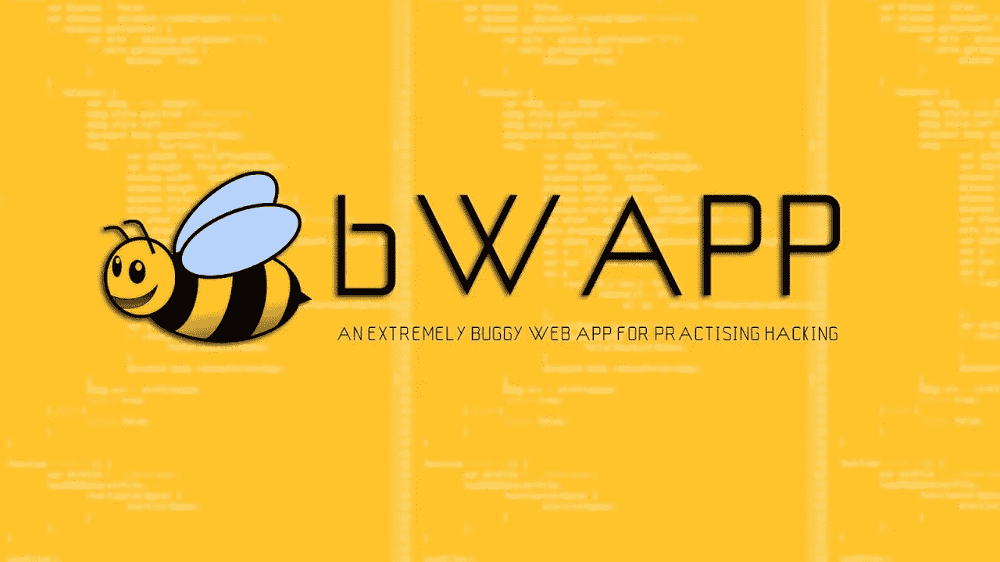
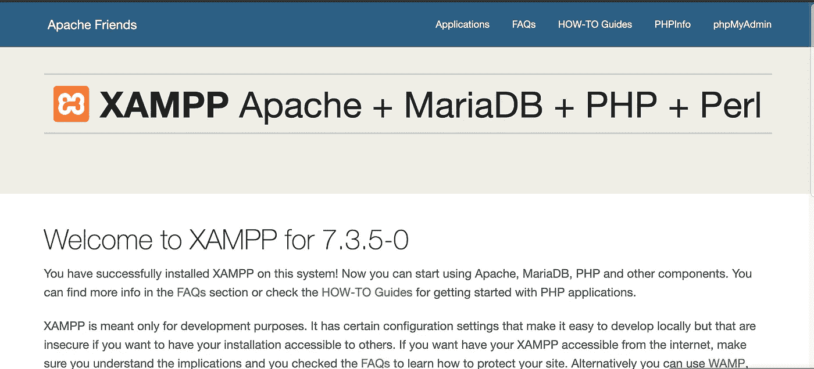
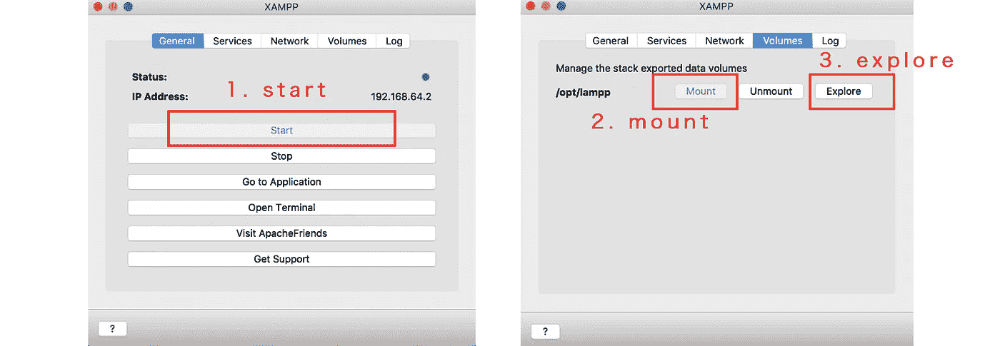
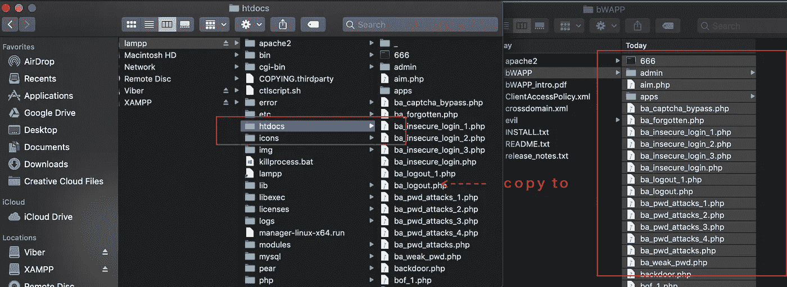
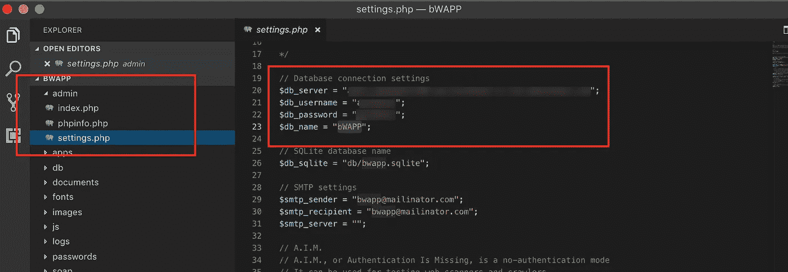
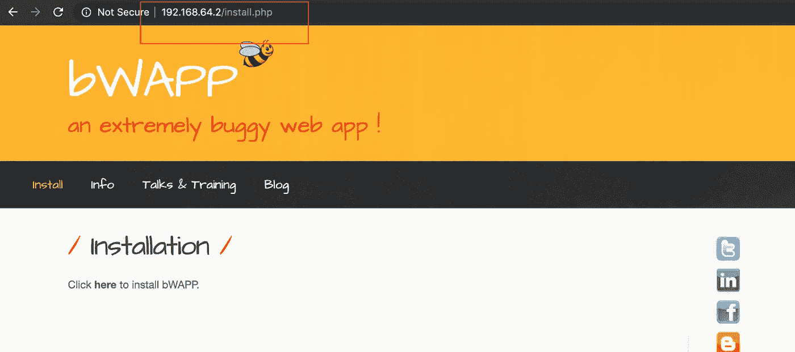

# [bWAPP]用 XAMPP 的 5 个步骤在 Mac 上建立一个易受攻击的网站

> 原文：<https://medium.com/hackernoon/bwapp-set-up-on-mac-with-xampp-security-example-tutorial-sample-how-to-install-linux-d03fd64ca586>

[Bwapp] set up on Mac with Xampp

为了练习你的黑客技术和验证你的黑客技术，你需要一个漏洞百出的网站。

> bWAPP，或称*bug web 应用*，是一个免费开源的故意不安全的 web 应用。

是什么让 bWAPP 如此独特？嗯，它拥有超过 [**100 个网页漏洞**](http://www.mmebvba.com/sites/default/files/downloads/vulnerabilities.txt) ！

# 1.下载并安装 XAMPP，并运行它

# 2.装载 XAMPP 虚拟机并探索

Mount with XAMPP VM and explore

# 3.初始化 BWAPP

3.1 从[这里](https://sourceforge.net/projects/bwapp/files/bWAPP/)下载并解压缩 ***Bwapp*** 。

3.2 在步骤 2 中点击 explore 后，将 bWapp `***php project***`复制粘贴到`***./htdocs***`中

After you click explore on Step2, copy paste bWapp `***php project***` into `***./htdocs***`

# 4.初始化数据库设置

4.1 按照解压缩 bWAPP 文件夹下`INSTALL.txt` 的指示操作。修改`./admin/settings.php`中的 DB 设置。

4.2 进入 bWAPP 页面`[http://192.168.64.2/install.php](http://192.168.64.2/login.php)`，初始化需要的 mySQL 数据库和表。

你会看到 bWapp 主页。

# 5.登录 BWAPP

用户名:蜜蜂
密码:bug

Login in BWAPP

# 6.攻击

我要说在 MAC 上设置 Apache 和 PHP 环境并不容易(作为 Nodejs 开发人员这么说)。我确实试过 MAMP 专业版，这是一个付费服务，有这么多我永远不会用来练习黑客技能的功能，所以坚持使用`XAMPP`。