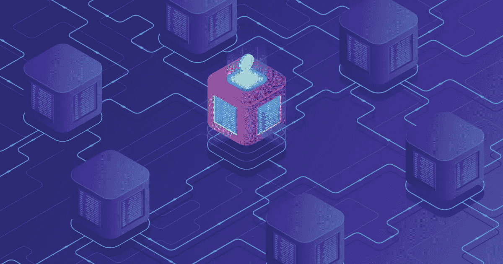

# Bystack —区块链即服务平台(BaaS)

> 原文：<https://medium.com/hackernoon/bystack-blockchain-as-a-service-platform-baas-8f96ddcb3dc3>

为了在 byte 和 atom 资产之间创建一个协调的功能， [Bytom](https://bytom.io/) 正在利用区块链技术开发一个多样化的可编程和资产经济。Bystack 是一个区块链即服务(BaaS)平台，最近推出，用于快速管理和建立商业目的的区块链网络。

创新的主链-侧链模型优化了共识算法、智能合约、隐私、可扩展性和跨链互操作性。消费者可以利用新的经济高效的平台在各种业务运营中执行和管理区块链网络；这使得它安全、用户友好且复杂性最低。

主链和侧链有它们指定的功能。Mainchain 使用分散化和安全性来销毁和发行资产，而 sidechain 通过牺牲一部分分散化来实现更高的性能，并在更大的规模上运行商业运营。侧链的另一个优势是满足不同的应用需求；侧链的数量可以超过特定的数量。

这种开箱即用的模式使 Bystack 能够服务于多种目的，如版权确认、供应链融资、版税兑换、公司资产管理以及更多应用。

**打破错综复杂的区块链三角**

毫无疑问，区块链目前是革命性的，但存在一个需要打破的不可能三角；分散化、安全性和可伸缩性是每个区块链公司都面临的问题。如果 Baas 平台的安全性变得至关重要，人们就不能忽视分散性和可伸缩性的二元悖论。

Bystack 是解决方案，它有助于在保持高性能的同时实现去中心化。怎么会？在这个模型中，Bytom 区块链(主链)通过一个跨链解决方案 Federation 连接到 Vapor(侧链)。

Bystack 的第一层提供了一个不需要许可的环境，保证了去中心化。主链还支持初始化资产的发布、传输和销毁，然后使用联合协议将它们安全地附加到侧链。同时，mainchain 允许存储和认证流程中所有资产的数字指纹。交易安全性和数据不变性由拜腾区块链的工作证明(PoW)算法来保证。

第 2 层采用拜占庭容错(BFT)算法，以提高每次交易的效率。在这种协议下，每秒的交易速度可以达到 100，000 马克。这对组合(主链-侧链)共同促进了公共链的去中心化和私有链的可伸缩性。Bystack 保护其主链并为其带来稳定性，而 sidechain 处理成功交易所需的所有性能、可伸缩性和其他必要尝试。

Bytom 还基于共识算法为侧链开发了独特的 DPoS 和 BBFT。它是如何工作的？投票是为节点资源 dpo 进行的。然后通过 BBFT 使被选择的节点达成共识；这导致新块的生成不到 0.5 秒。这种结合显著提高了侧链的效率。

此外，企业或个人可以创建他们的侧链，并从中构建应用程序；他们也可以使用现有的。

**高性能与安全性和隐私性不可兼得**

使 Bystack 脱颖而出的是它的主链-侧链和侧链-侧链的组合。这一发展与以往任何时候都不相上下。假设在一个侧链上有攻击，该攻击不会影响主链或其他侧链操作，确保区块链网络中的完全稳定性，并且由于资产转移协议被分成几个进程，一个行为不当的验证器不会对其他的产生任何影响。

Bystack 中的 DPoS+BBFT 一致性算法提供了高 BFT。通过数据恢复、共识状态自动恢复和节点服务自动路由，保证了区块链网络的安全性和稳定性。

BUTXO 是承载多项资产交易的升级版，增强了比特币 UTXO 模型。在这里，独立的契约锁定每个 BUTXO，这样当一个契约受到黑客攻击时；黑客只能拿到合同中锁定的资产。其他合同和资产不受影响。

这个解决方案可以推动区块链的未来；它拥有客户在区块链网络上寻找的一切；安全性、交易速度、高性能、可伸缩性和分散性。一切都是为了迎合拥有不同场景的企业或个人。你可以[攀登乞力马扎罗山](https://www.climbing-kilimanjaro.com/)，而不用担心你的资产。