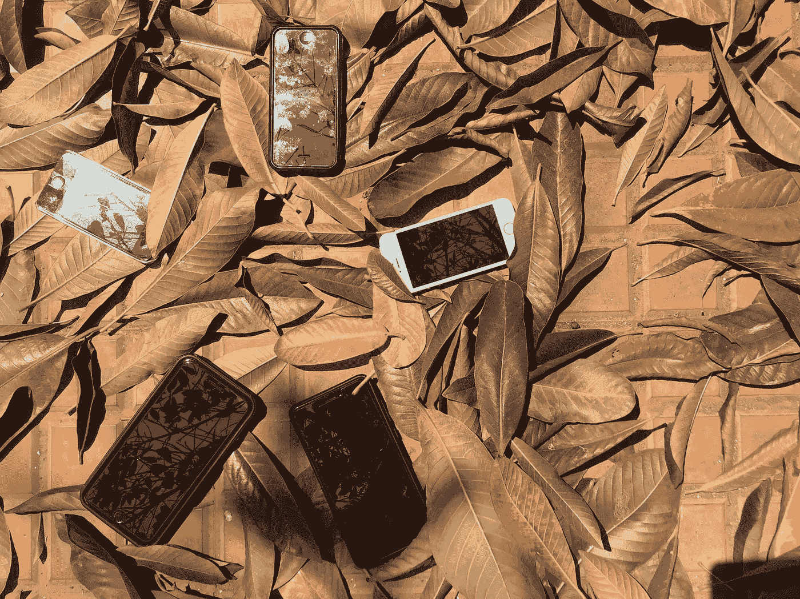
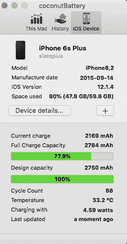
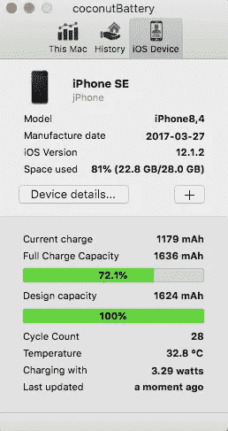
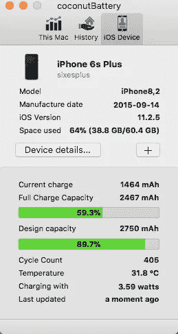
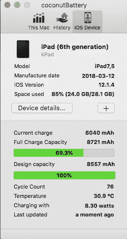
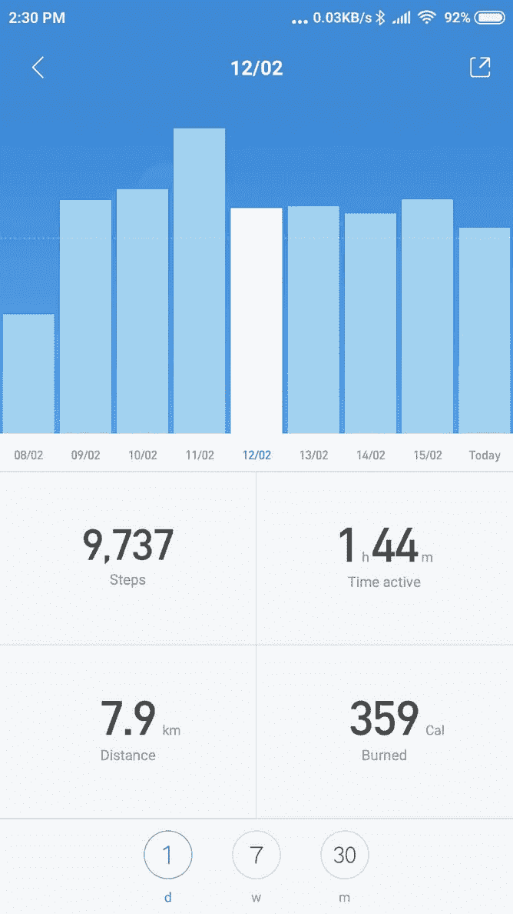
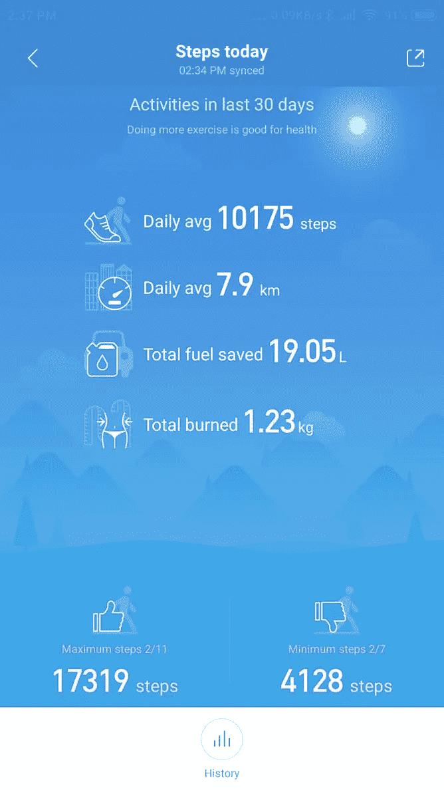
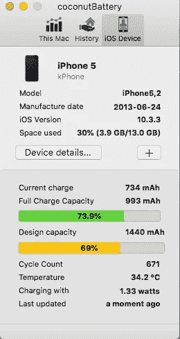
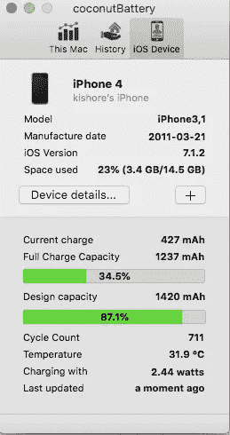
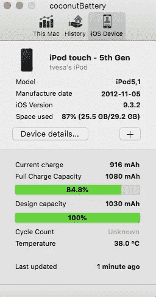

# 电子产品上瘾者能环保吗？

> 原文：<https://medium.com/hackernoon/can-a-gadget-addict-go-green-66675aa4a5d1>

## 关于戒除我炫耀性消费习惯的思考

Falling iPhone sales may be bad for Apple, but keeping old iPhones going is good for Earth (photo©babulous)

几天前，我看到一篇[新闻文章](http://fortune.com/2019/02/08/people-waiting-4-years-upgrading-iphones-analyst-apple/)说 iPhone 用户现在要等四年才能升级他们的设备。我能体会到这一点，因为我的 iPhone 6S+现在已经是第四个年头了。尽管我是个小玩意爱好者，但我还是推迟了升级，因为印度的 iPhones 价格高得吓人。在美国售价为 1099 美元的 iPhone XS Max (64GB)在印度的售价为 1545 美元，几乎高出 50%(₹1,09,900).

但是，人们很少会因为一个单一的原因去做事。我推迟升级的另一个原因是我在网上看到的另一则新闻。我们[目前每年产生](http://www.theworldcounts.com/counters/waste_pollution_facts/electronic_waste_facts)4000 万吨电子垃圾。

似乎每秒钟就要扔掉 800 台笔记本电脑。哎哟！

我不禁感到内疚。就在昨天，我把一堆旧 DVD 打包扔掉，因为现在网上什么都有。我上一次拥有 DVD 播放器是在将近八年前。想起来了，我不知道那个运动员在哪里失踪了。可能真的加入了你们产生的一大堆电子垃圾。前一天，这是一个旧的机顶盒，当电视信号数字化时就过时了。一周前，我拔掉了母亲的旧座机。那是两部手机和一束电话线被扔进了垃圾箱，这还没算上两根挂在屋顶上通向路边电线杆的长环形电缆。今天早上，是四节充电式 AA 电池没电了。简而言之，每隔一天，我都在为世界上日益严重的电子垃圾问题做贡献。

那么是什么导致了我的开悟？

## 多少个小玩意才算太多小玩意？

上周末，我在一个朋友在山里的农场过夜，突然出了点事，我不得不赶回去。到家后，我发现我的旅行装备包少了两个装备:一个电源和我连接的便携式热点。我记得我把它放在户外，是为了在山里接收微弱的手机信号。幸运的是，印度的雨季还没有开始，但是第二天晚上我仍然要开 45 分钟的车去取回我的东西。

驾驶对我来说是思考的时间，因为我的大脑相对不受我通常的多任务处理的干扰。所以我脑子里就冒出了这个问题。

什么样的人会带着一个装了这么多东西的旅行包，却把两个小玩意放错了地方，甚至没有意识到自己放错了地方？

答案显而易见，令人不安。是个小玩意太多的家伙！

我仔细看了看我的旅行工具包。不算我的 iPhone 和 iPad，还有一大堆各种尺寸的电缆(lightning & USB)，三个充电器，几个笔驱动器，一个闪存卡，一个 OTG 连接器，一个 wifi 范围扩展器，一套 iPhone 附加镜头，一部 Android 手机，一个 Echo Dot，一个蓝牙扬声器，一个蓝牙耳机，以及随机的适配器和软件狗。曾几何时，我身上唯一的小玩意就是一台相机。

太多的小工具，而且没有两种方法！

## 停止消费，开始回收

我一直在谈论环保。但是我需要把我的钱用在我所说的地方。理想情况下，我应该扔掉所有的小玩意，回去读书看报。然而，把我昂贵的小玩意送人对我自己来说有点过分。但是，我们所有人都可以推迟购买额外的小玩意，减少炫耀性消费习惯，并回收现有的小玩意再用几年。这将让大自然母亲从我们对其资源的不断掠夺中得到喘息的机会。

是时候不同意艾米·怀恩豪斯的观点了，去小玩意[康复中心](https://www.youtube.com/watch?v=KUmZp8pR1uc)。

我要做的是审计我所有的电子设备，看看我是否能避免购买更多同样的东西。我的目标是试图弥补我多年来产生的电子垃圾，减少或推迟我的消费。这是我能为我们这个长期遭受苦难的星球做的最起码的电子垃圾贡献。所以现在开始。

## 电话

让我们从我的手机开始，这是我产生最多电子垃圾的地方。2015 年底左右，我拿起了我现在的手机，iPhone 6S+。所以现在是第四年的第三个月。考虑到我的电子垃圾犯罪，我想知道我是否能把它推到最后五年，而不是我最初计划的四年。那么到底是什么阻止我把手机升级推迟到 2020 年苹果发布 iPhone 11S 的时候呢？

**FOMO** 这是任何电子产品爱好者的最大障碍。如果最新的 iPhone 拥有我的 iPhone 没有的奇妙的新功能怎么办？幸运的是，技术进步的速度似乎已经放缓。我玩过一部 iPhone XS Max。肯定更快，屏幕更大更好，那些人像拍的都好看，人脸解锁真的很酷。但这不像我的 iPad 3 和我的 2018 iPad(第六代)之间的区别，前者像污泥一样慢，几乎无法使用。新 iPhones 并没有真正的杀手级功能，让我觉得升级是绝对必要的。战斗更多的是在我的脑海里。我可以用一部用了三年的旧手机再生活几年吗？

**故障电池**这是一个交易破坏者。大约在去年年底，我的 iPhone 电池开始加速耗尽。比如，如果我用它在活动或假日拍摄 pix，电池会在几个小时内耗尽。这是非常令人恼火的，我最终得到了一个电源银行来度过这一天。所以当我听说苹果正在提供打折的电池更换计划时，我抓住了这个机会，给我的 iPhone 换了电池(尽管苹果经销商极力劝阻我)。这一点效果很好，因为我的 iPhone 的电池寿命感觉像新的一样好，而且我可以在没有电源的情况下应付大多数日子。

检查 iPhone 电池健康状况的一种方法是在 iOS 设置应用程序中。我查了我妻子和我的 iPhones。他们都表现出 100%的健康，这并不奇怪，因为他们都有新的电池。

但我想知道更多细节。所以我把我的设备连接到我的 Mac 上，运行 [CoconutBattery](http://www.coconut-flavour.com/coconutbattery/) 应用程序(它是免费的基础版；Windows 用户可以使用一款名为 [iBackupBot](http://www.icopybot.com/download.htm) 的应用的试用版。下面的前两个屏幕截图显示了我的 iPhone 6S+和我妻子的 iPhone SE 的电池健康状况。右边最后一张是我的 iPhone 6S+用原装电池一年的结果。

正如你所看到的，两款手机的电池健康状况仍然是 100%。从我四个月前(2018 年 10 月)更换 iPhone 6S+以来，它已经运行了 88 个完整的充电周期。我老婆的 iPhone 电池后来换了，循环次数只有 28 次。然而，我的 iPhone 6s+的原装电池在 2018 年 1 月检查时的健康率为 89.7%。苹果服务人员告诉我，只有当电池健康状况下降到 80%以下时，性能才会受到影响。但我还是改了，以免错过苹果对节流电池的替换提议。

自从换了电池后，我一直很小心我的充电习惯，试图接近[电池大学的](https://batteryuniversity.com/learn/article/how_to_prolong_lithium_based_batteries)建议，将电池电量保持在 25–75%的范围内。理想的 65–75%范围是不切实际的(详情请参考我的[关于手机电池的专门文章](https://hackernoon.com/confessions-of-a-battery-abuser-7a895c3c1b67))。

简而言之，如果我和我妻子好好保养我们的 iPhones 电池，它们应该可以轻松使用三年，也就是 2021 年底。

物理耐久性 iPhones 价格昂贵，但值得称赞的是，它们很少在质量上妥协(闪电线之类的配件是另一回事)。当然，如果你像一个朋友那样把一部 iPhone 从两层楼上扔下去，它就无法存活。然而，如果[你使用一个好的外壳](https://hackernoon.com/the-case-for-and-against-phone-cases-29dbfd88197a)，并最大限度地减少跌落，特别是在粗糙的表面上，这些手机可以承受打击并继续运行。

但是有一个因素我无法控制，那就是我的妻子。她讨厌手机壳，尽管偶尔会掉手机。最近我不得不更换它的屏幕保护。替换的屏幕保护罩已经有一条贯穿其前部的细微裂纹。好的一面是她的 iPhone 4 用了五年才在秋天摔碎。我很乐观，她的手机可以用很多年。提高胜算的是 iPhone SE 的经典扁平形状和钢制包裹的机身，这使它成为市场上最耐用的 iPhone。

话虽如此，手机就是一盒电子，也打不过时间老人。技术不可避免地会过时，组件可能会出现故障。我的 iPhone 5 在一天早上屏幕坏掉之前用了几年，可能是因为它是一部翻新的手机。我确实修好了它，但它与我的 4G 服务不兼容，所以我不得不不不情愿地把它冷藏起来。同样，我的 iPhone 4 的扬声器也开始出现问题，在第四年左右声音输出变得微弱。由于我无法在嘈杂的环境中接听电话，我不得不将其退役。我的 iPad 3 的扬声器也有类似的问题，不过我已经通过将它与蓝牙扬声器配对成功解决了这个问题。

**软件兼容性**苹果在软件方面有些起伏。iOS 更新一度拖慢了较旧的设备，并推动用户升级。苹果的理念导致了“节流门”(throttlegate)，即故意降低老款 iPhone 的速度，以避免它们在新应用消耗太多能量时关闭。这是塞翁失马焉知非福，因为公众的强烈抗议迫使苹果公司提供补贴电池更换计划，我利用了这一点。

然而，苹果似乎已经得到了备忘录。iOS 12 实际上提高了旧设备的性能。将我的 iPhone 6S+更新到 iOS 12 使它更快，并带来了许多新的有用功能。Siri 快捷方式是我每天使用的功能之一，但它不是唯一的一个。

希望苹果在 iOS 13 上继续保持良好的表现。但苹果对旧硬件能做的也就这么多，因为它跟不上为处理器更快的新手机设计的软件。

我有第二部手机，一部安卓手机。2017 年 5 月，我在₹12000 买到了小米的红米 note 4(170 美元)。由于价格相对较低，我倾向于每两年升级一次我的 Android。我看中了 Poco F1，这是小米的另一款手机，配置高端，价格适中，在₹20000(283 美元)。但是我现在有了新的想法。当然，它的速度很快，屏幕更大，可以用手势操作，但这并不是我的 Note 4 的巨大飞跃。我想我可以轻松地等一两年再升级。

我的孩子也有一个机器人，一个 Moto G3。它已经有三年的历史了，但是满足了她的需求，所以我们将继续使用它，直到它停止使用。

**座机**家里还有一部，因为我的另一半觉得让孩子打长途电话比手机安全。我确实把无绳电话收好了，因为她不喜欢再多一个会发出有害辐射的设备。其中一个橱柜上面还有一部旧的不能用的手机。

2019 年家里没有新手机，手指交叉。

## Wifi 路由器

接下来让我来处理路由器。对于一个相对无趣的产品类别，我对路由器的浪费令人惊讶。

我的 Netgear wifi 路由器在一年前工作正常，当时我一时冲动换了一个 Mi 路由器。我的理由是它让我能够更好地控制访问我网络的设备。我还为自己买了一个 wifi 扩展器，以改善楼下的 wifi 信号，还有一个便携式无线路由器，供旅行时使用。

坦率地说，我可以用我的 Netgear 路由器管理，因为它的信号足够强，可以在家里的任何地方访问，而且它允许对我的网络访问进行有限的控制。最后，任何手机都可以复制我的便携式路由器的功能。

事后看来，买这三个小玩意对我来说是不负责任的，而且绝对不环保。电子产品的这种不必要的扩散是电子垃圾激增的原因。

现在，我只能用一个功能完全正常的备用路由器，和另外三个可能工作也可能不工作的旧路由器。我很幸运地回收了其中一个。那是我妹妹用宽带连接的时候，我设法用了我的一个旧路由器，而不是让她买一个新的。它已经持续了两年多了。我一直希望我也能回收其他的，但是如果我不能，他们最终将不得不离开。

很长一段时间内我都不需要新的路由器，除非我更换了提供商，需要一种不同类型的路由器。目前看来不太可能。

## 药片

iPads 有巨大的电池。如果使用得当，这些设备可以使用很多年。我在 2012 年得到了我的 iPad 3，它很好地服务了我几乎五年，直到我更新到 iOS 9。这是一场彻头彻尾的灾难，iPad 的速度慢得像爬行一样，除了基本的浏览和观看视频之外，几乎无法使用。大约在同一时间，它的扬声器开始行为不端。

2018 年 5 月，我不得不用我现在的第六代 iPad 替换它。这款 iPad 的处理器比我的 iPhone 更快，价格也低很多，而且还不到一年。这无疑是我所有苹果设备中性价比最高的。我每天都用它来阅读、娱乐、工作(尤其是在旅行时)，也用它来玩图像，因为许多 iOS 应用程序和 Apple Pencil 兼容性确实允许我进行实验。

出于好奇，我在 iMac 上使用椰子电池应用程序测试了两款 iPads 的电池，并添加了我的 iPhone 6S+的结果进行比较。

我的旧 iPad 3 显示只有 81.2%的电池和 497 次循环计数。我当地的苹果经销商告诉我，苹果公司表示，如果 iPhone 的健康状况下降到 80%以下，就应该更换电池了。所以这是在边界上，虽然我不确定这 80%的数字是否适用于 iPads。无论如何，我不再使用那台 iPad 了，因为它已经变得太慢了，而且我已经从它身上提取了大约六年的生命。

我目前的 iPad 测试结果显示，在近九个月的日常使用中，电池只充满了 76 次电。相比之下，我的 iPhone 6S+在短短四个月内就充满了 88 次电。这种差异毫无疑问是由于 iPad 的大电池。这种设备还有很多年的生产力。

至少在四年内，比如 2023-24 年，我不需要任何新的 iPads。

## 计算机

我们家里有三台旧电脑。最新的是一台 3 年前的触摸屏 Windows 笔记本电脑。然后是我 2011 年的 iMac，和 2008 年的 MacBook Pro。

我的妻子和孩子共用一台笔记本电脑，由于孩子对它不太小心，它的电池寿命被缩短了。但他们都主要用它来上网和看视频。所以它现在还能用。我想它会一直持续到崩溃。然而，如果我的孩子出于某种原因选择了一门需要新模型的课程，我必须得到它，这超出了我的控制范围。

MacBook Pro 是一只恐龙。我更换了它的电池，更换的电池也凸出来了。所以我现在直接从电源上运行它。令人惊讶的是，它仍然工作，我可以用它来进行简单的活动，比如说写这篇中型文章。它还可以在旅行时作为便携式桌面使用。对它有利的是，巨大的 17 英寸屏幕是一个不错的桌面替代品，它有大量的端口，所以我可以用它来完成我的 iMac 无法处理的任务。就像那天我不得不从一盘旧的 DV 磁带上翻录视频一样。不过，带着它到处跑是个问题。

iMac 是我的主力。这个老家伙就像一个跑马拉松的 70 岁老人，慢慢地走着，但最终还是到达了终点。它不能加载最新的 Mac OS，有一个过时的蓝牙，不允许切换或空投，它的 DVD 驱动器早就停止工作了。幸运的是，我的 iPad 已经接管了一些我的 Mac 现在难以处理的任务。这不是最好的解决方案，但我可以接受，因为基本的打字和冲浪仍然可以很好地工作。

所以，是的，在计算机方面，如果一切按计划进行，我可以尝试推迟更换，让我们忽略约翰·列侬对生活和计划的想法。

## iPods

我的第一个 iPod 是一个老式 clickwheel 的遗物，仍然可以使用，里面有大约 60GB 的音乐，但它看不到任何动作。我孩子的 iPod Touch(第五代)也闲置了，因为她有了安卓系统后就不再用了。

iPod 的冗余始于史蒂夫·乔布斯推出 iPhone 时，iPhone 也兼作 iPod。当互联网和数据价格开始下降时，他们的灭亡加速了，因为现在每个人都只是简单地播放音乐，甚至在手机上关掉屏幕随意播放 Youtube 音乐视频。

我认为真正杀死 iPod 的是 Alexa。当 Alexa 可以为你播放你想要的任何东西时，谁还想在手机中搜索和滚动呢？甚至我那怕科技的妻子最近也依偎着 Alexa。(与我和我的孩子不同，她对 Alexa 非常礼貌，甚至在她向她提出任何要求时都会微笑。直觉告诉我，我们应该以她为榜样。

我希望我能回收或者重新利用这些 iPods，但是这并没有发生。理论上，我可以将它们用作外部存储，但我的 32GB 笔式驱动器要方便得多。如果印度的夏天不那么炎热，我可能会把 clickwheel iPod 永久地搬到我的车里作为音乐播放器。

反正现在已经没人买 iPods 了。至于我的旧 iPods，它们有一些情感价值，但在我想出如何处理它们的时候，它们大多都处于无用或死亡的边缘地带。

## 电视机

这个简单快捷。几个月前，我把用了十年的飞利浦 32 英寸电视换成了安卓系统的小米电视 4C Pro。我最初的计划是[购买小型](https://hackernoon.com/why-think-small-makes-sense-with-tvs-e062d6f5537f)，每 2-3 年升级一次。

但是我不认为我会很快升级我的电视。

## 扬声器和耳机

房子周围有三到四个不同类型、大小和形状的扬声器。其中一个是[的假便携式 Bose](/mobile-lifestyle/the-bose-speaker-that-wasnt-a-bose-4c9d41be842d) 无线扬声器，由于被我的孩子放在雨中，现在几乎不能用了。

至于耳机，我们有几个“家庭”耳机，我的妻子和孩子共用，因为他们经常丢失和找到他们的个人耳机。我曾经在慢跑时戴着苹果有线耳塞，但它悲惨地淹没在我的汗水中。我把它换成了有线 JBL 耳机，评论者称它是防汗的。在用它慢跑了一年之后，我可以证实这个说法。然而，这个耳机现在是我的备用，因为我买了一个 JBL 蓝牙耳机，以避免在锻炼时与电缆斗争。

假 Bose 音箱将加入电子垃圾洪流。但在不久的将来，我们不会再为我们的家居系列增加任何扬声器或耳机。

## 电力银行

我去年疯狂购物时买了一个新的。我的理由是我的旧索尼电源银行开始显示其年龄，并采取永远充电我的手机。事实是，这只是一个借口，因为我的索尼 Powerbank 可能会轻松地持续几年。

我买 Mi Powerbank 的真正原因是，它是一款仅售₹699(10 美元)的高端产品。它有一个低功耗模式，可以在不损坏小电池的情况下为小设备充电(如 my like 蓝牙耳机)。它也足够强大，可以给我的手机快速充电，有足够的电力给我的 iPad 的巨型电池充电，并且可以同时进行这两项工作。除了像所有小米的小玩意，它看起来很好，是真正的物有所值。

我的电力银行应该可以使用 3-4 年，除非我永久“放错地方”,所以我肯定不会在电力银行市场出现很长一段时间。

## 衣服

我的 Mi Band 2 不是 Apple watch。但是我没有抱怨，因为它可以计算我的步数，并告诉我时间和日期，所有这些都只需要₹1600(22 美元)。我最近想升级到 Mi Band 3，因为它的屏幕更大。

但在这里我要揭露一个黑暗的秘密。我的 Mi Band 1 仍然可以使用，但闲置在我抽屉的一个角落里。我用 Mi Band 2 取代了它，因为它没有表盘，我必须使用手机上的应用程序来查看我的数据。

我的 Mi Band 2 电池一次充电可以使用一个月或更长时间，因此这款设备至少可以使用五年。至于多余的 Mi Band 1，购买它是一个坏主意，因为我一直知道它没有表盘。我的错。

为了地球的缘故，为了弥补我的 Mi Band 1 的不幸，我将避免我的可穿戴升级，直到我的 Mi Band 2 放弃它的幽灵。

## 备份磁盘

我的第一代 500GB 时间胶囊仍然在工作，尽管我每个月只打开它一次做备份来延长它的寿命。我的常规备份在一个 1TB 的外置硬盘上，我还有第二个 1TB 的硬盘专门用来备份照片和家庭视频。还有一些随机的笔驱动器藏在房子周围，因为我发现人们很容易丢失它们。

我不需要更多的备份磁盘了，尽管前几天有一个掉了下来，我吓了一跳。

## 适配器和电缆

家里有这么多小玩意，我家里也有很多这样的东西。上周，一条闪电电缆停止工作，所以它正在被淘汰。

使用假冒配件是自找麻烦。所以我不得不继续用原装的或者苹果认证的来替换它们，如果它们失败了的话。

这一个将不得不在个案的基础上处理。

## 电视机顶盒

我的 D2H 盒子肯定是五年左右的。记录到 USB 功能最近一直失败，但我一直在推动它，因为我不看太多的电视。

这个盒子很有可能会出故障，必须在今年的某个时候更换。希望不会。

## 相机和镜头

我有一台 DSLR 相机，大约一年用一次。我的佳能 350D 现在是古雅的 800 万像素，在我去年更换电池后，它仍然完全正常工作。我有一些美好的回忆。但我现在很少使用相机或其配件，如 50 毫米主镜头、70-300 倍变焦镜头和三脚架。

智能手机杀死了相机。它们很紧凑，相比之下几乎没什么重量，而且因为它们总是在你身上，所以能很快抓住镜头。

At the beach (photo©babulous)

只要我的相机还能用，我就会偶尔掸掉它的灰尘，把它保存起来。

## 退役的小玩意

以上是我经常使用的小工具列表。我确实有一些其他设备，比如一台旧的索尼 Handycam，它可以在 DV 磁带上记录，也许还有一些我不知道或已经忘记的其他东西。除此之外，我的一个橱柜里还有一些退役的 iOS 设备。为了检查它们的状况，我在其中的三台设备上运行了 coconutbattery:一台 iPod、一台 iPhone 4 和一台 iPhone 5，所有这些设备都很少或从未使用过。

这些手机没有多大用处，因为它们不能在印度的 4G 网络上工作。属于我孩子的 iPod 已经被一部手机取代了。这些仍然存在的唯一原因是它们没有转售价值，据我所知，苹果在印度没有回收计划。

继续，iPod 或者电池测试有问题。它不可能达到 100%的容量，因为它已经使用了六年。至于 iPhone 4，几年前我更换了它的电池，但它有缺陷的扬声器使它很难回收。

iPhone 5 似乎是最糟糕的。69%的电量，它的电池现在随时都可能没电。我可以挽救一些东西的一个方法是，如果我的大家庭中有人需要购买一部新手机，就接受在线交换报价。如果幸运的话，我可能会得到₹1000(14 美元)。希望，如果我这样做，他们会回收手机。

## 回收利用

那么，我打算如何处理我所有的电子垃圾呢？这些垃圾可以使用，但却闲置着。

理想情况下，我尝试重用它们。就像我把几个退休的桌面扬声器连接到我母亲的电视上，来放大她那戏剧性的印度电视连续剧。东西也会流传下来。我的旧蓝牙音箱给了我的孩子。多亏了 YouTube，我的旧 iPad 重新成为了我妻子的私人烹饪顾问，我们开始品尝许多奇怪的菜肴。

然而，印度的好处是我们有一个巨大的回收产业。就像当我意识到我的旧电脑正在腐烂时，我让其中一个人顺便来拿走它。他告诉我，他会把它拆开，回收任何可以重复使用的东西，把剩下的扔掉。

他还给了我₹100(1.4 美元)作为运走它的奖励。印度就是印度。

## 结论

作为对我许多电子垃圾贡献的忏悔，我想我可能可以在不买任何新玩意的情况下度过 2019 年。祝我好运。