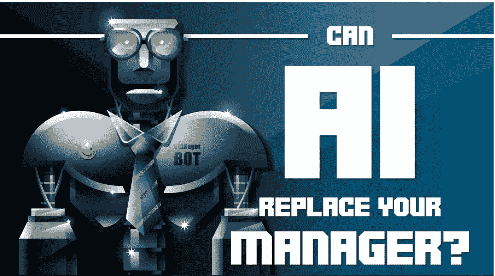
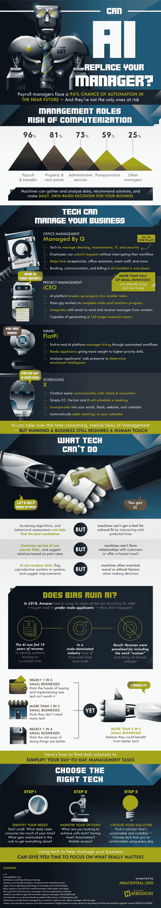

# 人工智能能代替你的经理吗？

> 原文：<https://medium.com/hackernoon/can-artificial-intelligence-replace-your-manager-1e464fe345aa>

人工智能技术正在席卷大大小小的企业，接管责任，管理数据，并影响明智的决策。超过五分之四的小企业主表示，他们的企业可以从更好的技术中受益，但并不总是确定他们真正需要什么。

不是所有的企业都是平等的，每个公司的可扩展性看起来都不一样；这意味着不同的职责、计算需求和管理任务。企业可能会受益于专注于项目管理的人工智能技术。iCEO 是一个项目管理人工智能平台，它将一个项目分解为更小且容易跟踪的任务，可以雇佣自由职业者和专门完成任务的临时工，并保持向生产力的全面移动。办公室管理的大规模需求也获得了一些人工智能的力量，正如《由 Q 管理》所看到的那样，虽然很小，但却很有力量，有助于管理从发票和任务管理到清洁人员调度和维护服务的一切。

为你的企业选择正确的技术需要认真审视日常运营，确定经理们在哪里挣扎和不足，并实施人工智能来收拾残局。这张信息图详细描述了管理人工智能的来龙去脉，以及如何为任何企业选择正确的选项。

