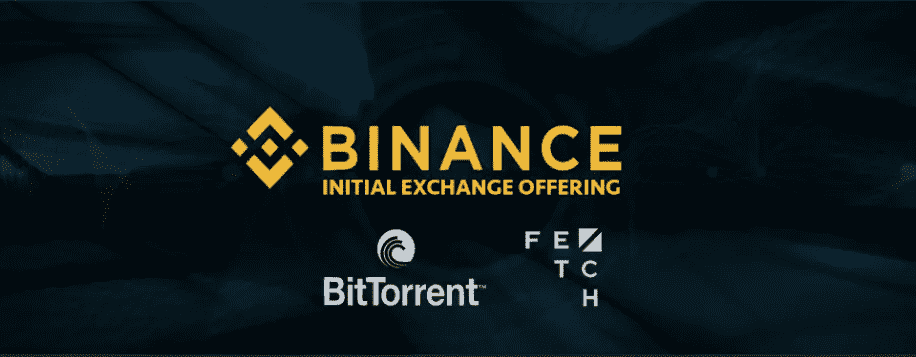
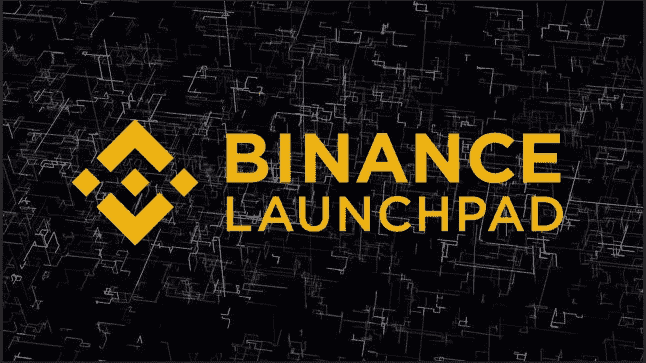
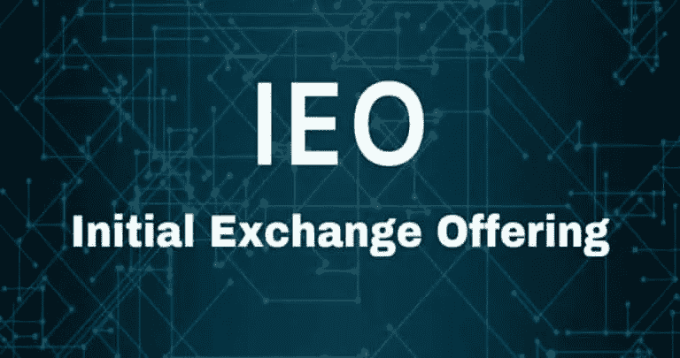
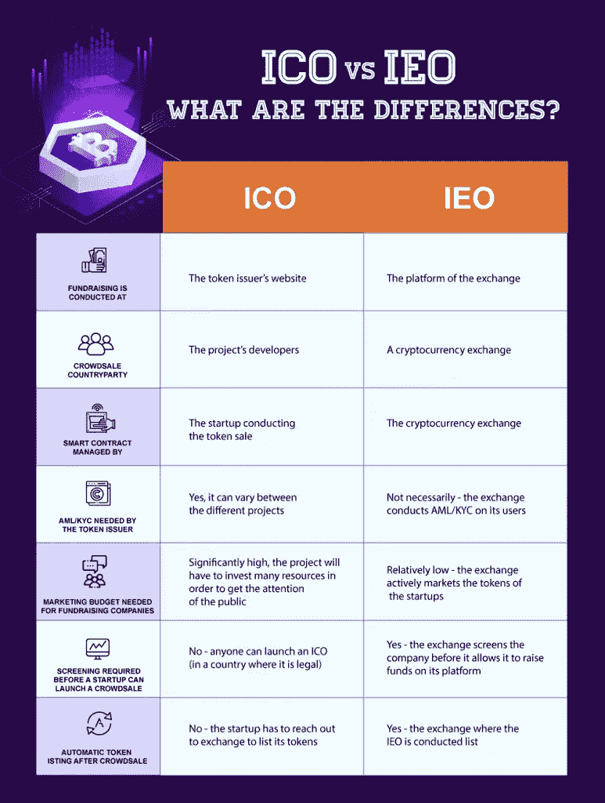

# 币安的初始交易平台(IEO)能引领下一波加密浪潮吗？

> 原文：<https://medium.com/hackernoon/can-binances-initial-exchange-offering-ieo-platform-lead-the-next-crypto-wave-ce6b1c054213>

不应低估币安首次发行股票(IEO)的成功。它可能会改变加密领域的游戏规则。一些人将 2017-2018 年蓬勃发展的 [ICO](https://hackernoon.com/tagged/ico) 市场归因于加密货币如此受散户投资者欢迎的主要原因。在过去的两年里，ico 筹集的资金数量确实令人吃惊。感谢 [Cointelegraph](https://cointelegraph.com/news/ico-market-2018-vs-2017-trends-capitalization-localization-industries-success-rate) ，我们知道，2017 年 ICOs 总共募集了 56 亿美元。2018 年这个数字增加到了 114 亿美元！然而，争论表明 [ICOs 是](https://www.coindesk.com/the-crypto-winter-is-here-and-we-only-have-ourselves-to-blame)加密冬天的主要原因之一。

Bitcoinist 的一篇文章提供了关于以太坊遭受巨大下跌的关键见解，这是因为 ICO 项目清算了他们的以太坊。因此，就像每一个创新的想法一样，需要进行一些调整。

2019 年 1 月，币安宣布 BitTorrent 将在他们的 LaunchPad 上启动他们的[筹款。这种发行被称为首次交换发行(IEO)。BitTorrent 和 Fetch 的成功。人工智能正在成为 ico 的一个潜在的游戏改变者。现在，其他交易所也在效仿币安提供这项服务。](https://www.binance.com/en/blog/292851206965837824/Binance-Launchpad-to-Start-BitTorrent-Token-Sale-on-January-28)

# 币安的 IEO 平台可能会改变游戏规则

# BitTorrent 成功

Tron 的 BitTorrent 首次上市。Justin Sun 于 2018 年 7 月收购了 torrent 客户端。花费 1 . 4 亿美元，TRON 就能让 1 亿用户使用它的区块链协议。

BitTorrent 的 crowdsale 可以认为是一个巨大的成功。他们设法在两次会议中卖出了 594 亿枚代币。用户使用币安硬币(BNB)和 Tron 代币(TRX)购买 BTT 代币，仅用了 15 分钟就达到了 720 万美元的硬性上限。

BitTorrent 的 IEO 的成功是整个加密/区块链领域值得庆祝的。ICOs 需要经历重大变革，才能成为它想要成为的——筹资颠覆者。

# 竞争对手将紧随其后

按交易量计算，币安是最大的加密货币交易所。这也是第一个在 2019 年 1 月推出 IEO 平台的交易所，即[币安发射台](https://launchpad.binance.com/)。紧随币安之后的将是 **Bittrex、KuCoin、Huobi、BitMax** 等等。随着其他交易所紧随币安之后，我们可以期待更多的独立企业感到高兴。但是所有的功劳都归于币安，因为他建立了这样一个进步的举措来进一步采用加密技术。

[拿来。艾](https://fetch.ai/)是另一个见证了[筹款活动巨大成功的 IEO](https://twitter.com/cz_binance/status/1100034248797343745)。该项目正在开发一个超级智能基础设施，连接运输、制造、酒店和供应链系统。他们将跟踪运营数据并创建预测功能。他们的努力不仅可以提高效率，还可以利用未充分利用的资产，为供需双方提供最大价值。该项目筹集了 69，204，152 FET，在 10 秒钟内约为 600 万美元。该基金有 2，758 名捐款人，平均捐款额为 2，175 美元。

随着越来越多的交易所寻求为加密项目提供这种服务，这将导致加密行业的重大变化。因此，对于投资者和加密货币爱好者来说，这个领域变得更加安全。更重要的是，真正的创新可以发生。

IEOs 似乎是 ICOs 的自然继承者——提供了一种替代加密项目的融资方式。

我们来看看 IEOs。

# 什么是首次公开募股(IEO)？

首次交易所发行(IEO)与 ICOs 类似，但它是在加密货币交易所进行的。crypto exchange 将通过创建一个投资者可以参与融资的平台来代表初创公司进行管理。

代币发行者必须向交易所支付上市费，以及发行期间售出代币的一定比例。作为回报，交易所将出售加密初创公司的代币。IEO 结束后，交易所将在其平台上列出硬币。用在 IEO 销售的百分比来激励交易所，是让一个知名公司来营销产品的好方法。此外，IEO 参与者必须在该交易所的平台上创建一个账户。因此，在 IEO 期间，这种伙伴关系对双方都有利。

# 首次交易所上市的优势

*   **名声**

由于各种各样的骗局和项目的消失，ico 已经形成了一个负面的名声。因此，有一个信誉良好的交易所作为合作伙伴，可以大大增加创业公司的可信度。糟糕的项目也会影响交易所的声誉。

*   **可信度**

加密交易所被强烈鼓励审查令牌发行者及其提供的质量。为了保护他们的名字，交易所要求初创公司是可信的，因此，这些初创公司将接受交易所的严格尽职调查。这大大降低了初创公司被揭露为骗局的可能性。

*   **即时交易列表**

在交易所被列为 IEO 的项目将享受近乎即时的上市。另一个不同之处是，一旦资金到位，ICO 就会铸造代币。在 IEO 的案例中，项目生成代币并将其发送到交换平台。

*   **覆盖 KYC/反洗钱**

ico 面临的一个巨大障碍是处理 KYC/反洗钱。对于 ieo，令牌发行者不必担心，因为交易所将管理 KYC/AML 流程，加密交易所也处理该流程。

# IEOs 能成为下一个主要的加密货币炒作吗？

我们都知道 ICOs 在成为热门话题时有多不可思议。最初的交易所发行看起来是许多 ICO 骗局和次优项目发行的解决方案。币安和其它交易所正寻求为投资者创造一个安全的空间。交易所提高了加密货币项目和投资者之间的信任度。

作为投资者和项目之间的中间人，大多数独立评价机构有更高的机会成为优质项目。因此，独立评价组织有潜力成为未来项目筹资的标准模式。

加密货币和区块链项目的未来看起来非常乐观，几种类型的硬币产品将把 ico 带到一个新的水平。一个这样的例子是[安全令牌提供(STOs)](https://moonwhale.io/security-token-offerings-stos/) 。有关 sto 的更多信息:

 [## 安全令牌产品(STOs 您需要了解的内容

### STO 是新的 IPO

hackernoon.com](https://hackernoon.com/security-token-offerings-stos-what-you-need-to-know-8628574d11e2) 

*原载于*

# *关于我:*

***伊利亚·扎基是美国一家名为** [**STO 咨询公司**](https://moonwhale.io/) **的公司——moonwale Ventures 的业务开发和营销主管。***

*在我们的各种社交媒体平台上关注我们—*

*[推特](https://twitter.com/MoonwhaleBV) | [领英](https://www.linkedin.com/company/moonwhalebv) | [脸书](https://www.facebook.com/MoonwhaleBV/) | [电报](https://t.me/moonwhaler)*