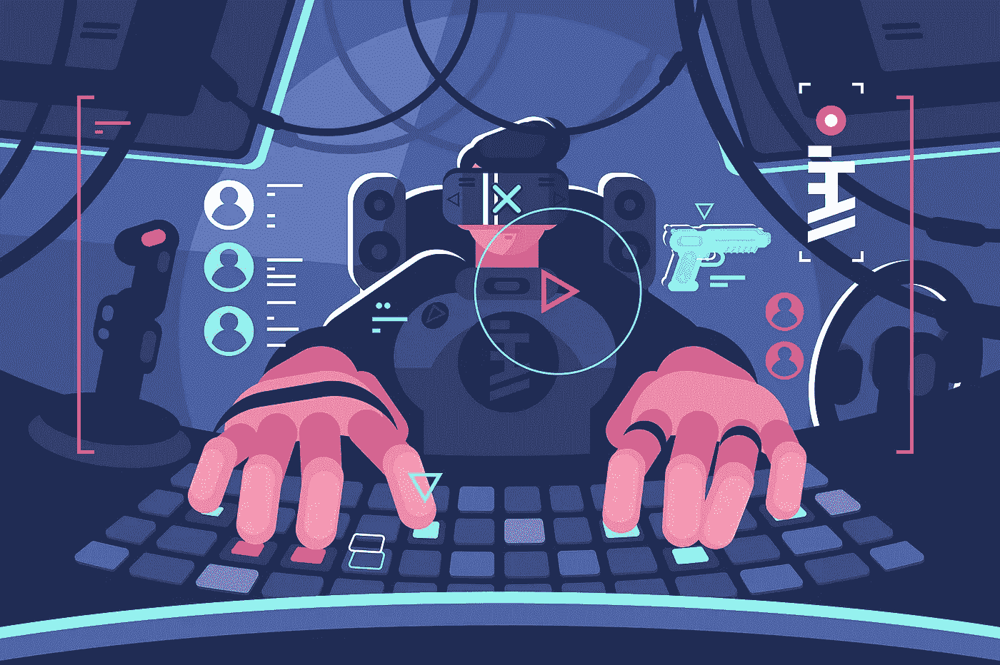
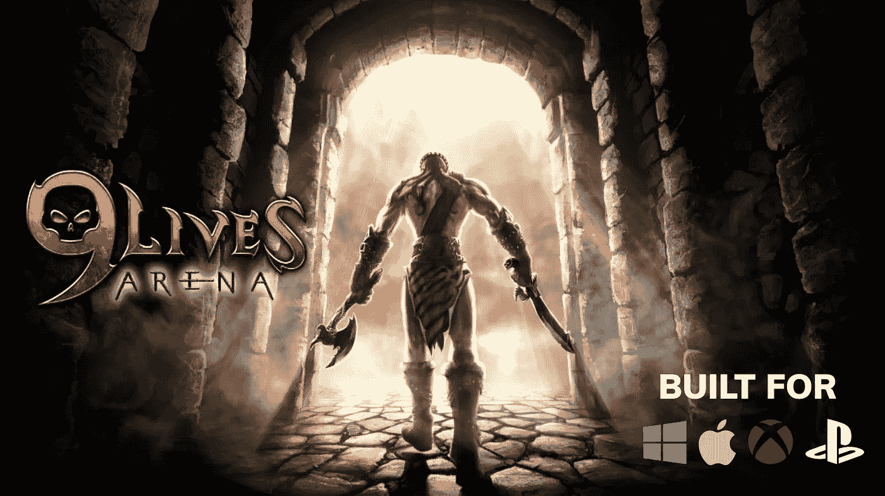
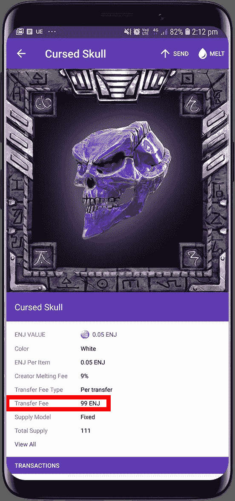
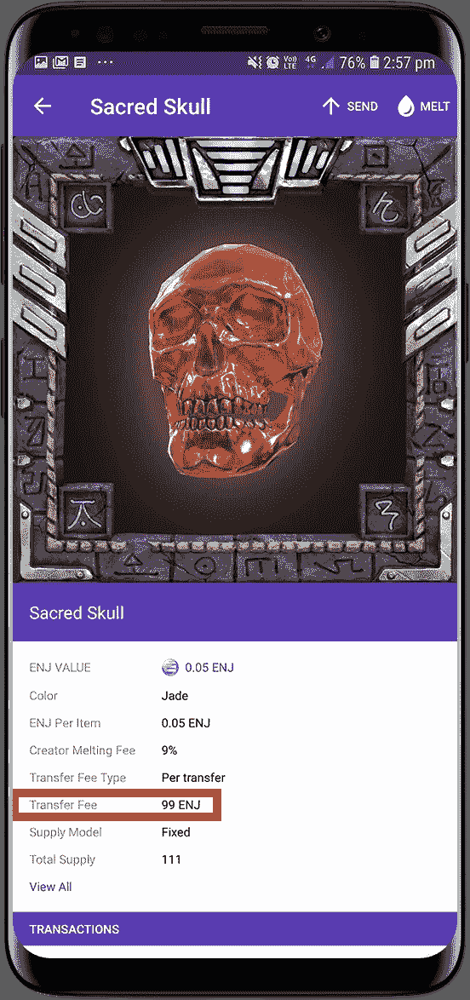
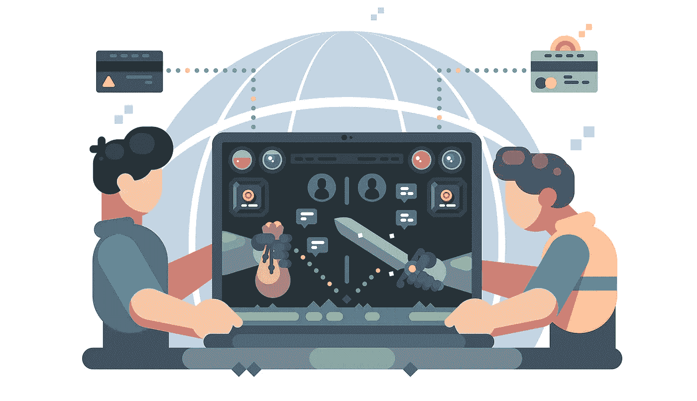

# 区块链博彩业能提供有收益的工作吗？

> 原文：<https://medium.com/hackernoon/can-blockchain-gaming-provide-gainful-employment-61c0b6cf539>

## 区块链项目承诺用有形价值填充数字领域。今天，我们将调查这是否真的可能，如果可能，它会如何影响我们的生活和整个社会。

# 如果游戏是为了提供工作机会而设计的会怎么样？

研究表明，32%的游戏玩家会辞去他们的工作，如果他们能够作为职业游戏玩家养活自己的话。

**这表明以游戏为生并不是一个新概念——但我们已经知道了。**

我们有电子竞技超级明星通过赢得比赛和吸引赞助交易每年赚取 [**数百万美元**。](https://www.careeraddict.com/esports-earnings)

我们有 [YouTube 超级明星赚**甚至更多**](https://www.businessinsider.com.au/fortnite-streamer-tyler-ninja-blevins-received-40000-donation-playing-game-2018-9?r=US&IR=T) **。**

> 但是，对于我们这些喜欢为了娱乐而过简朴生活的人来说呢？

[金恩](https://enjin.io)、[多变](https://changelly.com/)、[铁锈时代](https://www.ageofrust.games/)、[九命竞技场](https://www.9livesarena.com/)和[比达利礼券](http://enj.li/gift)最近发布了视频，展示玩家如何赢得游戏内物品和加密货币，然后用它们换取**比特币**，甚至用它们来抓**优步**。

看这个…

**这段视频中的** [**金恩币(ENJ)**](https://enjin.io/) **是从** [**铁锈时代**](https://www.ageofrust.games/) **收到的，是一种基于 ERC-20 以太坊的加密货币。如你所见，通过访问** [**比达利的礼品卡商店**](http://enj.li/gift) **，用户可以轻松购买优步优惠券，使用** [**金恩钱包**](https://enjinwallet.io/) **付款，并在几分钟内叫到车。**

 [## 用金恩硬币购买礼品卡(ENJ)

### 明智地使用你的金恩，用你的 ENJ 从 100 多个顶级品牌购买高质量的礼品卡。

giftcards.bidali.com](https://giftcards.bidali.com/buy-giftcards-with-enjin/) 

> 但是如果一个游戏不提供加密货币奖励呢？

看这个…

**[**金恩钱包**](https://enjinwallet.io/) **使玩家能够熔化他们的贵重物品并从里面取回** [**金恩硬币**](https://enjincoin.io/) **。然后他们可以使用** [**Changelly 的**](https://changelly.com/) **钱包内兑换服务将他们的奖金兑换成数百种不同的加密货币。****

**请记住，这些游戏旨在提供最大的乐趣，而不是有报酬的就业。**

**他们利用[区块链](https://hackernoon.com/tagged/blockchain) [技术](https://hackernoon.com/tagged/technology)赋予游戏中的资产现实世界的价值，这一事实从本质上提高了游戏的赌注，使体验更具内在吸引力。**

**然而，我们也可以设想通过在游戏中实现更深层次的经济，并使玩家能够探索经常性的金融机会，来创造有形的游戏经济，为玩家提供稳定的收入。**

# ****点对点交易，租赁&就业****

**坦率地说，如果你将这个概念推到极限，我们将谈论完全模仿我们全球金融体系的游戏经济。**

**平衡可能变得极具挑战性——但让我们努力做到这一点。**

**更简单的收集、交易和社交游戏形式也证明了对社区参与的巨大作用，同时对玩家和游戏开发者保持盈利。**

****

## **9 生活竞技场:交易和收集游戏**

**[9Lives Arena](https://www.9livesarena.com/) 是一款 AAA 级玩家对玩家角色扮演游戏，使用[金恩的区块链游戏开发平台](https://enjin.io/)通过[以太坊的区块链](https://www.ethereum.org/foundation)上的交易来管理其资产经济。**

**9Lives Arena 的主要游戏机制围绕着高强度的 1v1 肉搏战:**

**9Lives Arena — GDC 2019 Teaser**

**然而，创新的游戏工作室通过名为“[亚特兰蒂斯被遗忘的头骨](/@laemmche/the-forgotten-skulls-of-atlantis-1408d0ed31db)”的社区收集挑战增加了另一层社交游戏**

*****被遗忘的骷髅头，见*** [***金恩钱包***](https://enjinwallet.io/)***……*****

************

**The Forgotten Skulls of Atlantis are a set of blockchain assets that accrue 99 ENJ for 9Lives Arena’s game devs each time an item is gifted or traded.**

**游戏工作室最近通过博客文章宣布了这个聪明的挑战[，其中他们解释说，某些头骨的收集和组合将给予玩家史诗般的物品“如此罕见，以至于他们来自亚特兰蒂斯的祖先会复活，加入他们庆祝他们的财富！”](/@laemmche/the-forgotten-skulls-of-atlantis-1408d0ed31db)**

**大多数 9Lives Arena 的社区成员都选择将他们收藏的头骨紧紧握在手中，慢慢努力打造一个成功的组合。**

**其他着眼于最大的奖品的人正在从同行那里购买头骨——自然地，这些同行正在利用这个新市场并出售这些物品来获利。有人看到有人出价高达 2000 ENJ(在写这篇文章的时候是 336 美元)来买这些被遗忘的头骨中的一个。**

**金恩的智能合约自动化的利润分享功能使 9Lives Arena 能够在每次将头骨从一个以太坊地址发送到另一个以太坊地址时，自动分配一笔 **99 ENJ 交易费**(撰写本文时为 16 美元)。**

**通过这种模式，9Lives Arena 可以允许他们的资产自由交易，同时从每笔点对点交易中获得一小部分收入，然后他们可以再投资到他们社区赖以繁荣的游戏经济中。**

**这是一个完美的游戏未来的模型。**

**考虑到《九命竞技场》尚未上映…**

**想象一下,一旦史诗物品和奖励完全融入 9Lives Arena 的游戏世界，这一挑战将变得多么引人注目。**

***想象一下*一旦游戏的社交经济获得了足够数量的收藏家、玩家和*彩带*，这将推动怎样的社区参与。**

***想象一下*如果像[堡垒之夜](https://www.gamesindustry.biz/articles/2019-02-08-fortnite-ios-revenue-estimated-at-usd500-million)和[红色死亡救赎](https://au.ign.com/articles/2019/02/06/red-dead-redemption-2-sold-23-million-units-pushes-take-two-earnings-above-expectations)这样的主流游戏利用这些社交游戏机制，通过增加收入和刺激社区，为玩家提供有利可图的机会。**

# **区块链博彩业能养活饥饿的人吗？**

**让我们飞到[委内瑞拉，看看资源农民](https://www.kotaku.com.au/2018/04/the-runescape-players-who-farm-gold-so-they-dont-starve-to-death/)如何通过玩[江湖](https://www.runescape.com)找到养活他们贫困家庭的方法。**

**这些专注的创业型游戏玩家每天都在做游戏中重复的采矿和农活，而这些是富裕玩家根本不想做的。**

**这些“黄金农民”在黑市和灰色市场上出售他们的资源和物品，并用所得收入养活家人。**

**但这可能会在游戏生态系统中引发问题，因为游戏生态系统不是为玩家相互提供服务而设计的。例如，当大量稀有物品被注入到游戏的经济中时，这些物品就变成了普通物品，失去了它们的价值。**

**这可能会使游戏对玩家来说过于简单，或者减少开发商急需的收入。**

**Runescape Players Are Hunting Down Venezuelans**

****通过将他们的游戏项目放在区块链上，开发者可以通过使用可靠的智能合同来调节他们的经济，从而缓解这些游戏平衡问题。****

****因为所有交易都由区块链管理，所以没有交易可以绕过管理它们的智能合约。****

**游戏工作室可以使用智能合同来:**

*   **指定具有预定义交易参数的批准市场**
*   **通过对区块链交易收取交易费来创收(即使这些交易是在游戏生态系统之外进行的)**
*   **汇总链上数据以标记和遏制有害活动**

**简而言之，如果 Runescape 使用这些区块链工具，他们的问题就都不存在了，淘金者也会被冷落。**

> **但是，如果我们开始创作专门为提供就业机会而设计的基于社区的游戏会怎么样呢？**

**想象一下我们可以培育的丰富的游戏社区，我们可以展现的有趣的社交体验，以及我们可以占领的新兴市场。**

# **一种用于游戏的金融系统**

**现在，让我们将想象力发挥到极致...**

***想象一下*在游戏商店里，你可以从真人而不是静态市场购买物品。**

***想象一下*如果玩家可以互相租借物品来完成特定的任务。**

**想象一下如果玩家可以互相雇佣来帮助他们完成任务。**

**想象一下游戏世界中的故事人物是人类而不是 NPC(非玩家角色)。**

**更重要的是，工作室可以通过使用公平互利的利润分享模式将所有这些基于目标的社交互动货币化，这种模式由世界上最分散和安全的区块链以太坊自动执行。**

****

## **人类的区块链游戏**

**超过 7.3 亿人靠每天不到 1.90 美元生存(在撰写本文时是 ENJ)。今年，3600 万人将死于饥饿。**

****世界上有超过 22 亿游戏玩家，其中大多数人每天花得起 1.9 美元玩游戏——如果值得的话。****

**几乎不可能在这个世界上为那些不被它看到的人开拓出一个有意义的地方，但是游戏开发者有能力创造全新的世界。**

**那些生活在远离机遇的世界。**

**在一个资源日益减少的星球上，数字资产经济没有任何限制。在游戏市场，最大的限制是缺乏工具、资源和想象力。**

**通过提供工具将游戏中的努力转化为现实世界的资源，我们可以释放那些被最本能的生存需求所驱使的人的想象力。**

**通过设计充满有意义机会的**数字世界** ，我们可以让自己在**物理世界**中改善生活。**

**很难说我们错过了多少灵感和人类精神，这些灵感和精神来自我们星球上那些看不见的遥远角落。**

**也许他们需要的只是一个平台和一个设备——因为剩下的很快就会到位。**