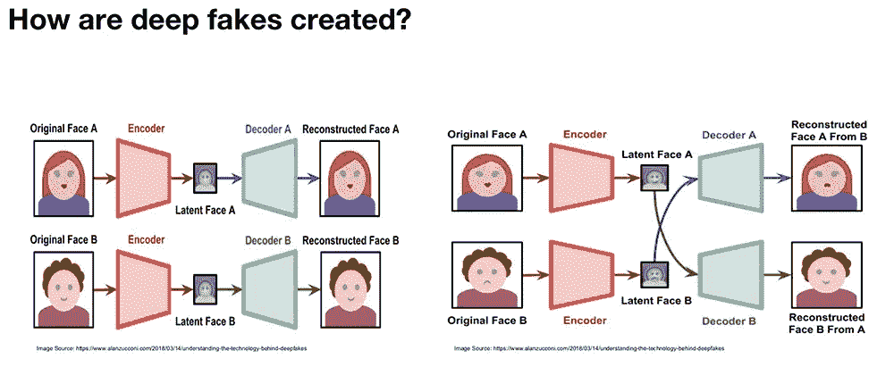
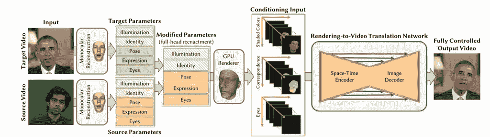
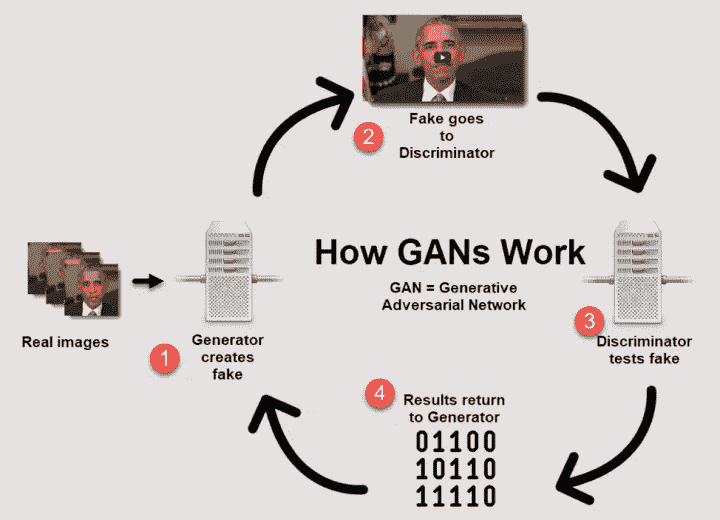
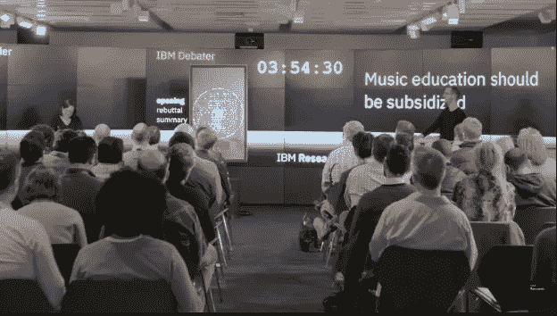
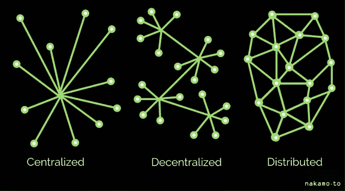

# 具有人工智能的区块链能否对抗深度打假？

> 原文：<https://medium.com/hackernoon/can-blockchain-with-artificial-intelligence-fight-deep-fake-9b899b4d45e7>

许多年来，真理本身就是讨论的主题，客观而独立于我们思考或描述它的方式。关于真理的哲学理论可能有许多相对依据，但在数学中存在绝对真理。

真理能变形吗？在一个基于情感的市场中，真理对于人们的信仰和观点的知识界来说是主观的。由[*【1】*](https://medium.com/u/ef7ccf89e7dc#cite_note-FoxNews2018-1)*是一个基于人工智能**的*它用于使用称为“ [*生成对抗网络*](https://en.wikipedia.org/wiki/Generative_adversarial_network)*”(GAN)的机器学习技术，将* *现有图像和视频组合并叠加到源图像或视频上。*[*【2】*](https://en.wikipedia.org/wiki/Deepfake#cite_note-Schwartz-2)*现有视频和源视频的组合产生了一个假视频，该假视频显示一个人或几个人在现实中从未发生的事件中执行动作。*这是根据维基百科的定义。

Source:https://arxiv.org/pdf/1805.11714.pdf

Source: https://www.symantec.com/blogs/election-security/ai-generated-deep-fakes-why-its-next-front-election-security

但是，深度造假比使用虚假应用对名人和政治领导人进行视频歪曲要糟糕得多。自上次选举以来出现的对假新闻的广泛讨论可以超越党派信仰而进一步发展。

昨天晚上，我听了一场关于学前补贴的辩论，一个人工智能正在辩论道德、金融、个人生活的影响以及各种可能源于她(因为声音是女性)积极反对这个话题的脆弱性。[人工智能](https://medium.com/u/2350c97e8f6b?source=post_page-----9b899b4d45e7--------------------------------)系统引用了各种研究，并预测她的对手会说什么，反驳了人类辩手，还开了几个玩笑。据@IBM 称，Project Debater 是第一个就复杂话题与人类进行辩论的 AI 系统。"*在一场关于复杂话题的 20 分钟辩论中，Project Debater 正在消化来自世界级人类辩手的大量文本，构建一个结构良好的演讲，并清晰而有目的地发表演讲，并且可以深思熟虑地反驳对手。*“作为一名前 IBM 员工，我非常好奇。

**这可能是人工智能的一小步，但这是人类对抗深度造假的一大步吗？**

IBM 很早以前就开始了这个项目，并于 2018 年 6 月向全球开放。Project Debater 进行了一系列辩论，其中大部分是关于资助行动，但也涉及不同的主题，如太空探索、音乐教育和昨天的学前教育。

项目辩手是一个发达的辩论内容搜索引擎辩论她的人类对手的立场，明确和含蓄。IBM 的研究人员 Ranit Aharanov 表示“*我们实际上是在试图表明，计算机系统可以通过提供事实和进行不同类型的论证来增加我们的对话或决策过程*。

*“论点挖掘——主张和证据是论点的主要组成部分；识别并正确使用它们对于在辩论中构建论点至关重要。IBM Project Debater 团队在开发机器学习技术方面投入了大量精力，以挖掘海量语料库中的主张和证据，并使用它们来生成与争议话题相关的论点。*

**Facts vs 分散式人工智能系统**

Source: nakamo.to

我记得当我是一名公共辩手时，我必须做的第一件事是确保我所有的研究事实都是正确的，并引用正确的信息，同时将同情心带到我的立场上。项目辩手能够聪明地做到这一切，并且在政治上保持中立。认知上对事实检查的不偏不倚可以抵御中央数据系统的反复无常的模型。脸书、谷歌、Equifax 是我们数据的看门人，这些中央系统的平台漏洞在最近的数据泄露事件中暴露无遗。赏金猎人可以很容易地从科技巨头(脸书)那里购买我们的数据，有时网络黑客会入侵机密数据平台(Equifax)来达到同样的目的。

当涉及到我们的数据时，总是存在隐私与透明的问题。如何正确激励自主平台？

区块链能否成为这种实体被激励、目标被重构以寻求真相的平台漏洞的解决方案？

有许多分散的开源区块链技术正在成为这些人工智能代理服务的智能合约的平台使能器。[奇点网](https://singularitynet.io/)、[算法 ia](https://algorithmia.com/) 、[海洋协议](https://oceanprotocol.com/)、[opened](https://www.openmined.org/)、 [Effect.ai](https://effect.ai/) 就是几个这样的例子。区块链技术的这种创新可能会阻止用户数据通过深度伪造被武器化的黑暗未来。

## 分散的思想已经在我们的文化中成长。互联网是第一个开源平台，是艺术家、博客、思想领袖、技术人员和其他人创造大量价值的推动者，但在很大程度上被肥胖的应用层技术巨头垄断。在可编程的金钱之后，我们是时候控制真相了。真理不是由任何中央集权的权威制造的，而是在所有的连续体中保持其基础。

否则也不会太远，因为真理是少数掠夺我们的人制造的商品。

下一次项目辩手会议发生在 2 月 12 日星期二上午 9:30，关于区块链，听起来非常有趣。用区块链数字化商品、信息、货币的流动。这种情况发生在 IBM，沃森在其中担任项目辩手。链接在这里:[https://www.ibm.com/events/think/watch/channel/23631238/](https://www.ibm.com/events/think/watch/channel/23631238/)

如果你想了解更多的技术背后，深度打假背后的研究，可以阅读这篇研究论文:【https://arxiv.org/pdf/1805.11714.pdf