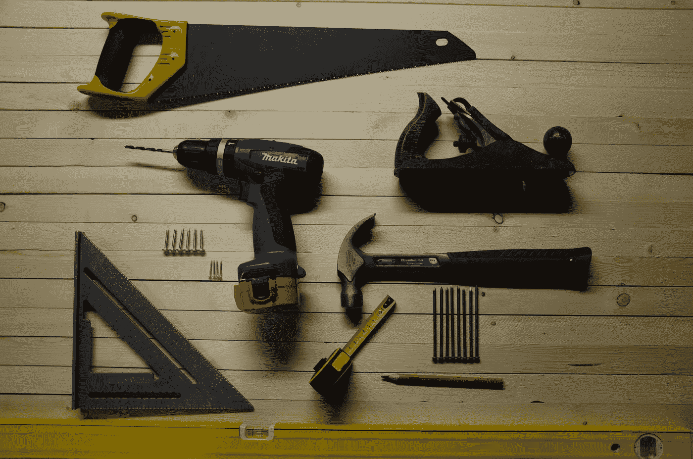
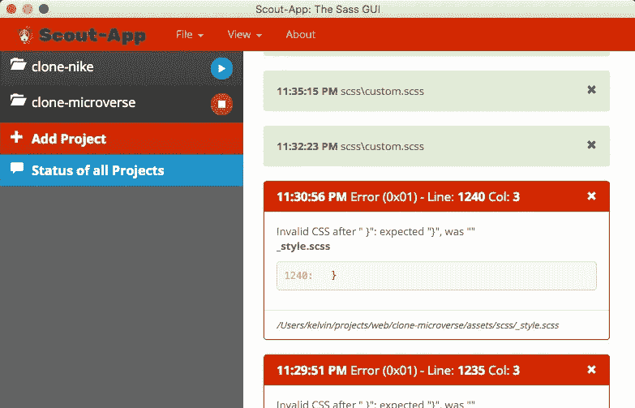
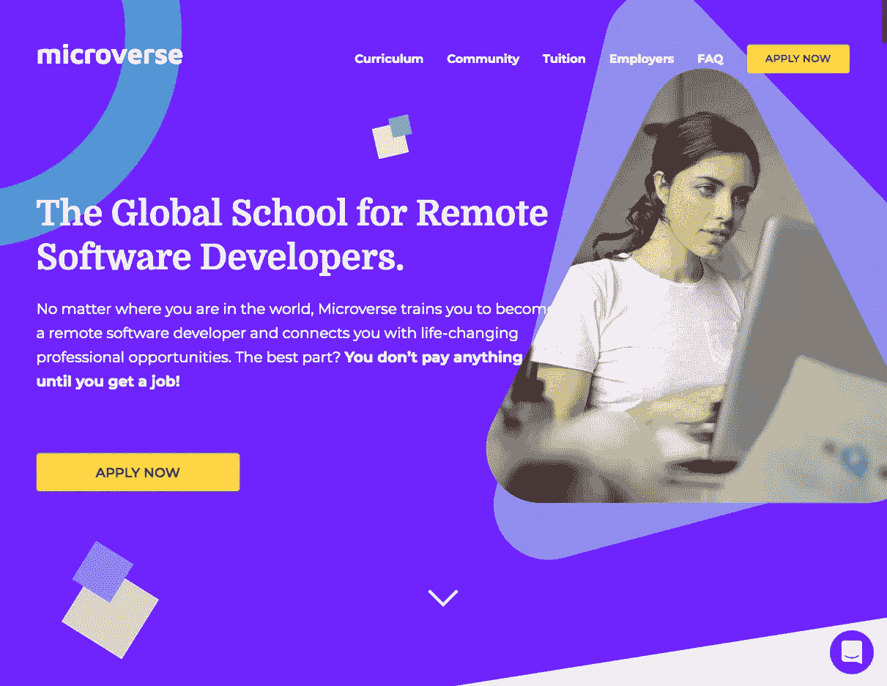
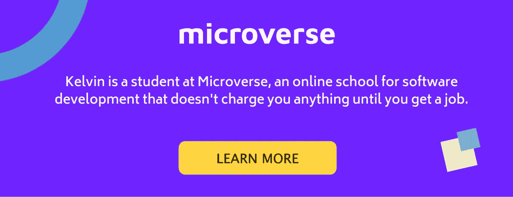

# Bootstrap 4 能克隆整个网站吗？

> 原文：<https://medium.com/hackernoon/can-bootstrap-4-clone-entire-websites-fb905fdb32c3>



> 我是一名初级 web 开发人员，最近学习了 Bootstrap 4，并尝试探索该框架在现实世界前端项目中的可能性。

# 开始前…

为了说明这种可能性，**我决定用 Bootstrap 4 做一个真实世界的项目来获得经验**。

**我选择克隆一个在线编码学校的网站(**[**Microverse**](https://www.microverse.org/)[**)。org**](http://www.microverse.org/) **)** 我参加这个项目，因为:

*   这是一份在当今就业市场很常见的单页申请。
*   它有大约 7 ~ 8 个部分来介绍它的特性和服务，这使得它与其他真实世界的项目相比足够复杂。
*   它使用#Bootstrap4 和自定义 CSS 的前端装饰，这正是我要找的。
*   我没有从零开始建立网站，但是我尽量不从学校或任何其他人那里获得任何帮助，以确保我将如何在现实世界项目中工作。

我在大约一个月的时间里完成了这个项目，但在此期间我还在做一些其他的项目和学习，所以我在这个项目上花费的总时间大约是 **30 ~ 40 小时**。

**最后的项目**和原来的不完全一样(我也不打算这样)，你**可以从这个** [**链接**](https://kelvin8773.github.io/clone-microverse/) **看出来。**

以下是我是如何完成这个项目的，以及我从中得出的结论。

# 让我们开始= >第一部分—项目设置

首先，我去[get bootstrap](https://getbootstrap.com/docs/4.3/getting-started/download/)。com 下载最新版本的[引导源文件](https://github.com/twbs/bootstrap/archive/v4.3.1.zip)。(是 V.4.2.1)，解压，我看到文件夹里面有以下文件。(有很多子文件夹和文件我都省略了)。

```
bootstrap-4.2.1 tree -L 2
    .
    ├── CNAME
    ├── CODE_OF_CONDUCT.md
    ├── ...
    ├── build
    │   ├── banner.js
    │   ├── ...
    │   └── vnu-jar.js
    ├── composer.json
    ├── dist
    │   ├── css
    │   └── js
    ├── js
    │   ├── dist
    │   ├── src
    │   └── tests
    ├── nuget
    ├── package-lock.json
    ├── package.js
    ├── package.json
    ├── scss
    │   ├── _alert.scss
    │   ├── _badge.scss
    │   ├── _breadcrumb.scss
    │   ├── _button-group.scss
    │   ├──  ...
    └── site
        ├── _data
        ├──  ...
        └── sw.js 17 directories, 67 files
```

出于我的目的，我只关注一个主要文件夹— `./scss`，因为我将通过 **Sass** 编译我自己版本的 CSS。我将整个`./scss`文件夹复制到我的项目文件夹中，下面是我的项目文件夹结构。

```
➜  clone-microverse git:(development) tree
.
├── [1.0K]  LICENSE
├── [ 736]  README.md
├── [ 224]  assets
│   ├── [ 128]  bootstrap
│   │   └── [1.4K]  scss
│   │       ├── [1.1K]  _alert.scss
│   │       ├── [1.0K]  _badge.scss
│   │       ├── [1.2K]   ...
│   │       ├── [ 920]  bootstrap.scss
│   │       ├── [1.0K]  mixins
│   │       └── [ 576]  utilities
│   ├── [ 128]  css
│   │   ├── [438K]  custom.css
│   │   └── [452K]  custom.map
│   ├── [2.0K]  images
│   │   ├── [9.8K]  1-r-kn-gdqsl-5-lie-3-l-r-7-j-n-0-a-zq-2-x.png
│   │   ├── [9.5K]  2000-px-stack-overflow-logo-svg.png
│   │   ├── ...
│   └── [ 128]  scss
│       ├── [ 27K]  _style.scss
│       └── [1.2K]  custom.scss
└── [ 48K]  index.html
7 directories, 47 files
```

这个项目有 2 个`/scss`文件夹，一个是`./asset/bootstrap/scss`(来自 Bootstrap 源文件)，一个是`./asset/scss`(供我在里面写定制代码)，输出文件夹是`./asset/css`(我的 HTML 会引用链接到那里)。

对于`Sass`编译器，我使用 [**Scout-App**](https://scout-app.io/) 来帮助，它是一个 Sass GUI，所以它非常简单，易于设置。



一旦我完成了项目设置，我就开始在 HTML & Sass 文件中编写代码。

# 第二部分= >编码…(最难的部分)

基于 bootstrap 官方[文档](https://getbootstrap.com/docs/4.1/getting-started/theming/)，我创建了一个 **custom.scss** 文件来将我的定制元素和 Bootstrap 基础文件添加在一起。

```
// Custom.scss
// Option A: Include all of Bootstrap/* -------begin customization-------- */$theme-colors: (primary: #6f23ff,
secondary: #ffd540);:root {
  --dusk: #3e396b;
  --very-light-blue: #f8faff;
  --purplish-blue: rgb(111, 35, 255);
  --tealish: rgb(65, 211, 189);
  --light-tan: #f9f1ae; --padding-sm: calc((100vw - 540px) / 2);
  --padding-md: calc((100vw - 720px) / 2);
  --padding-lg: calc((100vw - 960px) / 2);
  --padding-xl: calc((100vw - 1140px) / 2); --oPadding: calc(0.16 * 100vw);
  --oHeight: calc(0.16 * (100vw - var(--padding-xl)));
  --oHalfHeight: calc(0.16 * (50vw -var(--padding-xl)));
}/* -------end customization-------- *//* import Bootstrap to set the changes! */@import "../bootstrap/scss/bootstrap.scss";/* ----------- custom font import  ------------ */@import url("https://fonts.googleapis.com/css?family=Domine:400,700|Maven+Pro:400,500,700,900|Montserrat:400,500,600,700,900&display=swap");/* ------------ Self-styling -------------- */@import "./style";
```

我使用了“选项 A”——在这个项目中包含所有的引导组件，将所有的自样式定制放入一个单独的文件`./style.scss`，sass 将所有的 Sass 文件编译成一个巨大的 CSS 输出到`./asset/css/custom.css`，我在我的`index.html`文件中引用它。

```
<!DOCTYPE html>
<html lang="en">
  <head>
    <meta charset="UTF-8" />
    <meta name="viewport" content="width=device-width, initial-scale=1.0" />
    <meta http-equiv="X-UA-Compatible" content="ie=edge" />
    <link rel="stylesheet" href="./assets/css/custom.css" type="text/css" />
    <title>clone-Microverse - Online Coding School</title>
  </head>
```

到目前为止，上面的所有步骤都非常清楚，容易遵循(我在大约一个小时内完成它们)，但是接下来要做的事情超出了我的计算。

我花了前几个小时试图自己重新创建导航栏和登录页面。我越是尝试，越是发现它的艰难和复杂。我试图利用更多的 bootstrap 4 类和更少的定制 CSS，但这似乎是不可能的。

原来的网站看起来很光滑和时尚，不是吗？是的，但价格是非常指定和复杂的前端代码。



我最终放弃了它，并尝试查看原始网站的代码，看看它们实际上是如何组合在一起的，结果令人震惊——组成一个组件的堆栈或层比我最初想象的要多，比直接使用 Bootstrap 4 类更多的自定义 CSS，他们打算使用更多的#id 而不是 class 来实现 CSS 样式的特异性。下面是代码的一部分-

```
# Index.html
<div id="homepage" class="row bg-primary">
        <div class="content">
          <div id="homepage-navbar-container" class="container-fluid p-0">
            <nav id="homepage-navbar" class="navbar navbar-expand-lg w-100">
              <div class="container">
                <a href="#" class="navbar-band logo">microverse</a>
                 ....
                <div id="navbarToggler"
                  class="collapse navbar-collapse w-100 align-items-baseline">
                  <ul class="nav navbar-nav w-100 justify-content-end">
                    <li class="nav-item pr-3">
                      <a
                        class="nav-link font-weight-bold text-white text-capitalize"
                        href="#"
                        >curriculum</a
                      >
                    </li>\\ _style.scss
#homepage-header {
    margin-top: 163px;
    position: relative;
    z-index: 105; .head-line {
      font-family: "Domine", serif;
      font-size: 3rem;
      font-weight: bold;
      line-height: 1.27;
    } .head-text {
      font-size: 1.25rem;
      line-height: 1.65;
      margin-top: 15px;
      margin-right: 30px;
      color: #fff;
    }
```

由于这些复杂性，我花了将近一个月的时间来完成所有的编码，有一些断断续续的时间，我只是在业余时间做这个项目，但它仍然比我以前做过的大多数前端项目都要困难。最终完成的`index.html`文件有`1204`行，`_style.scss`文件有`1512`行，

```
├── [1.0K]  LICENSE
├── [ 736]  README.md
├── [ 224]  assets
│   ├── [ 128]  bootstrap
│   │   └── [1.4K]  scss
│   ├── [ 128]  css
│   │   ├── [437K]  custom.css
│   │   └── [451K]  custom.map
│   └── [ 128]  scss
│       ├── [ 27K]  _style.scss
│       └── [1.1K]  custom.scss
└── [ 48K]  index.html
```

最后，你可以在查看[中的所有代码。我已经从原来的网站克隆了大约 95%的代码，但仍然花了我很多时间来完成它。如果我需要从头开始做这个项目，我无法想象我要花多少时间。](https://github.com/kelvin8773/clone-microverse)

# 经验教训和结论…

首先，完成这个项目后，我想我现在可以回答我在开始时提出的问题了—**Bootstrap 4 对一个真实世界的项目能有多大帮助？**

*   一个简短的回答是——“不多”
*   一个更长的答案是——“它有助于网格系统和一些间距工具，但该项目仍然需要大量的定制 CSS 来帮助使网站看起来独特和杰出。”
*   一个更长的答案是——“Bootstrap framework 有助于为项目提供一个坚实的基础，它贡献了大约 20 ~ 30 %的代码库，但现实世界的项目需要更多独特的设计和差异化，作为前端开发人员需要想象力和创造力！”

其次，下面是我从这个项目中学到一些东西

*   现实世界中的前端项目通常是复杂且具有挑战性的。(它会比 Odin project 或任何其他在线学习平台中的项目复杂得多)。
*   像 Bootstrap 4 这样的前端框架可能会有所帮助，但是勤奋和创造力仍然是主要的贡献者。
*   前端开发主要涉及重复编码和被要求经常更新，确保我喜欢这种工作方式之前，我跳进去。
*   关于 SASS、CSS 和 HTML 还有很多东西要学。

最后，由于我的知识和资源的限制，我可能会用一种完全错误或不成熟的方式来做这个项目，因此我会得到一个完全错误的答案。但那又怎样？不管怎样，我做到了，并写下了它，我确实从中学到了很多。

也有免费资源可以帮助定制 Bootstrap 4 主题，但它们似乎不适合这个项目，所以我可能会在下一个项目中尝试它们。

*   [themestr.app](https://themestr.app/)
*   [礼帽](https://themesguide.github.io/top-hat/dist)

如果有一个问题我不能从谷歌或任何其他来源得到答案，我会再做一次，我认为这是一个自学成才的程序员如何在今天的环境中学习进化。

PS:我欢迎你对这个项目的批评和建议，再次感谢你阅读整个故事。

