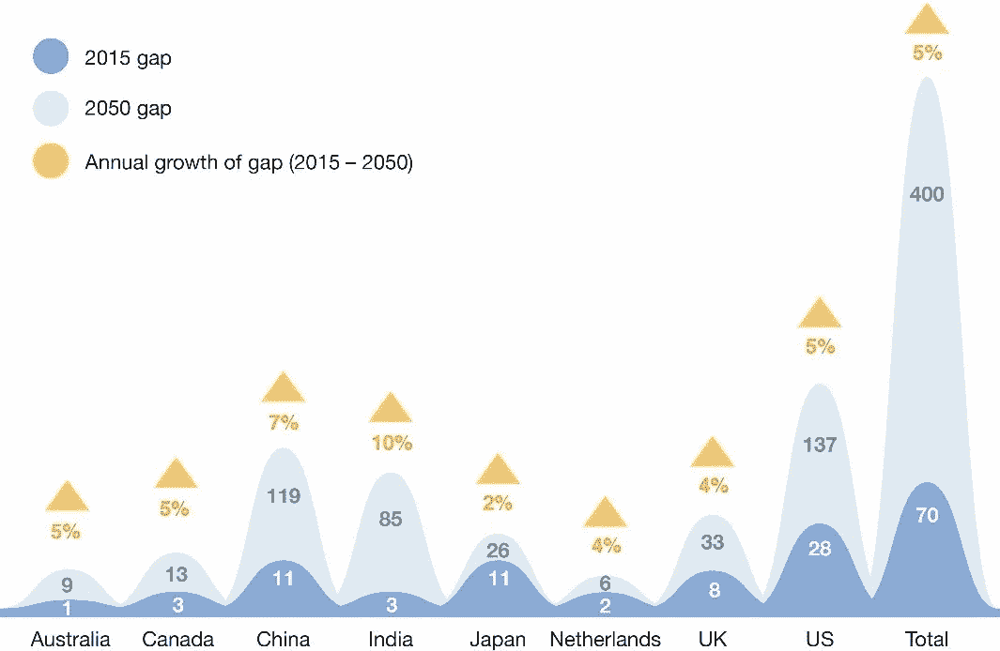

# 当我老的时候 crypto 能养活我吗？

> 原文：<https://medium.com/hackernoon/can-crypto-feed-me-when-im-old-5ffd0e393f50>

作者:奥利娅·格林

在过去一周关于养老基金首次涉足数字资产领域的新闻之后，我花了一分钟时间探索政府支持的养老金领域的最新发展，以弄清楚为什么那些曾经承诺保护退休人员的人已经在很大程度上放弃了提供社会保障。

从那些从未真正致力于资助社会领域的国家开始，让我们看看俄罗斯联邦最近的一些发展。回到 2018 年 12 月，政府做了一件相当离谱的事情，尤其是对那些记得苏联时代全盛时期的老年人来说。这表明公民最好自己制定退休储蓄计划，而不是希望由政府发放养老金，并强调俄罗斯养老金制度不足以提供退休人员的一些基本生活必需品。然而，鉴于该国最新的联邦法律规定提高退休年龄，这一宣布并不特别令人惊讶。

好吧，看起来提高退休年龄似乎是那些试图让老年人离开船的人的首选蓝图，如果不是最容易的话。在全球范围内，如果一个人的预期寿命在 100 岁上下波动，那么 70 岁的退休年龄将成为新常态，这主要是由于[养老金缺口](https://www.weforum.org/press/2017/05/global-pension-timebomb-funding-gap-set-to-dwarf-world-gdp/)的快速增长，预计到 2050 年将达到 224 万亿美元:

并不是所有的经济体都对养老金采取“先到先得”的方式。美国国会还暗示，将通过组建一个委员会来救助数百个养老金计划，该委员会的任务是使用联邦资金终止一些由雇主和工会联合向员工提供退休福利的多雇主(T4)养老金计划。这实质上意味着，美国养老金体系已经到了政府正式为其失败做好准备的地步，同时促使美国公民考虑替代退休计划。

转到池塘的另一边——英国——会变得更加忙乱。养老金一直是这里的一个热门话题，退休储蓄缺口达 2.3 万亿英镑，主要是由于工作自动化，总体估计最快将在 2028 年陷入重大经济危机。政府一直在进行多种尝试，通过调整预算分配和创建在线仪表板来帮助受益人跟踪养老金，以修复这个有缺陷的系统。然而，后者似乎不会很快发生，因为福利部长最近已经着手扼杀该项目——她的理由主要是这种类型的服务不应由国家提供。更重要的是，英国 2018 年预算特别指出，英国养老金体系将与预期寿命的增长保持同步。根据这份文件，“公共服务养老金的估值正在进行中，初步结果表明，从 2019 年至 2020 年，需要进行变革，以使公务员的养老金福利更加慷慨，包括教师、警察、武装部队和 NHS 工作人员”。这是否意味着政府有意推迟解决即将到来的养老金危机？还是根本没有？

面对所有这些令人担忧的问题，一个问题出现了——自 80 年代末以来，政府真的没有能力或意识到社会保障计划需要改革吗？有没有一个逻辑推理或任何合法的解释来解释这个一直没有真正停止滚动的养老金雪球？我们在设计资金不足的退休计划时考虑游说者和政治家的动机如何？这是在选举承诺中保持低税收的某种复杂方法吗？最重要的是——资产的令牌化和将养老金放在区块链上是追踪退休人员资金的一种方式吗？无论答案是什么，有一点是明确的:储蓄者和投资者必须开始为自己的退休计划负责，考虑一些替代储蓄途径。

更多精彩内容尽在#区块链和# web 3—[http://www . techno mads . wtf](http://www.technomads.wtf)