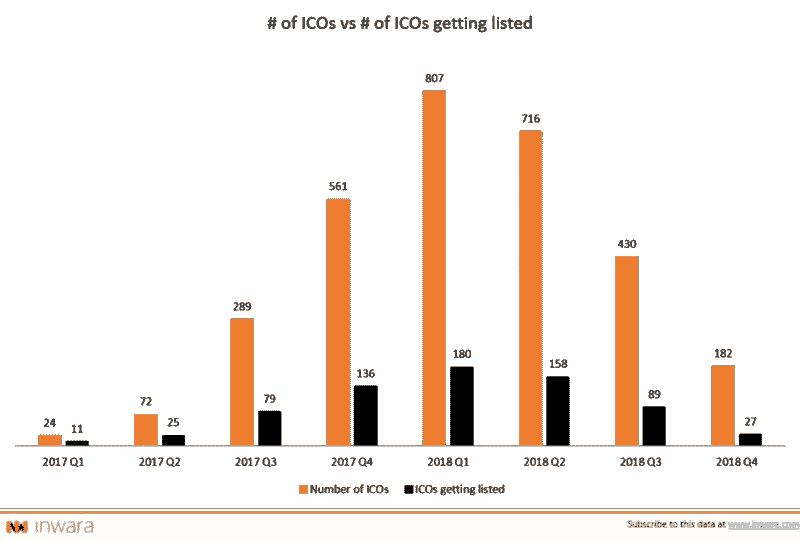
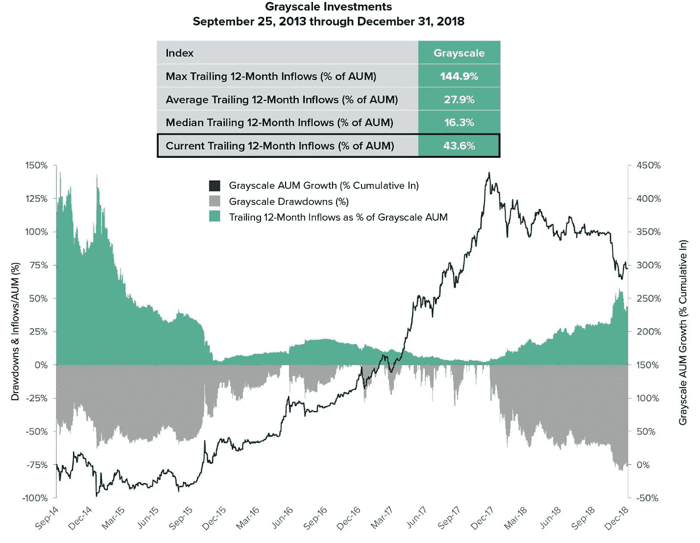

# Crypto Spring 还会远吗？

> 原文：<https://medium.com/hackernoon/can-crypto-spring-be-far-behind-5bbe1aeab96b>

Eleanor Haas，Iconiq 实验室合伙人，加密/区块链评论员，创新者和 Astia Angels 顾问，大西洋中部 Keiretsu 论坛主任

这是秘密的冬天。加密货币已经暴跌了 90%。创业公司纷纷倒闭。但是在头条新闻背后是积极的信号。三个例子:令牌化筹资继续发展，世界上最大的数字货币资产管理公司发现投资者谨慎但耐心，美国最大的银行宣布了自己的区块链令牌——这是企业长期参与和新生技术成熟的最新证据。

**令牌化募捐演变**

免费提供资金的 ICOs 尽管是加密货币——不可能永远存在，它们也没有。ICO 在 2018 年成为现实——包括投资者的抵制和 SEC 的审查。加密货币和 ICO 都大幅下跌——加密货币的价值、ICO 的数量和融资都大幅上升。越来越少的交易所上市扼杀了投资者的流动性，加剧了 ICO 吸引力的下降。

从 2018 年 1 月到 12 月，ICO 的筹资额从 15 亿美元暴跌到 7450 万美元(ICO 数据)，ICO 的数量从 Q1 年底的 807 个——创下月度历史新高——到第四季度的 182 个，Q1 的交易所上市数量从 27 个(因瓦拉)的 180 个。

但是象征性的筹款很可能处于过渡阶段，并有可能继续存在。ICO 问题源于投资者收到的加密货币代币的性质。它们缺乏内在价值，依赖用户感知，导致大量投机和欺诈；它们与 20 世纪 30 年代的美国证券法缺乏兼容性，导致了重大的法律和监管不确定性。

2018 年期间，STO(安全令牌产品)成为一种替代方案。对于这些债券，投资者会收到由有形资产支持的代币，如公司股权或房地产。sto 对投资者也有保护措施。目前启动的大多数是面向合格投资者的私募证券发行。可悲的是，这就排除了对公众的销售，尽管美国证券交易委员会有一个豁免公共安全产品的积压，或监管 A+ STOs，目前正在等待批准。证券律师正在处理一些额外的问题，预计美国证券交易委员会最早将于今年年初发布关于证券令牌分析的“简明英语”指南。

此外，两党立法《代币分类法法案》已于 12 月提交国会。它的主要目标是澄清“证券法不适用于使用区块链的公司，一旦他们达到成为一个功能网络的目标。”有意思！

这不是板上钉钉的事，但有希望出现积极的变化。想要令牌化筹资的一个原因是，它能够为创新型企业家、创新型投资者以及他们的令牌所支持的企业创造价值。

它可以为创新者提供一种重要的新方式来为他们的项目融资——一种使资本获得民主化的新方式。(这种情况能否持续将取决于证交会的裁决。)

它为投资者提供了一条快速获得流动性的新途径。

它可以让公司以代币购买者的身份与潜在客户接洽。

由于基于令牌的网络效应，它可以创造一种新的参与方式，促进企业成功，激励措施越来越相互。

谨慎但耐心的外汇投资者

全球最大的数字资产管理公司 gray Investments 创建基于虚拟货币的投资产品，面向机构和散户投资者。尽管如此，该公司在 2018 年取得了丰收，流入资金为 3.595 亿美元，是该公司历史上最强劲的日历年流入。

熊市导致该公司第四季度每周平均投资流入量从 690 万美元缩减至 230 万美元。但截至年底，该公司仍管理着 8.25 亿美元的资产(AUM)，其中 44%来自 2018 年的投资流入——尽管这是自 2015 年上一个熊市周期以来 AUM 的最高提取额，12 月达到 75%。

一个令人鼓舞的趋势是来自退休基金的资金量增加，在最后一个季度增加了 40%。机构投资者仍占流入资金的最大份额。

“这些数据点强化了我们观察到的两个重要趋势。首先，在熊市的这个阶段，普通投资者对多年期投资(即为退休投资)很有耐心。其次，随着时间的推移，机构投资者正在建立数字资产的核心战略头寸，并在很大程度上把 2018 年的缩减视为一个有吸引力的切入点，”该公司表示。

**首个美国银行支持的加密货币**

银行是摩根大通，代币叫做 JPM 硬币，它本身不是钱。这是一种数字硬币，代表摩根大通账户中已经持有的美元。目的是降低机构客户向其他客户付款的成本、资本储备和风险。当一个客户使用区块链向另一个客户汇款时，结算时间被消除了，因为他们的 JPM 硬币被即时转移并兑换成等值的美元。

这是迈向未来的第一步，在未来，企业发债或跨境支付等核心交易将在区块链上进行。为了实现这一点，银行需要能够在几毫秒内(而不是几天内)转移资金，以与智能合同兼容

最初，JPM 硬币将在银行的法定区块链上发行，随后扩展到任何标准的区块链网络。

该硬币目前是一个原型，已经成功进行了支付测试，并将于今年晚些时候在试点项目中推出。该银行计划探索该技术的其他使用案例，如托管和清算与结算。

**一个新兴产业开始成熟**

这里有比看上去更多的东西。在加密/技术界，JPM 硬币是有争议的，因为它将在银行自己控制的私人企业区块链上运行，而不是分散的公共平台。比特币粉丝和其他密码纯粹主义者认为，加密货币的存在是为了从中央当局，特别是大银行和政府手中夺取控制权。对他们来说，权力下放是区块链所有事物的本质。

另一方面，各种垂直行业的企业已经与区块链科技合作多年，希望从集中许可的*私有*区块链获得他们能够提供的真正商业价值。

除摩根大通之外的多家金融机构，包括花旗银行、BNY 梅隆银行、桑坦德银行、加拿大皇家银行和高盛

像美国运通卡、维萨卡和万事达卡这样的支付处理公司

像大众和雷诺这样的汽车公司

沃尔玛和星巴克等零售商。

亚马逊网络服务(AWS)与 IBM、惠普、微软、甲骨文和 SAP 一起提供区块链即服务(BaaS)。

与一些早期的区块链创业公司不同，企业测试区块链技术的项目是独一无二的，而不仅仅是很好。他们关注的是真正的投资回报。他们将运营置于财务之上。

**开始**结束

2018 年是 crypto/区块链转型的一年。在 ICO 的狂野西部时代，太阳落山了，并以新的方式开始了象征性的筹款。加密货币在价值上受到了重创，但作为一种有效的加密资产幸存了下来，并作为交易媒介获得了越来越多的使用。区块链的关键基础设施继续得到建设。企业概念验证开始进入试点和跨一系列用例的早期生产部署。

我们会走向隐秘之泉吗？