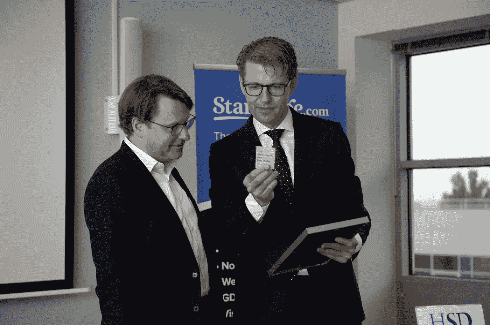
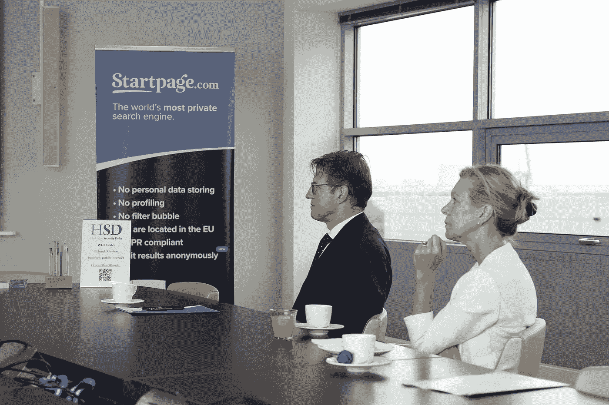
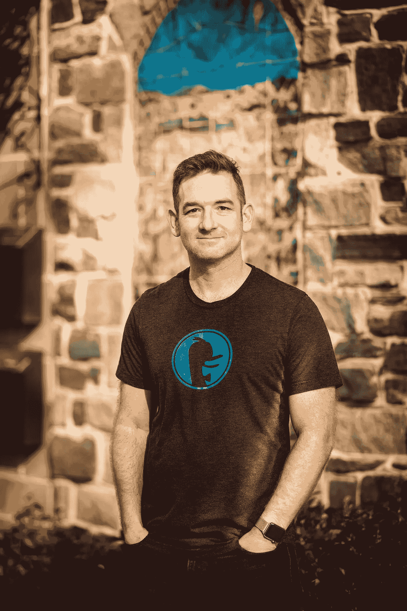
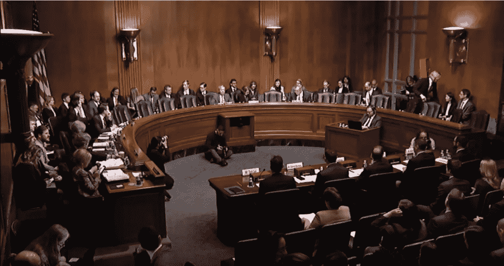

# 自由市场能拯救隐私吗？

> 原文：<https://medium.com/hackernoon/can-the-free-market-save-privacy-e488196f1b65>

政府向盈利性公司寻求解决方案

Dutch Legal Protection Minister Sander Dekker and Startpage.com Business Development Director Alex van Eesteren discuss privacy during a recent working visit

对隐私的担忧达到了前所未有的高度，公民们正期待着他们的政府给出解决方案。但是，立法是控制监控经济的最佳或唯一方式吗？

欧洲的通用数据保护条例(GDPR)是隐私保护的一大进步，但它并不完美。GDPR 的违规通知规则运作良好，但许多隐私专家对那些旨在阻止公司不当处理消费者数据的条款不以为然。如果消费者想体验所有的互联网服务，他们仍然会发现自己受制于像脸书这样的大公司。

在这场数据危机中，立法者已经开始向关注隐私的盈利公司寻求免费市场如何帮助解决问题的想法。其中两个是隐私搜索引擎 Startpage.com 和达克达克戈。

## Startpage.com ~世界上最私密的搜索引擎

Dutch Legal Protection Minister Sander Dekker and Director General for the Administration of Justice and Law Enforcement Anita Vegter visit Startpage.com to learn more about how the company protects consumers

荷兰法律保护部长桑德·德克尔(Sander Dekker)最近向该国众议院发送了一封“愿景信”，以引发一场关于荷兰政府如何帮助其公民夺回在线隐私的辩论。在信中，他以 Startpage.com 的[搜索引擎](https://www.startpage.com)为例，说明私营企业可以提供帮助:

> 德克尔在信中写道:“重要的是，人们应该更加意识到分享个人数据的后果。”。“荷兰的举措，如搜索引擎 Startpage.com，其中没有个人数据存储，有助于保护公民的隐私。”

Dutch Legal Protection Minister Sander Dekker looks on as Startmail.com Product Manager Raúl Maduro shares recent privacy innovations

德克尔和荷兰司法和执法总监安妮塔·维特在收到这封信后对 Startpage.com 总部进行了工作访问。他们与团队成员会面，讨论其私人搜索引擎如何在保持盈利的同时保护消费者隐私。

Startpage.com 从不记录或分享用户个人信息。一旦用户进行隐私搜索，他们还可以使用免费的[“匿名查看”功能](https://www.startpage.com/en/search/proxy-help.html)访问他们找到的隐私网站。这家总部位于荷兰的公司通过无针对性的广告赚钱。它也有一个付费的隐私友好的电子邮件服务，Startmail.com。

## DuckDuckGo ~不跟踪你的搜索引擎

DuckDuckGo CEO Gabriel Weinberg

欧洲政府并不是唯一一个在自由市场寻找隐私解决方案的政府。美国参议院司法委员会主席 Lindsey Graham 邀请美国私人搜索引擎 DuckDuckGo 的负责人在 3 月份就其如何在保护消费者的同时赚钱发表证词。

The U.S. Senate Judiciary Committee hearing on GDPR & CCPA: Opt-ins, Consumer Control, and the Impact on Competition and Innovation, March 12, 2019

首席执行官加布里埃尔·温伯格告诉参议员们，他的私人搜索引擎是如何通过提供无针对性的广告来盈利的:

> “…以我们的业务为例:当你在 DuckDuckGo 上键入一个搜索时，我们只是向你显示与该搜索相关的广告。如果您搜索“汽车”，我们会显示汽车广告。但是那些广告不会一直跟着你，因为我们不知道你是谁，你去过哪里，或者你要去哪里。这是情境广告对行为广告。”

DuckDuckGo 和 Startpage.com 有类似的商业模式，证明没有必要为了赚钱而窃取用户数据。他们采用消费者在“常规”跟踪搜索引擎上可以得到的相同结果，并在不记录用户个人信息或设置跟踪 cookies 的情况下提供给他们。DuckDuckGo 主要在隐私方面提供雅虎/必应搜索结果。Startpage 主要以保密的方式提供谷歌搜索结果。这两个搜索引擎也从其他来源获取搜索结果，比如即时回答。

Startpage.com 和 DuckDuckGo 只是碰巧都是搜索引擎，但还有其他盈利公司赚钱的例子，同时还尊重用户隐私。

除了呼吁新的消费者隐私立法之外，我预计未来政府会更多地关注营利性隐私替代方案。立法是必不可少的，但往往是不完善的、被动的和执行缓慢的。另一方面，注重隐私的营利性公司积极主动，行动迅速，无需在相互冲突的政治和经济优先事项中寻求共识。

自由市场可能有助于保护隐私——或者至少在立法跟上之前避免反乌托邦。