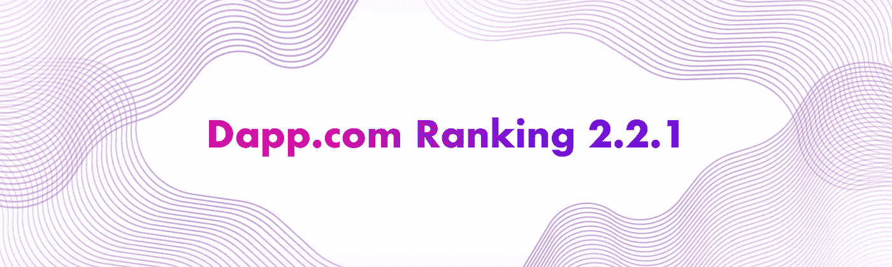
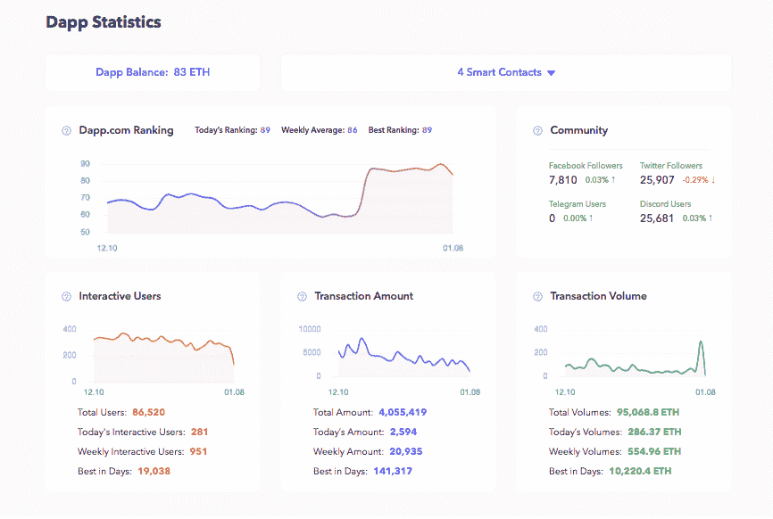

# 我们能不能别再说“DAU”了？

> 原文：<https://medium.com/hackernoon/can-we-finally-stop-talking-about-dau-d310283592c2>

## 以下是 Dapp.com 鉴别好 dapp 的方法，你永远不会再错过了。

自 2017 年第三季度以来，分散式应用程序(dapps)获得了公众的极大关注。根据我们的 [Q3 2018 Dapp 市场报告](https://www.dapp.com/article/dapps-got-game)显示，Dapp 用户已经从 2017 年 6 月的不到 2 万人上升到 2018 年 9 月的超过 95 万人。以太坊 dapps 在 2018 年前三个季度表现良好，总交易量超过[价值 20 亿美元的以太坊](https://www.dapp.com/2018-Q3-Dapp-Report.pdf)。尽管该行业仍处于早期阶段，但它展示了成为一个价值数千亿美元的市场的潜力。

*我们正在见证 dapps 在这里的大规模登陆。*

但是，如何确定一个 dapp 项目好不好呢？大多数人认为只有日活跃用户(DAU)是衡量一个 dapp 优秀的唯一标准。然而，在许多情况下，它可能是不准确和误导的。因此，我们想借此机会向您介绍一种更科学的评估 dapps 的方法——**Dapp.com 排名 2 . 2 . 1**——并解释其工作原理。

# 为什么“DAU”具有误导性？

## 首先，让我们从 DAU 的定义开始。

每日活跃用户(DAU)是衡量互联网产品成功的一种方式，如社交网络服务、在线游戏或移动应用程序。它计算在某一天访问互联网产品或服务或与之互动的用户数量。"[1]"通常产品用户被认为是"活跃的"的唯一要求是他们以某种方式观看产品或参与产品。"[2]

## 介绍 DIU

DAU 数据记录在产品后端，只有操作员可以访问。一些网站流量测量工具，如 [Alexa](https://www.alexa.com/) 和 [SimilarWeb](https://www.similarweb.com/) 提供估计数据，这些数据经常缺失且不完整。对于大多数 dapp 数据网站，他们通过监控其合同地址来测量 dapp 的 DAU，以找出交易的数量。这里的数字通常是指“DAU”。然而，Dapp.com 排名更进了一步，查看了与区块链上的合同交互的唯一钱包地址。按照这个标准提取出来的数据，与其称之为 DAU，我们更愿意称之为 **DIU** — ***每日互动用户*** 。

## 那我们为什么用 DIU 而不用 DAU 呢？

登录或浏览该产品的用户被算作 DAU，但只有那些与区块链有互动的用户才是 DIU。例如，一个 dapp 游戏 ABC 可能有 10，000 个 DAU，但这些人只是探索零购买和交易活动的市场，那么他们不是 DIU。

# DIU 重要吗？

早在 2017 年，加密收藏品非常受欢迎，我们把这些 dapps 称为“烫手山芋游戏”——以低价购买物品，然后以更高的价格转手。然后 2018 年推出的很多闲散游戏和庞氏骗局。每日参与用户数成为唯一的指标——只是为了确保每天都有大量新参与者加入游戏，以便能够获得更高的红利。许多投资者研究了游戏机制和 DIU 统计数据，以决定是否投资新推出的加密收藏品或其他具有投资属性的 dapps。所以人们把 DIU(以前叫 DAU)作为评价一个 dapp 的唯一标准。

我们都知道透明是 dapp 的关键特征，与智能合约交互的钱包地址(账户)的每一个细节都记录在区块链上。然而，人们仍然找到了作弊的方法，下面是如何作弊的:dapp 游戏 ABC 有 1 个用户，交易量为 1 ETH，当这 1 ETH 从一个地址转移到智能合同时。但也可能是 100 个用户只有 1 个 ETH 的总交易量，如果这 1 个 ETH 被分成 100 个不同的钱包并转移到智能合约。(这样想，1 个人 1 个苹果派 vs . 100 个人 1 个苹果派。)

此外，一些人甚至建立服务来为 dapps 提供更高的“DAU”(实际上是 DIU)，以便在 DappRadar 等网站上获得最高排名。一个名为 [EOS DAU](https://eosdau.com/) 的网站可以帮助 dapps 创建大量的 EOS 账户，以与其合同进行互动，并能够名列前三。

那么，DIU 真的很重要吗？是的，但是 DIU 是*而不是【dapps 的唯一标准。*

# 如何鉴别好的 Dapp？

嗯，挑选一个好的 dapp 是一个令人生畏的挑战。在过去的一年里，我们 dappss 一直在研究和分析数以千计的 dapp。以下是我们认为您应该了解的一些关键指标:

1.  **每日互动用户(DIU)** :与 dapp 智能合约互动的账户(用户)数量。
2.  **用户质量**:0.01 ETH 的用户和 100 ETH 的用户差别很大，我们认为 100 ETH 的用户是优质用户。
3.  **交易金额**:包括非零交易(通常是购买)和零交易(动作)。
4.  **用户账户资金来源**:通过多次转账，清除资金来源于 dapp 合同的机器人和假冒用户。
5.  **用户关注度**:如果一个用户账户在一天内 10 次与 dapp 的合同相关活动中有 5 次，我们认为他/她对该 dapp 的关注度很高。
6.  **用户操作的及时性**:如果用户对 dapp 的最后一次贡献是在几个月前，那么他/她最近对 dapp 的操作应该反映其 dapp 排名的差异。
7.  **社区**:包括社区规模和活跃度。一个社区是由它的忠实支持者和用户组成的，他们参与了从 dapp 开发到扩展的整个过程。它不仅显示了成长的潜力，也反映了团队的运作能力。

(A snapshot of [https://en . Wikipedia . org/wiki/Daily _ active _ users # cite _ note-1](https://medium.com/u/c8b1419b5d28#cite_note-1)

[2]赛义夫·纳赛尔，毛吉；德拉克亨，安德斯；亚历山德罗卡诺莎(2013 年 3 月 30 日)。游戏分析:最大化玩家数据的价值。斯普林格。第 56-57 页。ISBN 978–1–4471–4769–5。[https://en . Wikipedia . org/wiki/Daily _ active _ users # cite _ note-2](https://en.wikipedia.org/wiki/Daily_active_users#cite_note-2)

如果你对探索区块链和分散技术的潜力感兴趣，[Dapp.com](http://dapp.com)是你可以信赖的灵感、工具和信息的来源。