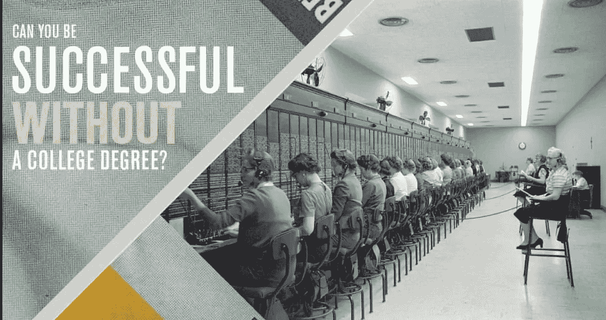
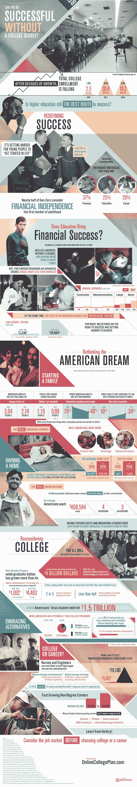

# 没有大学能成功吗？

> 原文：<https://medium.com/hackernoon/can-you-be-successful-without-college-c94594f1a4d9>

## (TLDR 是)

经过几十年的增长，大学新生入学率正在下降。对于这些有远见的年轻人来说，拒绝传统的大学经历并不意味着拒绝教育，而是意味着拒绝沉重的债务。

新生代认为经济独立是成年的第一个里程碑，这让他们面临一个艰难的选择——大学还是职业？在过去的 70 年里，大学学费增长了四倍多，如今，三分之二获得学士学位的学生为此负债。更不用说法律或医学等高等学位的平均成本已经增长了 8 倍多。我们剩下的是 1.5 万亿美元的集体学生贷款债务。面对这种前景，许多大学年龄的人正在接受替代教育路线，事实上，许多当今发展最快的职业根本不需要学位。

根据年轻人的说法，财务、教育和职业是他们开始生活时面临的最大障碍。对许多人来说，在大学里花费时间和金钱与其说是一种竞争优势，不如说是一种障碍。这张信息图详细描述了高等教育的现状以及替代方案如何改变教育游戏。

