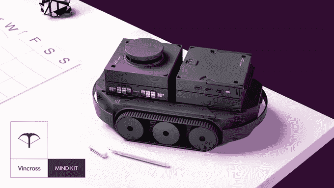
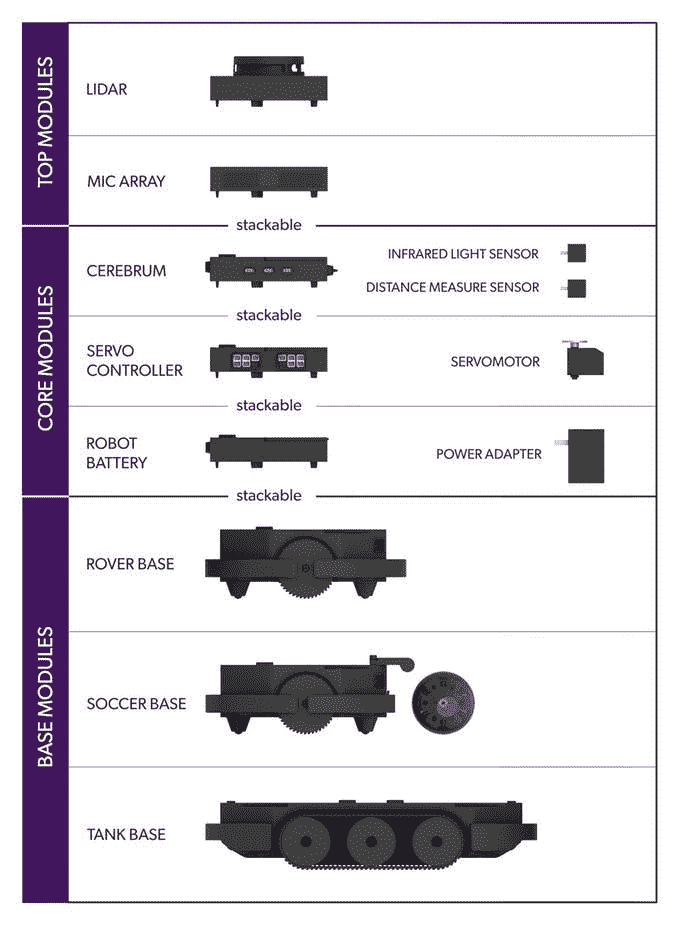
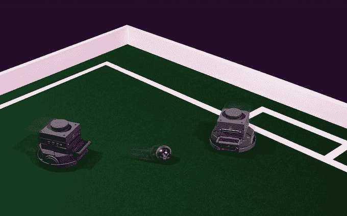
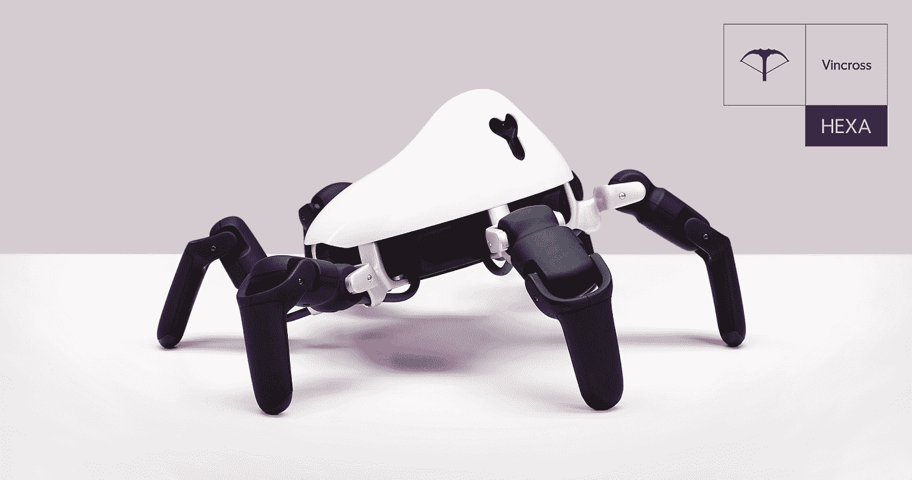

# 你会机器人吗？

> 原文：<https://medium.com/hackernoon/can-you-robot-5499a4d158ae>

制造商、开发人员、机器人爱好者，如果你还在寻找机器人部件，并希望它们与软件兼容，请继续阅读。

最近，消费机器人公司 [Vincross](https://www.vincross.com/) 刚刚推出了 [MIND KIT](https://www.kickstarter.com/projects/1090670314/mind-kit-maker-kit-exclusively-for-robotics?ref=9zw3i1) ，这是一个机器人开发工具包，为你提供建造自己的机器人所需的硬件和软件，即使你是机器人开发的第一次学生。目前它可以在 [Kickstarter](https://www.kickstarter.com/projects/1090670314/mind-kit-maker-kit-exclusively-for-robotics?ref=9zw3i1) 上预购。

[Vincross MIND KIT is available on Kickstarter through March 21, 2019](https://www.kickstarter.com/projects/1090670314/mind-kit-maker-kit-exclusively-for-robotics?ref=9zw3i1)

根据 Vincross 委托的哈里斯民意调查，90%的美国人认为学习机器人技术将为他们的职业提供“未来保障”,但只有 5%的美国人试图开发机器人项目。根据民意调查，问题的症结在于今天 62%的美国人认为机器人硬件不可及。

MIND KIT 出现在公共或基于社区的资源太少的时候，而具有拖放编程的机器人套件只是为了迎合儿童，但没有提供足够模块化和复杂的功能来构建实用的复杂机器人。

如果你仍然想象你可以有一个机器人来卸载你的洗碗机，不要止步于此，因为 MIND KIT 的 Kickstarter 奖励之一-机械臂套件将提供你需要的工具。

让我们来看看思维工具包中包含了哪些内容。

MIND KIT Modules

**大脑** —大脑是机器人优化的单板计算机，在这里你可以控制机器人的思维、语言、决策和感知。

**伺服控制器** —使 MIND KIT 能够同时运行多达 20 个伺服电机的模块。伺服控制器与大脑一起，当夹在一起时，形成了作为机器人优化制造商套件的 MIND Kit 的基础。

**ENERGON** —一种锂离子电池，经过优化，可以高效地运行人工智能和机器人电机。

**可定制**——通过大脑内置的 54 个可编程引脚或 6 个 USB Type-C 插座，hack MIND KIT 可以根据您的需求构建高度复杂的机器人。

**模块化配件** —通过即插即用配件，将配件夹在一起，为您的机器人构建添加更多功能，包括**激光雷达**、**四轴机械臂**、**坦克底座**(带履带的轮式模块)、**扬声器** & **麦克风阵列**和**漫游车底座**(四轮模块)。

**机器人优化—**MIND Kit 是唯一一款机器人定制的制造商套件，可以同时控制多达 20 个伺服电机，同时还可以运行 SLAM、实时视频处理和强化学习。

**MIND OS 2.0** —市场上第一个也是唯一一个专为机器人设计的操作系统已经更新，现在可以比以往任何时候都更容易地为您的机器人开发软件应用程序。

你能用思维工具包做什么？让机器人成为你餐桌上的服务员？得到机器人的拥抱？蔻驰你自己的机器人足球队？答案是肯定的。

“Play a drum”

“The soccer team”

从 Vincross 的六足全地形机器人 [HEXA](https://www.vincross.com/hexa) 开始，MIND KIT 的使命是让机器人变得无障碍，这使 Vincross vision 更进了一步。

Vincross 6-legged programmable robot HEXA

在为 MIND KIT 提供动力的引擎盖下，是 MIND OS 2.0，这是 Vincross 最新的机器人专用操作系统，可以通过简单的 SDK 访问，使构建 MIND KIT 机器人的技能、动作和应用比以往任何时候都更容易，而不需要深入的机器人开发技能。

此外，MIND OS 还受到 Vincross 论坛的支持，这是一个机器人开发人员社区，他们共享知识和技能，以支持其他开发人员开发机器人。

如果你曾经对机器人有过很酷的想法，现在是将你的想法付诸实践的好机会。

[Kickstarter 活动](https://www.kickstarter.com/projects/1090670314/mind-kit-maker-kit-exclusively-for-robotics?ref=9zw3i1)将于 2019 年 3 月 21 日结束。看看吧，我想你会印象深刻的。

**关于 Vincross**

Vincross 由孙天琦于 2014 年创立，是一家消费级机器人开发商，旨在让机器人变得更容易使用。Vincross 于 2016 年 8 月推出的第一款消费型六足全地形机器人 HEXA 最为知名，该公司的最新产品是 2019 年 2 月推出的第一款机器人优化制造商套件 MIND Kit。在创办 Vincross 之前，田琦在清华大学担任人工智能科学家。迄今为止，Vincross 已经从 GGV 资本、联想、真格基金、Seek Dource 等公司筹集了 1700 万美元的资金。

要了解更多关于 Vincross 的信息，请访问 http://vincross.com