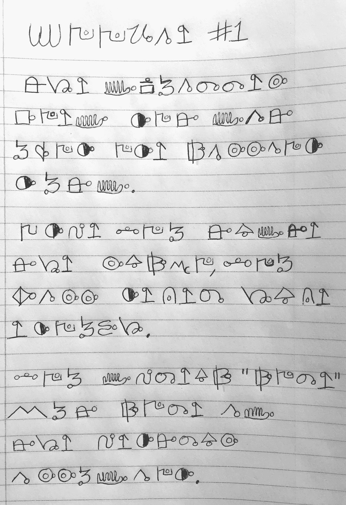
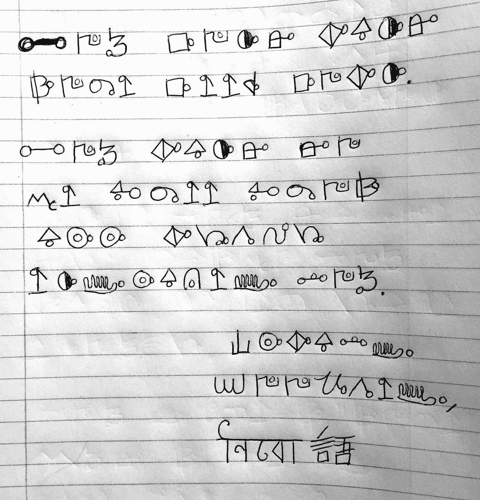
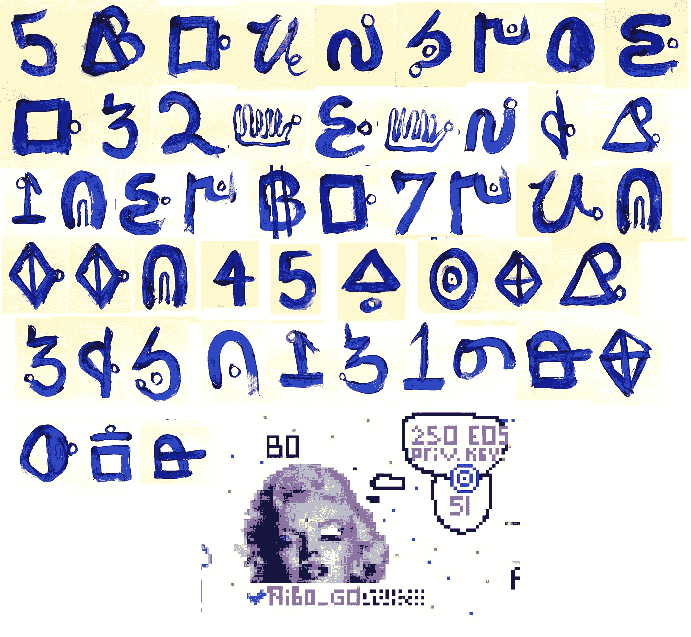

# 你能解开这个密码吗？如果是这样，750 美元的 EOS 帐户是你的

> 原文：<https://medium.com/hackernoon/can-you-solve-this-cipher-if-so-750-eos-account-is-yours-c773e1711332>

from the [pixEOS Paint game canvas](https://paint.pixeos.art/)

我想这是一周前的事了，当时我正在浏览 pixEOS Paint 画布，我记得看到了玛丽莲·梦露的这个思想泡泡，但当时我并没有深入研究。昨晚，我浏览了一个名为 EOS Discussions App 的 Reddit 风格的新网站，发现有人发现了一个密码，可以打开一个 750 美元的 EOS 账户。账户名是 nibogonibogo，可以在这个区块浏览器上看到:【https://bloks.io/account/nibogonibogo

这就解释了为什么画布上写着“priv key”和“51”。所有 EOS 帐户都有一个公钥和私钥，私钥中有 51 位数字。所有私钥也都以数字“5”开头。最先发现并写下此事的匿名人士已经在这篇帖子中详述了大部分线索:[https://EOS . discussions . app/#/e/pixeos/5252422109/Private _ Keys _ to _ _ 750 _ EOS _ Account _ Hidden _ in _ Cipher](https://eos.discussions.app/#/e/pixeos/5252422109/Private_Keys_to__750_EOS_Account_Hidden_in_Cipher)

这些段落也发布在 Twitter 和 EOS 讨论应用程序上:

cipher

cipher

原帖在私钥可视化上犯了个小错误，今天 nibogonibogo 账号更正了。下面是一个未知脚本中私钥的正确图像:

from [https://eos.discussions.app/#/e/pixeos/5252422109/Private_Keys_to__750_EOS_Account_Hidden_in_Cipher](https://eos.discussions.app/#/e/pixeos/5252422109/Private_Keys_to__750_EOS_Account_Hidden_in_Cipher)

我也开始在 Twitter 上关注这个 nibo_go 账户:[https://twitter.com/nibo_go](https://twitter.com/nibo_go)

我不擅长破译密码，但我打赌肯定有人能破译它们。