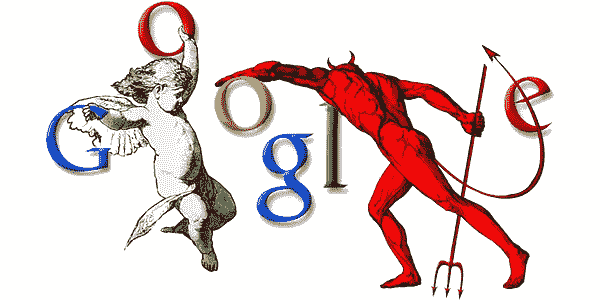
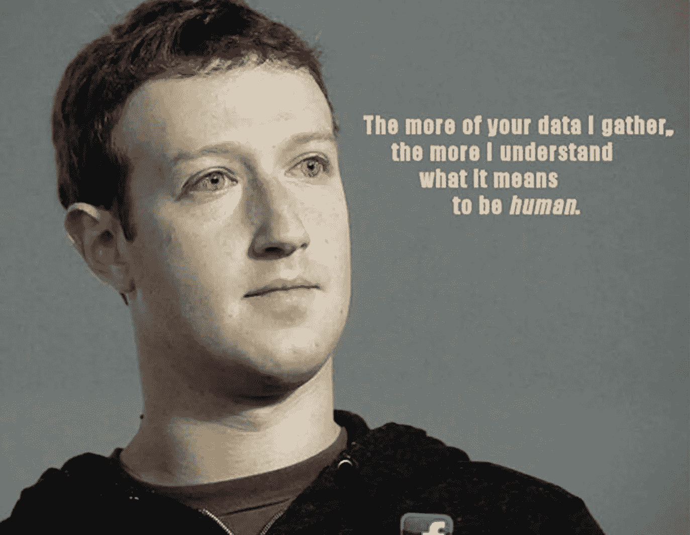
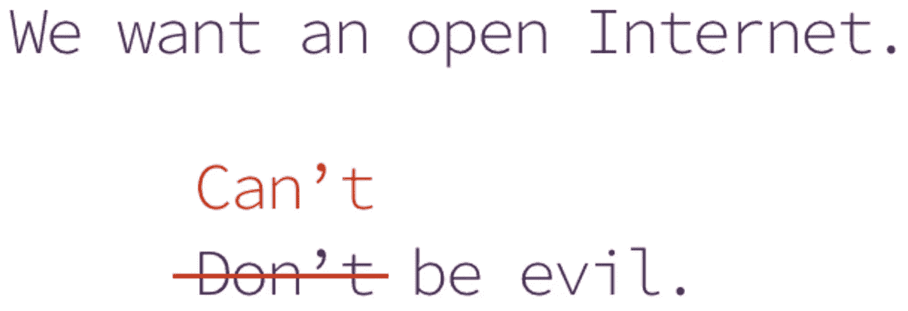

# 不能邪恶 vs .不要邪恶

> 原文：<https://medium.com/hackernoon/cant-be-evil-vs-don-t-be-evil-12fb625057b7>

> *不作恶*:一句可爱的口号。现在一个被取消的承诺。
> 
> *不能为恶*:未来组织和商业的典范。

公司将从*可信服务条款*过渡到建立*数字化服务合同*。证明*不变的*服务水平将成为消费者和企业软件的新标准和独特卖点。

用户已经受够了破隐私和破产品。科技公司用免费软件和广告支持的模式将自己逼入了一个危险的角落。不惜任何代价的增长，很多风投和创业公司支持的模式往往与用户的利益不一致。这导致一些企业家早在 2014 年就把*不能是邪恶的*作为他们努力的[焦点](https://blockstream.com/2014/11/17/blockstream-closes-21m-seed-round/)。[开发人员正离开大型科技公司](https://medium.com/u/8dd3ab013f82#3939c4b3547c)去创办注重影响力的初创公司，即用户拥有他们的数据，增长与积极的社会或环境利益相一致。什么概念。我们不仅担心其他人控制我们的数据，我们还意识到有可能控制我们自己。

# 系统性问题

免费从来都不是免费的。如果听起来好得难以置信...[数据作为劳动力](http://radicalmarkets.com/chapters/data-as-labor/)是[格伦·威尔的](http://glenweyl.com/) [激进市场](https://press.princeton.edu/titles/11222.html)中写的一个话题，但这个想法已经存在几十年了。从签证交易到我们的电子邮件，大公司一直在从我们的反馈和行为数据中了解我们是谁。这是一笔大生意。

你可能还记得你第一次看到定向广告时的想法，“这有点令人毛骨悚然。至少我看到了相关的广告。”一个非常合理的回应。我们没有意识到的是那些广告投放的动力。我们认为只与朋友、家人或同事分享的数据是如何被使用的。这些数据是[训练分析和人工智能模型](https://www.cmo.com/features/articles/2018/9/19/ai-in-marketing-and-advertising-.html)，为公司提供了一套超人的[个性化能力](http://www.netimperative.com/2018/11/european-advertising-trends-ai-adoption-set-to-boom-as-brands-look-to-get-personal/)。它们会影响我们的情绪、行为并控制我们。研究表明，最聪明的人可能最痛苦。

听起来像电子恐慌或锡纸帽领域？[几份](https://www.nytimes.com/2018/04/11/technology/facebook-privacy-hearings.html) [报告](https://www.recode.net/2018/4/20/17254312/facebook-shadow-profiles-data-collection-non-users-mark-zuckerberg)(2/几份)显示，大多数用户不知道他们的数据被用于什么目的。值得注意的是，关于这一事实的最新数据是由[电子前沿基金会](https://www.eff.org/deeplinks/2019/01/guided-tour-data-facebook-uses-target-ads)汇编的，该基金会[在网上游说并争取消费者保护](https://www.eff.org/work)。

为什么有些人否认公司如何从控制我们的数据和生活中获利？因为它们让我们免费分享迷因、协调事件和储存我们所有的记忆？国家和企业层面的社会工程隐性成本，远不如一个月几块钱。自动化和失业率以惊人的速度增加了这些成本，刺激了人们对新模式的兴趣。

互联网的新商业模式不会是免费的。一线希望:通过调整激励措施，并在新技术的帮助下，用户将最终净零，或者在有影响者的情况下，获得利润。欢迎来到“不可能是邪恶的”经济。

# 精英技术

为*提供动力的不可能是邪恶的*组织？你可能会怀疑一些热门词汇，比如 T4、区块链和加密货币，以及一些初创公司的名字和一些挥舞的大手。这篇文章是关于基础的，所有这些都很简单。密码学。

密码学上的突破是这个新的不可信商业行业中大肆宣传和流行词汇的基石。区块链很快成为整个空间的统称，但这是一个误称。区块链只是加密密封的不可变数据库。围绕网络和计算有太多的担忧，利用加密技术创建*的架构不可能是邪恶的*业务逻辑。有些涉及区块链数据库，有些不涉及。该是我们完善论述的时候了。

> “区块链对金融系统的影响就像互联网对媒体的影响一样”~ [HBR](https://hbr.org/2017/03/the-blockchain-will-do-to-banks-and-law-firms-what-the-internet-did-to-media)

加密货币或密码已成为另一个包罗万象的术语。在 2016 年末和 2017 年，[技术](https://hackernoon.com/tagged/technology)被危险地过度使用，2018 年[的结果令人失望](https://www.coindesk.com/crypto-didnt-give-us-2017)。比特币社区所称的数字货币的[双重花费问题](https://www.investopedia.com/terms/d/doublespending.asp)已经得到解决，解决方案也在不断改进。

我们需要几种架构来解决数据的“双重所有权”问题。各有利弊。我们不能简单地把钱加到互联网上，然后期望商业发生变化。范式转变必须超越金钱。我们需要改变社会和文化。世界各地的运动开始攻击被一些人称为 [Web 3.0](https://en.wikipedia.org/wiki/Talk%3AWeb_3.0) [的技术栈](https://blockchainhub.net/web3-decentralized-web/)。

[Welcome to the new internet](https://www.youtube.com/watch?v=qtOIh93Hvuw) | [Muneeb Ali](https://twitter.com/muneeb) | [TEDxNewYork](https://www.tedxnewyork.com/) | [YouTube Video](https://www.youtube.com/watch?v=qtOIh93Hvuw)

# 新型号

互联网已经摧毁了消费者对付费内容和知识产权的兴趣。随着 P2P 的出现，媒体经历了巨大的变革。那些被新技术所跨越的行业的问题仍然没有解决。这种转变也催生了假新闻和定向广告技术的社会回音室，超出了本文的范围。本质上，如果我们不开始拥有、归属和重视好的内容，我们就完了。

如果我们能挖掘出今天*【免费】*平台的隐性成本，我们就能抵消互联网的基础设施成本。这是[网](https://en.wikipedia.org/wiki/Talk%3AWeb_3.0)[运动](https://www.web3summit.com/)中许多人的愿景。还有另一场运动也认同这种意识形态。IndieWeb 运动是一个“自带技术”的集合，使个人能够拥有自己的内容、数据和与他人的联系。两者各有千秋，但在用户体验、沟通和被公众广泛采用方面都受到了严重影响。

这些运动必须降低采用新商业模式的认知负担、社会和经济成本。用户熟悉某些 UX 和支付模式。过多的负担和过少的回报是领养灾难的原因。一种方法可能是通过现有的机构，这些机构已经尝试了这些运动的相同的参与性商业模式，例如，合作杂货连锁店或零售商。

当新技术到来时，总会出现中断。现任者试图将其建立在现有的商业模式之上，但失败了。新的组织出现了，并以新的商业模式灵活地巩固了自己在一个行业中的地位，随后改变了这个行业。密码学是软件。开发周期非常快。*不能为恶*组织来了。和他们一起的是 B2B 和 B2C *不可能是邪恶的* SaaS 提供商。你会在哪里建造？

# 摘要

现在是学习密码学、分布式计算和多方计算的最佳时机。当所有人的目光都集中在 AI/ML 或其他技术接下来会做什么时，我们必须将注意力转移到*谁*和*我们如何*控制 AI 和新兴技术。几乎每天都有新的突破、算法和设计模式出现。我们产生了大量的数据。是时候拿回属于我们的东西了。我们需要合适的工具来做这件事。*不能作恶*是技术、组织和商业的未来。

你将如何证明自己？

[solo block . solutions](https://soloblock.solutions)
[medium.com/@mattdlockyer](/@mattdlockyer)
[twitter.com/mattdlockyer](http://twitter.com/mattdlockyer)
[linkedin.com/in/mattlockyer](http://linkedin.com/in/mattlockyer)