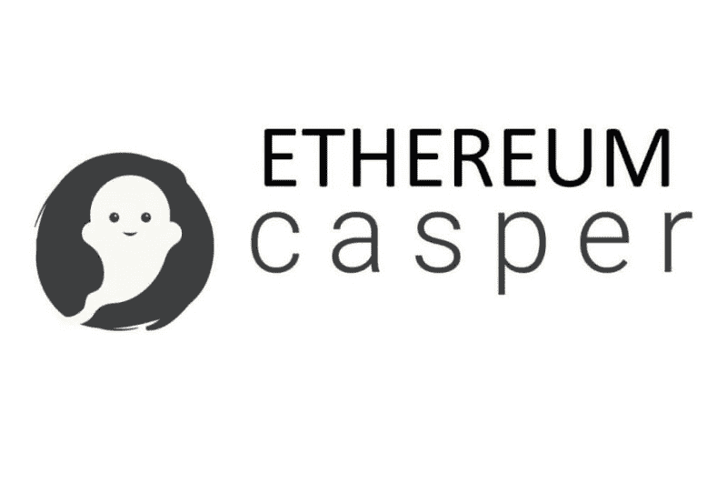
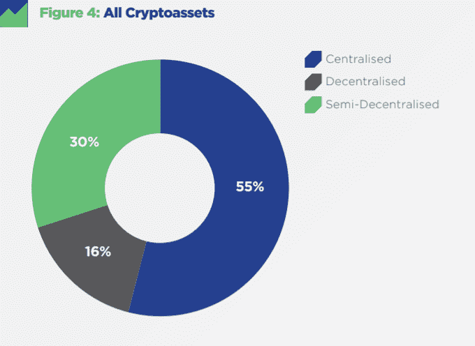

# 我们不能在一把伞下同时拥有可伸缩性和去中心化吗？

> 原文：<https://medium.com/hackernoon/cant-we-have-both-scalability-and-decentralization-under-one-umbrella-525d18101b62>

人们普遍认为，对于区块链技术来说，缺乏可伸缩性是广泛理解、采用和利用的障碍。

> “可扩展性”指的是分散式网络接受许多平等参与者的能力，同时确保它能够处理的交易数量足够大，以供有意义的使用。

自 2014 年以太坊的构造转变以来，区块链一直典型地依赖于各种形式的中央集权和非公开的规模化。可能需要将焦点转向投票协议、委托和/或棘轮。

虽然绝大多数区块链公司声称他们的网络是分散的，但只有少数公司实现了有意义的分散。相反，他们强调可伸缩性和速度。想想 Ripple，许多人认为它是 XRP 标志背后的中央集权实体。

根据 [Crytpoasset 分类报告](https://www.cryptocompare.com/media/34478555/cryptocompare-cryptoasset-taxonomy-report-2018.pdf)，只有 16%的区块链是真正分散的，其余的要么是集中的，要么是半分散的。

Image source: [https://www.cryptocompare.com/media/34478555/cryptocompare-cryptoasset-taxonomy-report-2018.pdf](https://www.cryptocompare.com/media/34478555/cryptocompare-cryptoasset-taxonomy-report-2018.pdf)

我和 [CasperLabs](https://casperlabs.io/) 谈了为什么他们认为为了可伸缩性而牺牲去中心化在技术上是不合适的，也是不必要的。

他们的一般前提是，追踪由单个受信任的私人实体或团体控制的数据的来源已经在很大程度上通过数据库的创新得到了解决。关键是实现基础设施的公共所有权/使用权。

CasperLabs 是一款完全去中心化、可扩展的新型利益证明区块链，首席执行官 Medha Parlikar 和首席 CBC Casper 架构师 Vlad Zamfir 目前正在开发一款完全去中心化、分片、可扩展的分布式账本技术(DLT ),该技术将依赖于突破性的利益证明协议。该协议，CBC-Casper，将扩展和加强几十年来对拜占庭容错的研究。Zamfir 也是以太坊基金会的建筑师和研究员。

回到正题，CasperLabs 的灵感来自以太坊的最佳特性，提供了强大的 PoS 技术和大规模可扩展性。

Vlad Zamfir, lead architect at CasperLabs and researcher at the Ethereum Foundation

令人兴奋的是，网络的基础设施是由首席执行官 Medha Parlika 和首席 CBC-Casper 架构师 Vlad Zamfir 领导的研发团队设计的，他也是以太坊基金会的研究员。虽然 Vlad Zamfir 并不积极地在新的区块链上编码，但他[作为一名研究员](https://www.coindesk.com/casperlabs-is-building-a-pos-blockchain-with-help-from-ethereums-vlad-zamfir)正在制定协议规范。

据该公司称，理想的共识应具备 CBC Casper 符合的以下特征:

*   一个简单的共享共识安全证明
*   在新数据结构之上开发共识协议的灵活性
*   没有必要的协议内终结阈值
*   开放和无许可访问
*   没有代表团；即没有参与者的类别

在与 CasperLabs 的合作中，Zamfir [认为](/casperlabs/vlad-zamfir-collaborates-with-casperlabs-to-launch-a-new-decentralized-proof-of-stake-blockchain-91899730175e?source=user_profile---------18------------------)“*该技术有望通过股权共识证明在不牺牲去中心化的情况下扩展区块链，并且通过消除传统工作证明协议所需的挖掘，它将在生态和经济上更加高效和安全*

Zamfir 暗示，比特币的力量确实正在影响环境，因为矿工需要大量能量来进行 GPU 和 ASICs 的计算过程。两年前，普华永道的区块链分析师 Alex de Vries 警告说:

“能源消耗是疯狂的，”他告诉我。“如果我们开始在全球范围内使用它，它会杀死这个星球。”

CasperLabs 的联合创始人兼母公司 ADAPtive 的首席执行官 Mrinal Manohar 评论说:“工作证明系统花费大约 90-95%的底层计算资源来生成随机数。

“不幸的是，这些数字一旦产生就没有前瞻性的效用，这使得系统本身就很浪费。浪费的系统往往不起作用；我讨厌卷入政治和谈论资源限制，我宁愿只说效率总体上是个好主意。如果操作得当，无需许可的分散式股权证明是高效且安全的。”

CasperLabs 进行了大量投资，研究开发完全去中心化和可扩展的区块链的最佳方法。CBC-Casper 是 CasperLabs 即时路线图的一部分，被认为是以太坊的潜在共识协议。许多 CasperLabs 团队成员都是以太坊的早期投资者，更不用说是以太坊基金会的研究员 Vlad Zamfir 了。

但是，CasperLabs 打算如何与以太坊合作呢？我对那件事很好奇。

“Linux 非常伟大，因为尽管有无数的分支，但方向上的重点是创造伟大的东西和合作，而不是专注于琐碎的竞争或宫廷阴谋，”马诺哈尔回应道。

“以太坊是一个天才的结构性转变，在我们的行业中从未复制过，我们 CasperLabs 的许多人从一开始就是该项目的种子投资者和支持者。我们在 Github 上的整个代码库都是开源的，每个人都可以使用。如果我们的构建中有任何对以太坊有用的部分，或者任何支持开源和去中心化精神的项目，我们很乐意分享。这是公开邀请。CBC-Casper 是一项重要且具有启发性的技术，需要实施。”

本周末，CasperLabs 将与 CryptoChicks 合作参加[crypto chicks Hackathon+block chain，AI Conference，](https://www.toronto.cryptochicks.ca/)这是一项在加拿大多伦多 RBC WaterPark Place 举行的大型区块链和人工智能活动。该活动包括 Zamfir 和以太坊的 Vitalik Buterin 等小组成员。