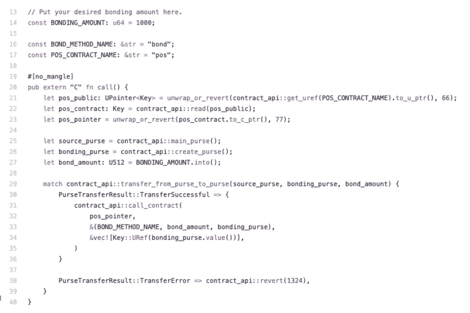
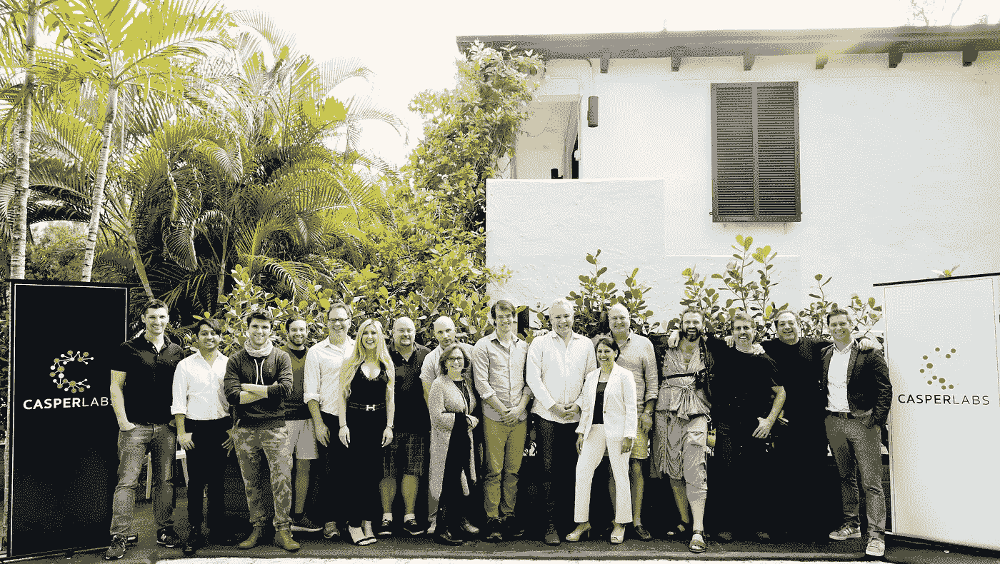

# CasperLabs 宣布推出 Node 0.5，为公共 DevNet 做好准备

> 原文：<https://medium.com/hackernoon/casperlabs-announces-node-0-5-gets-ready-for-public-devnet-1a5a915418bb>

Bonding transaction in Rust

*PoS CBC-Casper 区块链协议仍在发布时间表上*

*继 6 月推出 Node 0.4 之后。*

[CasperLabs](https://casperlabs.io/) ，实现纯 CBC-Casper 利益证明(PoS)协议的完全分散和可扩展的下一代区块链的构建者，宣布发布[节点 0.5](https://github.com/CasperLabs/CasperLabs/releases) 。在此版本中，现在可以通过发送绑定请求向网络添加节点并加入共识。

CasperLabs 的 Node 0.5 包含了支持公共 DevNet 的所有必要特性，引入了验证器绑定、解绑定和 Stake 契约证明。它们共同实现了 CBC-Casper 的一个定义性特征:共识的参与者可以加入和离开网络，而无需经过任何代理投票过程。也被称为“无许可”，这是高安全性区块链的一个基本属性。

CasperLabs 区块链支持编译到 WASM 的智能合约。目前，Rust 的编译目标是可用的。

CasperLabs 的首席执行官 Medha Parlikar 分享道:“我很高兴宣布 Node 0.5 的发布，这为我们下周的公开 DevNet 发布铺平了道路。”Parlikar 补充说，“我们令人难以置信的开发团队继续朝着今年晚些时候公开发布我们的网络取得坚实的进展。”

CasperLabs Node 0.5 版本的亮点包括:

*发送部署* —部署(事务)现在必须使用与执行部署的帐户相关联的公钥进行签名。从给定帐户执行的交易必须采用顺序随机数，以防止重放攻击，并确保给定帐户的确定性交易执行。

*账户和钱包***——**卡斯珀拉布区块链在钱包里使用账户，账户是存放代币的地方。帐户仅在令牌转移请求时创建，并使用与 ed25519 兼容的密钥对进行保护。当创建一个帐户时，在铸币厂中创建一个钱包，令牌被转移到新的钱包，并且在传递的公钥下将新的帐户对象写入全局状态。该帐户还包括阈值、associated_keys 和 account_activity 的附加字段，这些字段对于帐户恢复非常重要，这是未来版本中计划的一项功能。

当从帐户接收部署时，帐户公钥用于从全局状态访问执行前状态上下文。合同被执行，执行效果被应用到前状态以计算后状态，并且后状态被存储在帐户的公钥下的全局状态中。这个后状态现在将成为该帐户下一次部署的“前状态”。

*验证器绑定和解除绑定*—CBC-Casper Stake Proof 使验证器能够通过向网络发送一个请求来加入和离开网络，这个请求是一个特殊的事务，称为“绑定或解除绑定请求”。

*完成交易****—***CBC-Casper 协议是可证明安全的。这意味着该算法存在一个数学证明，证明交易一旦被 CBC-Casper 完成，就不能被撤销。Casper 协议通过使用特殊的[算法](https://hackingresear.ch/cbc-inspector/)来测量给定块达到的终结级别，从而实现了这一点。一旦提交了事务，就可以使用位于端口 40403 的 GraphQL 接口来获取完成信息。

其他技术细节和编码示例，以及 GitHub 开发者包和文档的链接，可以在 CasperLabs 的[官方公告](/casperlabs/casperlabs-releases-node-0-5-456dc0bfaf40)中找到。

CasperLabs Team

**关于 CasperLabs**

CasperLabs 正在为所有需要高度安全性、快速执行和可预测经济性的应用构建一个变革性的区块链。该公司的技术建立在由 CasperLabs 首席架构师兼以太坊研究员 Vlad Zamfir 设计的最纯粹的利害关系证明 CBC-Casper 协议实现之上。CasperLabs 提供了一个完全去中心化、无许可、公共和开源的区块链平台，该平台为开发人员提供了强大的工具、应用洞察和可预测的费用结构。

网址:[https://casperlabs.io/](https://casperlabs.io/)

电报:[https://t.me/casperlabs](https://t.me/casperlabs)

领英:[https://www.linkedin.com/company/casperlabs/](https://www.linkedin.com/company/casperlabs/)

GitHub:[https://github.com/CasperLabs](https://github.com/CasperLabs)