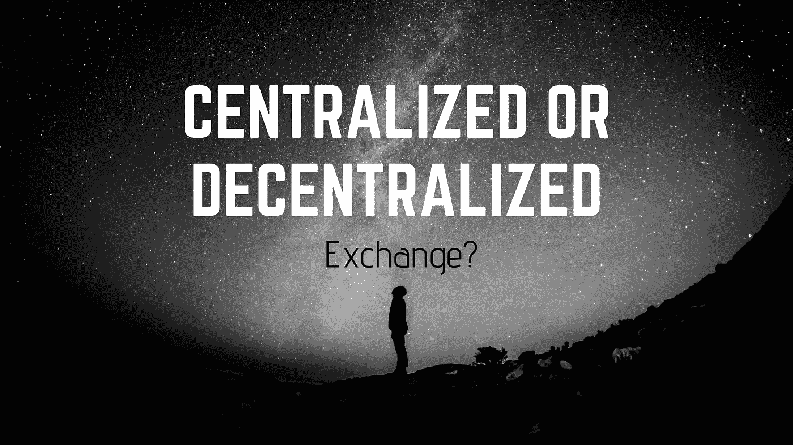
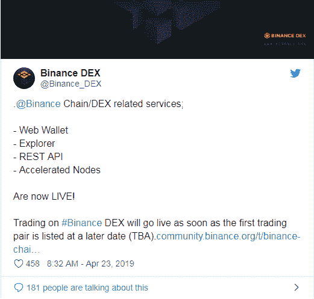

# 集中式与分散式加密货币交换——简单解释！

> 原文：<https://medium.com/hackernoon/centralized-vs-decentralized-cryptocurrency-exchanges-explained-simply-639411ecb452>

近年来，“加密货币”一词正在统治世界。加密货币是首要关注的问题，因为它是一种安全、可信的交易方式，因为世界正朝着这个方向发展！此外，货币是数字的，它们不能被伪造，这就是为什么投资者转向加密交换服务！

随着加密货币的激增，交易者对加密货币交易所执行交易的需求。密码交易所在区块链行业的发展中发挥着至关重要的作用。

简单来说，加密货币交易所允许投资者即时交易、购买或出售加密货币。通常，加密交易所支持 20 多种货币进行完善的交易。当谈到交易所时，人们寻找加密控股公司，以获取他们业务的高端红利。因此，他们更喜欢提供强大功能和功能齐全的解决方案的交易所。

据 DataLight 报道，一家加密分析网站发布了一份报告，该报告揭示了美国在加密货币交易所的访问量创下最高纪录。根据该报告，它记录了 2200 万次每月访问，导致 100 次加密货币交易。

## 集中式与分散式加密货币交易所:

加薪之后，这些交易将会成为下一个热门话题！

中央交易所的运作类似于今天的银行:

*   来了一个主人。
*   他们很安全。
*   他们遵守规章制度。

集中交易所虽然存在，但分散交易所的概念却在到处流通！

补充，反对集中交易所的战争已经开始了！想知道怎么做？

你可能听说过 ***密钥的证明*** 概念，这是由著名的比特币顾问 ***，Trace Mayer*** 给出的。他建议，每一个在中央交易所存储 BTC 的比特币所有者都应该把钱转移到自己的钱包里。

众所周知，硬币是由第三方服务存储的，而不是你的。这可能会引起安全问题！

这正是 HitBTC 发生的事情，hit BTC 是一个交易量约为 40，000 BTC 的集中交易所。当一些交易者试图提取他们的 BTC 时，得到一条消息，“该账户暂时禁止提取”。

此外，您需要了解与集中交易相关的风险:

*   它们很容易被黑客攻击，从而导致资金损失。
*   今晚整个交易会消失。

现在你应该明白集中交易的真正问题了。然而，为了证明密钥是过时的，并且你是你的资产的真正所有者，分散加密交换作为一个天赐的策略出现了！

这是因为:

*   由于没有注册要求或 KYC 过程，增强了隐私。
*   不需要存款或取款。点对点之间发生的所有事务都由编程安全的智能协定处理。
*   没有单点故障、控制或调节。

几年前，分散式加密货币交易所陷入困境，人们甚至会因为犯小错误而损失资金。但如今，这已经是最直观的平台了。

如果你仍然不确定什么是分散交换，这是允许用户控制他们的加密资金的交换。补充一下，这个交易所没有第三方设置！

为了解决与集中式平台相关的所有问题，对等交换应运而生。这意味着用户可以与其他用户交易，加密货币将从彼此的钱包转移，而不是从加密货币交易所的钱包转移。

补充说，为了确保欺诈活动不会发生，分散资产交易所提供托管服务，其中各方将存款，双方将获得他们的资金！

## 分散式交易所是如何运作的？

分散式交换机的工作方式如下:

*   代币所有者下订单:以便用 DEX 上可用的另一资产交换他/她的资产。代币所有者指定他们必须出售的单位数量、代币的成本，以及在此之前允许对他们的资产进行投标。
*   一旦卖出订单被设定，其他用户可以通过发出买入订单来提交出价。
*   一旦卖方设定的时间到期，所有的投标由双方审查和执行。

从外面看，作为下订单的用户:

*   您正在使用您的钱包地址登录区块链分散式 exchange。
*   您可以提交购买或出售请求。
*   智能合同得到执行，资产转移完成。
*   断开它。

随着这种流行，大量的[创业公司](https://www.zabtechnologies.net/bitcoin-exchange-development-company)有兴趣知道如何建立一个分散的交易所**。**问题是，这可能是提高股息的原因。

## 去中心化的比特币交易所流行了吗？

一般来说，答案是否定的。如果你看看币安、比特币基地、Bittrex 等集中式交易所，它们已经占据了加密货币总交易量的 99%左右。

主要原因是，分散交换发展当年并不存在！此外，这是大多数加密投资者进入市场的时候！

来到现在，他们现在过得好吗？

如果你是一个新手，这可能是一个完美的时机，在这里你可以阅读大量关于如何创建一个去中心化的交易所的讨论。此外，在 Twitter、Reddit、Quora 等公共和社交论坛上讨论这些问题。

如果用 Google Trend，可以优先找到去中心化的交换软件。另一个有趣的新闻是币安发射 DEXT3***。***

SOURCE: BINANCE DEX

与集中式交换和分散式交换相比，分散式交换有其可取的特点，但仍是重中之重！

目前， ***投资者可以开始兑换币安币兑 MITH，这是币安发射台*** 举行的最新一次 IEO。

要开始使用，用户需要:

*   提供用户名、电子邮件地址和 ID 验证。
*   用户必须在币安链上创建一个地址，这是币安前几天创建并推出的区块链网络！

这种币安去中心化的交换已经成为流行的交换方式，它最终会带走通过非法方式获得的权力！

此外，人们正朝着这一能给企业带来潜在利润的战略前进！

另一个消息是恒星分散交换。然而，这并不像币安那样受欢迎！

这背后的原因之一可能是最近的贸易下降百分比！本周恒星股价下跌了 2.8%。 无论如何，5 月 1 日 ***人民币兑美元汇率上涨了 2.8%左右，这是不可否认的事实！***

## 为什么要建立一个分散的交易所？

考虑到所有这些标准，您还需要考虑以下策略:

*   **费用**

交易费用是大多数密码交易员关注的领域。在传统平台的情况下，客户必须支付每笔交易费用，这与加密交易平台不同！

集中交易所通常对每笔交易收取%的费用，而在白标分散交易所它的运作类似于每笔交易的费用！

因此，当一项交易准备好放在 DEX 上时，你需要支付一笔汽油费，通过这笔费用，你的交易将通过区块链得到确认。汽油费用通常在 0.05 美元到 1 美元之间。

*   **匿名**

分散式 exchange 脚本通常不涉及中央机构。因此，不会对他们提出任何要求。一个人可以在没有任何身份验证的情况下登录并开始交易。

此外，匿名允许用户访问否则不可用的工具。

如果你不清楚，我用例子解释一下。 ***BitMEX*** 是一个加密交易所，但是，不允许美国的交易者利用这项服务！

另一方面， ***dYdX，*** 最大的分散式交换机允许用户利用服务！

*   **所有权**

而去中心化交易所比特币的另一个特点是对他/她资产的所有权。在集中交易中，硬币的所有权完全由交易所掌握。然而，由于用户不需要提供访问，通过保持对键的交换可以导致更快的执行。但这可能是密码失窃的原因！

你有一个真实的例子。***2018 年，7.13 亿美元被盗，其中大部分来自 Coincheck Exchange hack*** 。

在去中心化的交易所，你完全没有这些风险！

*   **流动性**

集中交易所的衰落主要与流动性因素有关。没有流动性，价格发现很难实现！

***首席运营官看着宙斯。凯瑟琳·尤西娜*** 强调了加密交易中流动性的重要性。

**“***加密中的流动性可以由传统资产支持的加密资产提供，也就是通过桥接加密和菲亚特市场。更高的流动性将导致更快的交易，更稳定的价格，从而有更多的市场参与者。这将促进区块链技术和加密仪器的普遍采用，并导致行业的“成熟”。虽然围绕 Crypto VS. Fiat worlds 有一些讨论，但 Crypto 更多的是一种延伸，是整个金融市场的下一步发展***。**

## **挑选适合的**

**由于加密世界需要时间来成熟和发展成为特色生态系统，加密货币必须占据中心舞台！在最近几天，硬币和代币是投资投机中涉及的形式，这使我们能够接触到行业中形状较大的交易平台！有太多的[创业公司](https://www.zabtechnologies.net/bitcoin-exchange-development-company)根据他们的道路，与任何一个交易所一起前进！**

**选择最好的分散交易所或集中交易所将完全取决于你和你的成功目标！如果你在一个分散的交易所，总是需要更高层次的责任来保护你自己的资产！**

**去中心化给我们带来了不信任的新世界，但你必须相信自己是负责任的！**