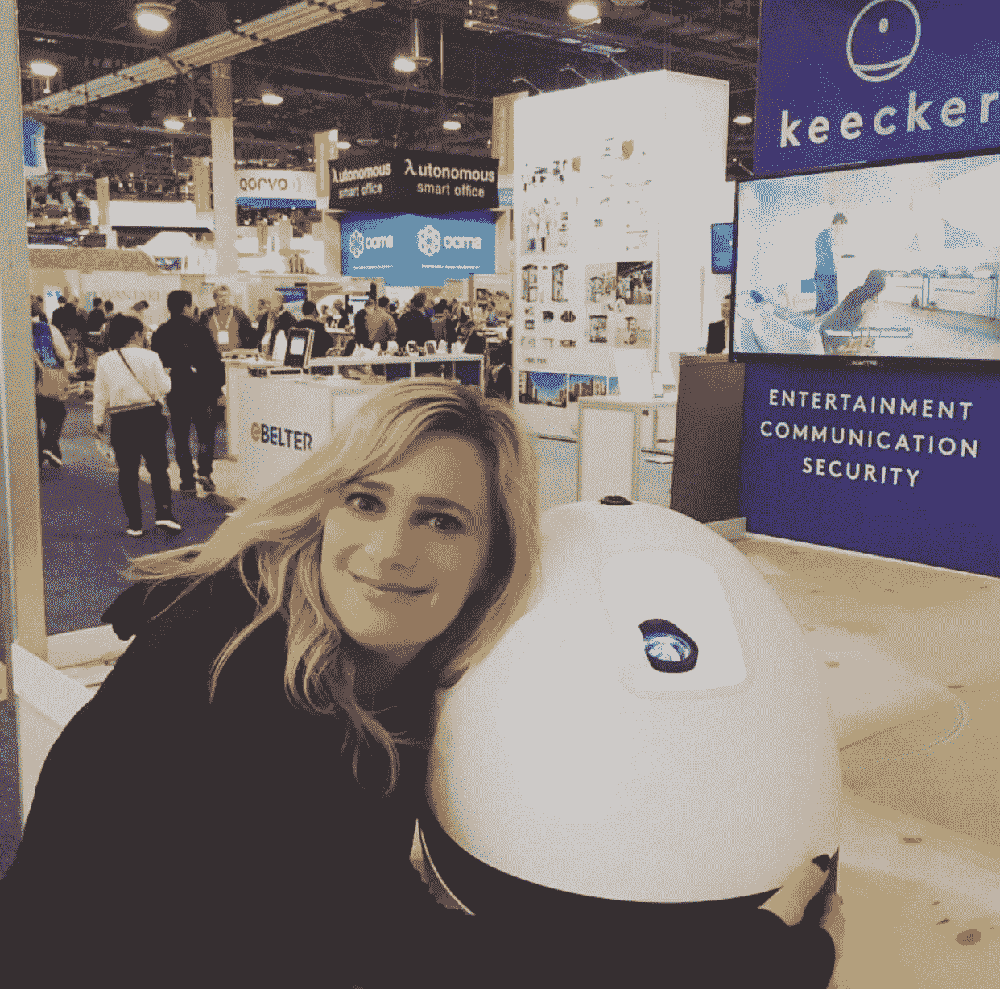

# CES 2019 展会指南

> 原文：<https://medium.com/hackernoon/ces-2019-show-guide-45544bf1d853>

## 会说话的冰箱、会飞的出租车、超级机器人等等！

Me hugging my favorite family robot last year, Keecker

消费电子展(又称 CES)终于来了，对于即将来到这个世界上最大的技术展会的 182，000 名观众来说，他们将度过有趣的一周。该展会于 1 月 8 日(星期二)至 1 月 11 日(星期五)正式开始，但媒体今天开始陆续抵达，以预览最热门的产品。

一些主要人物今年明显缺席，如吉普森，他去年有一个完整的摇滚明星名册，包括《冥河》和《伊吉·阿德利亚》的汤米·肖。目前还不清楚是否有任何东西会超过英特尔令人惊叹的无人机令人难忘地降落在贝拉焦喷泉上的披露。这很可能是一个安静的一年，主要参与者将退出这一年，并为来自超过 4400 家公司的 24 个产品类别的展览留下空间。

与 2018 年的另一个显著区别是扬声器组合的多样性增加。在 1000 名演讲者中，近 400 名似乎是女性(包括我！)，这与 2018 年的零女性主题演讲形成鲜明对比。还有一个额外奖励[女商女孩休息室](https://www.thefemalequotient.com/event/the-girls-lounge-ces/)，它提供为期两天的专题讨论，以高调的女性娱乐高管为特色，并在由 Engadget 和 Quartz 领导的展览开幕式上提供一次特别的“行走的女孩”地面参观。该活动由几十个领先品牌赞助，包括 NBC、脸书、Spotify、欧莱雅、维亚康姆、Twitter、Hulu、纽约时报、Quartz 和谷歌。似乎是进步。

亮相的名人包括阿里安娜·赫芬顿、詹尼·麦卡锡、杰克·多西、诺兰·布什内尔、史蒂夫·哈维、奥兹医生和道瑞。此外，区块链的亿万富翁将成为 [CES 数字货币论坛](https://www.ces.tech/conference/Digital-Money.aspx)的焦点，在那里我将登台采访 Brock Pierce 和其他加密先锋，参加[大加密辩论](https://www.ces.tech/conference/Digital-Money/The-Great-Crypto-Debate.aspx)。

如果你去了，请你知道，CES 不是一个你可以掉下来暴怒的展会。在拉斯维加斯大道上绵延数英里的 11 个官方场馆中，有 250 万平方英尺的参展商空间。如果你是这个节目的新手，你需要一个向导。

**地形**

要计划你的参观，试着每天只关注一个地点。主要有三个区域:东部科技区、西部科技区和南部科技区。这是他们所在位置的[地图](https://cdn.ces.tech/ces/media/pdfs/ces-2019-svm-round-7-final_2.pdf)，这是按照名称、展位号或产品类别查找特定参展商的[互动地图](https://ces19.mapyourshow.com/7_0/floorplan/?hallID=OO&CFID=40513911&CFTOKEN=cf5df3a8fcb5e1c6-6C62778D-E7B2-C7FD-B482D4FF6D65580C)。

**TechEast** 更广为人知的是 LVCC(会议中心)、西门和文艺复兴，在这里你可以找到自动驾驶汽车，这是未来的家，有许多可爱的机器人、制造机器人、无人机和非常智能的语音音频/视频设备。展会时间为周二 10-6、周三 9-6、周四 9-6 和周五 9-4。北馆多为汽车(展位 3000–9999)和会议室(上层 N250-N264，下层 N101–120，N201–249)。在中心是大大堂(G1-GL15)，中央汽车广场(CP1-CP45)，中央大厅(展位 10000-18999)是音频视频和惊人的吸引力，如 LG 和三星。在 5G 附近，你会发现南大厅连接器(上层 S219-S233)，它将使你在下雨时不必走到外面。如果你是记者的话，这里也是媒体室的所在地。南馆有较小的参展商。1 号馆(20000–22999 AR VR 游戏)、2 号馆(25000–27999、S101-S118 AI、机器人、无人机)、3 号馆(30000–32999)和 4 号馆(350000–37999)展示 3D 打印、计算机、iproducts、高科技零售、生活方式和安全。南广场(60000–64999)是设计&来源展示区。中央广场(CP1-CP45)和白金地段倾向于无人驾驶汽车。

**TechWest** 是 Venetian、Sands Expo、Wynn 和 Encore，是你可以在这里找到健康技术、健身、生活方式、睡眠、家庭技术、数字货币和尤里卡公园的初创企业。A-D 大厅(40000–46999)展会时间与 LVCC 相同，周二 10–6，周三 9–6，周四 9–6，周五 9–4。

**Tech South** 是 Aria、Park MGM 和 Vdara，专注于好莱坞和游戏内容、品牌参与、广告、营销和货币化社区。这里展示了许多优秀的面板。展厅时间与 LVCC 相同，周二 9-5，周三 9-5，周四 9-5。

有几个地方可以领取您的徽章，包括麦卡伦机场行李认领处(往往有很长的队伍)，曼德勒湾前台和会议中心 L1 湾区门厅，那里是周日新闻活动的地方。这里是[徽章位置](https://cdn.ces.tech/ces/media/register-plan-images/ces2019_registration-locations-and-hours.pdf?fbclid=IwAR27csoXfUt-EYa3LAl-ZWs5qgt36TK7Tz-4DA8YnZHwYfBRpTCLhK27DSM)的完整列表。

场馆之间有免费班车，[详情在此](https://cdn.ces.tech/ces/media/register-plan-images/ces-2019-transportation-flyer-12-14.pdf?ext=.pdf)。

**节目指南**

以下是我对该节目的最佳选择。完整列表，下载 [CES app](https://www.ces.tech/Logistics/CES-App.aspx) 关注我 [@contentnow](http://twitter.com/contentnow) 。

**1 月 6 日星期日**

**什么:生活在数字时代
什么时候:**1 月 6 日星期日下午 1-1:45 **哪里:**曼德勒湾 L2 礁 DEF
**详情:**[https://www . ces . tech/Media/Media-Events/Media-Days-schedule . aspx](https://www.ces.tech/Media/Media-Events/Media-Days-Schedule.aspx)

**什么:科大讯飞
时间:**1 月 6 日星期日下午 2-2:45**地点:**曼德勒湾 L2 海滨 F
**详情:**[https://www . ces . tech/Media/Media-Events/Media-Days-schedule . aspx](https://www.ces.tech/Media/Media-Events/Media-Days-Schedule.aspx)

**WHAT:P&G Presser
WHEN:**1 月 6 日星期日 2-2:45pm**WHERE:**曼德勒湾 L3 Banyan AB
**详情:**[https://www . ces . tech/Media/Media-Events/Media-Days-schedule . aspx](https://www.ces.tech/Media/Media-Events/Media-Days-Schedule.aspx)

**WHAT:by ton press
WHEN:**1 月 6 日星期日下午 3-3:45**WHERE:**曼德勒湾 L2 海滨 A
**详情:**[https://www . ces . tech/Media/Media-Events/Media-Days-schedule . aspx](https://www.ces.tech/Media/Media-Events/Media-Days-Schedule.aspx)

**什么:潮流看点> CES 亮相
时间:**1 月 6 日周日下午 4-4:45**地点:**曼德勒湾 L2 海滨 C
**详情:**[https://www . CES . tech/event/CES-2019-Trends-to-Watch-presentation . aspx](https://www.ces.tech/event/CES-2019-Trends-to-Watch-Presentation.aspx)

**内容:CES 亮相
时间:**1 月 6 日周日晚 5-8:30 **地点:**曼德勒湾，海岸线展厅 **详情:**[https://www . CES . tech/Events-Programs/CES-unsecured/Las-Vegas . aspx](https://www.ces.tech/Events-Programs/CES-Unveiled/Las-Vegas.aspx)

**什么:NVIDIA presser
什么时候:**1 月 6 日周日晚 8 点 **哪里:**米高梅大会议中心 **详情:**[https://www . CNET . com/news/ces-2019-watch-the-NVIDIA-press-Conference-live-Sunday-8-p-m-pt/](https://www.cnet.com/news/ces-2019-watch-the-nvidia-press-conference-live-sunday-8-p-m-pt/)(直播)

**内容:CoinAgenda 展示
时间:**1 月 6 日周日晚 8 点-午夜 **地点:**仅限媒体/受邀者

**1 月 7 日星期一**

**什么:LG Presser
什么时候:**1 月 7 日星期一上午 8–8:45 **哪里:**曼德勒湾 L3 南海安倍 **详情:**[https://www . ces . tech/Media/Media-Events/Media-Days-schedule . aspx](https://www.ces.tech/Media/Media-Events/Media-Days-Schedule.aspx)

**什么:怪物压榨机
什么时候:**1 月 7 日星期一上午 9-9:45 **哪里:**曼德勒湾 L3 南海 CD
**详情:**[https://www . ces . tech/Media/Media-Events/Media-Days-schedule . aspx](https://www.ces.tech/Media/Media-Events/Media-Days-Schedule.aspx)

**什么:Bosch Presser
时间:**1 月 7 日星期一上午 9-9:45**地点:**曼德勒湾 L2 曼德勒 BCD
**详情:**[https://www . ces . tech/Media/Media-Events/Media-Days-schedule . aspx](https://www.ces.tech/Media/Media-Events/Media-Days-Schedule.aspx)

**什么:数字好莱坞/AR VR MR Gaming with Unity，Google
什么时候:**1 月 7 日星期一上午 9-10 点**哪里:** LVCC 北厅 N258 **详情:**[https://www . ces . tech/conference/Digital-Hollywood/ARV rmr-Think-Tank-Top-Technology-and-Entertainment-companies . aspx](https://www.ces.tech/conference/Digital-Hollywood/ARVRMR-Think-Tank-Top-Technology-and-Entertainment-Companies.aspx)

**内容:数字好莱坞/Bleacher Report，Refinery29，Twitter
时间:**1 月 7 日周一上午 10:15–11:15 **地点:** LVCC 北厅 N253 **详情:**[https://www . ces . tech/conference/Digital-Hollywood/The-Future-of-of-Brand-partnership-and-Influencer-marketing . aspx](https://www.ces.tech/conference/Digital-Hollywood/The-Future-of-Brand-Partnerships-and-Influencer-Marketing.aspx)

**什么:数字好莱坞/AR VR MR Gaming with Don Daglow
时间:**1 月 7 日周一上午 10:15–11:15 **地点:** LVCC 北厅 N258 **详情:**[https://www . ces . tech/conference/speaker-directory/Don-Daglow . aspx](https://www.ces.tech/conference/speaker-directory/Don-Daglow.aspx)

**什么:松下记者
什么时候:**1 月 7 日星期一 10-10:45am **哪里:**曼德勒湾 L3 茉莉舞厅 **详情:**[https://www . ces . tech/Media/Media-Events/Media-Days-schedule . aspx](https://www.ces.tech/Media/Media-Events/Media-Days-Schedule.aspx)

**什么:海信记者
什么时候:**11 年 1 月 7 日星期一-11:45am **哪里:**曼德勒湾 L2 曼德勒 L
**详情:**[https://www . ces . tech/Media/Media-Events/Media-Days-schedule . aspx](https://www.ces.tech/Media/Media-Events/Media-Days-Schedule.aspx)

**什么:数字好莱坞/VR AR MR Hospitality，Arcades，主题公园
什么时候:**1 月 7 日周一，晚上 11:30–12:30 **哪里:** LVCC 北馆 N258
**详情:**[https://www . ces . tech/conference/Digital-Hollywood/VR armr-Everywhere-Hospitality-Arcades-and-Theme-Parks . aspx](https://www.ces.tech/conference/Digital-Hollywood/VRARMR-Everywhere-Hospitality-Arcades-and-Theme-Parks.aspx)

**什么:高通记者
什么时候:**1 月 7 日星期一 12-12:45pm **哪里:**曼德勒湾 L2 泻湖 CDEF
**详情:**[https://www . ces . tech/Media/Media-Events/Media-Days-schedule . aspx](https://www.ces.tech/Media/Media-Events/Media-Days-Schedule.aspx)

**什么:丰田出版社
什么时候:**1 月 7 日星期一下午 1-1:45**哪里:**L2 曼德勒湾 Oceanside D
**详情:**[https://www . ces . tech/Media/Media-Events/Media-Days-schedule . aspx](https://www.ces.tech/Media/Media-Events/Media-Days-Schedule.aspx)

**什么:三星 Presser
什么时候:**1 月 7 日星期一下午 2-2:45pm **哪里:**曼德勒湾 L2 曼德勒 GH
**详情:**[https://www . ces . tech/Media/Media-Events/Media-Days-schedule . aspx](https://www.ces.tech/Media/Media-Events/Media-Days-Schedule.aspx) 看[这里](https://www.techadvisor.co.uk/how-to/digital-home/samsung-ces-2019-live-stream-3632763/)。

**什么:女商少女休息室
时间:**1 月 7 日周一下午 2-7 点 **地点:**安可塔，顶层套房
**详情:**[https://www . thefemale Quotient . com/event/the-Girls-Lounge-ces/](https://www.thefemalequotient.com/event/the-girls-lounge-ces/)

**什么:数字好莱坞/派拉蒙的 Ted Schilowitz
什么时候:**1 月 7 日周一下午 2:15-3:15pm**哪里:** LVCC 北厅 N258
**详情:**[https://www . ces . tech/conference/Digital-Hollywood/The-Immersive-Media-Leadership-thing-Tank-ARV rmr . aspx](https://www.ces.tech/conference/Digital-Hollywood/The-Immersive-Media-Leadership-Think-Tank-ARVRMR.aspx)

**什么:娱乐 AI，斯坦福的 Poppy Crum 博士
什么时候:**1 月 7 日周一下午 2:30–3:15pm **哪里:** LVCC 北厅 N256
**详情:**[https://www . ces . tech/conference/Artificial-Intelligence/The-Future-of-Entertainment-with-AI . aspx](https://www.ces.tech/conference/Artificial-Intelligence/The-Future-of-Entertainment-with-AI.aspx)

**内容:ShowStoppers LaunchIt
时间:**1 月 7 日星期一下午 2:30-5 点**T4【地点:**曼德勒湾 L3 Palm A
**详情:**[https://www . ces . tech/Media/Media-Events/Media-Days-schedule . aspx](https://www.ces.tech/Media/Media-Events/Media-Days-Schedule.aspx)

**什么:现代出版社
什么时候:**1 月 7 日星期一下午 3-3:45 **哪里:**L2 曼德勒湾 Oceanside B
**详情:**[https://www . ces . tech/Media/Media-Events/Media-Days-schedule . aspx](https://www.ces.tech/Media/Media-Events/Media-Days-Schedule.aspx)

**什么:AI 的伦理
时间:**1 月 7 日星期一下午 3:30–4:15pm **地点:** LVCC 北厅 N256
**详情:**[https://www . ces . tech/conference/speaker-directory/Anna-Beth ke . aspx](https://www.ces.tech/conference/speaker-directory/Anna-Bethke.aspx)

**什么:Intel Presser
什么时候:**1 月 7 日星期一 4-4:45pm **哪里:**曼德勒湾 L2 曼德勒 EF
**详情:**[https://www . ces . tech/Media/Media-Events/Media-Days-schedule . aspx](https://www.ces.tech/Media/Media-Events/Media-Days-Schedule.aspx)

**什么:不可能的食物记者
什么时候:**1 月 7 日星期一下午 5-5:45 **哪里:**曼德勒湾 L1 边境烧烤
**详情:**[https://www . ces . tech/Media/Media-Events/Media-Days-schedule . aspx](https://www.ces.tech/Media/Media-Events/Media-Days-Schedule.aspx)

**什么:索尼发布会
什么时候:**1 月 7 日周一 5-5:45pm**哪里:** LVCC 中央大厅 17300
**详情:**[https://www . ces . tech/Media/Media-Events/Media-Days-schedule . aspx](https://www.ces.tech/Media/Media-Events/Media-Days-Schedule.aspx)

**什么:LG 主题演讲
时间:**1 月 7 日周一下午 6:30**地点:**公园米高梅，剧场
详情:[https://www.ces.tech/Conference/Keynote-Addresses.aspx](https://www.ces.tech/Conference/Keynote-Addresses.aspx)

**什么:NPD 鸡尾酒
时间:**1 月 7 日周一晚上 7-9:30 **地点:**海市蜃楼 1OAK
**详情:**[https://www.npd.com/ces](https://www.npd.com/ces)

**内容:Pepcom/数字体验
时间:**1 月 7 日周一 7-10:30pm **地点:** Mirage 1OAK
**详情:**仅限媒体/邀请

**什么:Medialink Party
时间:**1 月 7 日星期一晚上 8 点-12 点 **地点:**安可 XS 俱乐部
**详情:**仅限邀请

**什么:官方 CES C 空间派对
什么时候:**1 月 7 日周一晚上 10:30-12am**哪里:** Aria Jewel
**详情:**免费带徽章，[https://www . CES . tech/Topics/Advertising-Entertainment/Entertainment-Content . aspx](https://www.ces.tech/Topics/Advertising-Entertainment-Content/Entertainment-Content.aspx)

**1 月 8 日星期二**

**什么:CTA Gary Shapiro&Karen chup ka>IBM 主题演讲
时间:**1 月 8 日星期二上午 8:30 **地点:**威尼斯 L5 皇宫舞厅
**详情:**[https://www.ces.tech/Conference/Keynote-Addresses.aspx](https://www.ces.tech/Conference/Keynote-Addresses.aspx)

**什么:数字货币论坛/健身&财经
什么时候:**1 月 8 日星期二上午 8:30–9 点 **哪里:**威尼斯人 L4 Lando 4302
**详情:**[https://www.ces.tech/conference/Digital-Money/Fitness-Finance-How-AI-and-Behavior-Elevate-wellness . aspx](https://www.ces.tech/conference/Digital-Money/Fitness--Finance-How-AI-and-Behavior-Elevate-Wellness.aspx)

**什么:Fintech 遇上 tech fin/你的 Crypto IQ 是多少
什么时候:**1 月 8 日星期二 9–9:45，9:45–10:15am **哪里:**威尼斯人 L4 Lando 4302
**详情:**[https://www.ces.tech/conference/Digital-Money.aspx](https://www.ces.tech/conference/Digital-Money.aspx)

**什么:女孩走光了地板之旅** — Engadget 的 Olivia Kristiansen，Quartz 的 Georgia Frances King **什么时候:**1 月 8 日星期二上午 10 点-下午 12 点 **哪里:**离开 LVCC 大大堂，Engadget GL-23 展位

**什么:展示楼层开放！
时间:**1 月 8 日星期二晚上 10-6 点**T4 地点:** LVCC +威尼斯人

**什么:数字货币论坛/大密码辩论:布洛克·皮尔斯、马克道的史蒂文·贝克尔、牛栏资本的邓肯·戴维森、奇亚的瑞安·辛格、美国《金融时报》的马丁·帕里斯
时间:**1 月 8 日，星期二，上午 10:15–10:45 **地点:**威尼斯 L4 Lando 4302
**详情:**[https://www . ces . tech/conference/Digital-1](https://www.ces.tech/conference/Digital-Money/The-Great-Crypto-Debate.aspx)

**什么:凯文·哈灵顿，在电视上看到的
时间:**1 月 8 日星期二，10:30–下午 1:30 **地点:**Westgate tech east 2107
**详情:**[https://www . ces . tech/event/Kevin-Harrington-at-PowerSphyr-Inc . aspx](https://www.ces.tech/event/Kevin-Harrington-at-PowerSphyr-Inc.aspx)

**什么:数字货币论坛/麻省理工学院迈克尔·凯西，娱乐 AI 安·格林伯格，两院制风险投资亚历克斯·麦克杜格尔
时间:**1 月 8 日星期二，10:50–11:！5pm **其中:**威尼斯人 L4 Lando 4302
**详情:**[https://www . ces . tech/conference/Digital-Money/How-block chain-is-Remaking-the-media entertainment-business . aspx](https://www.ces.tech/conference/Digital-Money/How-Blockchain-is-Remaking-the-MediaEntertainment-Business.aspx)

**什么:太空制作
时间:**1 月 8 日星期二 11-12pm**地点:** LVCC 北馆 N257
**详情:**[https://www.ces.tech/Conference/SuperSessions.aspx](https://www.ces.tech/Conference/SuperSessions.aspx)(直播)

**什么:科技内容的未来 w Jesse Angelo，NY Post
时间:**1 月 8 日星期二，11–12pm**地点:**艾瑞亚·L1·约书亚 9
**详情:**[https://www . ces . Tech/conference/speaker-directory/Jesse-Angelo . aspx](https://www.ces.tech/conference/speaker-directory/Jesse-Angelo.aspx)

**什么:你的 DNA 会让你和奥兹博士一起彻夜难眠
时间:**1 月 8 日星期二，11:30–下午 1 点 **地点:**威尼斯 L4 Lando 4305
**详情:**[https://www . ces . tech/conference/speaker-directory/Dr-Mehmet-Oz . aspx](https://www.ces.tech/conference/speaker-directory/Dr-Mehmet-Oz.aspx)

**什么:数字货币论坛/Rob Pegoraro，Tim Draper，Matthew Roszak，Michael Terpin，Alex Mashinsky
何时:**1 月 8 日星期二，11:30–下午 1 点 **何处:**威尼斯 L4 Lando 4302
**详情:**[https://www . ces . tech/conference/Digital-Money/True-decessions-ICOs-Crypto-Tokens-and-VCS . aspvcs](https://www.ces.tech/conference/Digital-Money/True-Confessions-ICOs-Crypto-Tokens-and-VCs.aspx)

**什么:阿里安娜·赫芬顿上睡
时间:**1 月 8 日星期二中午 12:30–下午 2 点 **地点:**金沙博览馆二层 A-D，睡号展位 43308
**详情:**[https://www . CTA . tech/News/Press-Releases/2019/January/CES-2019-announcements-Celebrity-line-aspx](https://www.cta.tech/News/Press-Releases/2019/January/CES-2019-Announces-Celebrity-Lineup.aspx)

**什么:詹尼·麦卡锡
什么时候:**1 月 8 日星期二中午 12:30–下午 2 点 **哪里:** LVCC 北厅 6419、FCA 集团/菲亚特克莱斯勒
**详情:**[https://www . CTA . tech/News/Press-Releases/2019/January/CES-2019-announcements-Celebrity-line-aspx](https://www.cta.tech/News/Press-Releases/2019/January/CES-2019-Announces-Celebrity-Lineup.aspx)

**内容:数字货币论坛/麻省理工学院的迈克尔·凯西，荷兰王子
时间:**1 月 8 日星期二下午 1-1:30 **地点:**威尼斯 L4 Lando 4302
**详情:**[https://www.ces.tech/conference/Digital-Money.aspx](https://www.ces.tech/conference/Digital-Money.aspx)

**内容:FCC 主席 Ajit Pai w CTA Gary Shapiro
时间:**1 月 8 日星期二下午 1:30–2 点**地点:** LVCC 北厅 N257
**详情:**[www.ces.tech/Conference/SuperSessions.aspx](https://www.ces.tech/Conference/SuperSessions.aspx)(直播)
*可能因政府停摆而取消)

**什么:数字货币论坛/数字时代的罗宾·拉斯金，财富杂志的罗伯特·哈克特，莱杰的埃里克·拉奇维克，迈克菲的加里·戴维斯
何时:**1 月 8 日星期二下午 1:30-2:15**T4 哪里:**威尼斯人 L4 Lando 4302
**详情:**[https://www.ces.tech/conference/Digital-Money.aspx](https://www.ces.tech/conference/Digital-Money.aspx)

**什么:C Space/CNET 与 CBSi 的布莱恩·库勒的下一件大事
时间:**1 月 8 日星期二下午 1:45–2:30 **地点:**阿利亚·L2·马里波萨舞厅
**详情:**[https://www . ces . tech/conference/speaker-directory/Brian-cooley . aspx](https://www.ces.tech/conference/speaker-directory/Brian-Cooley.aspx)

**什么:女商/Jen Howard，脸书娱乐导语
什么时候:**1 月 8 日星期二，下午 2-2:45 **哪里:**安可大厦，顶楼套房
**详情:**[https://www . thefemale Quotient . com/event/the-girls-lounge-ces/](https://www.thefemalequotient.com/event/the-girls-lounge-ces/)

**内容:数字货币论坛/关于监管
时间:**1 月 8 日星期二下午 2:15–2:455**地点:**威尼斯人 L4 Lando 4302
**详情:**【https://www.ces.tech/conference/Digital-Money.aspx】T42

**什么:与 iHeartPodcast 的 Conal Byrne
关于(播客)钱的一切**时间:1 月 8 日星期二，下午 2:15–3:15**地点:**艾瑞亚 L1 约书亚 9
**详情:**[https://www . ces . tech/conference/speaker-directory/Conal-Byrne . aspx](https://www.ces.tech/conference/speaker-directory/Conal-Byrne.aspx)

**什么:Techlash 在 21 世纪与 Axios 的 Mike Allen
时间:**1 月 8 日星期二下午 2:15–3:15pm**地点:** LVCC 北厅 N258
**详情:**[https://www.ces.tech/Conference/SuperSessions.aspx](https://www.ces.tech/Conference/SuperSessions.aspx)(直播)

**内容:媒体合作伙伴与 The Verge 的 Dieter Bohn、The Good housing 的 Jane Francisco、Reviewed.com 的 David Kender
时间:**1 月 8 日星期二下午 2:30–3 点**T4 地点:** LVCC 大大堂 CTA 舞台
**详情:**[https://www.ces.tech/event/Media-Partner-Roundtable.aspx](https://www.ces.tech/event/Media-Partner-Roundtable.aspx)

**内容:科技的创新者和颠覆者
时间:**1 月 8 日星期二下午 2:30-3:30 **地点:** LVCC 北馆 N257
**详情:**[https://www.ces.tech/Conference/SuperSessions.aspx](https://www.ces.tech/Conference/SuperSessions.aspx)(直播)

**什么:数字货币论坛/诺兰·布什内尔:Like A Block-trepreneur
什么时候:**1 月 8 日星期二下午 2:45–3:15pm **哪里:**威尼斯人 L4 Lando 4302
**详情:**[https://www . ces . tech/conference/speaker-directory/Nolan-Bushnell . aspx](https://www.ces.tech/conference/speaker-directory/Nolan-Bushnell.aspx)

**什么:数字货币论坛/未来去中心化
什么时候:**1 月 8 日星期二下午 3:15–4 点**哪里:**威尼斯人 L4 Lando 4302
**详情:**【https://www.ces.tech/conference/Digital-Money.aspx】T42

**什么:女商/Khartoon Weiss，Spotify
什么时候:**1 月 8 日星期二下午 3:30–4:15pm **哪里:**安可大厦，顶层套房
**详情:**[https://www . thefemale Quotient . com/event/the-girls-lounge-ces/](https://www.thefemalequotient.com/event/the-girls-lounge-ces/)

**什么:FCC & FTC 专员圆桌
时间:**1 月 8 日星期二下午 3:30-4:30**地点:** LVCC 北厅 N258
**详情:**[https://www . ces . tech/conference/Innovation-Policy/FCC-and-FTC-Commissioner-round table . aspx](https://www.ces.tech/conference/Innovation-Policy/FCC-and-FTC-Commissioner-Roundtable.aspx)

**内容:威瑞森主题演讲
时间:**1 月 8 日星期二下午 4 点 **地点:**威尼斯 L5 宫宴会厅
**详情:**[https://www.ces.tech/Conference/Keynote-Addresses.aspx](https://www.ces.tech/Conference/Keynote-Addresses.aspx)

**什么:女商/凯蒂·汤普森，商业内幕
时间:**1 月 8 日星期二，下午 4:15–5:15 **地点:**安可大厦，顶层套房
**详情:**[https://www . thefemale Quotient . com/event/the-girls-lounge-ces/](https://www.thefemalequotient.com/event/the-girls-lounge-ces/)

**什么:女商/Jason Wagenheim，business
什么时候:**1 月 8 日星期二下午 5:15–6 点 **哪里:**安可大厦，顶楼套房
**详情:**[https://www . thefemale Quotient . com/event/the-girls-lounge-ces/](https://www.thefemalequotient.com/event/the-girls-lounge-ces/)

**什么:CES 数字货币论坛酒会——财富的罗伯特·哈克特、麻省理工的迈克尔·凯西、Bloq 的马修·罗扎克、Chia 的瑞安·辛格
时间:**1 月 8 日星期二下午 5:30–6:30–8:30**地点:**威尼斯 L4 Lando 4202
**详情:**[https://thedigitalmoneyforum.com](https://thedigitalmoneyforum.com)

**内容:数字货币论坛/代币大战—迈克尔·特平
时间:**1 月 8 日星期二，下午 6-6:30 **地点:**威尼斯人 L4 Lando 4302
**详情:**[https://www.ces.tech/conference/Digital-Money.aspx](https://www.ces.tech/conference/Digital-Money.aspx)

**什么:NOMAD CES Party
时间:**1 月 8 日星期二下午 6 点**地点:**海市蜃楼，34000 S 拉斯维加斯大道，豪华别墅
**详情:**[https://www.ces.tech/Conference/Keynote-Addresses.aspx](https://www.ces.tech/Conference/Keynote-Addresses.aspx)

**什么:DEG 酒会
时间:**1 月 8 日星期二下午 6 点 **地点:** Cosmopolitan Marquee 夜总会
**详情:**[https://www.degonline.org/event/deg-reception-ces](https://www.degonline.org/event/deg-reception-ces/)(仅限邀请)

**什么:数字货币论坛/贵宾招待会-罗伯特·哈克特，《财富》杂志，迈克尔·凯西麻省理工学院媒体实验室，马修·罗扎克，Bloq，瑞安·辛格，奇亚
时间:**1 月 8 日星期二，下午 6:30-8:30 **地点:**威尼斯 L4 Lando 4302
**详情:**贵宾仅限邀请

**内容:精彩节目
时间:**1 月 8 日星期二，晚上 6-10 点 **地点:**永利拉菲舞厅
**详情:**仅限媒体/邀请

**内容:现场派对
时间:**1 月 8 日星期二，晚上 9:30–11 点 **地点:** Aria Catch
**详情:**仅限受邀者

**什么:CNET 派对
时间:**1 月 8 日星期二晚上 9:30 **地点:**德莱夜总会
**详情:**仅限邀请

**什么:CES 开幕派对
什么时候:**1 月 8 日星期二晚上 10 点-12 点(开放酒吧晚上 10 点-11 点)**哪里:**凯撒的 OMNIA
**详情:**免费带徽章，[https://www . CES . tech/event/CES-Opening-Party-presented-by-OMNIA-夜店. aspx](https://www.ces.tech/event/CES-Opening-Party-presented-by-OMNIA-Nightclub.aspx?sf204537869=1)

**1 月 9 日星期三**

**内容:展会时间
时间:**1 月 9 日星期三，下午 9-6 点
**地点:** LVCC 金沙展

**什么:IDC 早餐
时间:**1 月 9 日星期三上午 9-11 点 **地点:**华尔道夫酒店(fka 文华东方)
**详情:**[https://www.idc.com/getdoc.jsp](https://www.idc.com/getdoc.jsp)

**什么:Wunderman 早餐
时间:**1 月 9 日星期三上午 9-11 点 **地点:** Palazzo，Lavo
**详情:**[https://www . event brite . com/e/Wunderman-membrain-Breakfast-ces-ces-2019-tickets-53118728547](https://www.eventbrite.com/e/wunderman-membrain-breakfast-ces-2019-tickets-53118728547)

**内容:AMD 主题演讲
时间:**1 月 9 日星期三上午 9 点 **地点:**威尼斯 L5 皇宫舞厅
**详情:**[https://www.ces.tech/Conference/Keynote-Addresses.aspx](https://www.ces.tech/Conference/Keynote-Addresses.aspx)

**什么:头条新闻维亚康姆的鲍勃·巴卡什
什么时候:**1 月 9 日星期三上午 10-10:30**哪里:**艾瑞亚·L1·约书亚 9
**详情:**[https://www . ces . tech/conference/speaker-directory/Bob-Bakish . aspx](https://www.ces.tech/conference/speaker-directory/Bob-Bakish.aspx)

**什么:在紧张的市场中寻找新领工——WSJ 的加里比奇
时间:**1 月 9 日星期三上午 10:15–11:15 **地点:** LVCC 北厅 N258
**详情:**[https://www . ces . tech/conference/Future-of-Work/Finding-New-Collar-in-a-Tight-Market . aspx](https://www.ces.tech/conference/Future-of-Work/Finding-New-Collar-Workers-in-a-Tight-Market.aspx)

**什么:美容与科技 w Cosmopolitan 的 Jessica Pels
时间:**1 月 9 日星期三上午 10:20–11 点 **地点:** LVCC 北馆 N253
**详情:**[https://www . ces . Tech/conference/HighTech-Retailing/Beauty-and-the-Tech . aspx](https://www.ces.tech/conference/HighTech-Retailing/Beauty-and-the-Tech.aspx)

**什么:BabyTech 变聪明 w Jessica Naziri
时间:**1 月 9 日星期三上午 10:30–11 点 **地点:**A-D 金沙厅 43901
**详情:**[https://www . ces . Tech/conference/baby Tech-Summit/Feeding-Gets-Smart-Tech-delives-Full-bellies . aspx](https://www.ces.tech/conference/BabyTech-Summit/Feeding-Gets-Smart-Tech-Delivers-Full-Bellies.aspx)

**WHAT: C Space BYOB w Brit + Co 的 Jill Braff
WHEN:**1 月 9 日星期三上午 10:30–11 点 **WHERE:** Aria L2 马里波萨舞厅
**详情:**[https://www . ces . tech/conference/speaker-directory/Jill-Braff . aspx](https://www.ces.tech/conference/speaker-directory/Jill-Braff.aspx)

**什么:移动革命—路透社、奥迪、英特尔、DOT
什么时候:**1 月 9 日星期三上午 11 点**哪里:** LVCC 北厅 N257
**详情:**[https://www.ces.tech/Conference/Keynote-Addresses.aspx](https://www.ces.tech/Conference/Keynote-Addresses.aspx)

**什么:混乱时代的交战规则——Variety 的 Janko Roettgers，Spotify，YouTube，Reddit，MGM Resorts，E & Y
何时:**1 月 9 日星期三，11-11:40am **何处:**艾瑞亚·L1·约书亚 9
**详情:**[https://ces . tech/conference/Entertainment-Summit/New-Rules-of-Engagement-in-the-disrules . aspx【T10](https://ces.tech/conference/Entertainment-Summit/New-Rules-of-Engagement-in-the-Disrupted-Age.aspx)

**什么:体育和粉丝体验的技术——暴雪的丹尼尔·切瑞，Twitch 的克里斯汀·萨尔瓦托
时间:**1 月 9 日星期三，晚上 11:40–12:20 **地点:** Aria L3，Primrose 2–3
**详情:**[https://www . CES . Tech/conference/CES-Sports-Zone/The-Technology-of-of-Sports-and-Fan-Experiences . aspx](https://www.ces.tech/conference/CES-Sports-Zone/The-Technology-of-Sports-and-Fan-Experiences.aspx)

**WHAT: DtoC with Hulu，Fandango，Discovery，Conde Nast，YouTube
WHEN:**1 月 9 日星期三，晚上 11:40–12:20 **WHERE:**阿丽亚·L1·约书亚 9
**详情:**[https://www . ces . tech/conference/Entertainment-Summit/Into-The-Zeitgeist-The-directto consumer-Entertainment-economy . aspx【T32](https://www.ces.tech/conference/Entertainment-Summit/Into-the-Zeitgeist-The-DirectToConsumer-Entertainment-Economy.aspx)

**什么:与 MSNBC 的理查德·卢伊，好管家的瑞秋·罗斯曼，迈克·费布斯的大脑干预
时间:**1 月 9 日星期三，下午 1-2:55 **地点:**威尼斯 L4 Lando 4305
**详情:**[https://www . ces . tech/conference/Digital-Health-Summit/A-Brain-and-Mental-Health-Crises-intervention . aspx](https://www.ces.tech/conference/Digital-Health-Summit/A-Brain-and-Mental-Health-Crises-Intervention.aspx)

**活动内容:与 IBD 的 Patrick Seitz、Tom's Guide 的 Mark Spoonauer、今日创新与科技的 Charles Warner 的媒体圆桌会议
时间:**1 月 9 日，周三，下午 1:30–2 点 **地点:** LVCC 大大堂，CTA 舞台
**详情:** [CES App](https://www.ces.tech/Logistics/CES-App.aspx)

**什么:#NBATWITTER NBA 的亚当·席尔瓦，TWITTER 的杰克·多西
什么时候:**1 月 9 日星期三下午 1:30–2 点 **哪里:** Aria L3 樱草舞厅
**详情:**[https://www . CES . tech/conference/CES-Sports-Zone/NBA Twitter-A-Conversation-with-Adam-Silver-and-Jack-dorsey . aspx](https://www.ces.tech/conference/CES-Sports-Zone/NBATwitter-A-Conversation-with-Adam-Silver-and-Jack-Dorsey.aspx)

**什么:史蒂夫·哈维
什么时候:**1 月 9 日星期三下午 1:35-2:05**哪里:**艾瑞亚·L1·约书亚 9
**详情:**[https://www . ces . tech/conference/Entertainment-Summit/headlines-Conversation-with-Steve-Harvey . aspx](https://www.ces.tech/conference/Entertainment-Summit/Headliner-Conversation-with-Steve-Harvey.aspx)

**WHAT: C Space/Elle 的 Jenna Blaha with insta gram&HP
WHEN:**1 月 9 日星期三下午 1:30-2:30**WHERE:**Aria L2 马里波萨舞厅
**详情:**[https://www . ces . tech/conference/C-Space-story teller/C-Space-story teller-Elle . aspx](https://www.ces.tech/conference/C-Space-Storytellers/C-Space-Storyteller-Elle.aspx)

**什么:电竞 w Twitch、雷蛇、不朽
什么时候:**1 月 9 日周三下午 1:30-2:30**哪里:** LVCC 北馆 N257
**详情:**【https://www.ces.tech/Conference/SuperSessions.aspx】T42(直播)

**什么:新边疆在移动 WHAT、NatGeo、Magic Leap、戛纳狮子会
什么时候:**1 月 9 日星期三下午两点 **哪里:**公园米高梅、公园剧场
**详情:**[https://www.ces.tech/Conference/Keynote-Addresses.aspx](https://www.ces.tech/Conference/Keynote-Addresses.aspx)

**什么:女商/Jenna Blaha，Elle
什么时候:**1 月 9 日星期三下午 2:15–3 点 **哪里:**安可大厦，顶楼套房
**详情:**[https://www . thefemale Quotient . com/event/the-girls-lounge-ces/](https://www.thefemalequotient.com/event/the-girls-lounge-ces/)

**什么:炉边聊天——综艺的詹科·罗特格斯，宽带电视的沙赫扎德·拉法蒂
什么时候:**1 月 9 日星期三下午 2:25-2:40**T4 哪里:**艾瑞亚·L1·约书亚 9
**详情:**[https://ces . tech/conference/Entertainment-Summit/Conversation-with-沙赫扎德-拉法蒂-宽带电视公司 aspx](https://ces.tech/conference/Entertainment-Summit/Conversation-with-Shahrzad-Rafati-BroadbandTV-Corp.aspx)

**什么:趋势塑造全球创新
时间:**1 月 9 日星期三下午 3-3:45 **地点:** LVCC 北厅 N257
**详情:**[https://www.ces.tech/Conference/SuperSessions.aspx](https://www.ces.tech/Conference/SuperSessions.aspx)(直播)

**什么:头条新闻:美国偶像的克里斯·道特里
什么时候:**1 月 9 日星期三下午 4:50–5:15pm**哪里:**艾瑞亚·L1·约书亚 9
**详情:**[https://www . ces . tech/conference/Entertainment-Summit/头条新闻-Conversation-with-Chris-Daughtry . aspx](https://www.ces.tech/conference/Entertainment-Summit/Headliner-Conversation-with-Chris-Daughtry.aspx)

**什么:TechCrunch 拉斯维加斯硬件&由 John Biggs 主持的 Crypto Meetup
时间:**1 月 9 日星期三下午 6-9 点 **地点:**工作进行中，南 6 街 317 号，89101
**详情:**[https://www . eventbrite . com/e/TechCrunch-Las-Vegas-Hardware-and-Crypto-Meetup-tickets-53994522](https://www.eventbrite.com/e/techcrunch-las-vegas-hardware-and-crypto-meetup-tickets-53994527084)

**什么:亚马逊鸡尾酒
什么时候:**1 月 9 日星期三晚上 6-10 点 **哪里:**永利、阳伞倒下
**详情:**[https://www . eventbrite . com/e/Amazon-seller-ces-2019-cocktail-receiving-by-agent-zera-tickets-53499529533](https://www.eventbrite.com/e/amazon-seller-ces-2019-cocktail-reception-by-agent-zera-tickets-53499529533)

1 月 10 日星期四

**内容:展会时间
时间:**1 月 10 日星期四，晚上 9-6 点
**地点:** LVCC 和金沙展

**WHAT:C Space:Hulu
WHEN:**1 月 10 日星期四上午 9:30–10 点 **WHERE:** Aria L2 马里波萨舞厅
**详情:**[https://www . ces . tech/conference/C-Space-story tellers/C-Space-story teller-Hulu . aspx](https://www.ces.tech/conference/C-Space-Storytellers/C-Space-Storyteller-Hulu.aspx)

**什么:鲨鱼坦克的 Daymond John 在尤里卡公园
时间:**1 月 10 日星期四上午 10-11:30 **地点:** Tech West，L1 金沙博览馆 G 馆
**详情:**[https://www . CTA . Tech/News/Press-Releases/2019/January/CES-2019-announcements-Celebrity-line-aspx](https://www.cta.tech/News/Press-Releases/2019/January/CES-2019-Announces-Celebrity-Lineup.aspx)

**什么:零售的未来挑战— NPD 史蒂夫·贝克
时间:**1 月 10 日星期四上午 10:15–11:15 **地点:** LVCC 北厅 N256
**详情:**[https://www . ces . tech/conference/Research-Summit/Future-Challenges-Current-Performance-Opportunities-for-Retail . aspx](https://www.ces.tech/conference/Research-Summit/Future-Challenges-Current-Performance-Opportunities-for-Retail.aspx)

**什么:智能娱乐的未来 w 特纳的大卫·贝克
什么时候:**1 月 10 日星期四下午 1-2 点**哪里:**艾瑞亚·L2·马里波萨舞厅
**详情:**[https://www . ces . tech/conference/speaker-directory/David-Beck . aspx](https://www.ces.tech/conference/speaker-directory/David-Beck.aspx)

**内容:媒体合作伙伴圆桌会议:VentureBeat 的 Dean Takahashi，TechRadar 的 Matt Swider，Engadget 的 Dana Wollman
时间:**1 月 10 日星期四下午 1-2 点 **地点:** LVCC 大大堂
**详情:**[https://www.ces.tech/cesapp](https://www.ces.tech/cesapp)

**内容:为智能家居和物联网增添人情味——Tom ' s Guide 的 Michael Prospero，Brava 的 John Pleasants
时间:**1 月 10 日星期四，下午 3:15–3:45 **地点:**Venetian L4 Lando 4302
**详情:**[https://www . ces . Tech/conference/kidsplay family-Tech-Summit/Adding-the-the-the-Human](https://www.ces.tech/conference/KidsPlayFamily-Tech-Summit/Adding-the-Human-Touch-to-Smart-Homes-and-IoT.aspx)

什么:机器人应该是人形的吗？软银机器人公司 Omar Abdelwahed
时间:1 月 10 日星期四下午 3:30-4:30**地点:** LVCC 北厅 N262
**详情:**[https://www . ces . tech/conference/speaker-directory/Omar-Abdelwahed . aspx](https://www.ces.tech/conference/speaker-directory/Omar-Abdelwahed.aspx)

**内容:CES Afterparty
时间:**1 月 10 日星期四晚上 10 点-12 点**地点:**米高梅客家俱乐部
**详情:**免费带徽章，[https://www . CES . tech/event/CES-After-Party-presented-by Hakkasan . aspx](https://www.ces.tech/event/CES-After-Party-presented-by-Hakkasan.aspx)

1 月 11 日星期五

**内容:展示时间
时间:**1 月 11 日星期五，下午 9-4 点
**地点:** LVCC 和金沙博览会