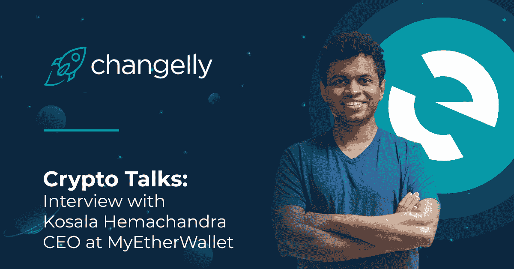

# Changelly 对 Kosala Hemachandra 的采访:从 MEW V5 发布到区块链的未来

> 原文：<https://medium.com/hackernoon/changelly-interview-kosala-ceo-mew-2d1b887153d3>

*2 月中旬*[***changely***](https://changelly.com/?utm_source=medium&utm_medium=social&ref_id=MEW_interview)*宣布与基于以太坊的加密钱包的先驱——*[***MyEtherWallet***](https://www.myetherwallet.com/)*合作。此外，这种合作与名为 MEW V5 的新钱包版本的发布相匹配。我们已经写了一个* [*教程，关于如何在新的*](/changelly/myetherwallet-tutorial-by-changelly-b9a8e20ae3a6) *内交换代币。*

那么，现在是时候和掌管我钱包的人谈谈了。有请***kosa la Hema Chandra****“无硬件”硬件钱包理念的新晋钱包创始人兼思想者。我们向科萨拉询问了他的创意、成功可靠的加密钱包的原理以及他对整个区块链未来的看法。祝你阅读愉快！*

## **你好，Kosala，很高兴你能参加 Changelly 的“加密讲座”,非常感谢你的采访！对于还没有安装 MEW V5 的人，能否简单描述一下新钱包版本的主要更新？**

我们最近对 MEW 的界面进行了彻底的重新设计( [MEW V5](https://myetherwallet.com/) )，为世界各地的用户带来一种更加通用的直观的与区块链互动的方式。最明显的变化是新版本在布局、设计和视觉上更加友好。

我们还简化了布局，例如，新用户可以轻松访问客户支持并找到教育资源，而更熟悉我们的旧界面( [Vintage MEW](https://vintage.myetherwallet.com/) )的人仍然可以找到他们的路。你可以在我们的官方博客上找到更多关于 MEW V5 的细节。

## **您能解释一下“无硬件”硬件钱包是什么意思吗？**

去年，我们推出了“MEW Connect ”( T1 ),将硬件钱包(T3)的安全优势带给了 T2 的所有智能手机。除了智能手机，我们的官方免费配套应用程序不需要任何硬件，用户只需登录他们的钱包，他们的私钥就安全地存储在设备中

此外，它与你进行交易的电脑是分开的，这一事实使它更加安全。你需要与网站和应用程序进行交互，以完成某些任务，这确保了只有你能够访问这些功能。

## **现代可靠的加密钱包的三大关键因素是什么？**

首先是**安全**。随着加密货币被越来越多的人采用，诈骗和网络钓鱼攻击也越来越复杂。加密钱包需要为用户提供工具来保证他们自己的安全和他们的密码安全；无论是[存储在手机钱包](/myetherwallet/mobile-crypto-wallets-explained-the-matryoshka-edition-65d4da37c0c0)还是其他地方。

接下来是**可用性**。我们继续推动采用的唯一方法是提供不会让新手不知所措的可用体验。教育资源和直观的用户界面在这里都发挥了作用。

第三是**透明度**。毕竟，加密货币的意义在于去中心化和不可改变。正如我们最近在 QuadrigaCX 中看到的，在加密领域并不完全是这样。

## **自发布以来，用户对 MEW V5 的第一印象如何？**

看到用户对 MEW V5 的反应令人难以置信的兴奋。我们在这次更新中投入了大量的工作，我们非常高兴地看到人们正在享受新的精简界面！当然，一些用户立即适应了新的流程，而其他人则评论说他们错过了旧界面的功能。

我们的目标是让初学者的加密体验更简单，同时也让专家用户可以方便地使用他们已经习惯的所有功能。这是一个微妙的平衡，但是我们从我们的社区得到了很多有用的反馈，这激励我们继续改进新版本 5。

## 区块链的未来如何？比方说，你认为几年(2-5 年)后加密钱包会是什么样子？

老实说，我们不认为在未来几年内加密钱包的运作方式会有太大的变化。可能会添加更多的安全元素，以增加钱包的安全性，但它们的操作和功能应该保持不变。

但是，如果你看得更远一点，在未来 5-10 年内，我们相信采用率会上升。钱包的功能将不得不发展以支持日益增长的需求。这可能意味着更好的硬件钱包，更安全，更容易携带，或者过渡到所有内置硬件钱包的智能手机，以支持和促进用户的日常体验。

我们还预计越来越多的供应商接受加密——特别是星巴克刚刚加入进来——因此钱包将开发支持移动支付的功能。

今天到此为止。在[marketing@changelly.com](http://marketing@changelly.com/)给我们发电子邮件，成为 Crypto Talks 的今日英雄，或者分享你对区块链发展的看法。别忘了在社交媒体上关注 Changelly:

[推特](https://twitter.com/Changelly_team)
[脸书](https://m.facebook.com/changellyteam)
[电报](https://t.me/join_changelly)
[Reddit](https://www.reddit.com/r/Changelly)
[Youtube](https://www.youtube.com/channel/UCDEC0Iw44JxM7cwf4VKFIyA)

不错的交换，#Changellions！