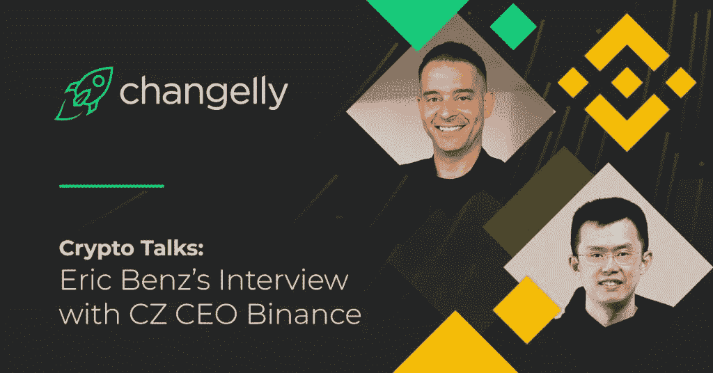
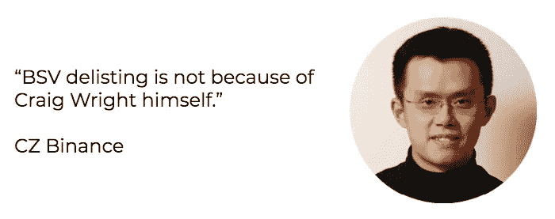
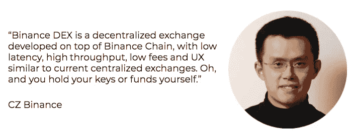
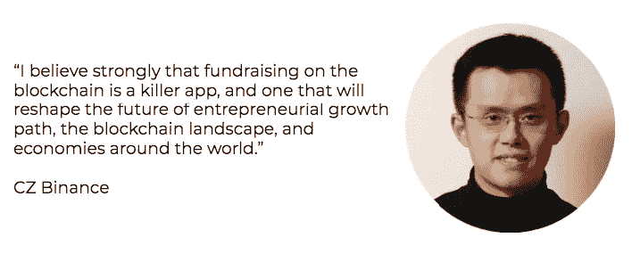
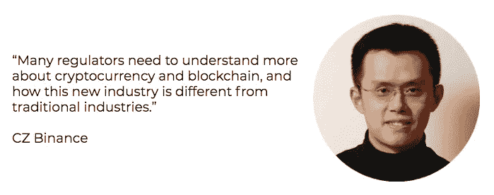
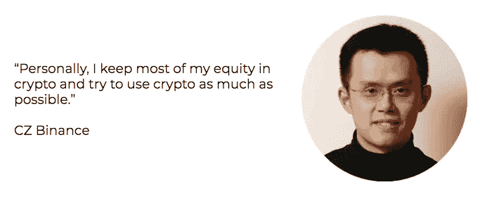

# 专访首席执行官赵昌鹏

> 原文：<https://medium.com/hackernoon/changelly-interview-with-cz-ceo-binance-e0ec71c92a9f>

今天，Changelly 将与一位非常特殊的客人进行“秘密谈话”。有请赵昌鹏，众所周知的 CZ 币安， [*币安加密货币交易所*](https://www.binance.com/en) *的首席执行官，一位真正的加密先锋。大约两年前，他创办了币安，当时他的 ICO 募集了 1500 万美元。迄今为止，该公司的净资产约为 20 亿美元，并且还在不断增加。Changelly 首席执行官埃里克·本茨与 CZ 讨论了热门的加密问题，即:股票和加密交易所之间的主要差异，币安 DEX 的推出，反洗钱/KYC 问题，BSV 除名，以加密为生，对加密企业家的建议，等等。祝你阅读愉快！*

Eric: 你好，CZ！很高兴你能和昌格利一起参加“加密讲座”。你在彭博开始了你的职业生涯。考虑到您对股票和加密交易所的工作和交易原理的了解，您能否总结出加密交易所缺乏的传统交易所的哪些特征，相反，加密交易所比其“老大哥”股票交易所有哪些优势？

你好，埃里克。很荣幸，谢谢邀请我。有许多巨大的差异，我不认为我可以在这里列出所有，但在我的脑海中，这里有一些:

1.  从系统的角度来看，传统的交易所每天只运营几个小时，你可以在非交易时间进行大量的处理、升级等工作。有了 crypto，即使交换停止几分钟，这也是一个大问题。
2.  传统的交易所只允许几百个经纪人连接，通常使用专线。实际上，交换系统只为几百个大客户提供服务。有了 crypto，我们有来自 180 个不同国家的 10，000，000 多名用户使用不可靠的互联网或手机网络进行连接。从系统的角度来看，加密要求更高。
3.  从商业角度来看，在传统市场中，你有经纪人和许多中间人，而易资产只能在少数交易所交易，由专业人士(或做市商)提供流动性。有了加密，每项资产通常在数百甚至数千个交易所交易，价格更加公平，在加密交易所更难操纵。
4.  就奇特的特征或订单类型而言，传统交易所比加密交易所更先进。这也符合用户细分市场，传统交易所主要由少数大型机构交易商主导，而加密仍然主要由散户主导。

**Eric:** 你对比特币期货是什么态度？你认为比特币交易所交易基金的批准可能会在未来支持或反对 BTC 价格吗？

CZ: 我认为交易所交易基金和衍生品一般不会影响标的资产的价格。基础资产的价格应该由它的价值决定，要么是效用价值(如比特币)，要么是代表价值(如股票)。拥有衍生品可能会增加流动性，和/或增加或减少其波动性(例如期货)，但不会从根本上改变长期价格。

总的来说，有更多的流动性总比没有好，所以我认为如果获得批准，这将是一件好事。但 BTC 的价格从根本上并不取决于 ETF。

**Eric:** 所以，我们不禁对最近轰动一时的 BSV 从币安交易所退市事件感到好奇。我们想冷静地弄清楚这种情况。能否请你解密一下克雷格·S·莱特的哪些行为和言论挑起了退市局面？此外，克雷格对比特币最大清单持有者的追捕是不是成了整个故事的最后一根稻草？

**CZ:** 首先，我在推特上分享了我对这个问题的看法。CSW 自称为南部聪(Satoshi Namakoto)，并不断在比特币社区内引发战争，而不是为行业贡献真正的价值。我个人和 CSW 没有任何互动。但是伪装成别人是欺诈，这是我们不能容忍的。

其次，BSV 退市并不是因为克雷格·赖特本人。我们的上市审核小组根据币安的退市标准决定退市。

最近，币安推出了分散式交换测试网和新的币安链，为该平台提供动力。你能给我们介绍一下这个项目吗？

**CZ:** 我们在去年(2018 年 3 月)首次宣布了币安连锁和 DEX 计划，作为发展区块链生态系统努力的一部分。我们设法在今年四月推出了该产品。币安链是我们社区开发的区块链，有一些初始方向来自我们；币安 DEX 是在币安链上开发的分散式交换机，具有低延迟、高吞吐量、低费用和类似于当前集中式交换机的 UX。哦，你自己拿着你的钥匙或基金。无需将资金存入交易所。币安连锁和 DEX 的目的是为发行和交易数字资产创造一个替代市场，并发展区块链代币经济。

**Eric:**DEX 的推出是否意味着它将很快完全取代币安交易所，币安令牌将从 ERC-20 转移到 mainnet？

**CZ:** 不知道，哈哈。坦率地说，我不认为德克斯会在短时间内完全取代 Binance.com。集中交换和分散交换各有优势，满足不同的需求。以币安交易所为例，我们提供 24/7 的客户服务，数百个交易对和高市场流动性，今天它受到大多数用户的欢迎。币安德克斯是那些希望完全控制自己的私人钥匙和资金的人的首选；DEX 的用户对他们的资金安全负责，在发行资产、开发工具等方面有更大的自由。

我们认为，从长远来看，DEX 是一种增长趋势，尽管它在现阶段与集中式交易所并不矛盾。我们提供两种选择，让我们的用户选择。

存储在币安交易所的所有 BNB 代币和我们合作的一些钱包已经在主网上自动转换成 BEP-2 格式。

**Eric:** 有一种观点认为 IсO 格式已经过时了。然而，像币安 LaunchPad 这样的项目恢复了人们对 ICO launch 的希望，ICO launch 可以为密码企业家和投资者服务？您能简单地告诉我们币安研究团队在为币安发射台选择项目时会考虑哪些特征吗？

**CZ:** 首先，我坚信区块链上的筹款是一个杀手级应用，一个将重塑未来企业家成长道路、区块链景观和世界经济的应用。这是一个如此强大的工具，如果使用不当，会伤害到人。但是如果使用得当，会给我们带来巨大的好处。

币安 LaunchPad 与 ICOs 有几个关键区别。我们非常仔细地审查项目，不遗余力地进行尽职调查，也有能力协商好的条款。我们还通过提高认知度、提高品牌可信度、提供流动性以及将他们介绍给庞大的用户群来帮助这些项目。币安创业平台旨在帮助有前途的区块链初创企业从加密投资者那里筹集资金。到目前为止，我们很高兴收到对 LaunchPad 项目的积极市场反应。

每次我们宣布一个新项目，币安研究都会相应地制作一份项目报告，让代币销售参与者对项目有一个清晰的了解。我们有义务对选定的项目进行研究，并向投资者披露我们的研究结果。

Eric: 今天，中央机构的代表似乎单方面制定了他们对加密业务的规则，并且不倾向于任何谈判。你对这种一边倒的捆绑立场是什么态度？另外，你认为有什么方法可以帮助监管者、政府和区块链企业家达成妥协？

今年早些时候，我写了一篇关于分权与集权的文章，我在文章中提到，人们越来越要求分权，因为在当前社会，权力和资源过于集中。我是权力下放的支持者。当涉及到决策时，我们听取社区的意见，并努力为社区创造最大的利益和透明度。

没有社区支持的单方面规则会伤害社区、经济，也会伤害规则制定者。没有社区支持就制定规则是不明智的。

许多监管机构需要更多地了解加密货币和区块链，以及这一新行业与传统行业有何不同。作为该行业最有经验的参与者之一，我们愿意帮助监管机构更多地了解该技术、其应用和工作机制。

**Eric:** 谈到反洗钱和 KYC，您认为在哪些情况下这样的政策实施是有效的？在您看来，如果大量可疑流动资金通过加密交换，哪一方应该负责并采取行动？

**CZ:** 我们有一个相当大的经验丰富的专业团队从事合规工作。币安拥有业内最严格的 KYC/反洗钱制度。引用自最近的 Bitwise 报告:

“事实上，他们一直在积极采用内部工具，通过技术解决这些问题。

例如，2018 年 10 月 17 日，币安完成了 Chainalysis 合规软件套件的推出，该套件使用“模式识别、专有算法和数百万开源参考来识别和分类数千种加密货币服务，以对可疑活动中涉及的交易发出实时警报。”142 2018 年 11 月，该公司与路孚特(前汤森路透金融与风险部门)合作，在其交易所实施自动化的“了解你的客户”( KYC)平台。143 2019 年 3 月，该公司通过与 IdentityMind 合作扩大了这一合作，identity mind 是一家注册科技公司，自称是“为数字货币交易所打造的唯一实时入职、交易监控和案例管理解决方案”IdentityMind 表示，它专门为区块链提供全面的 KYC 和反洗钱服务。"

埃里克:现在我们来谈谈靠密码生活。你相信在现在的现实中这可能吗？或者为了过上充实的生活，一个人仍然需要在他/她的口袋里有一些法定货币？

我相信许多人一直生活在一种“基于加密的生活方式”中，币安正在努力促进所有领域的大规模加密应用。诚然，仍然有许多地方只接受菲亚特，你仍然需要菲亚特在最后一英里，但有大量的菲亚特交易所，确实有利于交换到菲亚特。就我个人而言，我将大部分股权放在 crypto 中，并尽可能多地使用 crypto，并且只将我知道将在未来 2 周左右花费的最少部分转换为 fiat。

**埃里克:**币安以做各种慈善工作而闻名。你能告诉我们更多关于你是如何决定启动这样的项目和朝哪个方向努力的吗？

**CZ:**2018 年初，当币安开始实现指数级增长时，我开始意识到，运营一家初创公司不仅仅关乎业务，还关乎影响力。我们想改变世界，用密码做好事。这也是关于传播密码，或金钱的自由。我和一位老朋友 Helen Hai 讨论了这个问题，她是联合国工发组织的亲善大使，在非洲有多年的发展经验，我们决定成立区块链慈善基金会(BCF)。

BCF 是一个非营利组织，致力于利用区块链技术实现全球可持续发展。我们有一个加密的慈善基金和一个位于区块链的捐款平台来跟踪捐款的流向和使用情况，确保捐款的透明度。我们已经启动了几个项目，其中大部分以非洲为目标，因为那里是最底层十亿人的大本营，我们看到了采用加密技术的巨大潜力。一个例子是“币安儿童午餐”项目，该项目为乌干达各地学校的孩子们提供健康食品。到目前为止，我们已经成功帮助了 200 多名儿童，并继续推动这一计划，以帮助成千上万的儿童。

如果有人想捐钱给 BCF，这里有链接:[https://www.binance.charity/](https://www.binance.charity/)

**Eric:** 你会给那些 2019 年刚刚开始 crypto 之路的创业者哪些建议？

对于交易者:在你投资任何硬币之前，请对白皮书、团队背景、社区反馈等做一些研究；只要拿着你相信的加密货币。

对于企业家:请保持透明，并与你的社区和公众互动。拿着自己相信的加密货币，不断建设，创造更多的价值。

Eric: 对你来说，大量采用加密技术会是什么样子？

我相信会有成千上万的区块链和数百万的代币。我知道有一天我可以支付地铁票或者在 BNB 任何地方的街头小吃。🙂

就这样，密码小子！如果你觉得这个秘密谈话很有用，并希望阅读更多类似的对特定秘密企业家的采访，请在评论中留下你的反馈。同样，下面你可以读到对 BNB 进一步价格走势的多变预测:

漂亮的交换，换球！