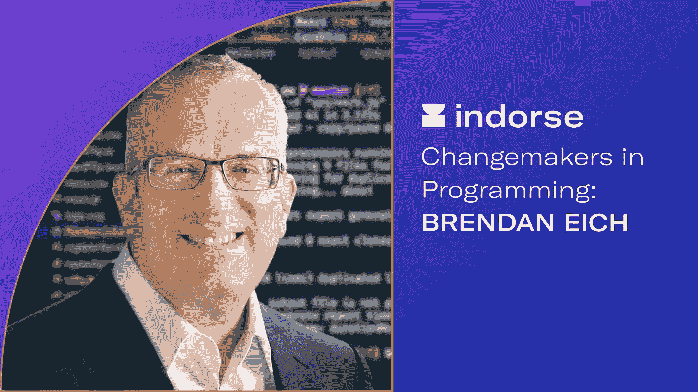

# 编程中的变革者:Brendan Eich

> 原文：<https://medium.com/hackernoon/changemakers-in-programming-brendan-eich-e43f2cc7d269>

**编程中的变革者**:这个新的博客系列将聚焦于已经和/或继续对技术世界和编程世界产生积极影响的组织、协会和个人！

在第二篇文章中，我们将了解 JavaScript 的发明者。这是一个关于[Java](https://medium.com/u/bcf2eaa79e8c#</a>|<a class=)|[PHP](https://indorse.io/claims/new?utm_source=Medium&utm_content=Changemakers_in_Programming_Brendan_Eich_PHP)|[JavaScript](https://indorse.io/claims/new?utm_source=Medium&utm_content=Changemakers_in_Programming_Brendan_Eich_JS)|[Ruby](https://indorse.io/claims/new?utm_source=Medium&utm_content=Changemakers_in_Programming_Brendan_Eich_Ruby)

