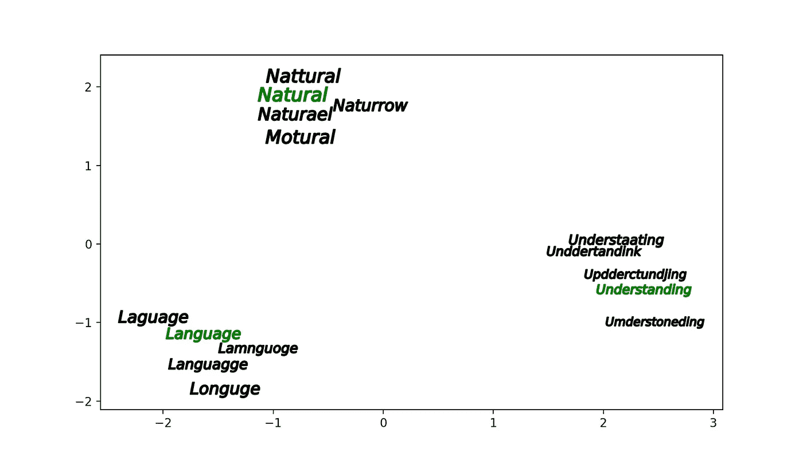
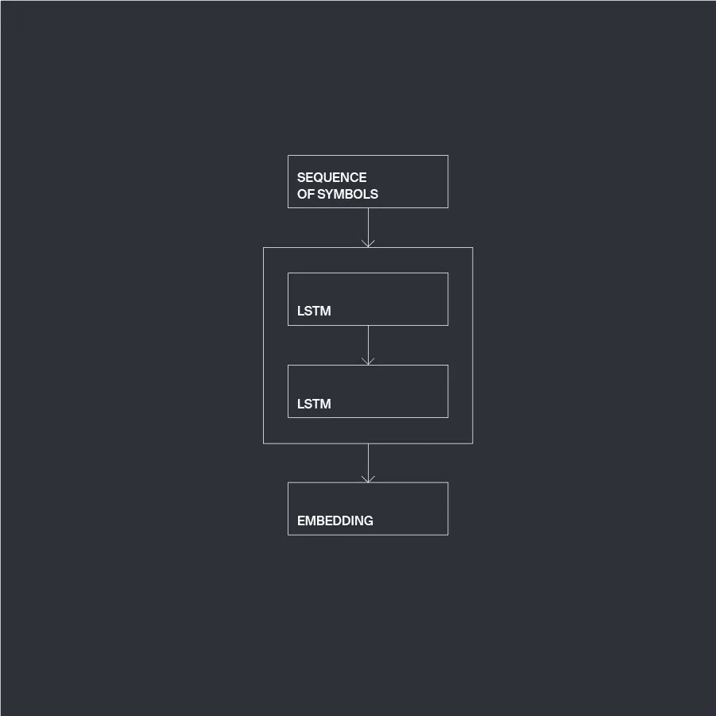
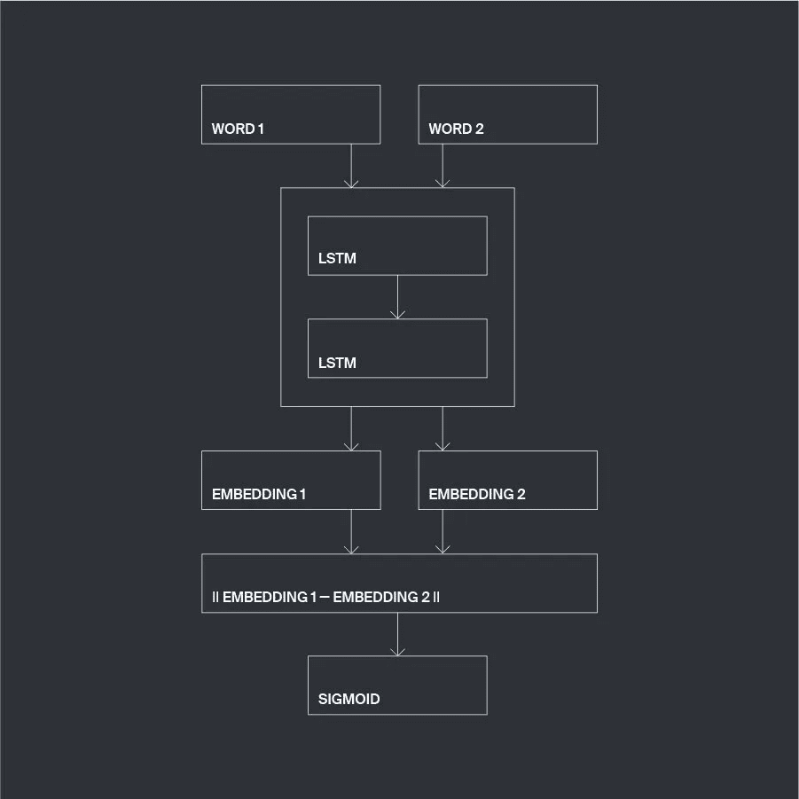
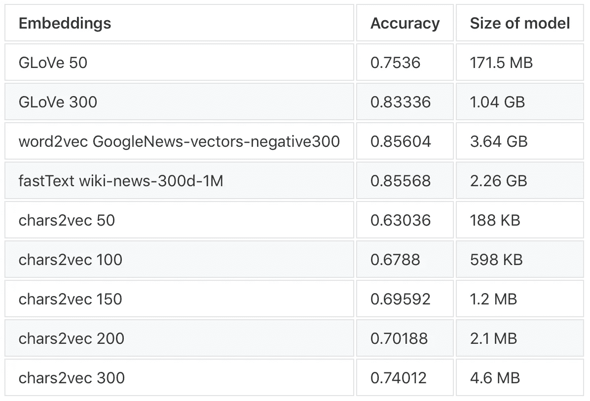

# Chars2vec:基于字符的语言模型，用于处理带有拼写错误和俚语的真实文本

> 原文：<https://medium.com/hackernoon/chars2vec-character-based-language-model-for-handling-real-world-texts-with-spelling-errors-and-a3e4053a147d>


本文描述了我们开源的基于字符的语言模型 [**chars2vec**](https://github.com/IntuitionEngineeringTeam/chars2vec) 。这个模型是用 Keras 库(TensorFlow 后端)开发的，现在可用于 Python 2.7 和 3.0+。

# 介绍

创建和使用单词嵌入是处理大多数 NLP 任务的主流方法。每个单词都与一个数字向量相匹配，如果这个单词出现在文本中，那么这个数字向量就会以某种方式被使用。一些**简单模型使用一个热门词嵌入，或者用随机向量或整数初始化单词**。这种模型的缺点是显而易见的——这种单词矢量化方法不代表单词之间的任何语义联系。

还有其他的语言模型，称为语义模型，用仿射嵌入向量来整理词义相关的单词。事实上，这些模型代表了各种单词的上下文接近度:这种模型是在现有文本(如百科全书、新闻文本或文学)的大型语料库上训练的。结果是，在这些文本中出现在相似上下文中的单词由最接近的向量表示。语义语言模型的经典例子有 [Word2Vec](https://www.tensorflow.org/tutorials/representation/word2vec) 和 [GloVe](https://nlp.stanford.edu/projects/glove/) 。一些更现代的语义语言模型( [ULMFiT](https://arxiv.org/abs/1801.06146) ， [ELMo](https://allennlp.org/elmo) )基于递归神经网络(RNNs)和其他神经网络架构。

语义模型包含在大型文本语料库上训练时提取的关于词义的一些信息，但是它们使用固定的词汇(通常缺少一些很少使用的词)进行操作。这对于解决一些 NLP 问题来说是一个很大的缺点。**如果文本中的许多重要单词不属于语义语言模型的词汇，那么它在解决某些类型的 NLP 任务时是低效的——该模型将不能解释这些单词**。如果我们试图处理人类写的文本(这些文本可能是回复、评论、应用程序、文档或网络帖子)，就会出现这种情况。这些文本可能包含俚语、来自特定领域的一些生僻字，或者在语言词汇和语义模型中不存在的名字。错别字也产生没有任何校对嵌入的“新”字。

一个很好的例子是处理用户对电影的评论的任务，同时基于 [MovieLens](https://grouplens.org/datasets/movielens/) 数据集构建电影推荐系统。“像塔伦蒂诺”这样的词经常出现在人们的评论中；导演的姓氏“塔伦蒂诺”中的错误或错别字产生了许多“新”字，如“塔拉蒂诺”、“托兰蒂诺”、“塔兰蒂诺”等。从用户评论中提取这种“塔伦蒂诺”特征的能力将明显改善电影相关性度量和推荐质量，以及由非词汇单词表示的各种其他特征的提取，所述非词汇单词或者非常具体如姓氏，或者由打字错误和错误拼写产生。

> 为了解决我们已经描述的问题，使用这样的语言模型是合适的，该语言模型将仅基于单词的拼写来创建单词嵌入，并且将相似向量与相似拼写的单词进行比较。

# 关于 chars2vec 模型

我们开发了基于单词符号嵌入的 chars2vec 语言模型。**该模型用固定长度的向量表示任意长度的符号序列，单词拼写的相似性用向量间的距离度量来表示。**该模型不是基于字典的(它不存储具有相应向量表示的固定单词字典)，这就是为什么它的初始化和使用程序不需要大量计算资源。Chars2vec 库可以通过 pip 安装:

```
>>> pip install chars2vec
```

以下代码片段创建 chars2vec 嵌入(维数为 50 ),并在 PCA 的帮助下将这些嵌入向量投影到一个平面上，输出一个描述所描述模型的几何意义的图像:

执行此代码会生成以下图像:



我们可以看到，拼写相似的单词由相邻的向量表示。然而，该模型是基于接受单词符号序列的递归神经网络，而不是基于对单词中存在的字母或模式的分析。我们对一个单词做的修改越多，比如添加、删除或替换，它的嵌入就离原来越远。

# 基于角色的模型的应用

在字符级别上进行文本分析的想法并不新鲜——有一些模型为每个符号创建嵌入，然后在平均过程的帮助下创建符号单词嵌入。平均过程是瓶颈——这种模型提供了上述问题的某种解决方案，不幸的是，不是最佳的解决方案，因为如果我们想要对关于符号相对位置和符号模式的一些信息进行编码，除了在单词中存在符号的简单事实之外，从符号嵌入向量中搜索每个单词的嵌入创建的适当形式需要额外的训练。

在字符级别处理文本的 NLP 模型的先驱之一是 [karpathy/char-rnn](https://github.com/karpathy/char-rnn) 。该模型将一些文本作为输入，并训练递归神经网络(RNN)来预测给定字符序列的下一个符号。还有其他基于 RNN 的字符级语言模型，如情感分析中的[字符级深度学习](https://offbit.github.io/how-to-read/)。在某些情况下，卷积神经网络(CNN)用于处理一系列字符，查看[字符感知神经语言模型](https://arxiv.org/pdf/1508.06615v4.pdf)，在论文[文本分类的字符级卷积网络](https://arxiv.org/pdf/1509.01626.pdf)中可以找到 CNN 用于文本分类的示例。

基于字符的语言模型的一个主要例子是脸书在 [fastText](https://github.com/facebookresearch/fastText) 库中实现的模型。fastText 模型创建符号单词嵌入，并基于它们的符号表示来解决文本分类问题。该技术基于对形成单词的多个 n 元语法而不是 rnn 的分析，这使得该模型对打字错误和拼写错误非常敏感，因为它们可以显著改变形成单词的 n 元语法的范围。然而，该模型提供了语言词汇表中缺失单词的嵌入。

# 模型架构

每个 chars2vec 模型都有一个用于单词矢量化的固定字符列表:该列表中的字符由各种独热向量表示，当字符出现在文本中时，这些向量会被输入到模型中；在矢量化过程中，列表中不存在的字符将被忽略。我们训练用于处理英语文本的模型；这些模型使用最常用的 ASCII 字符列表，包括所有英文字母、数字和最常用的标点符号:

```
[‘!’, ‘“‘, ‘#’, ‘$’, ‘%’, ‘&’, “‘“, ‘(‘, ‘)’, ‘*’, ‘+’, ‘,’, ‘-’, ‘.’, ‘/’, ‘0’, ‘1’, ‘2’, ‘3’, ‘4’, ‘5’, ‘6’, ‘7’, ‘8’, ‘9’, ‘:’, ‘;’, ‘<’, ‘=’, ‘>’, ‘?’, ‘@’, ‘_’, ‘a’, ‘b’, ‘c’, ‘d’, ‘e’, ‘f’, ‘g’, ‘h’, ‘i’, ‘j’, ‘k’, ‘l’, ‘m’, ’n’, ‘o’, ‘p’, ‘q’, ‘r’, ‘s’, ‘t’, ‘u’, ‘v’, ‘w’, ‘x’, ‘y’, ‘z’]
```

该模型不区分大小写，它将任何符号的大小写转换为小写。

Chars2vec 是借助基于 TensorFlow 的 Keras 库实现的。创建单词嵌入的神经网络具有以下架构:



代表一个字中的字符序列的任意长度的一位热码向量序列通过两个 LSTM 层，输出是该字的嵌入向量。

为了训练模型，我们使用了包括 chars2vec 模型的扩展神经网络作为一部分。更具体地说，我们正在处理一个神经网络，该网络将表示两个不同单词的两个单热向量序列作为输入，用一个 chars2vec 模型创建它们的嵌入，计算这些嵌入向量之间的差的范数，并用 sigmoid 激活函数将其馈送到网络的最后一层。这个神经网络的输出是一个范围从 0 到 1 的数字。



扩展的神经网络在成对的单词上被训练，在训练数据中，一对“相似”的单词被标记为 0 值，一对“不相似”的单词被标记为 1 值。事实上，我们将“相似度”定义为从一个单词到另一个单词的替换、添加和删除的数量。这给我们带来了获取这种训练数据的方法——它可以通过获取大量单词，然后对它们进行各种改变以获得一组新单词来生成。由一个原始单词中的变化产生的新单词的子集自然会与该原始单词相似，并且这样的单词对将具有标签 0。来自不同子集的单词显然会有更多的差异，应该用 1 来标记。

初始词集的大小、每个子集中的词的数量、对一个子集中的词的改变操作的最大数量定义了模型训练的结果和模型的向量化刚性。这些参数的最佳值应该根据语言细节和特定任务来选择。另一个要点是保持整个训练集的平衡(两个类都不应该占优势)。

扩展神经网络的第二部分只有一个边，其权重可以在训练过程中调整；这部分网络将单调函数应用于嵌入向量差范数。训练数据集规定第二部分应该为“相似”单词对输出 0，为“不相似”输出 1，因此在训练扩展模型时，内部 chars2vec 模型学习为“相似”单词对形成相邻的嵌入向量，为“不相似”单词对形成较远的嵌入向量。

我们用 50、100、150、200 和 300 的嵌入维数训练了用于英语语言的 chars2vec 模型。项目源代码可以在 [repo](https://github.com/IntuitionEngineeringTeam/chars2vec) 中找到，同时还有模型训练和使用示例(我们已经在新语言的数据集上训练了模型)。

# 训练自己的 chars2vec 模型

下面的代码片段显示了训练您自己的 chars2vec 模型实例的方法。

应该定义模型将用于单词矢量化的字符列表`model_chars`，以及模型的维度`dim`和模型存储文件夹`path_to_model`的路径。训练集(`X_train`、`y_train`)由成对的“相似”和“不相似”单词组成。`X_train`是单词对的列表，`y_train`是它们的二元相似性度量得分(0 或 1)的列表。

重要的是`model_chars`列表中的所有字符都应该出现在训练数据集的单词集中——如果某个字符不存在或很少出现，那么一旦在测试数据集中遇到该字符，就可以观察到不稳定的模型行为。原因是相应的一个热点向量很少被输入到模型的输入层，并且模型的第一层的一些权重总是被乘以零，这意味着它们的调整从未被执行。

chars2vec 模型的另一个优点是能够解决缺乏开放相关语言模型的任意语言的各种 NLP 问题。如果您正在处理具有特定词汇的文本，该模型可以为某些文本分类或聚类问题提供比经典模型更好的解决方案。

# 基准

我们使用各种单词嵌入在 IMDb 数据集上对评论分类任务进行了基准测试。IMDb 是一个开放的电影评论数据集，这些评论可能是正面的，也可能是负面的，因此它是一个二元文本分类任务，其中 50k 评论作为训练集，50k 集用于测试。

除了 chars2vec 嵌入，我们还测试了几个著名的嵌入模型，如 Google 的 [GloVe](https://nlp.stanford.edu/projects/glove/) 、 [word2vec](https://code.google.com/archive/p/word2vec/) (在 Google 新闻数据集(约 1000 亿字)的一部分上训练的预训练向量)。该模型包含 300 维向量，用于 300 万个单词和短语”)、 [fastText](https://fasttext.cc/docs/en/english-vectors.html) (维度为 300 的 wiki-news 模型，“在 Wikipedia 2017、UMBC webbase 语料库和 statmt.org 新闻数据集(16B tokens)上训练的 100 万个单词向量”)。

分类器模型看起来是这样的:每个评论通过平均包含它的所有单词的嵌入向量来矢量化。如果一个单词不在模型字典中，则给它分配一个零向量。我们使用了一个标准的符号化过程和 NLTK 库的停用词。我们选择的分类器是 linearSVM。下表显示了我们以这种方式进行基准测试的最受欢迎型号的测试精度。我们应该指出，我们的 chars2vec 模型比依赖于大量词汇的语义模型轻 3 个数量级，并且仍然显示出相当合理的结果。



我们看到 chars2vec 模型需要改进，以与语义模型的结果竞争。