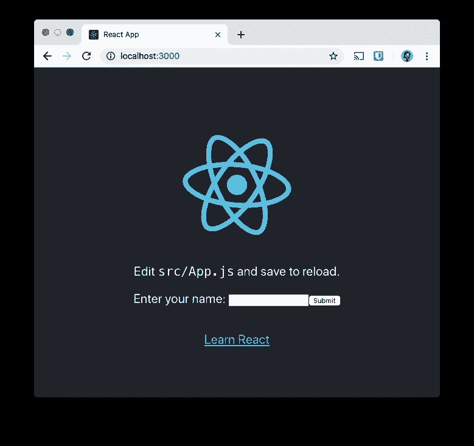
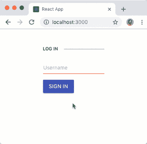
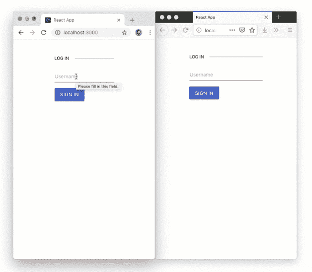

# 用 Twilio 和 KendoReact 构建一个聊天应用

> 原文：<https://medium.com/hackernoon/chat-app-twilio-kendoreact-40da290d17b2>


[Twilio 可编程聊天](https://www.twilio.com/docs/chat)为实时聊天应用提供了 SDK 和强大的后端，但它缺少前端。如果你需要一个聊天界面，以及一大堆其他有用的组件，那么 [KendoReact](https://www.telerik.com/kendo-ui#react) 可能就是你要找的。

剑道 UI 提供了精心设计和测试的组件，你可以在你的[反应](https://www.telerik.com/kendo-react-ui/)、[角度](https://www.telerik.com/kendo-angular-ui)、 [Vue](https://www.telerik.com/kendo-vue-ui) 和 [jQuery](https://www.telerik.com/kendo-jquery-ui) 应用中使用。在这篇文章中，我们将使用 React 和 [KendoReact 对话 UI](https://www.telerik.com/kendo-react-ui/components/conversationalui/) 组件构建一个 Twilio 聊天应用程序。

# 你需要什么

如果您想按照本教程进行构建，那么您需要一些东西:

*   一个 Twilio 账户(你可以[在这里](https://www.twilio.com/try-twilio)免费注册一个 Twilio 账户)
*   一个 [Twilio 聊天服务](https://www.twilio.com/console/chat/services)和一个 [API 密匙和秘密](https://www.twilio.com/console/chat/runtime/api-keys)，这两个你都可以在 [Twilio 控制台](https://www.twilio.com/console/chat)中创建(把它们放在附近，你很快就会需要它们)
*   [Node.js](https://nodejs.org/en/download/) 构建我们的 React 应用程序并运行我们的服务器(我们需要一个服务器来生成访问令牌，以便通过 Twilio 可编程聊天验证我们的用户)

如果你想跳过前面，你可以在这个 GitHub repo 中查看这个应用程序的代码[。](https://github.com/philnash/twilio-chat-kendo-react)

# 我们开始吧

我们将使用 [React 和 Express starter 应用程序](https://github.com/philnash/react-express-starter/tree/twilio)，它是我在[这篇文章](https://www.twilio.com/blog/react-app-with-node-js-server-proxy)中构建的，是这个应用程序的基础。这个应用程序为我们提供了一种简单的方法来运行 Node.js 服务器，并通过一个命令对前端做出反应，并且附带了准备为 Twilio 可编程聊天创建访问令牌的端点。[下载](https://github.com/philnash/react-express-starter/archive/twilio.zip)或克隆应用程序，进入目录，安装依赖项:

```
git clone -b twilio https://github.com/philnash/react-express-starter.git twilio-chat-kendo
cd twilio-chat-kendo
npm install
```

将`.env.example`文件复制到`.env`，然后在空白处填入您的 Twilio 帐户 SID、聊天服务和您之前生成的 API 密钥。

```
cp .env.example .env
```

运行应用程序以确保到目前为止一切正常。在命令行上运行:

```
npm run dev
```

您将在您的浏览器 localhost:3000 中看到一个类似这样的应用程序。



我们已经准备好了 Twilio 聊天应用程序，React 应用程序也已安装完毕。让我们开始建造吧。

# 准备聊天

在开始聊天集成之前，我们还需要做一些工作。我们需要安装一些依赖项，删除示例应用程序，并添加一点风格。让我们从这些依赖项开始。

我们将需要`twilio-chat`模块来连接 Twilio Chat，然后需要几个 KendoReact 模块来提供我们将要使用的组件:

```
npm install twilio-chat @progress/kendo-react-conversational-ui \
  @progress/kendo-react-inputs @progress/kendo-react-buttons \
  @progress/kendo-react-intl @progress/kendo-theme-material
```

接下来，剥离`src/App.js`回到基础，包括 KendoReact 材质主题的 CSS:

```
import React, { Component } from 'react';
import '@progress/kendo-theme-material/dist/all.css';

class App extends Component {
  constructor(props) {
    super(props);
  }

  render() {
    return <p>Hello world</p>;
  }
}

export default App;
```

为了让应用程序更有风格和布局(不需要太多的努力)，将引导 CSS 添加到`public/index.html`的`<head>`中:

```
<!DOCTYPE html>
<html lang="en">
  <head>
    <!-- rest of the head -->
    <title>React App</title>
    <link
      rel="stylesheet"
      href="https://stackpath.bootstrapcdn.com/bootstrap/4.1.3/css/bootstrap.min.css"
          integrity="sha384-MCw98/SFnGE8fJT3GXwEOngsV7Zt27NXFoaoApmYm81iuXoPkFOJwJ8ERdknLPMO"
      crossorigin="anonymous"
    />
  </head>
```

完成后，是时候构建我们的第一个组件了。

# 构建登录表单

为了让用户加入我们的聊天，我们需要他们登录并选择一个用户名。如果您正在将它构建到现有的应用程序中，那么您可能已经有了用户和登录系统。在这篇文章中，我们将通过显示一个要求输入用户名的登录表单来伪装它。

创建一个新文件`src/Login.js`，并打开它。由于登录表单本身不需要存储任何状态，我们将把它作为一个[功能组件](https://reactjs.org/docs/components-and-props.html#function-and-class-components)。从以下样板文件开始:

```
import React from 'react';

const Login = props => {
  return;
};
export default Login;
```

为了使我们的登录表单适合我们的对话式 UI，我们将使用 KendoReact 组件。在顶部导入`Button`和`Input`组件:

```
import React from 'react';
import { Button } from '@progress/kendo-react-buttons';
import { Input } from '@progress/kendo-react-inputs';
```

修改`Login`函数以返回以下 JSX:

```
const Login = props => {
  return (
    <form className="k-form" onSubmit={props.handleLogin}>
      <fieldset>
        <legend>Log in</legend>
        <div className="mb-3">
          <Input
            name="username"
            label="Username"
            required={true}
            style={{ width: '100%' }}
            value={props.username}
            onChange={props.handleUsernameChange}
          />
        </div>
        <div>
          <Button type="submit" primary={true}>
            Sign in
          </Button>
        </div>
      </fieldset>
    </form>
  );
};
```

这相当于 JSX 的一大块，所以让我们来分解一下。整个事情就是一个`<form>`包含一个`<fieldset>`和`<legend>`。然后在里面有一个`<Input>`组件和一个`<Button>`组件。这些是我们进口的 KendoReact 组件。它们的行为就像常规的`<input>`和`<button>`元素，但是符合 KendoReact 风格。

JSX 还包括一些我们需要向组件提供的属性；一个用户名和两个处理事件的函数。我们将把这些添加到`<App>`组件中，这样我们就可以把它们作为属性传入。

打开`src/App.js`，开始导入新的`<Login>`组件。

```
import React, { Component } from 'react';
import '@progress/kendo-theme-material/dist/all.css';
import Login from './Login';
```

定义我们将传递给`<Login>`组件的两个函数。一个函数需要处理用户输入，并更新存储在状态中的用户名。另一个处理提交的表单，并将状态设置为显示用户已登录。将这些添加到`src/App.js`中`<App>`组件的构造函数下面:

```
 handleLogin(event) {
    event.preventDefault();
    this.setState({ loggedIn: true });
  }
  handleUsernameChange(event) {
    this.setState({ username: event.target.value });
  }
```

在构造函数中，我们需要初始化状态并将这些函数绑定到组件:

```
 constructor(props) {
    super(props);
    this.state = {
      username: '',
      loggedIn: false
    };
    this.handleLogin = this.handleLogin.bind(this);
    this.handleUsernameChange = this.handleUsernameChange.bind(this);
  }
```

现在让我们更新`render`函数，如果状态显示用户已登录，则显示用户名，否则显示`<Login>`组件。

```
 render() {
    let loginOrChat;
    if (this.state.loggedIn) {
      loginOrChat = <p>Logged in as {this.state.username}</p>;
    } else {
      loginOrChat = (
        <Login
          handleLogin={this.handleLogin}
          handleUsernameChange={this.handleUsernameChange}
          username={this.state.username}
        />
      );
    }
    return (
      <div className="container">
        <div className="row mt-3 justify-content-center">{loginOrChat}</div>
      </div>
    );
  }
```

如果您的应用程序仍在运行，请返回浏览器，您将看到登录表单。否则用`npm run dev`启动 app，打开`localhost:3000`。在表格中输入您的姓名，然后按 Enter 或单击“登录”。



# 连接可编程聊天

现在，我们可以使用用户名生成一个访问令牌，并将登录的用户与 chat 连接起来。创建一个名为`src/ChatApp.js`的新文件并打开它。我们将为聊天应用程序创建一个基于类的组件，因此添加以下样板文件:

```
import React, { Component } from 'react';

class ChatApp extends Component {
}

export default ChatApp;
```

在这个组件中，我们需要做几件事情:

*   从服务器检索访问令牌并初始化 Twilio 聊天客户端
*   设置一个聊天频道并加入它，加载任何现有的消息
*   创建一个发送消息的函数
*   呈现 KendoReact 对话式用户界面

在此之前，我们需要导入两个模块；twilio-chat 和 KendoReact 会话 UI。在`src/ChatApp.js`顶部添加:

```
import React, { Component } from 'react';
import Chat from 'twilio-chat';
import { Chat as ChatUI } from '@progress/kendo-react-conversational-ui';
```

让我们也在构造函数中设置一些初始状态。我们需要一个消息列表，一个出错时的错误状态，以及一个显示聊天是否正在加载的布尔值，它将以`true`开始。

```
class ChatApp extends Component {
  constructor(props) {
    super(props);
    this.state = {
      error: null,
      isLoading: true,
      messages: []
    };
  }
}
```

## 获取访问令牌

当我们向端点`/chat/token`传递一个身份时，starter 项目已经设置为返回一个令牌。我们将使用`fetch` API 发出请求，作为`componentDidMount`生命周期事件的一部分。我们在这里使用`componentDidMount`,因为 React 文档告诉我们这是加载外部数据的好地方。

带有访问令牌的响应将是 JSON，因此我们需要使用响应对象的`json`方法来解析它，一旦解析完毕，我们就可以使用令牌来初始化聊天客户端。

创建聊天客户端返回一个承诺，因此我们可以链接所有这些方法。一旦创建了聊天客户端，我们将使用另一种方法来完成设置。我们还应该用一个`catch`方法来处理任何错误。

将这段代码添加到构造函数下面的`ChatApp`类中:

```
 componentDidMount() {
    fetch('/chat/token', {
      headers: { 'Content-Type': 'application/x-www-form-urlencoded' },
      method: 'POST',
      body: `identity=${encodeURIComponent(this.props.username)}`
    })
      .then(res => res.json())
      .then(data => Chat.create(data.token))
      .then(this.setupChatClient)
      .catch(this.handleError);
  }
```

编写处理错误的方法。我们将在状态中设置一条消息，并记录完整的错误，以便在遇到任何问题时可以进行调试。

```
 handleError(error) {
    console.error(error);
    this.setState({
      error: 'Could not load chat.'
    });
  }
```

## 设置聊天频道

我们已经用访问令牌初始化了我们的聊天客户端，但还有更多工作要做。一旦承诺兑现，我们需要使用新的聊天客户端加入频道。由于这是我们第一次完成该过程，我们将检查该通道是否存在。如果是这样，我们将尝试加入它；否则，我们将创建它，然后加入它。

将下面的`setupChatClient`方法添加到该类中:

```
 setupChatClient(client) {
    this.client = client;
    this.client
      .getChannelByUniqueName('general')
      .then(channel => channel)
      .catch(error => {
        if (error.body.code === 50300) {
          return this.client.createChannel({ uniqueName: 'general' });
        } else {
          this.handleError(error);
      }
    })
      .then(channel => {
       this.channel = channel;
       return this.channel.join().catch(() => {});
      })
      .then(() => {
        // Success!
      })
      .catch(this.handleError);
   }
```

我们捕捉中间的错误，以防通道不存在(50300 错误)并创建通道。此外，如果加入一个频道抛出一个错误，我们捕捉它，什么也不做。这将处理用户已经是通道成员的情况。

如果一切正常，代码将进入成功注释。在这个阶段，通道已经加载，因此我们可以将状态变量`isLoading`设置为`false`。我们还需要加载现有的消息，并为新消息设置一个监听器。

将上面的`// Success!`注释替换为:

```
 .then(() => {
        this.setState({ isLoading: false });
        this.channel.getMessages().then(this.messagesLoaded);
        this.channel.on('messageAdded', this.messageAdded);
      })
```

## 接收消息

我们需要编写上面提到的`messagesLoaded`和`messageAdded`方法，但在此之前，我们需要考虑 KendoReact 对话式 UI 想要的消息的[格式。我们需要将消息对象从 Twilio 提供的格式转换成对话式 UI 组件可以使用的格式。](https://www.telerik.com/kendo-react-ui/components/conversationalui/api/Message/)

让我们编写一个函数，它可以从聊天服务获取[消息，并为 KendoReact 返回一个消息对象:](http://media.twiliocdn.com/sdk/js/chat/releases/3.0.2/docs/Message.html)

```
 twilioMessageToKendoMessage(message) {
    return {
      text: message.body,
      author: { id: message.author, name: message.author },
      timestamp: message.timestamp
    };
  }
```

现在我们可以编写`messagesLoaded`和`messageAdded`方法了。`messagesLoaded`在我们第一次将现有消息加载到通道时运行，因此我们用收到的所有消息填充`state.messages`。

```
 messagesLoaded(messagePage) {
    this.setState({
      messages: messagePage.items.map(this.twilioMessageToKendoMessage)
    });
  }
```

`messageAdded`将接收一条消息作为它的参数，所以我们使用`[setState](https://reactjs.org/docs/react-component.html#setstate)`的回调版本将消息添加到列表中。注意，我们还使用 spread 操作符(`...`)将现有消息复制到新状态中。

```
 messageAdded(message) {
    this.setState(prevState => ({
      messages: [
        ...prevState.messages,
        this.twilioMessageToKendoMessage(message)
      ]
    }));
  }
```

## 发送消息

我们还需要一个向通道发送消息的函数。当用户在消息框中键入消息并通过单击 send 按钮或按 enter 键发送消息时，KendoReact 对话式 UI 将调用该函数。为了处理它，我们需要将消息文本发送到通道上。消息的显示将由我们在频道上监听的现有`messageAdded`事件来处理。

将以下函数添加到`ChatApp`类中:

```
 sendMessage(event) {
    this.channel.sendMessage(event.message.text);
  }
```

## 整理和呈现对话式用户界面

在我们可以看到实际的聊天之前，我们还有一些最后的部分要完成。我们应该处理被卸载的组件。我们可以通过关闭聊天客户端实例来做到这一点。

```
 componentWillUnmount() {
    this.client.shutdown();
  }
```

对话式 UI 需要一个用户对象，我们将使用我们的用户身份来创建它。我们还需要将所有回调函数绑定到组件。将以下内容添加到构造函数中:

```
 constructor(props) {
    super(props);

    this.state = {
      error: null,
      isLoading: true,
      messages: []
    };
    this.user = {
      id: props.username,
      name: props.username
    };

    this.setupChatClient = this.setupChatClient.bind(this);
    this.messagesLoaded = this.messagesLoaded.bind(this);
    this.messageAdded = this.messageAdded.bind(this);
    this.sendMessage = this.sendMessage.bind(this);
    this.handleError = this.handleError.bind(this);
  }
```

# 渲染聊天

现在一切就绪，我们可以呈现对话式 UI 了。在`src/ChatApp.js`中创建一个处理组件各种状态的`render`方法。如果有错误或者聊天仍在加载，我们将呈现一条消息，否则我们将呈现 KendoReact 对话式 UI 组件，传递用户对象、消息和用户发送消息时要运行的回调方法。

```
 render() {
    if (this.state.error) {
      return <p>{this.state.error}</p>;
    } else if (this.state.isLoading) {
      return <p>Loading chat...</p>;
    }
    return (
      <ChatUI
        user={this.user}
        messages={this.state.messages}
        onMessageSend={this.sendMessage}
        width={500}
      />
    );
  }
```

最后，我们需要渲染来自`<App>`组件的整个组件。导入`src/App.js`顶部的`<ChatApp>`组件。

```
import React, { Component } from 'react';
import Login from './Login';
import ChatApp from './ChatApp';
import '@progress/kendo-theme-material/dist/all.css';
```

现在更新`<App> component`的`render`函数，在用户登录时返回`<ChatApp>`组件。

```
render() {
  let loginOrChat;
  if (this.state.loggedIn) {
    loginOrChat = <ChatApp username={this.state.username} />;
  } else {
    loginOrChat = (
      <Login
        handleLogin={this.handleLogin}
        handleUsernameChange={this.handleUsernameChange}
        username={this.state.username}
      />
    );
  }
  return (
    <div className="container">
      <div className="row mt-3">{loginOrChat}</div>
    </div>
  );
```

重新加载应用程序，登录并开始聊天。您可以打开另一个浏览器窗口，用不同的名称登录，查看来回传递的信息。



# 这仅仅是开始

[Twilio 可编程聊天](https://www.twilio.com/docs/chat)是一个功能强大的聊天 SDK，而 [KendoReact 的对话式 UI](https://www.telerik.com/kendo-react-ui/components/conversationalui/) 使得在 React 应用程序中显示聊天内容变得非常容易。我们要做的大部分工作是生成一个访问令牌并设置 Twilio 聊天。一旦我们编写了几个将消息从 Twilio 翻译成 KendoReact 和从 KendoReact 翻译成 Twilio 的函数，UI 就就位了。

您可以在 [GitHub repo](https://github.com/philnash/twilio-chat-kendo-react) 中获得该应用程序的所有代码。

查看 [KendoReact 文档](https://www.telerik.com/kendo-react-ui)了解该 UI 的其他功能，例如[建议操作](https://www.telerik.com/kendo-react-ui/components/conversationalui/suggested-actions/)，当对方是机器人时很有用，以及[消息附件](https://www.telerik.com/kendo-react-ui/components/conversationalui/attachments/)，了解在您的聊天中显示媒体消息或其他视图(如列表或传送带)的方式。

如果你喜欢不同的框架，KendoReact 对话式用户界面也可用于 jQuery T1、T2 角 T3 和 T4 Vue T5，还有很多其他有用的组件可以用来构建你的应用。

你以前用过 KendoReact 吗？或者你正在你的应用程序中构建聊天功能，并寻找一个可爱的用户界面？请在@philnash 的评论或 [Twitter 上告诉我你的想法。](https://twitter.com/philnash)

*最初发表于*[*www.twilio.com*](https://www.twilio.com/blog/chat-app-twilio-kendoreact)*。*