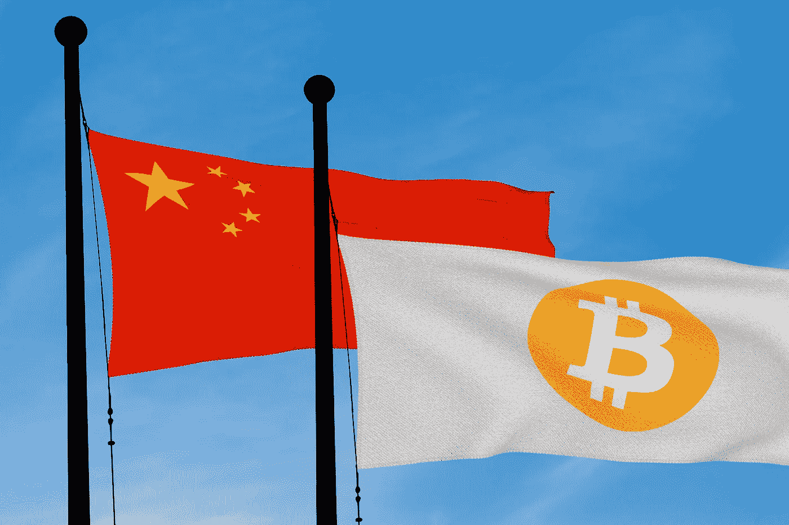

# 中国通过新的反匿名法规扩大对区块链的监管

> 原文：<https://medium.com/hackernoon/china-expands-oversight-over-blockchain-with-new-anti-anonymity-regulations-5753d474d916>

中国主要的互联网监管机构中国网络空间管理局(CAC)最近采取了一项新政策，本月早些时候在其网站上宣布了[，该政策要求所有区块链科技公司在提供任何与区块链相关的服务之前，收集其用户的某些身份信息。](http://www.cac.gov.cn/2019-01/10/c_1123971164.htm)

**新政策将于 2019 年 2 月 15 日起生效。**

[Picture’s source](https://techwireasia.com/)

区块链信息服务提供商被定义为通过桌面网站或移动应用程序使用区块链技术向公众提供信息服务和技术支持的“实体或节点”，将受到新法规的约束。2 月 15 日之后，这些公司必须在提供法规所涵盖的任何服务后 20 天内在 CAC 注册他们的名称、域名和服务器地址。

新规将要求区块链公司应要求向当局提供存储数据的访问权限，并引入注册程序，要求用户提供身份证和手机号码，以进行身份验证。

此外，区块链公司将被要求监督内容，审查中国现行法律禁止的信息，如可能危害国家安全、扰乱社会秩序或侵犯他人合法权益的内容和信息。区块链公司将被禁止通过其服务复制、发布或传播此类被禁止的内容。

未能遵守新规定的公司可能会被处以 20，000 元(2，900 美元)至 30，000 元(4，400 美元)的罚款。惯犯可能面临刑事调查的风险。

虽然有人担心加强监管会阻止中国区块链初创公司和企业家，但支持者认为，监管机构加强指导和澄清将通过展示中国对精心管理、安全可靠的国内区块链行业的承诺，鼓励初创公司和企业家。

## 微妙的区块链平衡行为

For several years, China has maintained a cautious and deliberative approach toward the blockchain. China Central Television (CCTV), the powerful state-controlled broadcast company announced in an [hour-long broadcast](https://www.youtube.com/watch?v=PeCTHcAQ_ho) last year, that *“the value of blockchain is ten times that of the Internet”*, and that blockchain is the next significant global technological revolution, exceeding the importance of the Internet, according to [Quartz](https://qz.com/1298221/china-is-suddenly-full-of-nice-things-to-say-about-blockchain-technology/).

President Xi Jinping [spoke in May 2018](https://www.cnbc.com/2018/05/30/chinese-president-xi-jinping-calls-blockchain-a-breakthrough-technology.html) about the enormous potential of the blockchain, stating *“a new generation of technology represented by artificial intelligence, quantum information, mobile communications, internet of things, and blockchain is accelerating breakthrough applications,”* Xi said, via a translator.

These are not just idle words; there is coordinated action underlying many recent Chinese blockchain ventures that have the support of the government, educational and research institutes and private enterprise. Chinese firms [occupy 57 spots in a newly compiled “Top-100 Blockchain Enterprise Patent Rankings” list,](http://www.iprdaily.cn/news_19746.html) according to a prominent intellectual property information source. China filed the most blockchain patents globally with the [World Intellectual Property Organization (WIPO)](http://www.wipo.int/about-wipo/en/) in 2017, according to Thomson Reuters, accounting for a total of 49% filed patents, while the U.S. came in second place with 33% of all filed patents.

Nanjing, the capital of China’s Jiangsu province, launched a 10 billion yuan ($1.48 billion) [investment fund for blockchain](https://www.zdnet.com/article/chinas-nanjing-launches-1-5-billion-blockchain-fund/). During the grand opening of the Hangzhou Blockchain Industrial Park in China, the [Xiong’An Global Blockchain Innovation Fund](https://www.coindesk.com/1-billion-blockchain-fund-launches-with-chinese-government-backing/) launched with $1.6 billion (10 billion yuan) to fund promising Chinese blockchain ventures.

然而，在加密货币方面，中国坚决反对放开任何可以与人民币匹敌的数字货币。中国不承认加密货币为法定货币，银行系统不提供加密货币或相关服务。

2017 年，中国政府采取了几项高调的监管措施来保护投资者和降低金融风险，包括宣布首次发行硬币是非法的，限制加密货币交易平台的主要业务，以及阻止加密货币开采。中国的行动制止了加密货币投机，防止了广泛的欺诈和操纵，使大多数中国投资者免受 2018 年的极度波动和巨大损失。

## **区块链在中国的未来**

总体而言，中国新兴的区块链科技领军企业的总体前景非常乐观。*说[Steve Deng](https://www.cryptoninjas.net/2018/11/08/dr-steve-deng-of-matrix-ai-network-on-the-future-of-ai-and-blockchain/)博士，MATRIX AI Network (MAN)的首席人工智能科学家，MATRIX AI Network 是一个全球开源、公共、智能的分布式计算平台和操作系统，总部位于区块链，总部位于中国，结合了人工智能(AI)和区块链。*

*史蒂夫·邓博士解释道:*

> *我认为区块链技术提供了四个关键优势。首先，区块链是一个值得信赖的网络，它提供安全的数字基础设施来验证身份。第二，它是一个监督网络，确保人们不会造成伤害。第三，它是一个交付网络，能够实现更快、更便宜的国际支付，并使支付更加自然和透明。第四，它是一个协作网络，为大规模协作提供激励。*

*与 MATRIX AI Network 一样，中国还有许多其他有前途的区块链科技公司，如 NEO、GXChain、Tron 和 VeChain，它们正在吸引投资者，引起私营部门战略合作伙伴的兴趣，并支持中国作为新数字经济中一支不可忽视的力量的主张。*