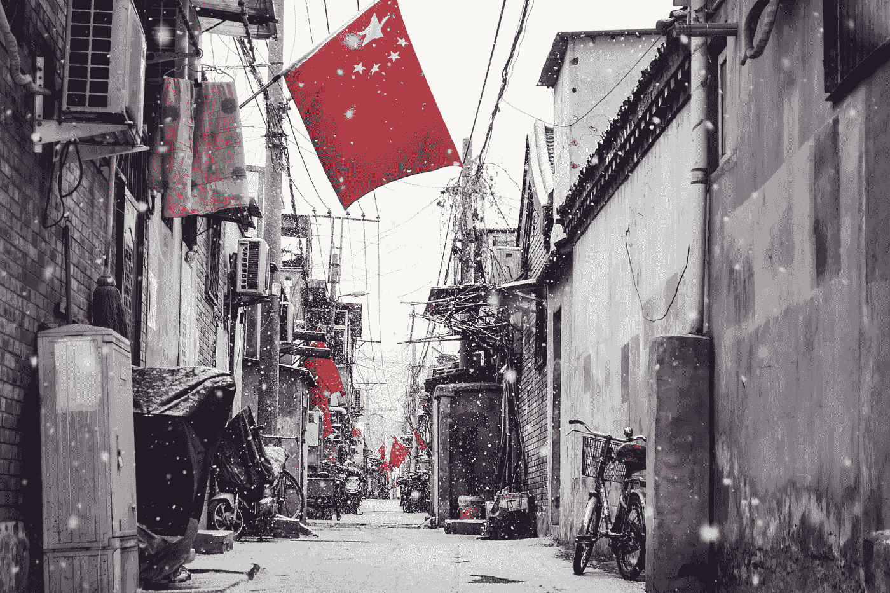

# 中国讨厌密码，但喜欢好的区块链。

> 原文：<https://medium.com/hackernoon/china-hates-cryptos-but-loves-a-good-ol-blockchain-91bddc5321ec>

许多对加密货币和区块链感兴趣的读者和投资者都会犯一个常见的错误，即把它们描绘成同样模糊、不确定的结构性交易系统。

然而，事实的真相是完全不同的:*区块链*是一个系统，一个模型，包含在一个不断增长的记录列表中(被称为*区块*)，而*加密货币*只是你可以使用的一个位于区块链的账本。基于区块链的应用和技术可以用于其他目的，而不仅仅是虚拟货币和贸易。

现在，读者可能会想:“我点击这里是因为我在标题中看到了‘中国’，这种讲座式的介绍是怎么回事？".嗯，因为要真正理解中国在实施基于区块链的技术上的战略——以及它对一批全新的年轻、数字化的本土企业家的开放(*和封闭*)——人们需要记住这样的误解。

Photo by [zhang kaiyv](https://unsplash.com/photos/roswv6S92Os?utm_source=unsplash&utm_medium=referral&utm_content=creditCopyText) on [Unsplash](https://unsplash.com/search/photos/beijing?utm_source=unsplash&utm_medium=referral&utm_content=creditCopyText)

让我们从这个开始:每个对 cryptos 稍微感兴趣的人都知道，第一个交易的硬币比特币及其匿名创造者[中本聪](/@rossimarco/satoshis-back-at-least-for-a-nour-46e753b3031e)的主要目标是创造一种*“去中心化*”的货币。

也就是说，他/她/他们想要摆脱以庞大的银行机构和庞大的国家为代表的中心。当我们谈到庞大的利维坦国家时，中国是一个相当完美的例子。

> 因此，比特币、以太坊和其他加密货币的主要议程与中国国家的极权主义和中央集权性质相冲突。无论这种“秘密议程”能否成功，中国都不愿意冒这个险。因为没有任何东西，哪怕是一枚虚拟的硬币，能够与国家和共产党的强大力量相抗衡。但它是可以被抑制的。

这就是贵阳市委常委胡绍在中央电视台长达一小时的谈话中所说的话:

> “区块链在中国不是去中心化，而是‘去中间化’。*没有办法摆脱中心*。”

我认为这是他发言的核心。

监管基于区块链的技术的实施(或者更确切地说，整合)的重要性已经成为一个优先事项，以至于它被列入了党的[十三五规划](http://www.gov.cn/zhengce/content/2016-12/27/content_5153411.htm)——是的，中国仍然是老式的、过时的苏联五年计划的粉丝。此外，中国目前是与区块链相关的[专利](https://digitalchamber.org/wp-content/uploads/2018/03/Blockchain-Intellectual-Property-Council-White-Paper-Electronic-FINAL.pdf)和许可证发放数量最多的国家，这使中国成为全球该行业的领导者。

> 中国不愿意冒这个险。没有任何东西，甚至是一枚虚拟的硬币，能够与国家和共产党的强大力量相抗衡。但它是可以被抑制的。

Photo by [Denny Ryanto](https://unsplash.com/photos/naOfJ3DlfPM?utm_source=unsplash&utm_medium=referral&utm_content=creditCopyText) on [Unsplash](https://unsplash.com/search/photos/china-technology?utm_source=unsplash&utm_medium=referral&utm_content=creditCopyText)

然而，与此同时，它禁止了各种形式的加密交易——最后一步是[禁止微信上的加密货币交易](https://cointelegraph.com/news/chinese-social-media-giant-wechat-bans-crypto-transactions-in-its-payment-policy),这是该国使用最广泛的多用途应用程序——它还计划关闭该国的采矿计算机网络，这是全世界最广泛的网络。

我不能说党的[环境原因](https://www.forbes.com/sites/enriquedans/2019/04/14/why-china-has-made-the-right-call-on-cryptocurrencies/#5191b53133e4)是否是对国家技术领域更多极权控制的伪装，但中国承诺在未来几年成为一个更绿色的国家，采矿区块需要大量消耗能源和资源，这是事实。

尽管如此，可以肯定地说一件事:中国不会放弃区块链，因为不可删除和不可破解的记录链的特征给了政府一个新的工具，以确定其在国家社会生活中的核心权力。

Photo by [Chastagner Thierry](https://unsplash.com/photos/zjfbWSQeyoI?utm_source=unsplash&utm_medium=referral&utm_content=creditCopyText) on [Unsplash](https://unsplash.com/search/photos/beijing?utm_source=unsplash&utm_medium=referral&utm_content=creditCopyText)

当然，这也意味着它将不得不与同样强大的区块链打交道，后者可能会为政权存储棘手的数据。今年 4 月，北京大学(顶级学术机构)的一名学生岳欣在一份以太坊交易中附上了一封信，谴责该大学在调查一起性骚扰案件时的行为，该案件可追溯到上世纪 90 年代，但在一个有审查强迫症倾向的国家，这仍然非常真实。

然而，值得注意的是，这个“意外”会说是聚会——发生在虚拟货币以太坊的区块链上。区块链的货币交易是公众更关心的，除了因为他们的本质，遍布全球，在中国的边界之外。

> “区块链在中国不是去中心化，而是‘去中间化’。*没有办法摆脱中心*。”

不过，就目前而言，中国愿意探索基于区块链的技术。反乌托邦，[一款评估公民公民意识和社会态度的新应用就是一个明显的例子。政府可能有机会获得关于中华人民共和国每个公民表现的不可更改的数据块。](https://bitcoinexchangeguide.com/could-government-authorities-in-china-utilize-blockchain-to-secretly-monitor-its-citizens/)

> 以及有机会迫使其他国家处理一带一路庞大的基础设施项目的区块链为基础的物流。

中国政府知道“权力下放”、“个人财务自由”或仅仅是“自由”都是资产阶级的西方概念，党已经抵制了近一个世纪，甚至在中华人民共和国成立之前。

如果它要使用区块链，那将完全按照中国的方式——或者更确切地说，按照党的方式。很明显，它会的。