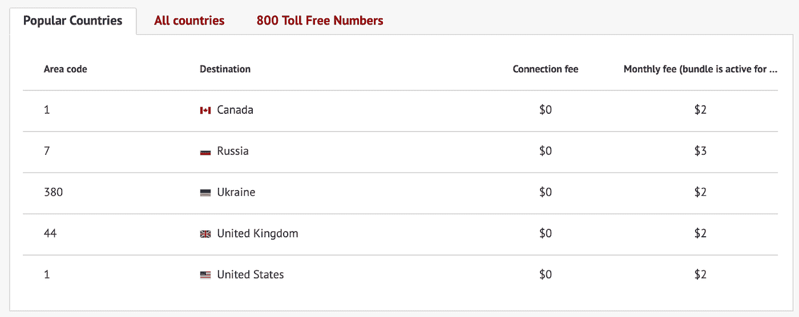
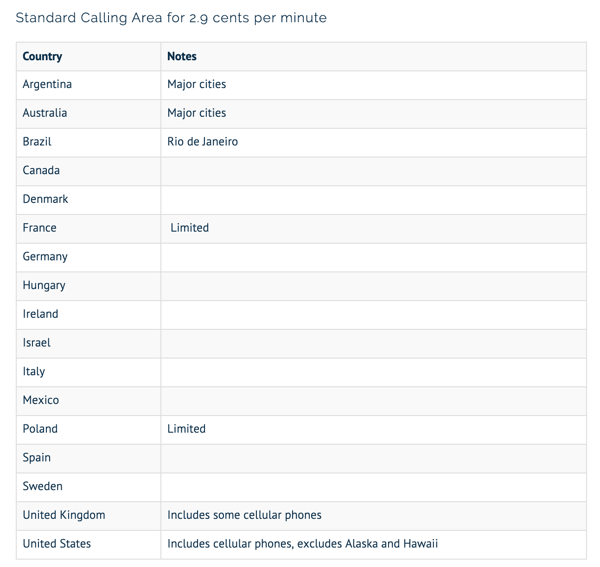
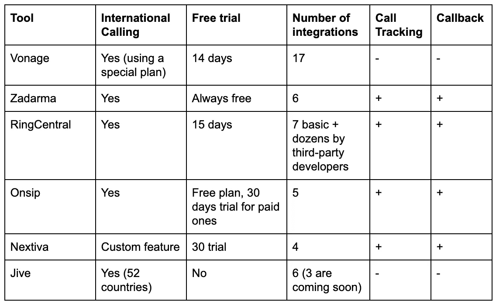

# 选择云 PBX:六种工具比较

> 原文：<https://medium.com/hackernoon/choosing-a-cloud-pbx-six-tools-comparison-730140928bb8>

最近，我决定我的公司需要一个云 PBX 系统用于我的项目。在公司只为 B2B 市场服务之前，我们已经推出了针对 B2C 受众的新服务。这导致了业务流程的许多变化，其中最显著的变化是—人们开始给我们打电话！

我们只是一家初创公司，但我们的客户遍布全球，因此我们需要一种解决方案，允许我们接受来自多个地点的呼叫并回拨。最后但同样重要的是，我们的预算很紧张。

免责声明:在我们的 B2B 客户没有打电话给我们之前，我不知道 VoIP 应该如何工作，所以我们必须从头开始构建一切。如果你发现我们在分析可用解决方案时犯了错误，请在下面的评论中提出你的建议。

我们走吧！

# **我们分析了哪些工具**

在对评论、文章和搜索结果进行了几天的挖掘之后，我列出了六个工具来进行彻底的分析:

*   [Vonage](https://www.vonage.com/)
*   [扎达尔马](https://zadarma.com/en/)
*   [中环](https://www.ringcentral.com/)
*   [onship](https://www.onsip.com/)
*   [Nextiva](https://www.nextiva.com/)
*   [摇摆舞](https://jive.com/)

在这个阶段，我们需要确保这些是受欢迎的工具，有很多用户和评论，因为我们不想依赖最近发布的和测试不佳的软件来与我们全新服务的用户建立关系。

# **比较**

由于我们刚刚开始接到客户的电话，我们不需要非常复杂的 PBX 系统。它应该可靠、灵活且价格合理。以下是我们评估的因素:

# **集成**

Vonage 有一系列可以集成的工具，包括 Salesforce、Office 365 和 ZendDesk。RingCentral 的集成较少，但仍然涵盖了从基础设施到生产效率的所有类别。

Zadarma 集成了不同的 CRM，包括我最喜欢的 Zoho，甚至是消息应用程序(FB messenger，Slack，Telegram)。这很方便，因为你可以在那里发送提醒，例如，设置未接来电的通知。

OnSip 只支持五个第三方工具:HighRise、Odoo、ZenDesk、Slack 和 Chrome(尽管它只是一个浏览器的扩展)。

Jive 的开发者已经实现了六个集成，并承诺很快将增加三个，包括 Office 365、微软动态和经销商套接字。

# **定价**

同样，我们需要一个云 PBX 来开展新的业务；这是一个可能成功也可能失败的实验。因此，我们不想投入大量资金来建设基础设施。

Vonage 的基础版名为“移动”(无座机)，起价 19.99 美元/月。在这里，您可以无限制通话(仅限美国和加拿大)，但不能进行分析和集成。如果你想将它与你的 CRM 集成，你需要每月 29.99 美元的高级计划。

如果按年付费(月费为 29.99 美元)，RingCentral 的基本计划是每个用户每月 19.99 美元，包括一个免费或本地号码和 100 分钟的免费通话时间。

Zadarma PBX 可以免费使用。他们对录音和分钟的延长存储收费。虚拟号码，包括 1-800 个免费号码，几乎免费提供给几十个国家(连接可能是免费的，也可能是付费的，月费通常是 3-5 美元)。

*Popular countries for virtual numbers, data: Zadarma.com*

OnSip 有两个计费选项:每分钟和无限计划。每月 49.95 美元，标准通话区内 2.9 美元/分钟:

*OnSip standard calling area*

无限计划是每人每月 18.95 美元(包括我们不需要的每个用户的台式电话或耳机)。他们也有纯互联网语音通信的免费计划。

Jive 根据用户数量采用分级定价。基本计划是 1-4 个用户每月 29.95 美元。现在他们为每个 Jive 席位提供 GoToMeeting Pro 许可证，这可能是一个优点。

Nextiva 的基本计划为您提供云 PBX、呼叫管理功能、免费本地和免费号码，每月 19.95 美元。

# **PBX 功能**

尽管价格对我们来说是一个至关重要的因素，但我们也分析了我们所评估的服务所提供的 PBX 系统的整体功能。

Vonage 有一个相当大的功能列表，按类别划分，如隐私，客户服务，个性化或移动工作。即使在其良好的基本计划中，RingCentral 也提供高清晰度(HD)语音功能。

有了 Zadarma，你可以记录电话和安装语音菜单(IVR ),即使是在基本的免费版本中。Onsip 提供基本功能和一些高级功能，如保留增强音乐。

从 Nextiva 我喜欢的功能来看，有语音邮件到电子邮件和呼叫排队值得一提。Jive 也有多种功能，作为一个企业主，我对间谍模式很感兴趣，它允许管理员在不中断正在进行的呼叫的情况下安静地进入现有的对话。对话参与者不知道您在听，因此您可以收集有关员工工作质量的数据。

# **其他功能:国际呼叫、回拨&呼叫跟踪**

我们的 b2c 市场拥有来自不同地区的用户。所以我们至少需要接听来自美国、东欧和西欧的电话。我们还想使用电话追踪——我们计划推出几个广告活动，所以我们需要知道哪个营销渠道产生了销售线索。回调部件和其他东西也可能是一个优势，尽管我们在开始时并不需要它。

Zadarma 提供了无争议的国际通话(他们有最大的购买号码的地区选择)，Vonage 有一个特殊的国际通话[计划](https://www.vonage.com/personal/phone-plans/vonage-world)，OnSip 有一个扩展的通话区域(这里的费率是)，您需要联系 Nextiva 以便设置国际通话，Jive 支持 52 个国家。

OnSip、RingCentral、Zadarma、Nextiva 提供呼叫跟踪功能。Jive 和 Vonage 不提供这个功能。

OnSip、Zadarma、RingCentral、Nextiva 也提供了小部件的回叫服务，这样你的客户就可以向你请求回叫了。我未能在 Vonage 的网站上找到关于回拨小工具的信息(尽管他们有一个很好的功能，叫做 call return——你可以通过拨打一个唯一的代码来回拨上一个呼叫者)。同样的情况也适用于 Jive——我在他们的网站上没有发现任何关于回拨功能的内容。

## **结果**

下面是我们在一个表格中的比较结果:

就是这样，希望这篇帖子能对那些和我一样，第一次面临为创业公司选择 PBX 任务的人有所帮助。