# 2019 年在 Vue.js 和 ReactJS 之间选择:什么最适合你的项目？

> 原文：<https://medium.com/hackernoon/choosing-between-vue-js-and-reactjs-in-2019-whats-best-for-your-project-14e6de33c591>


*文章原载于* [*Codica 博客*](https://www.codica.com/blog/react-vs-vue-2019/) *。*

如今，每个公司的目标都是在短时间内创建高质量的 web 解决方案。为了将它付诸实践，开发人员社区能够从许多 JavaScript 库和框架中进行选择，并进行辩论以找到最好的一个。

如果我们看看 [Vue.js](https://vuejs.org/) 和 [ReactJS](https://reactjs.org/) ，在 [Codica](https://www.codica.com) 我们认为它们是前端开发中发展最快的工具，原因有很多。我们使用 Vue 和 React 为多个任务创建了各种产品。虽然这些开发工具可以帮助创建相同的产品和应用程序，但它们各有利弊。

本文的目的是在许多不同的方面比较 Vue.js 和 ReactJS:从一般信息到技术特性。这两种 web 开发工具都有成熟的社区、广泛的支持和受欢迎程度，但 Vue.js 是框架，React 是库。那么，我们为什么要比较橘子和苹果呢？

# 为什么要 Vue 和 React？

比较的一个关键因素是 Vue.js 框架创建者尤雨溪将 ReactJS 作为新框架开发的灵感来源。

> 我想，如果我可以提取 React 中我真正喜欢的部分，然后构建一个真正轻量级的东西，而不涉及所有额外的概念，会怎么样？我也很好奇它的内部实现是如何工作的。我开始这个实验只是想复制这个最小的特性集，比如声明性数据绑定。基本上 Vue 就是这样开始的。
> 
> *—尤雨溪*

这些 web 开发工具彼此非常相似。我们甚至可以从 [Vue.js 官方文档](https://vuejs.org/v2/guide/comparison.html)中看到，那里展示了这样的相似之处。最初的主要共同点是:

*   虚拟 DOM
*   反应和组件结构
*   JavaScript 用法

乍一看，Vue 和 ReactJS 的相似之处多于不同之处。让我们深入到其他方面来进一步了解和详细比较这些工具。

# 成熟

分析项目开发并试图决定应该使用什么工具来获得结果，在选择尚未成熟或认可的工具时，您需要谨慎。

使用不成熟的工具时，存在一定的风险:

*   bug 或漏洞。
*   它可能没有一个大的知识库或社区，以防你需要帮助。

Vue.js 和 React 分别由一家大型公司和一位经验丰富的开发者发布，这给了我们稳定的信心和巨大的社区支持，以防我们需要帮助。

首先，让我们看看一些事实:

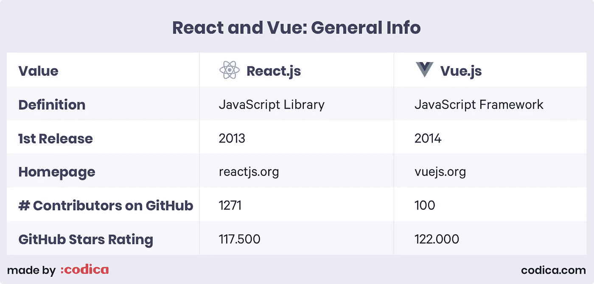

ReactJS 由脸书于 2013 年开发并发布，目前仍在他们自己的产品如 WhatsApp 和 Instagram 中实现。在撰写本文时，它是 GitHub 上最受欢迎的 JS 框架[之一，拥有大约 117，500 颗星](https://github.com/collections/front-end-javascript-frameworks)。

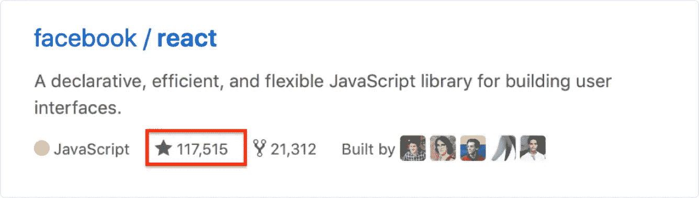

**Vue.js** 于 2014 年 2 月由谷歌前创意技术专家[尤雨溪](https://twitter.com/youyuxi)推出。2012 年至 2014 年，Evan 在谷歌创意实验室负责 UI/UX 原型和创意实验，并与 React 和 Angular 合作。后来，他总结了自己对这些框架的想法，并在相同的功能内创建了一个完全轻量级的框架。

到目前为止，Vue 也是 web 开发中最受欢迎的框架之一，GitHub 上有 [122，000 颗星。](https://github.com/collections/front-end-javascript-frameworks)

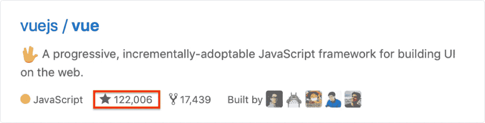

下面是 GitHub 的明星对比历史。


[Source](https://www.timqian.com/star-history/#facebook/react&vuejs/vue)

总之，Vue.js 和 React 在开发者社区中有着成熟的历史、支持和知名度。所有这些带来了从技术角度比较它们的兴趣，以发现开发过程中的关键差异。

# 社区和受欢迎程度

在 StackOverflow 上， [#reactjs](https://stackoverflow.com/questions/tagged/reactjs) 内有 115.900 个问题。此外，大约有 50.000 个 npm 包可供 React 开发人员在撰写本文时使用。

ReactJS 的社区比 Vue.js 的社区要大得多，但是主要问题是指 React 的碎片化性质，所以获取常见问题的反馈比较复杂。

另一方面，Vue 是一个渐进的轻量级框架，允许您轻松快速地开发解决方案。Vue.js 也更容易学习，因为它需要的时间更少，学习曲线也更低。但是要找到 Vue 开发者，要拿到未来的产品维护，就比较复杂了。

说到 Vue.js 的受欢迎程度，在 [#vue.js](https://stackoverflow.com/questions/tagged/vue.js) 内的 StackOverflow 上大约有 27000 个问题，大约有 14000 个 npm 包可供 Vue 开发者使用。

为了比较社区支持度和受欢迎程度，让我们来熟悉一下由 JavaScript 的[状态创建的 2017 / 2018 最受欢迎 JS 框架调查图表。他们每年从超过 20，000 名开发人员那里收集数据，主题从前端框架到测试库。](https://stateofjs.com/)


Source: [2017.stateofjs.com](https://2017.stateofjs.com/2017/front-end/results)

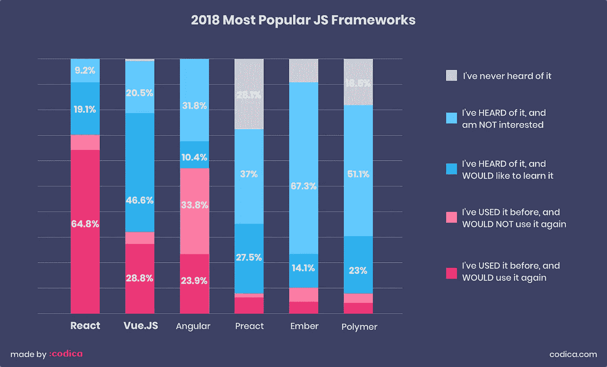

Source: [2018.stateofjs.com](https://2018.stateofjs.com/front-end-frameworks/overview)

如您所见，React 遥遥领先于最受欢迎的 JavaScript 库，拥有最大的知识库、支持和社区。所有这一切意味着你可以更快地找到 React 开发者，未来的支持也将更容易。

# 开发速度和成本

在开发开始时，您需要选择采用什么 JavaScript 框架/库。任何网站或应用程序都可以使用 Vue 和 ReactJS 创建。问题是开发速度和成本。

**发展速度**

我们的经验表明，Vue.js 和 React 在开发速度上特别相似，因为有许多额外的库、框架和包可以帮助您快速构建应用程序。一切都取决于开发人员的编码经验和技能，允许向 ReactJS 或 Vue 倾斜，但实际上，类似任务的时间估计示例性地是相等的。

**成本**

成本取决于许多因素，如开发人员的经验和资历水平，位置等，所以它可以有很大的不同。为了记住一些数字，我们添加了 React 和 Vue.js 的 Codementor 平台的平均成本。

ReactJS 开发商平均费率:

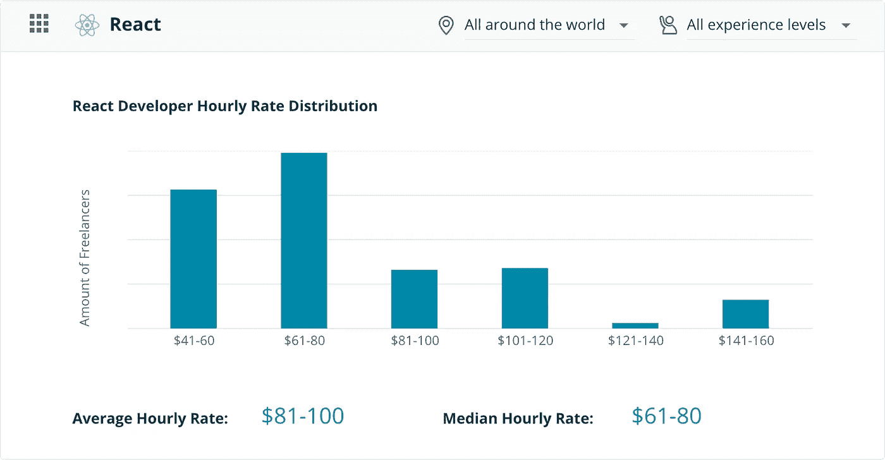

Source: [codementor.io](https://www.codementor.io/freelance-rates/reactjs-developers)

Vue 开发者平均费率:

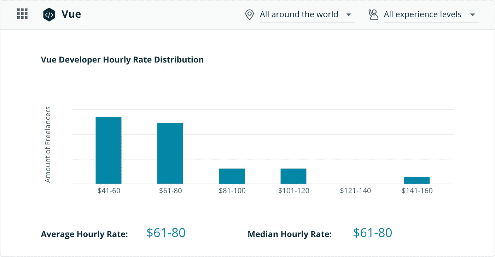

Source: [codementor.io](https://www.codementor.io/freelance-rates/vue-developers)

# 技术特性表

# 工具作业

**React** 提供了一个名为 [create-react-app](https://github.com/facebook/create-react-app) 的第三方 CLI 工具，帮助开发者加速应用开发、添加脚本、安装必要的依赖项等工作。

在 create-react-app 发布之前，开发人员必须复制 Webpack-config 和其他。rc 文件，或者手动配置所有内容。如果不使用 create-react-app，您必须将相同的配置从一个项目放到另一个项目。这没花多少时间，但实际上很无聊。

> ****create-react-app****提供了一个 CLI 接口，用于构建具有基本结构的应用程序，它安装所有必需的依赖项，并向 package.json 添加脚本来运行、测试和构建应用程序。**

*事实上，ReactJS 获得了对主要 ide 的巨大支持。*

*Vue-cli 是为 **Vue.js** 快速创建项目的工具。这样的项目有一个现成的结构，一个已安装的配置，以及一些基本文件。*

***Vue-CLI 的主要优势:***

*   *没有阻塞，插件可以在开发生命周期的任何时候添加。*
*   *多亏了没有设置的插件，你可以把更多的时间花在开发上，而不是定制上。*
*   *易于改进，因为调整可以在没有“异常值”的情况下定制。*
*   *允许开发者创建他们自己的插件和模板。*

# *灵活性*

*React 以 UI 为中心，所以最初，你在构建 UI 组件时会得到帮助。*

*但是，ReactJS 不提供状态管理。当您处理 React 应用程序时，您需要使用 Redux 作为状态管理工具。迄今为止，MobX 作为 ReactJS 的成员也越来越受欢迎。*

*而且，说起 React 路由器——不是官方包，也是第三方的。*

*作为一个动态框架， **Vue.js** 允许简单地利用其最基本的工具来创建一个应用程序，然而，如果有必要，它还提供了您可能需要的绝大多数功能:*

*   *Vuex 用于状态管理。*
*   *用于应用 URL 管理的 Vue 路由器。*
*   *用于服务器端渲染的 Vue.js 服务器端渲染器。*

*对于小型和大型应用程序，Vue 都比 React 更直观。*

# *移动开发*

***React Native** 帮助 React 开发者构建移动应用——这是一个使用 JavaScript 创建跨平台 iOS 和 Android 应用的框架。它出现在 2015 年初，基于 React。它不使用 WebView 和 HTML 技术，但是原生组件在 JS 中有绑定，在 React 中有包装。实际上，iOS 对 React Native 的支持比 Android 好，但 Android 支持的动态性相当有前途。*

*另一方面，Vue.js 与 **NativeScript** (NS)配合使用，允许您使用 XML、CSS、JavaScript 构建跨平台的应用程序。NativeScript 解决了上面提到的 React Native 同样的问题，但是它们有一些不同。*

*   *使用 HTML / CSS / JavaScript，web 开发人员更容易理解 NativeScript 语法和实现。在标记创建中，XML 的用法也类似于 HTML。*
*   *NativeScript 可以直接访问本机平台 API。*

*为了比较两个框架的受欢迎程度和开发者社区使用情况，我们先来熟悉一下 JS 2018 图表的一个[状态。](https://2018.stateofjs.com/mobile-and-desktop/overview)*

*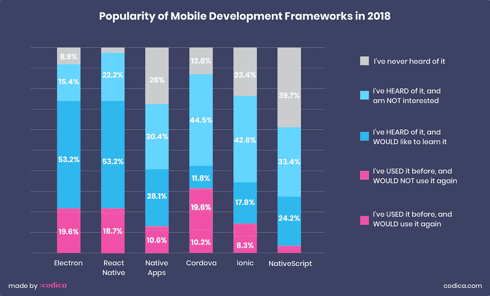*

*此外，这里有一个谷歌趋势图，显示了过去 4 年 React Native 和 NativeScript 的对比表。*

*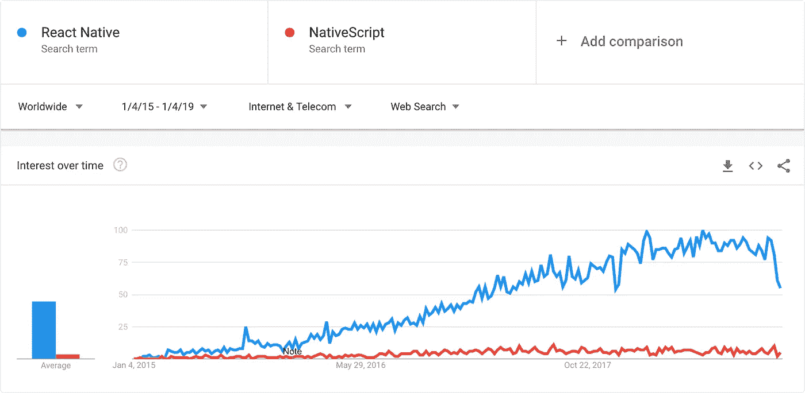*

*Source: [Google Trends](https://trends.google.com/trends/explore?cat=13&date=2015-01-04%202019-01-04&q=React%20Native,NativeScript)*

*总之，React Native 在开发人员社区中更受欢迎，更容易使用，这意味着有更多现成的解决方案可用于移动开发。*

# *组件方法*

*通常，当一个组件有一个文件时，Vue.js 和 ReactJS 在开发中实现相同的组件方法。仍然有一些有趣的不同方面有待发现。*

***做出反应**打乱了既定的最佳实践。几十年来，开发人员试图将模板和嵌入式 Javascript 逻辑分开，但在 JSX，它们再次混合在一起。也许这听起来很全能，但是你应该听听**彼得·亨特的**演讲[“反应:重新思考最佳实践”](https://www.youtube.com/watch?v=x7cQ3mrcKaY)。*

*他指出模式和逻辑的分离仅仅是一个技术部门，而不是一项责任。您必须创建组件而不是模板。组件是可重用的、可集成的，并且便于单元测试。*

*JSX 是一个可选的预处理器，具有类似 HTML 的语法，然后被编译成 JavaScript。因此有些奇怪——例如，您需要使用`className`而不是`class`,因为后者是 JavaScript 中的保留关键字。*

*JSX 对于开发来说是一个很大的优势，因为您将所有的东西都放在同一个地方，并且编译阶段的自动完成和检查将会工作得更快。当您在 JSX 中出错时，ReactJS 不会编译代码，而是显示出错的行号。*

*Vue 提供“单文件组件”。这就像是责任划分的妥协——模板、脚本和样式不在一个文件中，而是在三个不同的有序部分中。这意味着您可以获得语法高亮、CSS 支持以及轻松使用像 Jade 或 SCSS 这样的预处理程序的能力。*

*各种资料表明，JSX 更容易调试，因为 Vue 不会显示 HTML 中的语法错误。事实并非如此，因为 Vue.js 将 HTML 转换为渲染函数，因此显示错误时不会出现问题。*

*让我们熟悉一下 React 和 Vue 中为待办事项列表应用程序创建的同一个组件，看看 ReactJS JSX 和 Vue.js 模板之间的区别。*

***Vue 组件结构:***

```
***<template>
  <div class="ToDoItem">
    <p class="ToDoItem-Text">{{todo.text}}</p>
      <div class="ToDoItem-Delete"
        @click="deleteItem(todo)">-
      </div>
  </div>
</template>***
```

***反应组件结构:***

```
***import React, {Component{ from 'react';
import './ToDoItem.css';

class ToDoItem extends Component {
  render() {
    return {
      <div className="ToDoItem">
        <p className="ToDoItem-Text">{this.props.item}</p>
        <div className="ToDoItem-Delete" onClick={this.props.deleteItem}>-</div>
      </div>
    );
  }
}

export default ToDoItem;***
```

# *表演*

*为了检查 ReactJS 和 Vue.js 的性能，我们求助于一个伟大的 [js-framework-benchmark](https://github.com/krausest/js-framework-benchmark) 来帮助比较这两个框架的性能。*

*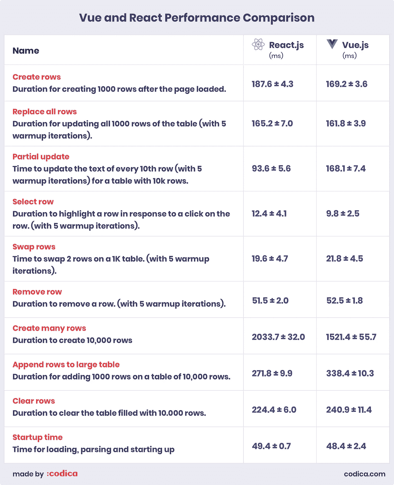*

*总而言之，React 的性能非常出色，但与特别慢或特别快的开发工具(如 [Inferno](https://infernojs.org/) )相比，ReactJS 和 Vue 彼此非常接近。*

# *状态管理*

*一般来说，这两种 web 开发工具在管理组件状态方面有相似的方法，但是在不变性和其他方面仍然有一些不同。让我们全部考虑一下。*

*很难创建 ui，因为状态无处不在——数据会随着时间而变化，这必然会增加复杂性。当应用程序增长并变得更加复杂时，处理状态的某些方式会有很大的帮助。对于小型应用程序，这可能是一种蛮力，像 [Vanilla JS](http://vanilla-js.com/) 就足够了。*

*国家管理是如何运作的？组件描述特定时间点的 UI。当数据改变时，框架重新绘制整个 UI 组件——显示的数据总是相关的。我们可以把这种想法称为“UI 作为一种功能”。*

*换句话说:应用程序状态完全在统一存储内的对象树中。它有助于调试应用程序，并且一些功能变得更容易实现。该状态处于只读模式，只能通过操作来更改，以避免出现争用情况(这对调试也很有用)。创建 Reducers 是为了指示操作如何转换状态。*

## *Redux 和 Vuex*

*一般来说， **React** 在应用程序的某种数据流库中使用。Redux 是最受欢迎的选择。类似的 **Vue** 数据流库叫做 Vuex。事实上，从 Redux 到 Vuex 的转换几乎没有痛苦，因为这两个库比 ReactJS 和 Vue.js 本身有更多的共同点。*

*React 经常与 Redux 成对出现。Redux 用三个基本原则来描述自己:*

*   *真理的唯一来源*
*   *状态为只读*
*   *使用纯函数进行更改*

*主要区别在于 Redux 非常依赖于状态不变性，因为 Redux 是在考虑 ReactJS 的情况下创建的。但是，建议避免改变用作属性或状态的值，以优化 React 性能。*

*在组件的阶段更改中，它开始重新呈现组件的整个子目录，从根权限开始。为了避免子组件不必要的重新运行，如果可能的话，您需要使用`PureComponent`或者实现`shouldComponentUpdate`。您可能还需要使用不可变的数据结构来使状态更改更加优化。*

*相比之下，Vuex 并不关心状态的不变性。*

*在 Vue 中，与组件相关联的依赖关系在渲染期间被自动跟踪，因此当状态改变时，系统确切地知道哪些组件实际上应该被重新显示。*

*这导致 ReactJS 和 Vue.js 组件与存储库交互的方式存在一些差异，我们想告诉您更多关于这方面的信息。*

*Redux 数据流相当严格和简单。该组件调度由动作创建者返回的动作。然后 reducer 根据动作想要它做的事情生成一个新的状态。最后，组件监控来自存储库的存储更改，并可以使用`connect()`函数访问存储。*

*每一个动作都要经过动作创作者。尽管理论上可以直接从一个组件中触发一个动作，但这种情况很少发生。动作的语法提示我们在动作创建者的功能中封装逻辑，即使是在最琐碎的动作中。*

*虽然 Vuex 中的数据流非常相似，但在组件与状态交互的方式数量上没有那么严格。首先，组件可以发送一个动作。这通常用于创建异步文件，比如从源代码中获取数据。*

*之后，动作产生了突变。类似于 reducer，突变函数是唯一允许改变状态的函数。但是，还有另外一种方式:一个组件可以直接做一个突变，有时候减少数据流是非常诱人的，完全丢弃动作。*

***总结一下**，状态管理是 React 和 Vue.js 的主要区别，Vuex 和 Redux 一样，是一个库，它的创建者受到了 Flux 的启发。与 Redux 不同，Vuex 改变状态，而不是像 Redux 归约器那样使其不可变并完全替换它。*

*这允许 Vue 自动检索当状态改变时要重新呈现的警报数据。Vuex 允许您使用称为模块的存储来组织应用程序状态管理，而不是使用专门的 reducers。*

# *React 与 Vue:比较摘要*

***反应过来***

*如前所述，如果您需要构建一个复杂的 web 应用程序，比如电子商务平台、市场等，那么应该选择 React。*

*通过社区卷，未来的维护和定制更加容易，因为你可以看到大量的贡献者和开发者准备构建任何应用程序，因为他们的数量比 Vue 大得多。*

*ReactJS 的另一个原因是大量的库和工具可用于简化和加速开发过程。当现成的解决方案可用时，没有必要从头编写一个函数。*

***Vue***

*另一方面，如果您对创建轻量级且易于修复的应用程序感兴趣，Vue.js 是一个不错的选择。学习曲线较低，允许在短时间内掌握框架并进入应用程序开发。*

*Vue 社区比 React 小，但它正以惊人的速度增长，这使得创建与 ReactJS 相同的解决方案成为可能。随着贡献量的增长，可用的工具和库的数量也在增加。*

*总结所有利弊，我们来看看 Vue.js 和 React 对比表。*

*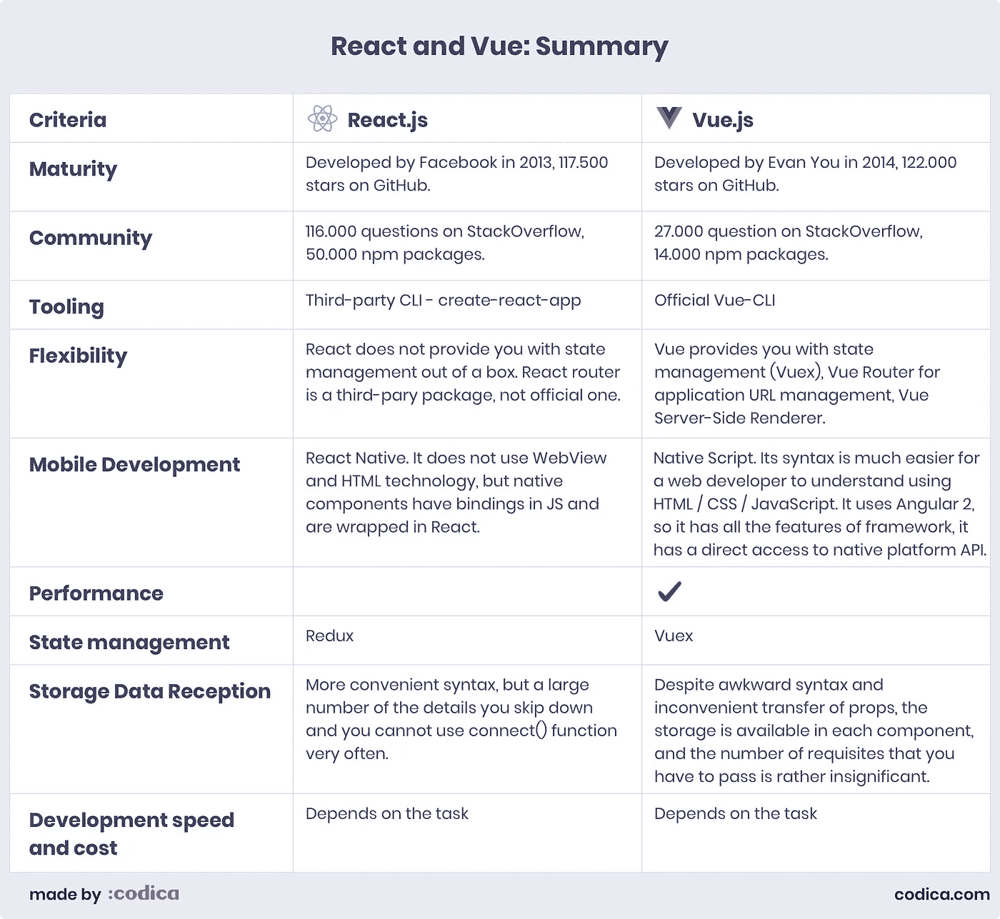*

*正如我们所看到的，Vue 和 React 都有强大的工具和功能来帮助我们进行 web 开发。然而，在选择采用什么时，你需要记住表中列出的差异，以便做出正确的选择。*

# *什么时候选择 React 还是 Vue？*

*这两种 web 开发工具都可以根据任何需要和要求来实现，例如创建 web 应用程序、单页应用程序和用户界面组件。*

*最后，让我们总结一下所有的信息，以及提到的 web 开发工具的优缺点，看看哪一个将是您的企业更好的选择。*

*下面是考虑不同因素选择 ReactJS 或 Vue.js 的对比表:*

*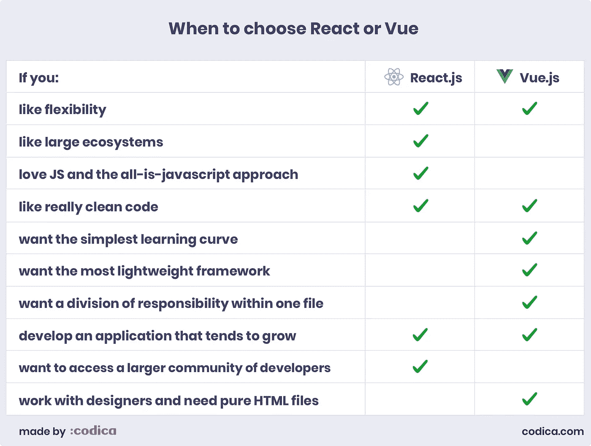*

*总而言之，Vue 和 React 都是创建复杂 web 解决方案的强大工具，因为它们可以为您提供在任何任务中感到舒适的大量可能性。*

*无论你选择什么，你都不会错的！*

**最初发表于*[*【www.codica.com】*](https://www.codica.com/blog/react-vs-vue-2019/)*。**