# 选择合适的聊天机器人开发平台:UX/用户界面视角

> 原文：<https://medium.com/hackernoon/choosing-the-right-platform-for-chatbot-development-ux-ui-perspective-ee44694e37a2>

人工智能和机器学习领域的技术进步为聊天机器人在各种人类活动中创造了新的可能性。

迄今为止，亚马逊 Alexa 和谷歌 Home 设备的销量已超过 1 亿台，达到 5200 万台。根据预测，到 2020 年，销售额可能分别超过 100 亿美元和 75 亿美元。

据[数字营销研究所](https://digitalmarketinginstitute.com/blog/2018-02-25-chatbots-will-80-of-companies-really-be-using-them-by-2020-chatb)称，基于人工智能的聊天机器人在商业中的应用预计将会增加，预计到 2020 年 [80%以上的企业](https://www.businessinsider.com/80-of-businesses-want-chatbots-by-2020-2016-12)会将某种智能的 24/7 虚拟助理集成到他们的营销中。

越来越多的企业将聊天机器人纳入他们的运营，因为聊天机器人变得越来越智能，越来越像人。有了自然语言理解(NLU)和自然语言处理(NLP)等技术，聊天机器人实际上可以与用户进行有意义的对话。

迄今为止，亚马逊 Alexa 和谷歌 Home 设备的销量已超过 1 亿台。根据预测，到 2020 年，销售额可能分别超过 100 亿美元和 75 亿美元。Alexa 和 Assistant 都会越来越了解它们的主人，甚至通过使用语音命令的语气来了解它们的情绪状态。

然而，聊天机器人中 NLP 工具的技术和语义限制还不能实现与用户的高质量交互。用户希望聊天机器人表现得像一个好朋友或顾问，所以结构良好、略带同情心的回答是必须的。这可以通过开发一个引导版本的 bot 以及内置的 NLP 作为自适应用户界面来实现。

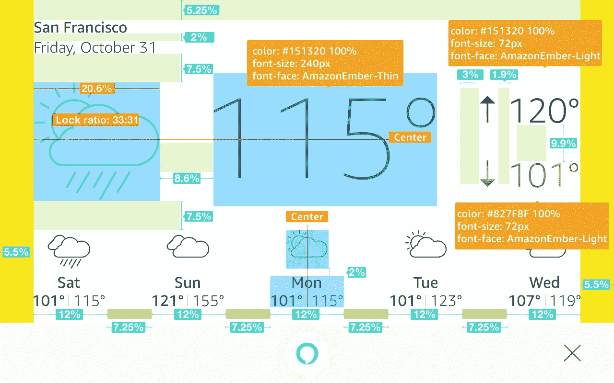

Alexa weather template layout

例如，在为 Alexa 创建聊天机器人用户界面(CUI)时，很明显你应该[定制其显卡](https://developer.amazon.com/docs/alexa-voice-service/display-cards-tablets.html#global-elements)的每个元素。因此，除了 UX 设计师，你的团队中还需要一个 UI 设计师来创建一个有吸引力的用户界面。同时，Alexa API 几乎有无限的机会用聊天机器人引导用户。您可以自定义布局(字体、颜色、按钮、图像)，创建一个真正独特的交互式设计界面。

**在其他平台上，选项的数量减少了。我们的团队调查了 Messenger、Telegram、Skype、Slack 和 Google Assistant 平台的 UX/用户界面功能，并制作了一个比较表:**

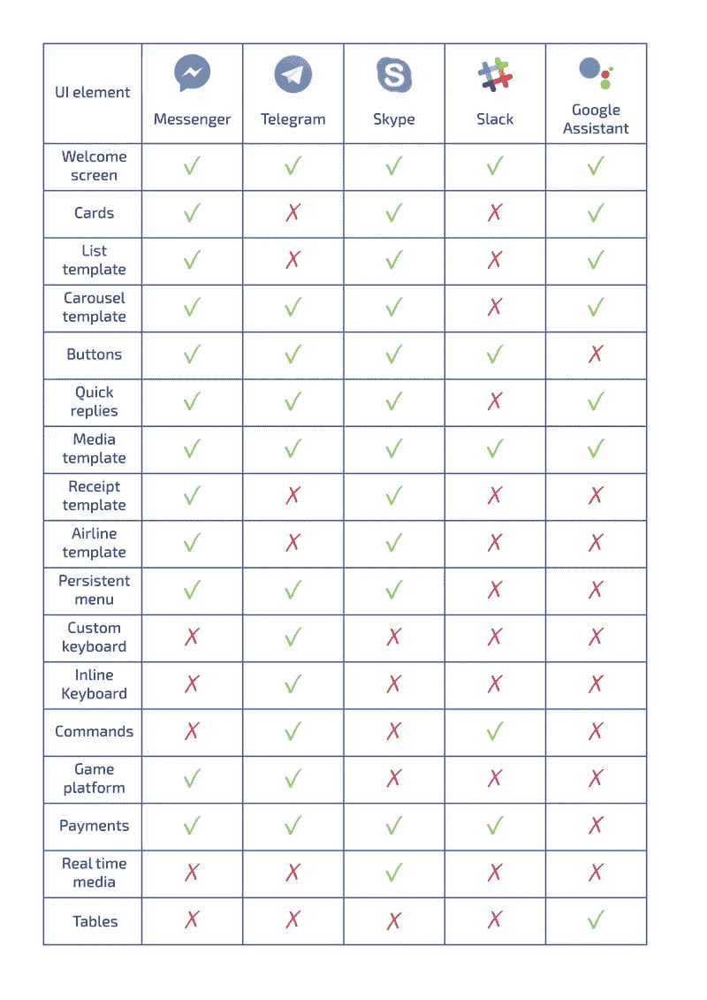

下面是最有趣的 UI 元素的对比概述。几乎在所有平台中，最常见的元素是丰富的图形卡。它们以图像、文本和按钮的形式提供信息，通过允许用户与机器人交互而无需打字，丰富了聊天机器人 UX。

# **1。富人卡**

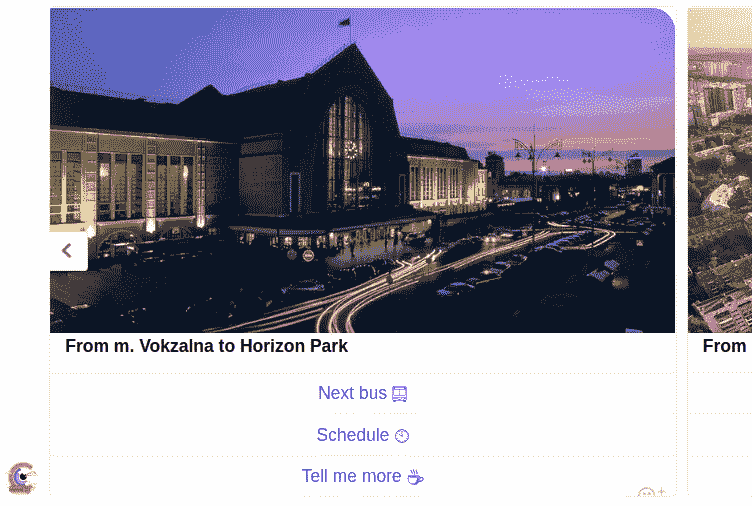

Facebook carousel of generic templates

脸书信使调用了一个**[**通用模板**](https://developers.facebook.com/docs/messenger-platform/send-messages/template/generic)**。这是一个简单的结构化消息，包括标题、副标题([均限制为 80 个字符](https://developers.facebook.com/docs/messenger-platform/reference/template/generic))、图像([纵横比 1.91:1](https://www.facebook.com/business/ads-guide/image/messenger-home/messages) )和最多 3 个按钮([每个按钮的标题](https://developers.facebook.com/docs/messenger-platform/send-messages/buttons)限制为 20 个字符)。在 messenger 中，当您的内容有优先顺序时，您可以使用轮播(包括多达 10 个通用模板)。****

****“ [**列表模板**](https://developers.facebook.com/docs/messenger-platform/send-messages/template/list#carousel) ”是一个由 2-4 个结构化项目组成的列表，底部有一个可选的全局按钮。每个项目都可以包含一个缩略图(正方形比例为 1:1)、标题、副标题和一个按钮。****

******"** [**收据模板**](https://developers.facebook.com/docs/messenger-platform/send-messages/template/receipt) **"** 允许您以结构化消息的形式发送订单确认。它通常包含要包含在收据上的项目列表、订单摘要、付款详细信息、税收、运输信息和其他文本。****

*****Messenger* 中的**[**媒体模板**](https://developers.facebook.com/docs/messenger-platform/send-messages/template/media)**允许您通过可选按钮将图像、gif 和视频作为结构化消息发送。********

********"** [**航空公司模板**](https://developers.facebook.com/docs/messenger-platform/send-messages/template/airline) **"** 专门支持航空公司用例，包括登机牌、航班更新、行程和登机提醒。这些模板专门设计用于为航空公司客户提供直观、信息丰富的结构化信息，并以熟悉的格式显示。******

****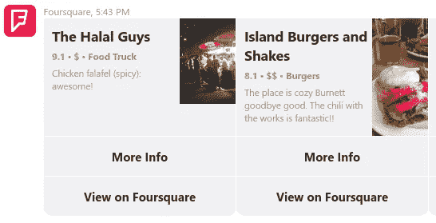****

****[Foursquare](https://join.skype.com/bot/a74972d2-78cc-4e9e-b1ef-abb50bc4d40d?add) bot in Skype****

****与 Messenger 的“通用模板”类似，Skype 有一个 **"** [**英雄卡**](https://docs.microsoft.com/en-us/microsoftteams/platform/concepts/cards/cards-reference#hero-card) **"** ，它包含以下[属性](https://docs.microsoft.com/en-us/microsoftteams/platform/concepts/cards/cards-reference#hero-card):一个标题、一个副标题(两者最多两行)、格式丰富的文本([出现在副标题](https://docs.microsoft.com/en-us/microsoftteams/platform/concepts/cards/cards-format)的正下方)、单个图像(纵横比 16:9)、最多 6 个可选按钮和一个“点击动作”(当用户在卡上点击时触发的动作)。****

****Skype 还支持多达 6 张同类型卡片的[转盘](https://docs.microsoft.com/en-us/microsoftteams/platform/concepts/cards/cards-reference#carousel-collection)和一个[列表布局](https://docs.microsoft.com/en-us/microsoftteams/platform/concepts/cards/cards-reference#list-card)，这是一个垂直的卡片列表。****

****在 *Skype* 中还有各种其他类型的卡:****

*   ****[**适配卡**](https://docs.microsoft.com/en-us/microsoftteams/platform/concepts/cards/cards-reference#adaptive-card) **—** 可以包含文本、语音、图像、按钮和输入字段的任意组合。这些可以让你一次创作一张卡片，并在多个应用程序中，如微软团队或在你自己的网站上漂亮地渲染它。****
*   ****[**缩略图卡**](https://docs.microsoft.com/en-us/microsoftteams/platform/concepts/cards/cards-reference#thumbnail-card) —通常包含一个缩略图、一个或多个按钮和文本。英雄卡和缩略图卡的区别仅在于图像和卡片的大小。****
*   ****[**签到卡**](https://docs.microsoft.com/en-us/microsoftteams/platform/concepts/cards/cards-reference#signin-card) —允许机器人请求用户签到。****
*   ****[**收条卡**](https://docs.microsoft.com/en-us/microsoftteams/platform/concepts/cards/cards-reference#receipt-card) —使机器人能够向用户提供收条。****
*   ****[**动画卡**](https://docs.microsoft.com/en-us/microsoftteams/platform/concepts/cards/cards-reference#animation-card) —可以播放动画 gif 或短视频。****
*   ****[**显卡**](https://docs.microsoft.com/en-us/microsoftteams/platform/concepts/cards/cards-reference#video-card) —可以播放视频。****
*   ****[**声卡**](https://docs.microsoft.com/en-us/microsoftteams/platform/concepts/cards/cards-reference#audio-card) —可以播放一个音频文件。****

****Telegram 和 Slack 中的卡没有必填字段。可以使用元素的任何组合。****

****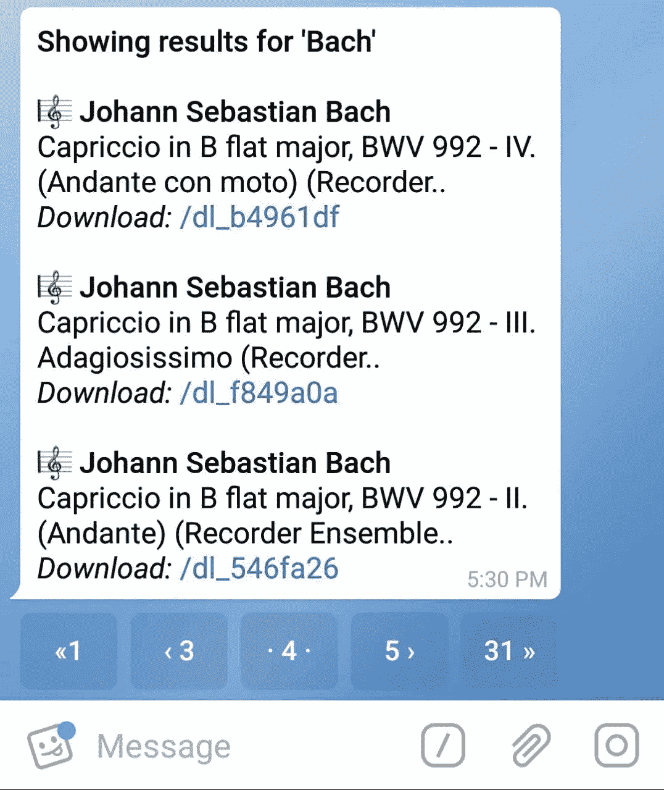****

****An inline keyboard in telegram bot @music****

****在 Telegram 中，可以通过使用直接集成到其所属消息中的**[**内嵌键盘**](https://core.telegram.org/bots#inline-keyboards-and-on-the-fly-updating)**来获得类似于 Messenger 和 Skype 的可滚动卡片的功能。按下嵌入式键盘上的按钮不会导致消息发送到聊天，但会即时更新或操作现有的消息。这可以替代传送带，因为无限数量的文本消息可以链接到特定的内嵌按钮。********

******Telegram 支持四种附件:照片、视频、文档(gif、docs)和位置。一旦用户开始查看聊天内容，照片就会自动下载，而视频和文档的下载则通过点击内容来启动(这种行为可以由用户在设置部分进行更改)。******

******在 Slack 中，我们无法找到一种方法来创建类似于转盘或列表的东西，因为它的功能与其他平台不同。我们只能尝试使用[交互消息](https://api.slack.com/interactive-messages)，它包含按钮、各种菜单类型，或者它们有一些可用的自定义动作。******

******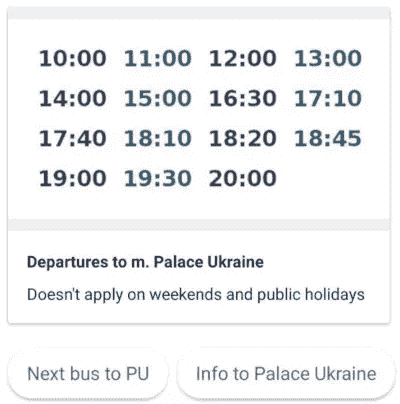******

******Google Assistant entity card and chips******

******在 Google Assistant 中，我们可以使用[基本卡片](https://developers.google.com/actions/assistant/responses#basic_card)(也称为实体卡片)来显示图像(强制为 192 dp 高)、标题、副标题(两者最多一行，多余的字符被截断)和文本(有图像的限制为 10 行，无图像的限制为 15 行)。这大约是 500(带图像)或 750(不带图像)个字符。卡片设计简洁，向用户展示关键信息，并允许用户通过网络按钮了解更多信息。******

******由于助手没有按钮模板，您可以在卡片下方添加多达 8 个[建议筹码](https://developers.google.com/actions/assistant/responses#suggestion_chip)，以继续或改变对话(见上图)。此外，您可以在“助手”中自定卡片的原色和背景色，以代表您的品牌。******

******如果你想让用户从选择列表中挑选更大的图片，你可以使用[传送带](https://developers.google.com/actions/assistant/responses#carousel)，它的[限制为 8 个项目](https://developers.google.com/actions/assistant/responses#ui_checklist)。当各种选项呈现给用户时，旋转式传送带是很好的选择，但不需要在它们之间进行直接比较(相对于[列表](https://developers.google.com/actions/assistant/responses#list))。一般来说，列表比传送带更受欢迎，因为它们更容易进行视觉扫描和语音交互。******

****Google Assistant 中的[媒体响应](https://developers.google.com/actions/assistant/responses#media_responses)用于播放和控制音乐、新闻或播客等音频内容的回放。有两个图像选项:右边的小正方形缩略图，**或**顶部的大图像(跨越卡片的整个宽度)。媒体响应用于提供音轨的可见性，例如名称、长度、可选的关联图像和播放/暂停控制。这张卡用于向用户呈现一段音频。****

# ****2.**快速回复******

****在 Messenger 中，[快速回复](https://developers.facebook.com/docs/messenger-platform/send-messages/quick-replies)提供了一种在对话中呈现一组多达 11 个按钮的方式，这些按钮可以包含标题和可选图像或仅包含文本，并突出显示在编写器上方。您也可以使用快速回复来请求位置、电子邮件地址和电话号码。****

****当快速回复被点击时，按钮被关闭，被点击的按钮的标题作为消息发布到对话中。****

********

****Facebook Quick Replies****

****在 Skype 中，快速回复对应于[建议的操作](https://docs.microsoft.com/en-us/azure/bot-service/dotnet/bot-builder-dotnet-add-suggested-actions?view=azure-bot-service-3.0)。建议的操作出现在作者附近，并通过使用户能够回答问题或通过简单地点击按钮进行选择来增强用户体验，而不必用键盘键入响应。与出现在丰富卡片中的按钮(即使被点击后，用户仍可看到和访问)不同，出现在建议的操作窗格中的按钮将在用户做出选择后消失。这可以防止用户在对话中点击陈旧的按钮，并简化机器人开发(因为您不需要考虑这种情况)。****

****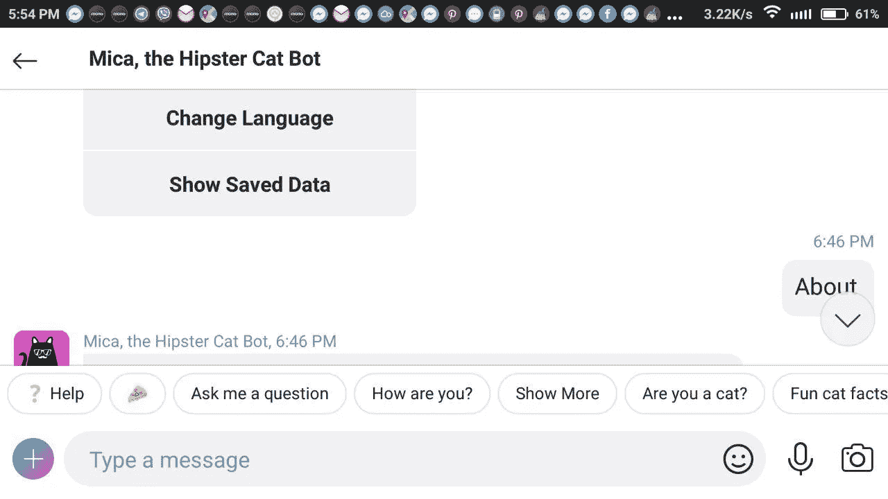****

****Skype suggested actions****

****在谷歌助手中，快速回复被称为“[芯片](https://developers.google.com/actions/assistant/responses#suggestion_chips)”。芯片帮助用户 1)提炼主题，2)发现相关主题、后续步骤和支点，3)采取行动。有时，对用户来说，点击芯片比说出或键入他们的回答更快更容易。当用户点击一个芯片时，该文本作为用户的回应成为对话的一部分。****

****筹码只能在有屏幕输出的设备上显示。出现的筹码数量取决于它们出现的屏幕大小，剩余的筹码滚动到屏幕之外(每回合的最大筹码数量为 8)。****

****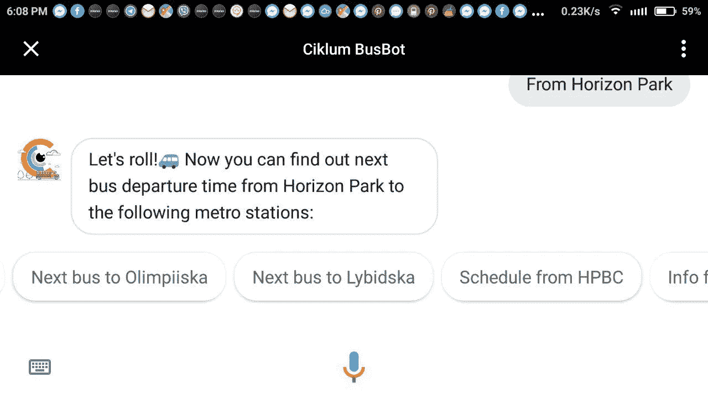****

****Google Assistant****

****快速文本回复也可以与可选图像一起发送，该图像显示为标题旁边的图标。****

****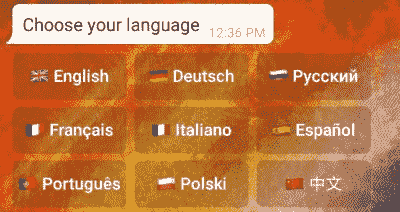****

****Keyboard buttons in Telegram****

****一键电报集成中的快速回复对应[键盘(回拨)按钮](https://core.telegram.org/bots/2-0-intro#callback-buttons)。当用户单击其中一个按钮时，这些按钮就会消失，机器人只会接收相关的查询。这可以防止用户在对话中单击附加到旧邮件的按钮。收到查询后，机器人可以在聊天屏幕顶部的通知或警报中显示结果。****

# ****3.**命令******

****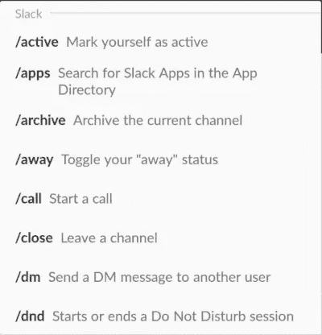****

****Slack commands****

****我们还想提请注意集成斜杠命令的可能性，这提供了一种更灵活的方式来与您的机器人通信。该功能仅在[电报](https://core.telegram.org/bots#commands)和[松弛](https://api.slack.com/slash-commands)中可用。以斜杠(/)开头的消息是命令，其行为与常规消息不同。命令通常会触发一个动作(比如发布一个 gif，开始一个视频会议，在你的待办事项列表中添加一些新的东西，或者做一些你已经硬编码的自定义事情)。****

****当有人键入斜杠命令时，消息(及其数据)将通过 HTTP POST 请求发送到配置的外部 URL。由开发人员决定如何处理消息数据，并在需要时做出响应。****

# ****4.**定制键盘******

********

****Telegram custom keyboard @jobs_bot****

****Telegram Bot API 中最牛逼的东西之一就是他们的[自定义键盘](https://core.telegram.org/bots#keyboards)。每当你的机器人发送信息，它可以通过一个特殊的键盘与预定义的回复选项。收到信息的电报应用程序会向用户显示你的键盘。轻按任何按钮都会立即发送相应的命令。通过这种方式，您可以极大地简化用户与您的机器人的交互。Telegram 目前支持自定义按钮的文本和表情符号。****

****事实上，我们可以容纳电报自定义键盘，以便将其用作 Messenger 中的持久菜单。让我们考虑一下它会是什么样子。****

# ****5.**持久菜单******

****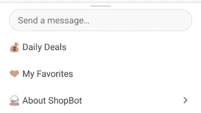****

****Messenger persistent menu****

****可以为 Facebook Messenger 机器人设置[持久菜单](https://developers.facebook.com/docs/messenger-platform/reference/messenger-profile-api/persistent-menu/#requirements)，以帮助人们在整个对话过程中发现并更容易地访问您的功能。用户始终可以使用持久菜单。该菜单包含用户可以随时执行的顶级操作。拥有一个持久的菜单可以很容易地向新用户和老用户传达你的机器人的基本功能。如果用户离开一段时间后返回，菜单将自动出现在线程中。****

# ******结论******

****随着 2019 年各种消息平台的出现，为你的机器人选择最佳平台可能不是一件容易的事情。毕竟，这完全取决于你的业务、产品或服务策略和目标受众的具体情况，以及信息平台的功能、界面和能力。问问你自己，“人类会更好、更快、更充分地处理这个问题吗？”如果答案是肯定的，那就没必要用这样的 bot 了。****

****对聊天机器人开发项目感兴趣？看看我们描述我们的团队如何构建了一个[公交车时刻表聊天机器人](https://www.ciklum.com/blog/ciklum-rd-team-builds-a-bus-schedule-chatbot-for-kyiv-office/)并推出了一个[工作机器人来简化招聘流程](https://www.ciklum.com/blog/ciklum-rd-launches-jobbot-to-simplify-recruitment-process/)的文章。****

*****Ivan Kotiuchyi，Ciklum NLP/聊天机器人团队的 Valentyn Vaityshyn 和聊天机器人专家 Oleh Bodilowsky。*****