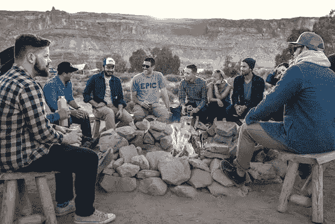
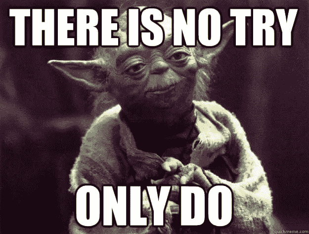

# 选择成功

> 原文：<https://medium.com/hackernoon/choosing-to-be-successful-716009536e1e>

创建一家新公司很难。通常，更重要的是你的心理游戏——你的勇气、你的毅力和你的选择会带来长期的成功。

史蒂夫·乔布斯[的名言:](https://www.youtube.com/watch?v=UF8uR6Z6KLc)

> "……**你身边的一切**你你**称之为**生活**的一切都是由比你**聪明不了多少的人**编造出来的……"**

我要补充的是，他们可能从你开始的地方开始:忙于一份日常工作，组建一个年轻的家庭，手头拮据，时间紧迫。

唯一的区别？

他们做出了明智的选择。

他们有意识地选择他们想从生活中得到什么。以及如何实现他们的个人使命。

Photo by [Caleb Frith](https://unsplash.com/photos/fGeB7hQ4wS8?utm_source=unsplash&utm_medium=referral&utm_content=creditCopyText) on [Unsplash](https://unsplash.com/?utm_source=unsplash&utm_medium=referral&utm_content=creditCopyText)

这反过来又决定了他们读什么，看什么，和什么人交往，以及他们用时间做什么。

# **你读过的书**

**我试着尽可能多、尽可能广泛地阅读。阅读你感兴趣的非小说主题的开创性著作很重要(例如[精益创业](https://www.amazon.com/Lean-Startup-Entrepreneurs-Continuous-Innovation-ebook/dp/B004J4XGN6/ref=sr_1_1?keywords=the+lean+startup&qid=1553771520&s=gateway&sr=8-1)、>亚马逊上的 2720 篇评论)，但也要阅读可能引起你共鸣的晦涩书籍(个人最喜欢的是 [Not Fade Away](https://www.amazon.com/Not-Fade-Away-Short-Lived/dp/006073731X/ref=sr_1_1?keywords=not+fade+away&qid=1553812702&s=gateway&sr=8-1) ，它在亚马逊上有< 70 篇评论)**

**一些帮助你挑选好读物的建议:**

*   **读几年前出版的书，它们已经存在更长时间了，所以评论很多。这个用亚马逊。经典的更好。我最近开始阅读奥斯卡·王尔德的《道林·格雷的画像》。这本书已经有 100 多年的历史了，写得很漂亮，绝对有永恒的教训**
*   ****不要打折小说**。生活中一些最伟大的教训是伪装的故事(我个人评价是《炼金术士》)。引人深思:*圣经是虚构的吗*？**
*   ****计划你的阅读+保留一份清单**。这样，你就可以平衡不同兴趣的阅读组合。每年年初，我都会为这一年创建一个涵盖广泛主题的书单。一年中，我会从不同的类别中挑选书籍来搭配。这让我们有意识地控制我每年想学的东西。**
*   **偶尔，**读一些不在你通常阅读范围内的东西**——一个朋友最近向我推荐了[爱情的五种语言](https://www.amazon.com/Love-Languages-Secret-that-Lasts-ebook/dp/B00OICLVBI/ref=sr_1_1?keywords=the+five+language+of+love&qid=1553773510&s=gateway&sr=8-1)，我认为这很有趣，与我的日常阅读习惯不同。所以，在你的书单中为意外发现留些空间吧**

**‍ **慎重选择你想输入的东西****

****

**Photo by [Janko Ferlič](https://unsplash.com/photos/sfL_QOnmy00?utm_source=unsplash&utm_medium=referral&utm_content=creditCopyText) on [Unsplash](https://unsplash.com/search/photos/friends?utm_source=unsplash&utm_medium=referral&utm_content=creditCopyText)**

# **‍People 你知道吗**

> ***“你是和你相处时间最长的五个人的平均值”***
> 
> ***—吉米·罗恩***

**创业很难。在与外界隔绝了一年之后，我建立了我们的第一家创业公司，在与墨尔本创业社区接触之后，我注意到了一个真正的不同。**

**我加入了一个合作空间，和其他创始人交了朋友，知道还有人和我一样，我变得更开心了——奋斗、战斗，但每天都在忙碌。**

**随着时间的推移，我的友谊和商业联系的界限变得模糊了。创始人成了朋友。朋友创业。**

**因此，你潜在的商业和合作伙伴增加了，人们自然会认为你是可以寻求创业建议的人——工作中的[吸引力法则](https://www.amazon.com/Law-Attraction-Esther-Hicks-ebook/dp/B009NLO7G0/ref=sr_1_2?keywords=law+of+attraction&qid=1553834384&s=gateway&sr=8-2)。**

**如果我明天出发，我会去以下几个地方寻找我的部落:**

*   **聚会——在你的城市里结识志同道合者的好方法。很多创始人用这个来寻找共同创始人**
*   **[脸书集团](http://www.facebook.com/groups)——我个人认为这是在网上与志同道合的人联系的最好地方。并建立了良好的关系**
*   **请你的朋友推荐——这是我的首选方法，因为已经有了社交证明，尤其是对那些已经建立了工作声誉的人。我很幸运能以这种方式遇到以前的商业伙伴。**
*   **联合工作空间——其他成功的创业公司出没的地方:试试 Coworker.com‍，或者谷歌“联合工作空间[你的城市]”**

****慎重选择你要联系的人****

****

**Photo by [Phil Coffman](https://unsplash.com/photos/anV_zgNDZhc?utm_source=unsplash&utm_medium=referral&utm_content=creditCopyText) on [Unsplash](https://unsplash.com/search/photos/friends?utm_source=unsplash&utm_medium=referral&utm_content=creditCopyText)**

# **你用的词**

**因为文字对我们的精神和情感有很强的内涵，你如何看待自己和你的个人使命是至关重要的。**

**我发现在自我对话和对他人说话时保持坚定是很有用的。**

**考虑潜力，而不是局限。**

****坚定你的信念。心态要开放。坚定你的信念。****

> **“当你想要某样东西时，整个宇宙都会帮你实现它。”——保罗·柯艾略**

**所以与其说:**

**我明天会回复你➡️我明天会回复你**

**我想是的，➡️，是的**

**我不知道➡️ I **会不会**回复你**

**当谈到积极的肯定。大脑无法区分你做过的和你想做的。**

**所以，想象一下你的生活将会是什么样子，把最终目标记在心里，你会很自然地融入这个新的生活。一些日常口头禅的例子:**

*   **我经营的企业影响着数百万人的生活**
*   **我来到地球上是为了服务他人**
*   **我所做的对世界有积极的影响**

**谨慎选择你要用的词，并且坚持到底。**

****

***原载于*[*www.iamjz.com*](https://www.iamjz.com/blog/choosing-to-be-successful)*。***