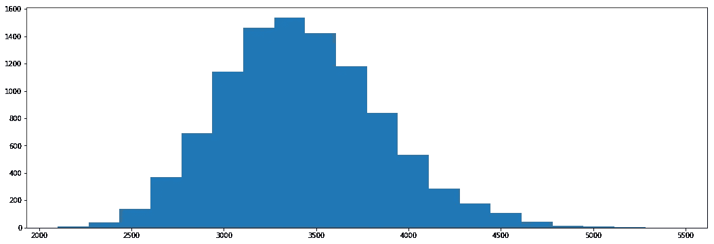
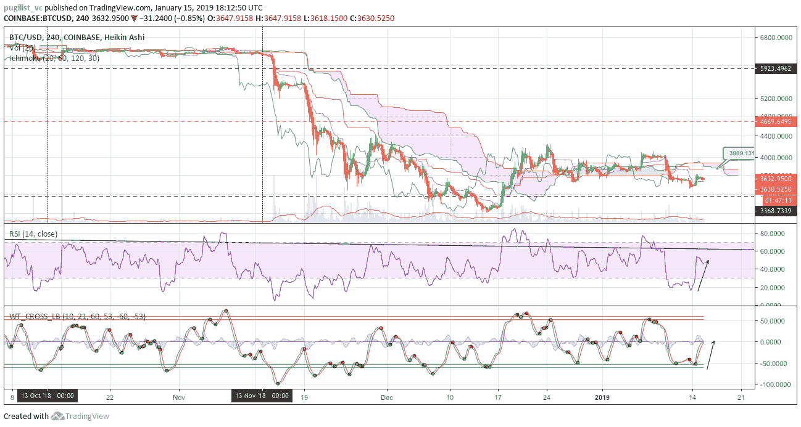
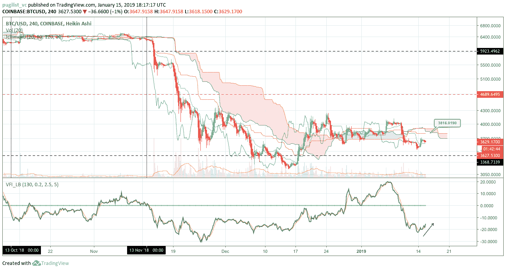
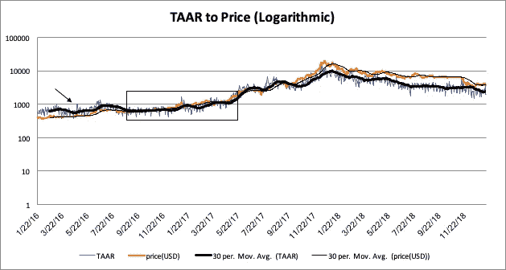
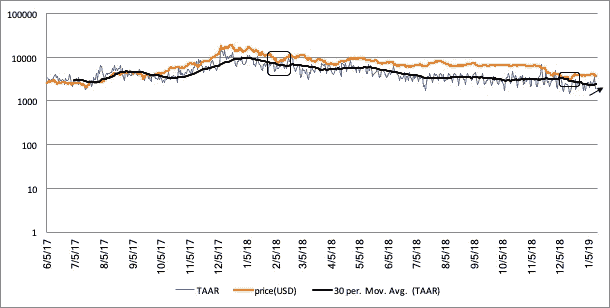
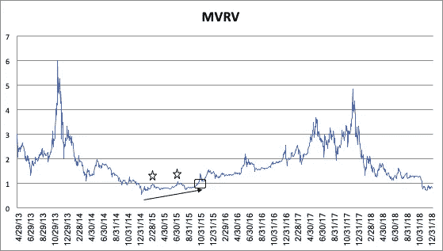

# 比特币简报:2019 年 1 月 14 日这一周

> 原文：<https://medium.com/hackernoon/chris-brookins-weekly-bitcoin-brief-e442c1bcbbd9>

# 接下来的 7 天

这个市场变化非常快，所以大部分预测努力都是徒劳的。然而，[我们](http://pugilistvc.com)仍然可以通过使用非参数统计和概率来利用更短的区间预测模型。这些方法旨在充当在黑暗的道路上行驶的“前灯”，也就是说，你无法看到一切，但你可以看到足够让你安全上路的东西。

## 2019 年 1 月 21 日—模拟靶场

未来 7 天的模拟价格范围如下:

*   **80%置信区间**:2887.40 美元和 3984.99 美元
*   **90%置信区间**:2752.62 美元和 4175.87 美元

*data from Coinbase Pro

## 2019 年 1 月 21 日—向上或向下二元分类预测

我们的 7 天模型表明，在 70.21%的概率下，BTC 美元的价格将在未来 7 天内上涨，即 BTC 美元的价格在 2019 年 1 月 21 日结束时将高于 2019 年 1 月 14 日。

## 技术分析

我们不会做出具体的价格预测，而是强调关键阻力和支撑位，它们可能会成为交易带或催化剂。在 4 小时图上， [RSI](https://en.wikipedia.org/wiki/Relative_strength_index) 和 [SWTO](/@coinloop/trading-with-the-wave-trend-oscilator-53ddc85293bf) 都呈上升趋势，这对未来一周的价格是积极的。

*tradingview.com

然而，使用缓慢的[市云](https://www.investopedia.com/terms/i/ichimoku-cloud.asp)设置(20/60/120/30)，寇森 A 和 Kijun 都可能在 3800 美元左右提供强大的阻力，而没有购买量的显著增加，即 [VFI](https://www.tradingview.com/script/MhlDpfdS-Volume-Flow-Indicator-LazyBear/) 高于 0。当前支撑位在 3600 美元左右，关键支撑位在 3500 美元左右。

*tradingview.com

# 长期指标

以下术语和意义的完整描述可在作者发表它们的原始 CoinDesk 文章中的[这里](https://www.coindesk.com/the-case-for-a-2020-bitcoin-bull-run)找到。

## 活动地址的网络交易(TAAR)

目前的 TAAR 价值是 2290 美元，并正在形成一个轻微的上升趋势。最终，价格回归 TAAR，并应在“均衡”中紧密分布(黑盒——从 2016 年至 2017 年)，因此密切关注这一指标将是 Q1 的关键。

*data from coinmetrics.io

一个可能的“底部”将是当价格跌至 TAAR 下方时(价格在 2018 年两次从 TAAR 反弹{黑盒})，在紧张的分布中稳定下来，并且两者都开始持续上升。

*data from coinmetrics.io

在接下来的几周里，我们将会看到 TAAR 是开始稳定，继续上升，还是再次下降。对于霍德勒来说，更好的结果是价格稳定(稳定)，TAAR 逐渐上升并达到这个水平。

## 市场价值(cap)对实现价值(MVRV)

目前的 MVRV 指标为 0.79，已经适度稳定。历史低点是 2015 年 1 月 15 日的 0.56。从那里开始，MVRV 持续趋势向上，两次试图突破 1.0(星星)，最终在 2015 年 10 月 25 日成功(黑色方块)；开始新一轮牛市。目前，MVRV 从 0.69 的前期低点的上升似乎是从超卖状态的反弹，这可能无法突破 1.0，并在 Q1 股市走低。

*data from coinmetrics.io

未来几周将揭示 MVRV 是否像其前身在 2015 年那样，似乎正在形成向 1.0 上升的新趋势。持续的上涨趋势可能会限制比特币价格的进一步下跌，并为 2019 年第四季度末(11 月至 12 月)预期的新一轮牛市启动“做好准备”。

*免责声明:本文仅用于教育目的，不应被视为投资或交易建议。*