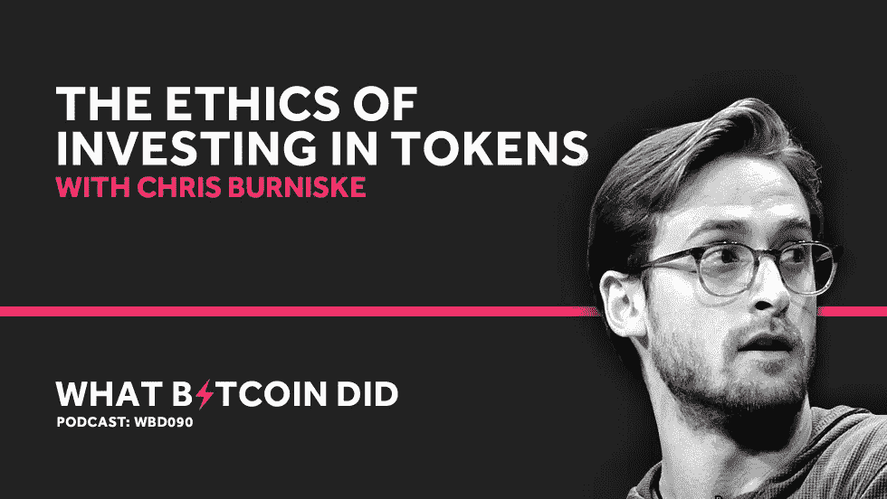

# 克里斯·伯恩斯克谈代币投资的伦理

> 原文：<https://medium.com/hackernoon/chris-burniske-on-the-ethics-of-investing-in-tokens-af824a91287e>

音频采访转录— WBD090

***注:*** *以下是我对 Placeholder 合伙人克里斯·伯恩斯克(Chris Burniske)的采访转录。我已经检查了转录，但如果您发现任何错误，请随时发送* [*邮件给我*](http://hello@whatbitcoindid.com) *。可以* [*在这里*](https://www.whatbitcoindid.com/podcast/chris-burniske-on-the-ethics-of-investing-in-tokens) *听原声录音。*

*你可以在这里订阅播客* [*听所有剧集*](https://www.whatbitcoindid.com/podcast/) *。*

在这一集里，我将与 Placeholder 的合伙人、《加密资产》的作者克里斯·伯恩斯克进行对话。我们讨论了为什么克里斯相信代币市场，道德价值提取，股权交易的演变和来自最大化主义者的压力。

联系比特币做了什么:
听:[**iTunes**](https://itunes.apple.com/gb/podcast/what-bitcoin-did-podcast-bitcoin-crypto-trading-strategy/id1317356120?mt=2)|[**Spotify**](https://open.spotify.com/show/0mWUJuONiilW5JSBBFZ0s7?si=5qcbjpjYSRyKpi8wycEZUw)|[**Stitcher**](https://www.stitcher.com/podcast/what-bitcoin-did)|[**SoundCloud**|](https://soundcloud.com/what-bitcoin-did)[**YouTube**](https://www.youtube.com/whatbitcoindid)|[**TuneIn**](https://tunein.com/radio/What-Bitcoin-Did-p1079869/)关注: [**网站**](https://www.whatbitcoindid.com/)

# **采访记录**

**面试日期:2019 年 3 月 25 日星期一**

> **“如果我们试图让比特币成为主流，这意味着绝大多数用户不会了解比特币的优点，他们不会在乎，如果他们觉得有一群尖叫的暴徒在问他们为什么要使用这种资产，他们实际上会被拒之门外。”**
> 
> **—克里斯·伯尼斯克**

**彼得·麦科马克: 所以我们正在进行的采访也非常及时，因为我们通过电子邮件聊了一会儿。已经过了很长时间了，我显然读过你的书。我已经读了三遍了。我把它带来了。想知道我们将要谈论什么，你的第一点是你看好比特币。我在 Twitter 上呆了整整三个星期，我不知道你看了多少，但我已经被最大化主义者激怒了！**

**[**克里斯·伯尼斯克:**](https://twitter.com/cburniske/) 啊哈。几乎每个人都会遇到这种情况。**

**[**彼得·麦科马克:**](https://twitter.com/PeterMcCormack) 是的。我的问题是我非常注重防守，我觉得我需要防守每一分，但我正在学着不去做，真的，我应该保持沉默，休息一下。所以我现在要休息一会儿，但我在同情和几乎完全同意马克思主义者之间切换，但之后又有了另一种好奇心。由于本周发生的事情，如果人们知道我在采访你，他们就会知道你的书，你的书将被视为比特币威胁模型的一部分。你必须意识到这一点。你已经有很多…**

**[**克里斯·伯尼斯克:**](https://twitter.com/cburniske/) 我已经多次处于马克思主义者的愤怒之中。你在推特上看到过。**

**[**彼得·麦科马克:**](https://twitter.com/PeterMcCormack) 我看过。因此，我将以健康的怀疑态度来对待这个问题…**

**[**克里斯·伯尼斯克:**](https://twitter.com/cburniske/) 如你所愿！**

**[**彼得·麦科马克:**](https://twitter.com/PeterMcCormack) 正如我应该的，还有好奇心。我认为，首先只是为了设置场景，如果你能解释谁是占位者，你投资了什么，你的投资策略是什么，那就太好了，然后我们可以从那里开始。**

**[**克里斯·伯尼斯克:**](https://twitter.com/cburniske/) 确定。我确实想回到比特币上来，希望能理清比特币为何不是最大化主义者的同义词。有许多支持比特币并相信比特币的社区，Placeholder 肯定是其中之一。关于占位符，2017 年上半年，我、乔尔·蒙内格罗和布拉德·伯纳姆筹集了 1.5 亿美元的风险基金。当时，对冲基金占主导地位，但我们选择了一种风险基金模式，资本承诺期限超过 10 年。所以不存在赎回，我们也不会受到市场对我们必须配置的资本数量的影响。**

**因此，它真正创造了这个资本茧，我们可以专注于支持我们的投资组合团队，具有真正的长期视野。因此，10 年期基金实际上是我们正在考虑的时间尺度。我们筹集资金的重点是信息技术中的价值增长，从硬件到软件到数据再到治理，如果你愿意，我们可以回到这个话题。这一论点仍然存在，我们继续层的东西。很早就开始关注开发者了。从 2018 年初开始，这种关注开始在分散的金融社区中开花结果。**

**真正意识到这一点，金融服务往往是新技术的最早采用者之一。区块链是天生的金融技术，因为它们降低了资产创建、托管和转移的成本，我们必须确定这些用例，比如说在金融垂直行业中，以真正开放更多的技术垂直行业。这就是我们投资 0x 或 Maker Dao 以及最近宣布的 Erasure 的地方。**

**我们所有的投资都在我们的网站 placeholder.vc 上。所以从顶部开始读，应该是 0x，Aragon，比特币，内容交付网络 CacheCash，Decred，Erasure，Filecoin，FOAM，Maker Dao，最近有一些围绕它的开源币，这是一个分散的 GitHub，UMA universal market access 和金融合同。然后是齐柏林飞船。**

**[**彼得·麦科马克:**](https://twitter.com/PeterMcCormack) 好的。显然，这本书是你写的。两三年前是什么时候？**

**[**克里斯·伯恩斯克:**](https://twitter.com/cburniske/)2016 年底开始写，2017 年 9 月出版。**

**彼得·麦考马克: 所以这是我在这一领域读到的第一篇文章，也是我第一次相信这里面的一切都是真实的。其中一些超出了我的理解，但这是一个非常好的密码世界的介绍。我现在不再是一个秘密投资者了。我持有比特币和 Monero。我对其他地方很好奇，但也有很多怀疑。但是你几乎把自己放在舞台上制作这本书，它受到了高度赞扬，但也受到了高度批评。所以从你开始的时候算起，我们已经有两到三年了。现在怎么反思这本书？**

**[**克里斯·伯恩斯克:**](https://twitter.com/cburniske/) 我认为回到我们写这本书的那个时期很重要，因为我在 2016 年共识上遇到了我的合著者杰克。几个月前，我和比特币基地一起发表了一份名为《比特币:敲响新资产类别的钟声》的白皮书，总的来说，这是最大化主义者喜欢的。**

**但我写那篇论文的真正目的是论证比特币极其重要，如果你不关注比特币，你就会错失良机。但比特币也是未来的早期迹象。这在金融界和技术界引起了强烈反响。当我遇到杰克时，我是随机遇到他的，在共识餐厅吃午饭时，他坐在我旁边，我们在聊天。他曾经是一名作家，现在是不同新闻媒体的撰稿人。他向我提出了写一本书的想法，起初我认为这是一个笑话，后来它实际上开始实现并成为现实。**

**在那个时候，你会说关于比特币的书。当我在这个领域漫游时，我最喜欢读的一本书是佩德罗·弗朗哥的《理解比特币》。无伤大雅的标题，但非常深入的经济学和密码学，当然还有安德烈亚斯的书。但是你有技术方面的书，或者历史方面的书，比如数字黄金。但当时我们没有一本涵盖整个资产类别的书说，“嘿，比特币是同类产品中的第一个，但它们将会更多，什么是处理这里正在发生的事情的潜在框架？”**

**因此，这实际上是一种尝试，让我们超越将这种新的资产类别仅归为货币的思维，而是认识到，好吧，我们已经有了一种天生的金融技术，它降低了资产托管、创建和转移的成本。这将打开整个可编程价值的世界。作为投资者，我们该如何做好准备呢？这就是这本书的起源。2016 年末，我拿到了出书协议，用了四个月的时间写完了这本书。这是一个积极的时间表，必须在三月底提交草稿。**

**但 2017 年 3 月 10 日是文克莱沃斯 ETF 被拒绝的那个星期五。当时以太网上涨了 20%，然后所有其他加密资产开始反弹。那真的开始了，我们可以回到那个话题。但这拉开了 2017 年牛市的序幕，所以当我们在写这本书的时候，一切都开始在我们眼前发生变化。在出版之前，我实际上对这本书变得非常没有安全感，觉得它是不完整的。我的不安全感完全是另外一回事！但我认为，就当时而言，这是一个很好的首次尝试。我们可能会再版。我可能会做一本完全独立的书，但现在感觉有点过时，但我认为仍然相关。**

**彼得·麦科马克: 对我来说，这更像是对未来的预测。除了陈述事实，还能有什么？**

**是的，我从来不想说，这就是未来的样子，因为任何告诉你他们知道未来会是什么样子的人都是在撒谎。我们不可能知道。**

**彼得·麦科马克: 现在回想起来，这本书有哪些地方你认为是错误的，或者你探索过的地方让你觉得很突出，你真的想重写？**

**[**克里斯·伯恩斯克:**](https://twitter.com/cburniske/) 我们写 ICO 这一节的时候，有一章，“ICOs 的蛮荒西部”。我认为这本身就可以成为一本书。考虑到事情发展的速度，我认为我们可以在这方面做得更好。有人在推特上呼吁我们应该覆盖更多的风险。我们确实有两章讲述了金融泡沫的历史，穿插了加密泡沫的例子，并试图让投资者为他们可能遇到的所有不同的潜在方案做好准备。所以书中确实尽了最大努力来讨论风险，但我认为本可以做得更多。**

**只是有一件非常具体的事情。我在 2016 年底被移植，他们移动了我的电话号码，然后闯入我的电子邮件，一切都从那里落下。我希望我已经加入了一个关于使用双因素身份验证保护适当的安全卫生的部分。所以有各种各样的事情，但现在的辩论，因为我确实感到了另一本书的冲动。这就像写一本书是智力的诞生，然后有一段时间的疲惫，我觉得我正在从中恢复。**

**所以一本书在我脑海中回响，我想问题是是再版还是做一些全新的东西。驱使我去做全新事情的是探索新事物。我父亲曾经说过，所有的创造力都是以维护为代价的，我不喜欢维护这本书的想法，它变成了这种枯燥的练习。我更喜欢写一本新书时进行智力探索的想法。它可能不那么精致，但它是读者与我一起进行的一次旅程，我们都知道我们正在一起计算空间。**

**[**彼得·麦科马克:**](https://twitter.com/PeterMcCormack) 好的。回到基金，股票投资和代币投资的区别是什么？**

**[**克里斯·伯恩斯克:**](https://twitter.com/cburniske/) 迄今为止，我们所做的每一笔投资都着眼于最终的加密资产，而不是着眼于提取股本资本化业务的现金流。也就是说，我们已经投资了股票、有限责任公司或者其他什么。但我们认为这些是占位性开发公司。实际上，在网络启动之前，它可以将投资者与开发商最紧密地结合起来，以股权结构筹集资金，然后实际解散该结构，或者在网络启动时有不同的处理方式，以获得对令牌的最终权利。**

**[**彼得·麦科马克:**](https://twitter.com/PeterMcCormack) 所以你也看好比特币？**

**[**克里斯·伯恩斯克:**](https://twitter.com/cburniske/) 是的，绝对是。我们持有比特币。我们的投资组合中有大量的比特币。**

**[**Peter McCormack:**](https://twitter.com/PeterMcCormack)你能说一下你在比特币上的投资水平吗，或者你必须保密吗？**

**这是我们最大的投资之一。**

**[**彼得·麦科马克:**](https://twitter.com/PeterMcCormack) 所以先说比特币。然后我想谈谈代币，我想谈谈基金投资代币的方式和提取价值的方式，以及是否存在价值。因为我有些怀疑。因为这个，我现在什么都没有了。我很好奇。**

**[**克里斯·伯尼斯克:**](https://twitter.com/cburniske/) 怀疑主义是健康的。**

**[**彼得·麦科马克:**](https://twitter.com/PeterMcCormack) 是的，有很多原因，但我们会谈到这一点。所以还是说比特币本身吧。我喜欢在几乎每一次采访中问人们同样的问题。我总是对答案感兴趣。每次都会变。但是比特币是什么？**

**[**克里斯·伯恩斯克:**](https://twitter.com/cburniske/) 我认为最简单的描述比特币的方法是；互联网协议上的钱。就像互联网协议语音一样，Skype 和 WhatsApp 呼叫之类的东西彻底改变了我们零成本与世界任何地方的任何人联系的能力，比特币作为互联网协议货币，撕掉了我们金融系统中所有预先存在的污泥，互联以及所有占用时间和成本的东西。它只是说，这是一个低成本交流或传递价值的全球网络。**

**[**彼得·麦科马克:**](https://twitter.com/PeterMcCormack) 好吧，有意思。所以我以前听说过，实际上人们把它称为互联网货币，但我有时很纠结，因为我认为稳定的硬币是互联网上更好的货币，因为它更接近货币。顺便说一下，我不喜欢稳定的硬币。我不是一个超级粉丝，但我认为它们是更现实的互联网协议货币，因为它们与货币挂钩，做的事情与比特币非常相似。**

**[**克里斯·伯恩斯克:**](https://twitter.com/cburniske/) 所以这就是我认为货币作为储存价值、交换手段和记账单位的地方。这种发展的关键首先是良好的价值储存，我们看到比特币正在这样做。我同意你对交易方式的一些担忧，我认为是 TBD。我也读“比特币标准”，我和穆拉德是好朋友。我理解他们对比特币的预期发展的观点和想法。我认为，如果你遵循“比特币标准”的思路，其中的论点是，世界已经受到通胀资产的影响，我们实际上需要回到通缩资产。这建立了所有正确的消费和储蓄模式等等。我认为这是一篇非常优雅的论文，我喜欢读这本书。我认为我自己还没有弄明白的是，当世界上大多数人仍然在通胀制度下运作，比特币是一种重要的价值储存手段，但不是大多数人的储存手段时，会发生什么。我认为，当世界主要是通货膨胀的时候，人们在心理上很难花一些通货紧缩的东西。我在这里说的是供应计划。那么，这是否需要我们假设比特币需要获得世界资产的多数价值，或者至少是世界货币基础，才能说拥有它……这真的是一种行为转变，一种心理转变，这要求很高。这可能会发生，但我认为我在 2019 年没有足够的信息来说这是可能的结果。**

**[**彼得·麦科马克:**](https://twitter.com/PeterMcCormack) 你对比特币有多自信和看涨？**

**克里斯·伯恩斯克: 我非常看好未来 10 年。**

**[**彼得·麦科马克:**](https://twitter.com/PeterMcCormack) 好的。与你对代币的投资相比，你对比特币有多乐观？因为我想有了代币还有很多东西需要证明。**

**[**克里斯·伯恩斯克:**](https://twitter.com/cburniske/) 是的……**

**[**彼得·麦科马克:**](https://twitter.com/PeterMcCormack) 这是一场算计好的赌局吗？**

**克里斯·伯恩斯克: 一切都是经过计算的投资，期望值是概率乘以回报。比特币有太多的用途。我猜我对比特币的根本信念在哪里？我认为这可能是我们见过的最完美的货币商品理论的实例，因为它是第一个加密资产。正因为如此，它为每一项后续的加密资产定价，它是流动性最强的加密资产。**

**因此，它已成为整个生态系统的流动性血脉，而且因为它决定了其它一切的价格，所以很难处理。这不是一个技术问题，这是一个社会问题，它不是可以从比特币中拿走的东西，但它是比特币可以失去的东西。因此，当我接触比特币时，比如说，通过观察那里的许多竞争对手，我不认为这些竞争对手能够从比特币身上拿走任何东西，因为比特币的建立是如此有机，它在生态系统中是如此根深蒂固。因此，在零售霍德勒比特币的背景下，这给了我很多信念，这是一个惊人的存储价值。**

**我想我要说的另一件事是比特币的稀缺性，你真的只能在数字世界里创造这种稀缺性。它是如此人为稀缺，随着供应计划收敛于 0%的通货膨胀率，你不能有实物商品货币。因此，被设定为完美的稀缺资产，我认为这是一个迷人的心理实验，应该对价格有积极的方向。**

**假设这是我作为一个零售召集人的零售视角，然后从占位符的角度，我给了你货币的商品理论，但也把它作为加密的储备资产和潜在的现金等价物。在之前的周期中，我们已经看到比特币和其他一些宏观资产对其他资产产生了这种跷跷板效应，比特币会反弹，因为作为记账单位，它可能会吸走一些空气。其他资产出现流动性短缺，因此比特币相对升值。**

**因此，你实际上可以用它来购买一些表现不佳的加密资产。因此，当我们建立这一更广泛的投资组合和重要的比特币头寸时，即使我们是一家风险基金，如果比特币强劲反弹，而我们对潜在基本面有信心的一些其他资产尚未在市场中显示出活力，你可能会看到我们持有一些比特币头寸，并购买其他加密资产。**

**彼得·麦科马克: 我和你一样，我看好比特币，但正如我所说的，我现在对代币有很大的怀疑。我认为和你一起探索这一点将会非常有趣，因为我想对你来说，你的声誉取决于代币的成功。**

**[**克里斯·伯尼斯克:**](https://twitter.com/cburniske/) 我的职业声望。我的个人生活完全是另外一回事。**

**[**彼得·麦科马克:**](https://twitter.com/PeterMcCormack) 我就是这个意思。你的职业声誉取决于代币的成功。你很有勇气写这本书，并站出来说这是你的信仰。但同时这也伴随着风险。我们知道 Twitter 有时有多残忍和野蛮。我的意思是你可以关掉你的笔记本电脑，然后离开。但我很有兴趣了解你为什么看多，因为我的怀疑来自于，更多的只是有一种总体感觉，许多这一切都没有意义。**

**[**克里斯·伯恩斯克:**](https://twitter.com/cburniske/) 很多都讲不通。95%?**

**彼得·麦科马克: 我认为还有更多潜在的问题有待证实。但另一件让我有点不快的事情是，我认为基金可以在技术得到验证之前从投资中提取价值，比如在代币公开销售时提取价值。我采访过阿里·保罗，凯尔·萨曼尼，现在就在你身边。这是我稍微关心的事情之一。**

**[**克里斯·伯尼斯克:**](https://twitter.com/cburniske/) 我也有同样的担忧。**

**[**彼得·麦科马克:**](https://twitter.com/PeterMcCormack) 好的。让我们打开这个。因此，让我们从…说服我，在未来有一种模式，人们可以在这些网络中购买和使用代币。**

**[**克里斯·伯尼斯克:**](https://twitter.com/cburniske/) 确定。实际上，我可能无法让你相信这一点，因为我不知道这个模型是需求方聚焦模型，还是供给方聚焦模型。这将更多的是服务的创造者，而不是服务的消费者。但退一步说，我们刚刚讨论了比特币，比特币已经证明，分散账本上的纯数字资产可以是存储价值。如果你回到 2015 年，上一次熊市，那不是一个据点，一个像现在这样的知识据点。现在很难想象，当时的不确定性。即使你拿那个时期的传统金融来说，我在不同的会议上也是区块链而不是比特币狂热，并被驳回。**

**所以只要理解这些心理变化的发生。在早期，特别是在一个新的运动产生后的第一个熊市，自然会有很多不确定性。我就此写了一篇名为“制造和购买代币的最佳时机”的文章，它真正解释了心理过程。所以，这是说，好吧，比特币已经通过了这一旅程，其他加密资产在他们的旅程中要早得多。为什么我们认为它们从根本上有价值？**

**我想说，我们今天在市场上看到的大部分是股票的演变和替代，而不是货币的替代。不是比特币。我们刚刚讨论的比特币和一些人喜欢它，如 Monero 或 Zcash，以及基于工作的资产的实际证明，我们稍后可以通过工作证明回到价值累计。但这些资产主要集中在货币上。但是，许多基于利益或关系的组织，无论是什么，实际上都在组织供应方，供应一种服务，一种超国家服务，并以这样一种方式实施该服务的规则、治理和发展，如果它成功了，持有该资产的供应方就可以要求该服务的价值流。**

**这实际上是一个贴现价值流模型，类似于股权的估值。就第三方而言，它不同于股权。如果你去考豪威，别人的努力和这个第三者是一个非常无定形的第三者。真的是这个集体，在这种情况下谁是第三方？它与不公平也有很大的不同，因为不公平会让你被动地收取红利。**

**然而，当您组织供应方时，加密资产基础部分是生产性的，部分是价值流生产性的，部分是非生产性的，部分是可转换的消费品，这是人们会陷入困境的地方。因此，生产基地，你必须是这个网络的积极参与者，以便获得价值流，从平等主义的角度来看，这是非常重要的。我的搭档乔尔做了很多很棒的工作，思考公平是如何导致我们今天在世界上看到的一些不平等的。但事实上，你必须是一个积极的参与者，才能获得价值流，这是任何加密资产的一个非常重要的组成部分。**

**因此，如果我要提出一个框架，我需要很快就此发表一篇文章，这个框架来自评估的角度，你可以广泛地认为有三个资产的超类。如果这一点不清楚，请打断我，这是三个超级资产类别，其中有资本资产，通常被认为是产生现金流的资产。所以债券、股票、创收的房地产，诸如此类。有可消耗的可转化资产，更是你的典型商品；石油，小麦，天然气，金属。那么它们就是你的故事价值资产，比如美酒、艺术品、稀有汽车。**

**如果你拿黄金这样的东西，它既可以是可转换的消费品，也可以是储值资产。我认为比特币也是如此。持有比特币并不能让你获得任何价值流的权利。你不能赌一个比特币就成为网络的参与者。所以我实际上认为，对那些资产进行估值的最佳方式仍然是通过交换等式，Mv=Pq，这是我在 2017 年提出的。但有趣的是，大部分加密资产都变成了资本资产。**

**成为有组织的、主要对供应方有用的东西。因此，我认为这些资产的大部分增值将通过贴现价值流模型来实现。真正有趣的是，以太坊与股权证明有重叠之处。它主要是一种资本资产，但在用于支付汽油费用时，它是一种可转换的消费品。所以我认为它变成了零件估价的总和，其中主要是供应方的贴现价值流。**

**但是，通过 Mv=Pq 可以获得一点价值，正如我在最初的评估文章中所讨论的，速度成为一个问题，所有这些因素都需要考虑。但我为真正的再次尝试奠定了框架，正如我最初写这本书时所做的那样，尝试区分这些系统的不同之处，从而获得价值，这样我们就可以停止争吵，“你的方法不好，因为它与我的方法不同”。根本不是那么回事。只是它们是试图解决不同问题的根本不同的方法。**

**彼得·麦科马克: 会有很多人会听这个演讲，他们不会理解你在演讲中谈到的很多东西，但他们有能力投资。我认为这些是人们必须做出的相当复杂的决定，但他们做得很松散。因此，我仍在努力理解，目前的股票模型中有哪些地方如此破碎，而代币正在修复。**

**你说也许是因为它向通常没有渠道的投资者开放了渠道，但它也确实改变了价值模式。它的成功取决于代币和价值的升值，但是对于大多数网络来说，价格波动是没有用的。这就是我的一个矛盾之处，我认为最大的矛盾，例如，在效用空间，有很多需要证明的地方，几乎每一个例子，如果这些是稳定的硬币，会更有意义。**

**[**Chris Burniske:**](https://twitter.com/cburniske/) 那么两件事情摆在那里，什么破股权和效用令牌模式。让我们从实用令牌模型开始，实际上我不太喜欢实用令牌这个词，因为它太宽泛了。它实际上只是说任何有效用的东西，不是货币或严格意义上的货币。我想我甚至不知道实用程序令牌的定义是什么，但可以说，它非常多样化。**

**人们对实用令牌的理解有很大的差异。我试图从资本资产部分获得的实际上是这些资产，比如以太坊股份证明或所有这些不同的东西，我们在 Livepeer 中看到了这一点。他们组织供应方，服务的提供者，他们有助于供应方加强管理和这些供应方的行为，并确保服务的一致性。它们对需求方没什么用。**

**实际上，我很容易看到一个需求方完全不使用本地资产的世界。他们支付任何稳定的硬币，任何法定硬币，任何他们想要的东西，这实际上并不重要，因为供应方最终从本地资产中获得的价值流，才是真正定义本地资产价值捕获的东西。因此，我认为人们对需求方，即服务的消费者的效用令牌感到困扰。**

**我想说的是，我认为对这些问题着迷是对的，但你不能就此止步。你必须说，看看等式的另一边，这是供应方，我认为在构建服务时有更多的价值获取和有用性。最终这些加密网络只会赢。只有当他们提供一种新颖的服务，让人们情不自禁地使用时，他们才能维持自己并真正提供价值。或者向现有公司提供同等服务，但价格要低一个数量级。这就是经济现实。这是一个非常简单的目标。**

**就公平而言。我认为我们已经看到了 17 世纪早期发明的股票的发展，以及各种资本化的企业。在早期，这些企业创造的服务和获取的价值并不是指数级的。生产一个增量单位总会有相当大的边际成本。**

**随着我们走过工业革命，现在进入信息技术，所提供的服务的规模在很大程度上已成为指数幂定律的基础，生产增量单位的边际成本为零。因此，我要说的是，当今世界中与股权相关的一个核心基本问题实际上是价值获取的不平衡，以及相对集中的股东基础，这些股东单方面拥有价值获取的权限以及对服务的控制权。**

**以脸书、亚马逊或谷歌为例，我认为我们作为一个整体依赖于它们，但所有权极其集中，是我们今天在世界上看到的财富和收入不平等的原因之一。因此，对于有意义的数字服务来说，同样，完全意识到并理解它不会对每个数字服务都有意义，但我认为对于一些或许多数字服务来说，一个加密网络模型可以利用和激励供应方、投资者、潜在的需求方，作为这个更广泛的集体，他们可以获得所提供服务的价值和控制权。**

**直觉上我觉得这是正确的事情，我们有一项处于非常早期阶段的技术，但我们知道它是高度可编程的。所以对我来说，限制自己认为它只会被用于这一件事实际上感觉很可笑。我不可能说出所有这些东西的用途。**

**彼得·麦科马克: 所以我们也会谈到这一点。所以回到股权。我想到的一件事是，当你说所有权集中在一小群人身上时，我理解。这显然是因为风险资本构成股权交易的方式。但是，不是也有一种观点认为，这有一些好处，因为公司成为孵化，他们有来自风投的支持结构。**

**他们有人加入董事会，他们孵化这些公司，而不用担心他们资产的价值或流动性。他们可以专注于解决产品的市场适应性问题。然而，在加密领域，我们已经看到了这种变化，任何人都可以在早期投资，我们已经有了这种 ico 和公司的狂野西部，因为它们似乎没有围绕他们所生产的东西的同样严格的水平。**

**[**克里斯伯尼斯克:**](https://twitter.com/cburniske/) 确定。**

**彼得·麦科马克: 所以本质上是有权衡的？**

**[**克里斯·伯恩斯克:**](https://twitter.com/cburniske/) 肯定有取舍。**

**[**Peter McCormack:**](https://twitter.com/PeterMcCormack)我不确定这是否是一个好的权衡，我也不确定在产品与市场实现契合之前，流动性是否有用。**

**[**克里斯·伯尼斯克:**](https://twitter.com/cburniske/) 对。将来可以更多地了解他们。我认为，我们在理解和发展加密网络的治理标准方面还处于起步阶段。但这并不是说我们永远也搞不清楚。再一次，回到这一技术的基本原理，它降低了资产创建、保管和转移的成本，并且真正的可编程性和投票是非常有价值的资产。**

**我又一次很难想象，与过去的纸质记录相比，我们无法使用这种技术找到更好的协调和治理方式。现在，就集中持股的好处而言，我认为集中允许更快的执行速度，我认为这一论点是有道理的，正如你所说，这一切都要追溯到权衡以及这些网络是如何建立的，我认为我们正在从股票界学习。特别是占位融资，即发布前网络的早期开发。先把发布前的开发放在一边，看看平衡操作。**

**我认为，一件非常重要的事情是，一旦我们搞清楚了治理，我们已经达到了这种更稳定的状态，供应方、服务的提供者和服务的投资者拥有平等的发言权和获得价值流的机会，这一点非常重要。因为投资者很重要，就像你指出的那样。但这是否意味着他们应该永远拥有对现金流的索取权，而其他任何人都无法获得？**

**难道供应方或消费者不应该潜在地接触这个网络吗？比如说脸书，他们都在集体创造这个网络。感觉有点不平衡。对于投资者来说，在股票模式下获得的价值捕捉感觉好得不像真的。**

**[**彼得·麦科马克:**](https://twitter.com/PeterMcCormack) 但那只是生活的现实？**

**[**克里斯·伯恩斯克:**](https://twitter.com/cburniske/) 这就是我们在过去 400 年里创造的社会结构的现实。但这不是自然发生的现象。这是一种只存在于我们集体意识中的社会结构，所以作为一个社会，我们有能力去改变它。**

**彼得·麦科马克: 你也说过，这很大程度上取决于能否创造出更快、更便宜、更好或更新颖的东西。如果没有这一点，并且能够访问或创建大量积极使用该系统的用户，所有这些都将无关紧要。**

**[**克里斯·伯尼斯克:**](https://twitter.com/cburniske/) 是的。**

**彼得·麦科马克: 因此，目前看来，要实现这一目标确实存在问题。我想说，我们已经进行了数百次，甚至可能是数千次的尝试，但没有什么突出的表现可以说明我们已经破解了任何形式的产品市场契合度。其他人谈论“杀手级应用”。我们似乎没有看到。我对原因有所怀疑，但在我告诉你我的想法之前，我会让你先说。**

**[**克里斯伯尼斯克:**](https://twitter.com/cburniske/) 确定。嗯，我认为我们仍然处于基础设施阶段，在这个过程中会有“杀手级应用”出现。丝绸之路是一个非常早期的“杀手级应用”，它改变了很多人。**

**[**Peter McCormack:**](https://twitter.com/PeterMcCormack)但是基础设施阶段显然是一个神话？**

**克里斯·伯恩斯克: 我们将让来自 USV 的丹尼和尼克发布一个关于来回进化的好帖子。我认为这才是重点。基础设施改善到一定程度，我们就有了突破性的应用。它可能没有粘性，比如 AOL，是一个突破性的应用，几十年来都没有粘性，至少在大范围内没有。于是就有了这个振荡基础设施 app/基础设施 app。一个推动另一个，一个推动并启用另一个。我会说…所以对此有一些回应。比方说拿那些有用的东西。**

**我们最近发表了一篇关于刀客的论文。创客道第一年发放的贷款金额，与 Lending Club 成立头五年发放的贷款金额大致相当。太棒了。当然这是一种不同的贷款。对创客道来说是担保贷款对无担保贷款。但我要说的是，当你看到一个网络提供一项服务，并以大约一个数量级的速度扩展，或者说至少是两倍的速度扩展时，你就知道你在那里发生了一些事情，我真的应该说是一个协议，因为一个网络可以说是股本资本化或加密资产资本化。**

**但是，当你有一个基于加密资产资本化协议的网络，扩展速度比你在股权领域看到的要快得多，这确实是系统的开放性，使所有参与者能够快速使用和推进服务，这几乎是你所不能拥有的，因为股权是多么封闭和集中。这几乎就像一种股权持股，我以前从来没有这样想过，但这意味着我们在这次对话中取得了良好的进展。这几乎就像股权股东船是一个专有的东西。这不是一个开源的东西。这不是一个开放的生态系统，任何人都可以加入并投入其中。**

**我们已经看到开源软件如何比专有软件发展得更快，在资产模型中，我认为您可以根据这些加密资产是开源资产进行大致类似的类比。而股权是一种私有资产，除非你在俱乐部内部，否则很难获得。因此，总体而言，它们现在无法快速扩展。完全同意，我们仍在为这些加密网络寻找合适的产品市场。**

**[**彼得·麦科马克:**](https://twitter.com/PeterMcCormack) 所以制造者刀是一个有趣的人。由于我有点陷入并同情整个最大主义者的观点，以及比特币是区块链的唯一需求，创客道是一个不断回到我身边的人，我一直说，“好吧，我不能忽视这一点”。但是，道师的成功本身是基于这样一个事实，即以太网是一种价值储存手段，在价值上升值，历史上拥有以太网的人赚了足够的钱，然后用它来制造道师。**

**但对于没有预先拥有 ETH 的新客户来说，这并不是特别有用，因为你必须先购买 ETH，然后才能从制造商 Dao 那里获得抵押贷款。所以我不认为这是一个很好的大规模用例。我认为这只是那些已经拥有大量 ETH 的人的一个小用例。你明白我的意思吗？**

**克里斯·伯恩斯克: 嗯，所以我想说，当你看到道的路线图时，他们已经非常可信地执行了，所以我们可以合理肯定地说，他们将继续执行。首先，我要转向多种抵押品，所以不仅仅是 ETH。在可预见的未来，它将继续受限于以太坊生态系统。但这不是永远的事。**

**[**Peter McCormack:**](https://twitter.com/PeterMcCormack)你认为它与 ETH 生态系统捆绑在一起有风险吗？**

**克里斯·伯恩斯克: 我认为这是一种风险，但不是不可容忍的，我认为我们已经看到了第二层协议的一次迭代，从基于比特币的交易对手转移到以太坊。我认为，我们可能会在未来看到类似的迁移，这取决于以太坊会发生什么。这些东西是灵活的，适应性强的，可塑的。但对于 Maker Dao，我认为如果你看好加密资产的定向增长，那么你应该看好 Maker Dao 作为一种成本极低的信贷工具。**

**我认为它首先是一种信贷工具，输出一种稳定的资产，这种资产碰巧也被广泛使用。因此，我同意目前它主要被用作 ETH 投资者获得杠杆的手段，但用例往往从特定用户的高价值、低速度开始。他们最初看起来像一个玩具或利基，但这真的是什么硬化服务的点，它可以变得更加主流，可及。**

**[**彼得·麦科马克:**](https://twitter.com/PeterMcCormack) 那么还有什么其他资产，可以用来做什么呢？我的意思是，它可能被用于“包装”比特币，**

**[**克里斯·伯尼斯克:**](https://twitter.com/cburniske/) 理论上任何 ERC-20 但是…**

**[**彼得·麦科马克:**](https://twitter.com/PeterMcCormack) 但是因此，所以它的成功又是建立在以太坊或者建立在以太坊之上的事物的成功之上的。**

**[**克里斯·伯恩斯克:**](https://twitter.com/cburniske/) 暂且不说。**

**[**Peter McCormack:**](https://twitter.com/PeterMcCormack)就目前而言，除非成为自己独立的区块链…**

**克里斯·伯恩斯克: 否则我们不知道不可操作性世界会变成什么样子。在 crypto 中，这有点像我们开着远光灯在黑暗的道路上行驶，但我们只能看到这么远。但是我认为在不同的基础层链之间创建状态和值的互操作性是一个技术问题。**

**当这个问题解决了，我很有信心它会解决，那么中间件协议就会变得更容易，实际上我在我们的网站上写了一篇关于中间件协议的文章；为了获得这种超链规模，并能够从不同的链拉资源和用户。**

**我们最近在 Loom 上看到了一个这样的例子，它运行在 Etherum 之上，但是刚刚提供了对 EOS 和 Tron 的支持。是的，围绕 EOS 和 Tron 存在争议，我理解这一点，但有趣的是，我们已经有一个中间件协议开始提供交换支持，比如说，在生态系统中一直很热门的互操作性，已经真正成为现实。**

**彼得·麦科马克: 所以这是我开始担心的地方，也许这其中的一些道德性质，看，我不希望人们被限制投资。我不喜欢投资者认证，我认为他们陈旧的规则是不公平的，但与此同时，我确实想知道我们是否真的仍处于这样一个实验阶段，这些系统应该由散户投资者资助和支持。**

**我的意思是，我自己也经历过，它很快赚了很多钱，也很快赔了很多钱，通过公开谈论这个故事，我有很多人联系我，告诉我类似的故事。很多人损失了很多钱，我知道这发生在互联网繁荣时期，但我们通过像币安这样的服务降低了投资门槛。**

**然后，我担心这些秘密基金有多道德，它们在宣传区块链未来的故事，在项目和协议的早期进行投资，却能够在任何事情被证明是成功之前提取价值并退出。我认为这是我更喜欢股票投资的旧世界，而不是现在，因为许多这些基金可以在没有任何项目成功的情况下获得回报。**

**[**克里斯·伯恩斯克:**](https://twitter.com/cburniske/) 是的，我认为发生变化的关键是流动性的途径或流动性的障碍大大降低了。因此，我听说你提出的担忧是，机构投资者可以更容易地获得流动性和退出投资，并有可能回报利润，即使这是一项无用的资产。**

**而在传统的股票市场，随着时间的推移，它已经变得如此成熟。我们进入股票市场的进化已经有 400 年了。随着时间的推移，它已经变得如此商品化，比如说在所有的操作和对一切的理解中，它有一个更好的过滤器来过滤垃圾和应该死亡的东西，在它们离开机构投资者的资产负债表和触及零售之前就已经死亡。所以我认为这是一个重要的问题。**

**彼得·麦科马克: 但情况并不总是如此，因为很明显，我们可以看看 Snapchat 或 Pinterest 之类的东西，所以这些东西本身仍有待证明，尤其是 Snapchat。对我来说，Snapchat 的首次公开募股本身与一些 ico 非常相似，因为它的股价在那之后确实很挣扎。**

**[**克里斯·伯恩斯克:**](https://twitter.com/cburniske/) 你似乎把我们带入了一个围绕风险投资的更广泛的话题，因为围绕风险投资基金不断膨胀的规模，有一个完全与加密无关的完全不同的话题。我的意思是占位符作为一个 1.5 亿美元的基金似乎大加密。但当我们与机构投资者交谈时，我们是一个小基金，我们是一个小的风险投资基金，“精品”。**

**因此，围绕风险资本的狂热部分是因为对某些风险资本家来说，回报如此之好，而且作为一种不相关的资产类别，比如传统的公共股票和债券，人们对此有很大的兴趣。但当人们对此有很大兴趣时，基金规模就会膨胀，从而推高资产价格。安德森·霍洛维茨基金的本·埃文斯有一个很棒的演讲，展示了私募股权，私人公司如何保持更长时间的私有，筹集更多的资金等等。很多价值甚至在上市之前就已经在私人市场被捕获了。**

**所以这实际上几乎是密码的逆问题。传统的股票市场，我只是和你一起思考这个问题。但是传统的股票市场，这些公司，你拿像优步这样的公司来说，它已经保持私有很长时间了，当它上市的时候，它是 500 亿到 700 亿美元的公司，从那里翻 10 倍，它是 5000 亿到 7000 亿美元的公司。然而，当微软首次公开募股时，我认为我们的回报是 100 倍或 1000 倍，这太疯狂了！**

**但在公共股票市场，因为人们很早就上市了，所以压力和要求较低。这就是我们传统的股票世界，你可能会争辩，我认为弗雷德·威尔逊在推文或博客中说，在某种程度上，加密资产是对早期流动性的反弹，正如你可能想象的那样。这是我认为每一代人的另一个周期都想成为新的，做一些与上一代人不同的事情，而社会就是这个不断摆动的钟摆，我们在一个方向走得太远，所以我们摆动回来，在另一个方向走得太远。**

**我们偶尔会碰到这些甜蜜点，在那里事情运行良好，但不可避免地在另一个方向摇摆得太远。所以这将是一个持续的进化。我认为作为一个投资者，我从来没有想过我会从事金融工作。我的父母是教育家，我在世界各地长大，他们在国际学校教书。我从小就被认为金融是魔鬼，从来没想过我会有今天。所以我有一堆的考虑，说不安全感，关于我正在做的事情，以及我在做的事情中如何对收入和财富不平等做出更好或更坏的贡献。**

**因此，我永远不会希望 Placeholder 进行一项有利可图的投资，而不是为这个世界提供真正的效用。我们如何处理这个问题是一个正在进行的对话。我们是不是就让我们投资组合中的一项资产在泵送，我们是不是因为知道它是一个人造泵，或者你知道，它与基本面完全无关而不出售它。这些都是非常严肃的道德问题，我们会认真对待，并定期进行讨论。**

**[**Peter McCormack:**](https://twitter.com/PeterMcCormack) 有没有一只基金在加仓时退出代币。**

**[**克里斯·伯尼斯克:**](https://twitter.com/cburniske/) 我们还没有。**

**[**Peter McCormack:**](https://twitter.com/PeterMcCormack)有没有退出任何代币？**

**克里斯·伯恩斯克: 我们一件东西也没卖出去。这也是我们与对冲基金非常不同的地方。我们不是商人。我认为我们是熊市中的买家，牛市中的卖家，而你最终是两个极端的流动性提供者。当所有人都在卖，你在买的时候，你就是流动性的提供者。当每个人都在买入，你在卖出时，你就是一个流动性提供者，实际上可以通过这个过程帮助抑制我们的成分组合资产的波动性。**

**但我要说的是，作为一家风险基金，我们随着时间的推移建立了大量头寸，与团队密切合作，我们仍在内部讨论如何处理退出过程，我们是否会逐步进行？我们一蹴而就吗？当然，我们和团队沟通。应该和市场沟通多少？我们的名字占位符真正揭示了你需要知道的关于我们如何看待自己的一切。我们是这些网络中的占位者助手，占位者霍德勒，是的，最终必须退出投资，但希望它是在这个论点已经结束的点上。**

**网络不再需要机构投资者，这又回到了我们之前的话题，我们是否应该永远拥有价值捕捉的权利？或者，我们是否应该在网络生命周期的早期就服务于我们最重要的目的，然后在网络真正开始改变其基本面时，将大部分、大部分剩余部分留给作为核心开发者的供应方、需求方。**

**[**彼得·麦科马克:**](https://twitter.com/PeterMcCormack) 第 10 年基金关闭时会发生什么？是不是每个仓位都要退出，基金都要平仓？**

**[**克里斯·伯恩斯克:**](https://twitter.com/cburniske/) 所以我们有所谓的有限合伙人协议，所以我们的投资者是有限合伙人或有限合伙人的 LPA。基本上，它是一个 10 年的基金，这意味着我们的投资者在 10 年内不能合法地撤回或要求他们的资本。我们还有两次为期一年的延期，如果我们认为我们的资产还需要几年，我们可以去咨询委员会。所以它变成了一个更灵活的过程。我喜欢把它看作是资本的茧，让我们不被市场分散注意力，真正专注于手头的任务。**

**彼得·麦科马克: 你担心会因为流动性低而退出吗？**

**[**克里斯·伯尼斯克:**](https://twitter.com/cburniske/) 绝对。**

**彼得·麦科马克: 因为在我看来，有很多基金持有大量代币，但这些市场的流动性非常差。**

**克里斯·伯恩斯克: 是的，这肯定是我考虑的事情。很多人都知道我们与 Decred 高度相关，我经常做的一件事就是与不同的交易所和流动性提供商讨论 Decred 的优点，并通过这种方式帮助有机地建立流动性。我认为建立流动性很重要。我认为不同的资产会有不同的流动性要求。**

**举例来说，治理资产，如果流动性稍微差一点，实际上可能没问题。这实际上可能更像是一个功能，而不是一个缺陷，在防止恶意收购方面非常容易，因为如果有人试图积累大部分资产，市场就会出现如此大的下滑。这是流动性领域的一个考虑因素。**

**我认为我们将开始看到加密资产的资本市场结构更加细分，在过去几年中，我们一直是主要的交易所，OTC 真正崛起。现在，我们看到像[听不清]这样的机构经纪业务，正在聚集所有这些不同的流动性池。所以你会开始看到不同的资产在不同的地方因为不同的原因而具有流动性。**

**彼得·麦科马克: 我想你已经和穆拉德讨论过法令了吧？**

**[**克里斯·伯尼斯克:**](https://twitter.com/cburniske/) 终于。**

**Peter McCormack: 是的，我在香港和他在一起，很多人似乎都知道他非常看好法令。老实说，我对此一无所知。**

**克里斯·伯恩斯克: 我们写了一篇关于它的投资论文，也在我们的网站上。非常简单，我认为它是 Decred 所拥有的，它非常安全，适应性强，可持续发展，这给了你一个你需要挖掘更多的框架。**

**彼得·麦科马克: 所以我想回到你对我说过的一个观点，你觉得铁杆比特币最大化主义者，我称他们为在 Twitter 上大声疾呼的强硬派，对比特币的大规模采用弊大于利。所以我认为谈论这个很有趣，因为我真的一直在努力解决这个问题，甚至今天早上，在我来这里之前，我和 Shinobi 进行了一个小时的谈话，他在 Stephan Livera 的播客上，一个铁杆比特币最大化主义者，因为最近有很多关于我的客人的问题。**

**我遇到过被认为是骗子和诈骗犯的人，几乎可以肯定这个采访会受到抨击，因为这应该是一个比特币秀，他们不是你最大的粉丝。他们不欣赏你在做的工作，因为他们相信一个区块链，那就是比特币。他们认为区块链的其他用途都是虚构的。他们认为加密资产是一个神话，它们不属于同一类别。**

**克里斯·伯恩斯克: 比特币不相信这些。**

**[**彼得·麦科马克:**](https://twitter.com/PeterMcCormack) 先说比特币的社区。所以我对此深表同情，因为过了这么久，我仍然很难看到所有的用例。我看了你可以投资的各种代币，每次我都想，“现在没有什么能让我觉得值得投资”。你显然有不同的论点，因为你是一只基金，你会更详细地研究它。**

**但是我过去认为，我也经历过认为强硬的马克思主义者是有害的和有毒的。我现在的想法非常不同。实际上，我认为他们绝对有必要采取强硬手段，这几乎就像如果这推迟了采用也没关系，强硬手段保护了比特币，比特币需要保护，因为它有太多的威胁。**

**[**克里斯·伯恩斯克:**](https://twitter.com/cburniske/) 所以我不认为比特币需要保护。我认为，回到我之前提出的货币思想轨迹的商品理论，比特币表现得非常好，它将继续定价，并成为几乎所有加密资产的流动性来源。事实上，通过斥责来到社区的新人或有不同想法的人，这实际上抵消了比特币天生的势头。**

**你提到我，说我是马克思主义者不喜欢的人。有趣的是我有一个完整的弧线。2014 年 2015 年 2016 年甚至比特币社区。我的意思是，如果你看看 2015 年，我发表了两份白皮书，一份是“比特币，一种颠覆性的货币”，我们在白皮书中实际上提出了比特币可能达到 17，000 美元，这受到了比特币社区或安全网络的庆祝，它确实对比特币进行了深入的研究，因为这是当时唯一值得注意的，以太坊刚刚推出，看看比特币基地奖励逐步淘汰时的交易费用。新的资产类别白皮书，实际上只是挖掘了大量关于比特币回报、比特币波动性、风险调整后回报的统计数据，为机构投资者提供了真实的背景。ARK 是第一个投资比特币的公共基金经理。这又带来了一波善意。**

**如果你回顾一下 Youtube 上的节目，我和 Vortex 聊过几次，有过不同的友好交流，比如和 Hodl 先生。我想我想起了一件事，我上传了一张我戴着比特币豆豆帽的照片，很明显我在纽约。他说了类似这样的话，“继续戴着它，我们会在纽约相遇的”。所以我开始，我认为这可能夸大了我自己的重要性，被比特币社区珍视，但很早就成为比特币社区的一员。**

**因此，从我的第一人称经历来看，当我开始探索，只是问更多的问题时，我并没有打算以一种威胁的方式，开始有反弹。我认为在 Twitter 上有一些情况我可以用不同的方式处理，我认为在 Twitter 上以火攻火从来都不是好事情。它只会放大消极。你需要成为一个积极的容器，吸收消极，而不是回报消极，因为那样你只会放大消极。在这方面，我可以说 Twitter 是一个冥想的工具，但我真的对最大主义者不再有什么感觉了。**

**我认为，理智上我担心，如果我们试图让比特币成为主流，那就意味着绝大多数用户不会了解比特币的优点。他们不会在意的。他们不会在乎的。如果他们觉得有一群尖叫的暴民在问“你为什么要用这另一项资产？”时，他们实际上会被拒之门外因为他们只是想用更快、更好、更便宜或新颖的东西。我认为这是一件很有争议的事情。让我们以比特币基地为例。作为一个应用程序，比特币基地已经做了大量的工作，将人们转化为比特币持有者，但不是通过首选的自我主权托管模式。**

**但我敢打赌，大多数人不想要我们意识形态偏好的自我主权模式的压力。所以我认为这很大程度上与我的生活方式密切相关，并受到不同东方哲学的松散指导。但是我发现尖酸刻薄、消极和仇恨完全没有必要，也没有建设性。我不认为比特币需要这样的辩护，我认为这样的辩护会适得其反。比特币实际上很好地捍卫了自己的价值。**

**彼得·麦考马克: 所以我想我可以举一个例子，我认为 SegWit2x 很有用。我们有一个私人的纽约协议，公司参加…**

**[**克里斯·伯恩斯克:**](https://twitter.com/cburniske/) 一场战斗简介——比特币虽然有趣，但不是对抗比特币的代币。**

**[**Peter McCormack:**](https://twitter.com/PeterMcCormack) 当然，但这完全是针对比特币的。如果 SegWit2x 被激活，核心回购将会转移到，我想杰夫·加齐克的团队，我现在凭记忆拍摄，我认为这是一个巨大的风险。我认为它得到了捍卫，而且得到了正当的捍卫。但是，因为有像约翰·卡瓦略这样的人加入了讨论，有像铁杆马克西姆主义者这样的人像公司一样进行威胁，不是以物理方式，而是让他们真正明白他们正在做的事情是错误的，交易失败了，因为对此有太多的愤怒和太多的敌意。**

**我们也要感谢小卢克·达什的 UASF，但有太多的敌意，我认为这需要一些强硬的态度。我认为这需要那些确实觉得自己想捍卫它的人。因为比特币的整个生命，整个存在都受到威胁。我不认为它可以被捍卫，除非它有那些人愿意…我听到一个家伙说，“我会为它而死”。不，我不认为我们应该为此而死。但我理解这种情绪。**

**[**克里斯·伯恩斯克:**](https://twitter.com/cburniske/) 所以你提出了一个很好的观点，实际上是想往回走一些东西。我认为比特币的发展到目前为止，因为你是对的，它一直受到攻击，一直受到传统金融和这类东西的攻击。我认为，在比特币的旅程中，迄今为止，它需要以这种方式得到捍卫，比如说在意识形态方面的极端信念。我的部分观点是，比特币就像一棵树，或者像一个孩子，因为它在成长，它从绿色开始，它需要被保护。但是随着它的展开，它进入了不同的阶段。**

**如果我们真的致力于主流，那么修辞要么需要改变，要么就会被埋没在电线里，变得无关紧要。事实上，我认为后者更有可能，这就是为什么我没有对此大肆宣扬，我只是让它保持原样，因为社交媒体无论如何都不是进行这些对话的建设性场所。这太微妙了，社交媒体只是想要火中取栗。**

**但我认为，我们必须鼓励社区关注必要事项的进展，不要疏远那些只是深思熟虑地提出问题的人。另一种思考方式是，每个社区都将进行治理，或者更确切地说，每个社区都必须做出决策。对于如何做出这些决定的途径，总会有一个选择，不建立一个框架本身就是一个决定。**

**这是治理的选择。我知道治理是一个负载词，但只是用它作为我们现在最好的例子，考虑到这一点并理解，好吧，这就是比特币选择的治理形式。我认为比特币的发展速度也比人们想象的要快。但我不认为它需要像以太坊那样快速移动，因为它为世界提供了价值主张。我们已经走了一堆不同的线程！**

**彼得·麦考马克: 是的，我们经历了很多，也涉及了很多事情。我现在想谈谈比特币基地的事情。所以比特币创造者反对比特币基地的一个理由是，虽然比特币基地最初支持比特币，这对比特币有好处，但它已经被很多人抛弃了。可以说，这也对比特币构成了威胁。在某些时候，风险投资的估值达到 80 亿美元左右，它必须带来回报，当然，随之而来的是压力，我假设 a16z 在他们的方向上有发言权，我假设 a16z 持有大量 ETH。我想布莱恩·阿姆斯特朗有很多 ETH。**

**克里斯·伯恩斯克: 但他们也可能持有大量比特币。**

**[**彼得·麦科马克:**](https://twitter.com/PeterMcCormack) 他们持有大量比特币，但他们有必要向人们介绍未经证实的加密资产。顺便说一句，这很有趣，因为对一些机构投资者来说，投资比特币仍然非常困难，因为我们在获得 ETF 批准方面已经经历了如此的延迟。然而与此同时，一个没有受过教育的散户投资者很容易去比特币基地买 0x；一些他们可能不应该购买或者不应该接触的东西。**

**熊市暴露出的问题是，我认为比特币基地需要为硅谷投资者带来回报，因此看起来……他们的产品策略几乎反映了收入的大幅下降，以及推动和竞争币安等公司的需要。对我来说，这确实感觉非常不健康，然后我可以从比特币制造者那里理解他们为什么把比特币基地视为威胁，因为比特币基地的动机是赚钱，而不是推广比特币。比特币不是为了支持风投、增长和投资者回报。这意味着提供硬性分散的资金，这就有冲突了。**

**克里斯·伯恩斯克: 所以我会说这是最新的叙事。但是比特币基地和比特币社区之间有着悠久的历史，**

**彼得·麦考马克: 我猜是因为布莱恩·阿姆斯壮支持大多数有争议的分歧。**

**[**克里斯·伯恩斯克:**](https://twitter.com/cburniske/) 但是如果你追溯到比特币基地的成立，甚至当我在这个领域专业发展的时候，仍然有人会和比特币基地打架，因为它是托管的。或者不同的安全让步。我想，也许重复发生的事情是不能或不愿意看到和接受另一个实体的观点，它就是它。他们将要做什么，他们将要做什么，他们将会有一个不同于你的价值体系的价值体系。**

**但是再多的叫喊，踢，尖叫都改变不了。因此，我们可以围绕它进行理性、深思熟虑的讨论，并理解为什么每个人都在做他们正在做的事情。但是你不能用脏话来说服别人。你用逻辑和道理说服人。**

**你为他们正在做的事情列出了逻辑和理由，我认为这是他们正在做的事情的原因之一。我不这么认为……所以我对弗雷德·厄尔萨姆的了解比我对布赖恩的了解要多得多，而且弗雷德已经不再和比特币基地在一起了。事实上，我认识的很多人都已经不在比特币基地工作了，但在与比特币基地的任何领导层交谈中，我从未感觉到他们对比特币有任何恶意或邪恶的意图。**

**[**彼得·麦科马克:**](https://twitter.com/PeterMcCormack) 没有，但是生意有压力。问题就在这里，很明显。他们过去有一套非常严格的发行代币的规则。变得非常放松。我认为，除了收入下降之外，很难提出其他理由。他们有来自币安的竞争，我认为可能，比特币在某种程度上是一种奇怪的礼物。这本来是不可能发生的。但它确实做到了，而且出于某种原因，它成功了。10 年后它还在这里，这真的是一个奇迹，是给世界的礼物。**

**然后我开始觉得，是的，也许我们需要保护这个。也许我们确实需要竭尽全力捍卫它，因为在这种加密资产世界中，大多数其他东西都是人们赚钱的机会。正如我们今天讨论的，有一种伪股票模型，人们在早期投资，希望获得回报。**

**然而比特币与其他任何东西都不一样。你之前谈过，我记下来了，但你说，“我们已经看到资产创造成本的崩溃，这促使人们出于自私、欺诈和狡诈的原因创造代币和发行 ico”。**

**[**克里斯·伯尼斯克:**](https://twitter.com/cburniske/) 也是有原因的。**

**[**彼得·麦科马克:**](https://twitter.com/PeterMcCormack) 有时是的，但两者都发生了。比特币就像是我们拥有的天赋，我现在明白了为什么人们想要捍卫它，因为我现在知道自己在做什么，我谈论了我的播客，它改变了我的生活。我可以周游世界，结识新朋友。我不想搞砸。我不想搞砸，我现在完全意识到我有一个标题是比特币的播客，我欠比特币很多。我意识到我不希望最大化主义者的愤怒，我很高兴我有。**

**[**克里斯·伯尼斯克:**](https://twitter.com/cburniske/) 但是我也不认为你可以害怕马克西姆主义者的愤怒。如果这变成了它自己的言论审查形式，那会让社区变得更加脆弱。我们从生物学中了解到物种的多样性导致生态系统的强健，所以我认为思想的多样性总是很重要的。我担心的是比特币，而不仅仅是比特币，更广泛地说是加密，因为分流很容易，而且大多数交流都发生在网上，人们比面对面交流时更刻薄。**

**我们有这些分歧的争论，从来没有和解，所以我们只是结束分叉说，“去你的，我要离开这里”。因此，我们通过背叛来治理，而不是承认生活总是一种妥协。这是对你自己和你自己的优先事项的妥协，你知道你一天能适应多少时间。它与他人和你的人际关系妥协了。当你把它放大并扩大到一个加密网络的规模时，它会变得更加混乱。**

**但我认为，尽可能地继续发展和共同努力，而不是继续分裂，分裂，分裂，分裂，这是非常重要的，这是我们在 Decred 背后的许多想法。发现如果我们围绕治理、沟通和冲突解决设定期望，那么希望我们作为一个社区能够同意在不同时期有不同意见，但共同前进。我认为这是最有建设性的做法。否则，你回到这个社区，这个社区会因为背叛而削弱治理，我认为这是不健康的。**

**对我个人来说，我有两样东西。我持有比特币，我持有以太。我猜我有来自叉子的比特币现金，我从来没有卖过，因为我从以太坊和以太坊经典叉子学会了不卖以太。我想我有所有的儿童餐叉，我都懒得去认领。但我作为散户投资者持有这两样东西，我这么做是因为我不想去想它。我对这两项资产的未来有合理的信心，我管理着 Placeholder 的整个投资组合。**

**但我认为，对于散户投资者来说，这是完全理性的，可能明智的做法是持有这两种资产，或者你提到了 Monero，这是完全不同的代码基础。我认为这是一个有趣的补充，在我们开始占位符之前，我实际上一直持有 Monero。但是，是的，保持简单，如果你从散户的角度投资，特别是在这个熊市，有一个安全的巩固，一个心理回归，说我们知道的事情，比特币已经得到更多的证明。所以如果你只持有比特币，那就太棒了！至少你手里拿着比特币。**

**[**彼得·麦科马克:**](https://twitter.com/PeterMcCormack) 你知道我发现什么真正有趣吗？有相当多的人持二元观点，认为比特币是区块链的唯一有效用途，也是唯一将存在的加密资产。他们有一个基本的信念，其他一切都是一个骗局，最终会消失，包括以太坊。**

**然后是另一群人，他们从根本上相信区块链有多种用途，会有多种加密资产。我觉得这很有趣，我们有这两组持相反观点的人，老实说，我真的不知道会发生什么。我不知道 10 年后，所有的马克思主义者会不会说，“是的，看，我们是对的。以太坊死了，法令死了，什么都没留下”。**

**或者在 10 年后，我们将拥有这个充满活力的基于区块链系统的生态系统。我的怀疑是，它将只是比特币。**

**[**克里斯·伯恩斯克:**](https://twitter.com/cburniske/) 你有资格发表你的观点和你的第一人称主观体验。根据经验，我会说，随着时间的推移，它只是朝着另一个方向发展。我认为第一个 altcoin，Namecoin 如果是这样的话，但是在 Namecoin，Feathercoin，你知道所有这些东西的时代，我相信是 2011 年，这种对话的重现已经存在了。我们已经八年了。我们已经收集了大量的经验证据。更多的钱流入了。更多的人才涌入，其中大部分不是比特币。**

**比特币在所有加密网络中所占的比例最大，我认为它将继续成为母体，我认为它很有可能在未来几十年继续成为加密生态系统的基石。但从方向上来说，它只会朝着那个方向发展，所以我是一个非常受数据驱动的人。我会改变我的想法，试着在我的想法中有很少的自我，因为那是一个投资者在没有好的理由的情况下依附于你的想法的死亡。如果我看到它走向另一个方向，我会改变我的想法，改变我的想法。**

**但从经验上来说，我只是看到越来越多的人才和有趣的东西被创造出来，比如说在比特币之外。这并不是低估比特币内部正在发生的事情。我认为比特币正在发生惊人的事情，但对我来说，这不是一个非此即彼的问题，它回到了可编程价值的世界。如果你看看世界上的资产，我认为货币大约占世界资产的 10%。还有很多。所以我觉得这就像当你在路上看到马，它们戴着眼罩，我就是不明白眼罩是什么意思。**

**[**彼得·麦科马克:**](https://twitter.com/PeterMcCormack) 嗯天赋是主观的。我的意思是，有人可能会说所有最好的人才都在比特币里，因为他们明白这是唯一的用途。所以我认为天赋是主观的。**

**[**克里斯·伯恩斯克:**](https://twitter.com/cburniske/) 但是佐科这样的人呢？**

**彼得·麦科马克: 我的意思是我会说佐科是一个非常聪明的人，有很多技能。但我也认为，他是那种作为有老板的人会表现出色的人，而不是作为一名领导者或隐私硬币的首席执行官。我认为 zCash 有很多很多问题，我看不到它的未来，也看不到它被采纳。我认为屏蔽和非屏蔽之间的冲突非常奇怪。我认为用户体验…和价格只是单向的。只是一滴一滴。**

**这么有才华的人。但我注意到，有很多人从事比特币工作，然后出于各种原因从事 alt 项目。但是我认为说某个领域的天赋多一些是不对的，因为我认为天赋是主观的。**

**[**克里斯·伯尼斯克:**](https://twitter.com/cburniske/) 正是。**

**彼得·麦科马克: 有些人会说我是一个有才华的播客。有人说我是个糟糕的播客。很主观。此外，从方向上看，它在某些指标上肯定是单向的。有许多东西正在建造，许多被认为有趣的东西正在出现；波尔卡多特，宇宙。我努力关注他们，因为我开始对他们中的大多数人不感兴趣，因为最大化主义者会说，“我们已经在这里 10 年了，我们已经看到了这些周期。钱进来了，项目开始了，然后就结束了。没有什么比比特币的力量更持久的了”。要干掉一个区块链是非常难的。**

**[**克里斯·伯恩斯克:**](https://twitter.com/cburniske/) 因为比特币是第一个，所以没有什么东西能像比特币一样存在这么久。**

**[**彼得·麦科马克:**](https://twitter.com/PeterMcCormack) 没有，但有重要的用法。任何东西都缺乏实质性的重要用途。我的意思是，有时甚至比特币…嗯，我和一个场外交易柜台谈过，他说，“比特币是唯一明智的可交易流动性加密资产”。他们的柜台上没有其他值得拥有的东西。所以我只是说它的发展方向，因为人们有这种信念，风险资本也有资金流入，证明这些区块链可以用于其他方面。但这并不意味着它会。**

**[**克里斯·伯恩斯克:**](https://twitter.com/cburniske/) 并没有。绝对没有。我认为，当我看指标时，我理解网络价值的问题，但比特币的主导地位是其网络价值除以所有未偿加密资产的网络价值，这种优势通常呈下降趋势。我希望有人来做，如果没有人做，也许我们会在内部做，但只是看看…尽管所有这些指标都有缺陷，我认为有一个有趣的研究可以做，比如说，网络价值。**

**如果你考虑所有这些不同指标的总容量，并查看比特币在其中的份额，如网络价值或交易数量或交易价值或散列率，甚至是基于工作证明与基于股份证明的网络百分比。所有这些其他东西都在占据份额，不是因为它们比比特币更好，而是因为比特币内部只能发生这么多事情，比特币作为一个社区，我们已经将其描述为不一定最欢迎新开发者进入这个领域。**

**所以人们选择建立在其他东西上，他们可能有一半的天赋，他们可能有十分之一的天赋，但是实验正在发生。如果一切都失败了，我愿意接受。但是，我只是没有直接看到这一点，例如，当我看以太坊的统计数据时，用气量确实是关键的公用事业指标，比比特币的核心交易价值指标(即开发者)好得多。**

**[**Peter McCormack:**](https://twitter.com/PeterMcCormack) 如果价值是价值的储存，为什么价值交易是核心指标？**

**[**Chris Burniske:**](https://twitter.com/cburniske/) 网络的处理能力。我同意价值储存是这种潜在的特征，但如果你打算将网络用于主动的东西，而不是被动的，我会说交易价值是最重要的主动效用度量。**

**[**彼得·麦科马克:**](https://twitter.com/PeterMcCormack) 好的。我会为此而挣扎，因为它是一种价值储存手段。和其他事物一样，它也有自己的扩展困难。所以我个人会很纠结。**

**Chris Burniske: 但是我在 12 月份的时候写了一篇名为《比特币以太坊:价格下跌超过基本面》的文章。实际上，我们探索了所有不同的基本原理，至少我在半天时间里做了这么多，并写了下来，只是为了说明事情仍在发生。**

**如果你转过身去，如果你把抑郁误认为死亡，那么这些东西就会继续开花、生长，成为意想不到的成功。我相信，你可能不相信，在未来的岁月里，但我认为重要的是你和我彼此没有敌意。这是一次很好的谈话。这是一个理性的、冷静的、引人入胜的讨论，我只是希望在加密社区中有更多这样的讨论，而不是毒性。**

**彼得·麦科马克: 对，肯定是。我真的很喜欢这个。我们也许可以再做一个小时！我们几乎肯定会在未来再次这样做。我从中获益匪浅。我仍然是袖手旁观思想的强硬派，我认为他们是必要的，我真的这样认为。**

**我觉得我有做我选择的事情的自由，我选择做这个采访，我已经在某种程度上实施了它…因为强硬的马克思主义者，我做这个采访的方式没有任何改变。我不觉得我不能拥有我的好奇心。但同时，我也很清楚。我觉得他们就坐在我的肩膀上看着我说，“小心点，皮特！”**

**[**克里斯·伯恩斯克:**](https://twitter.com/cburniske/) 从他们的角度来看，你刚刚从敌人那里收集了信息。**

**[**彼得·麦科马克:**](https://twitter.com/PeterMcCormack) 耶。你是威胁模型的一部分！但是不，我很感激你所做的。我现在有兴趣再读一遍你的书，因为我上次读它是在大约一年前。实际上我家里有一堆。**

**克里斯·伯恩斯克: 我得签那个。**

**[**彼得·麦科马克:**](https://twitter.com/PeterMcCormack) 你知道我有多笨吗，我应该带两个。**

**克里斯·伯恩斯克: 我有多余的。我给你加一份！**

**[**Peter McCormack:**](https://twitter.com/PeterMcCormack)所以我想要一个，也可能会送出一个。但我当时很欣赏这本书。由于许多原因，它对我来说非常有用，但我几乎有兴趣再读一遍，看看我现在对它的感觉如何，因为从那时起我已经改变了很多。**

**克里斯·伯恩斯克:我很想知道我对此有何感想。**

**彼得·麦科马克: 这就是我一开始问你的原因。我想知道你会怎么想，因为有些东西有很大的压力，比如交换方程式。很多人质疑这一点。速度受到了挑战。**

**[**克里斯·伯恩斯克:**](https://twitter.com/cburniske/) 确定。**

**彼得·麦科马克: 所以再看看你带着它去了哪里会很有趣。但我觉得这是个总结的好时机。我不经常录一个半小时！事实上，我注意到，我越少看我的笔记本电脑，我越是说话，面试就越长。所以出于某种原因，似乎效果更好。不管怎样，告诉我们你们会有什么收获会很好。如果人们对占位符感兴趣，他们如何找到占位符，以及你想听谁说。**

**[**克里斯·伯恩斯克:**](https://twitter.com/cburniske/) 嗯，我们一直在进行新的投资，并愿意与从事有趣项目的工程师进行交流。Placeholder 的网站非常简单，就是 placeholder.vc。我在 Twitter 上的地址是@cburniske，你可以为我找到其他的消息媒介，尽管我更难以捉摸。**

**彼得·麦科马克: 非常感谢我最终来到这里。**

**克里斯·伯恩斯克: 谢谢你邀请我，彼得！**

**联系比特币做了什么:
听:[**iTunes**](https://itunes.apple.com/gb/podcast/what-bitcoin-did-podcast-bitcoin-crypto-trading-strategy/id1317356120?mt=2)|[**Spotify**](https://open.spotify.com/show/0mWUJuONiilW5JSBBFZ0s7?si=5qcbjpjYSRyKpi8wycEZUw)|[**Stitcher**](https://www.stitcher.com/podcast/what-bitcoin-did)|[**SoundCloud**|](https://soundcloud.com/what-bitcoin-did)[**YouTube**](https://www.youtube.com/whatbitcoindid)|[**TuneIn**](https://tunein.com/radio/What-Bitcoin-Did-p1079869/)关注: [**网站**](https://www.whatbitcoindid.com/)**