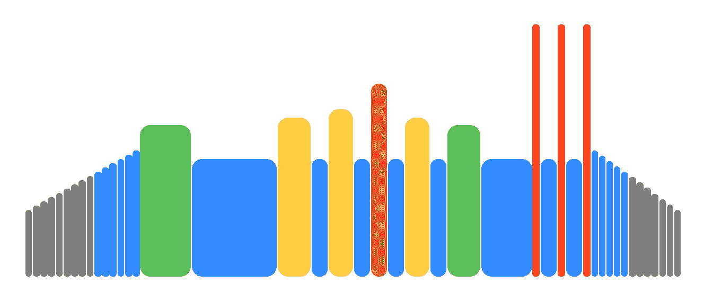
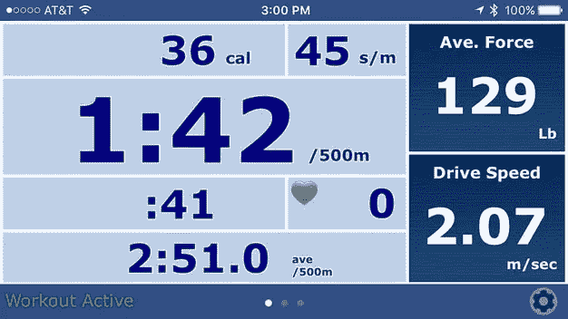
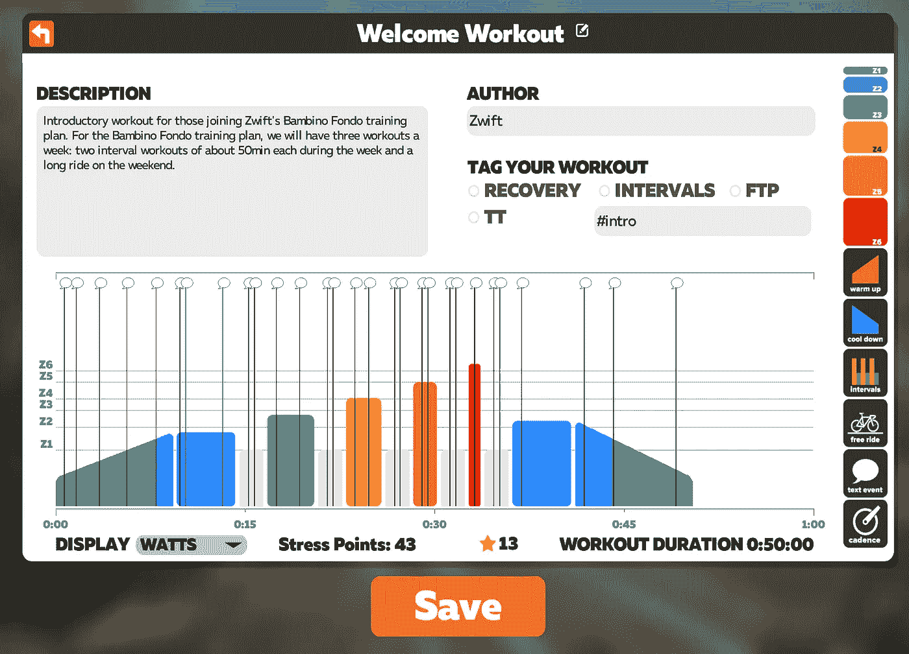
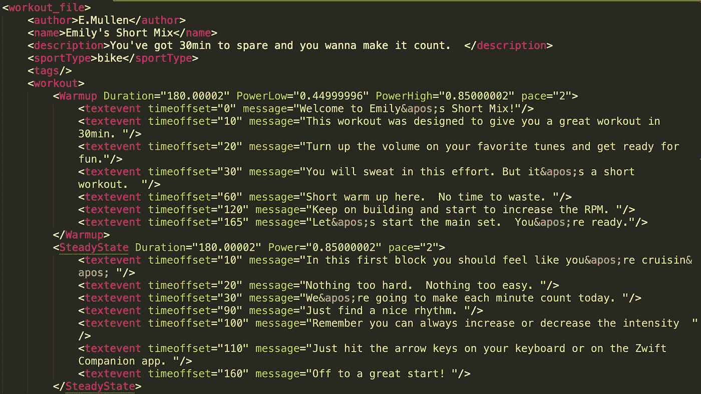

# 在 iOS 上克隆 Zwift 第 2 部分:反向工程训练

> 原文：<https://medium.com/hackernoon/cloning-zwift-on-ios-part-2-reverse-engineering-a-workout-9d4ffabc29e8>

A very colorful Zwift Workout

上一次，在“制作一个 iOS Zwift 克隆以节省每月 15 美元”中，我写了关于[学习核心蓝牙连接到我的健身自行车，并直接将数据流传输到我的应用程序](https://hackernoon.com/making-an-ios-zwift-clone-to-save-15-a-month-part-1-core-bluetooth-9925bba79f7a)。

自从写了那篇文章后，我对核心蓝牙服务的实现进行了一些清理，并开始支持一些额外的数据，如距离、消耗的卡路里和骑行节奏。

虽然骑着我的健身车盯着这些数字很有趣，但我自行车上的内置屏幕已经显示了这些数字，所以到目前为止，我基本上重新创建了官方 [ergData](https://www.concept2.com/service/software/ergdata) 应用的一个子集。

The ergData app is functional but ugly af

我意识到下一个挑战将是在我的应用程序中启动一个指导锻炼，并在自行车上显示目标瓦特数和我的实际瓦特数。

# 进入健身程序

Zwift 锻炼似乎很容易开始。您可以设置多个锻炼项目来指导您的锻炼。有热身，稳定状态，间歇，免费乘坐部分和冷却。在你锻炼的任何时候，Zwift 都会告诉你付出一定的努力。你只要努力让你的瓦特数符合 Zwift 想要你做的。

起初，我想我可以想出自己的方式来表示锻炼，但这也需要我重新创建我通常在 Zwift 上使用的所有锻炼。Zwift 还有一个很好的锻炼编辑器，可以用来编辑预设的锻炼或创建全新的锻炼。

Zwift’s built-in workout editor is pretty nice!

我发现，如果您复制现有的健身程序进行编辑，该健身程序将被保存为用户数据，并将在所有设备之间同步。你可能会问，锻炼数据是如何保存的？不，不像一个理智的开发者会使用的 [JSON](https://hackernoon.com/tagged/json) 。是[XML](https://hackernoon.com/tagged/xml)https://upscri.be/hackernoon/

。好吧，技术上来说它是一个. zwo 文件，但是我知道 XML 是什么样子的！以下是导出的健身程序文件的示例:

Hello darkness, my old friend

所以我继续在 Swift 中实现了一个 XMLParser。zwo 文件到我自己的锻炼结构。我不会用实现的细节来烦你，但是这是一种处理 XMLParser 的基于委托的 API 的回忆。我很惊讶 Foundation 中没有更现代的解决方案，但我猜想这是因为大多数人已经从 XML 向前迈进了。

# 让我们逆向工程

通过阅读。zwo 文件，我能够弄清楚 Zwift 如何表示他们的锻炼，并基本上对锻炼的结构进行逆向工程:

*   预热有持续时间、低功率和高功率(是 [FTP](https://zwift.com/news/4100-zwift-how-to-understanding-finding-your-ftp) 的百分比)。预热从低功率开始，并在该段结束时逐渐上升到高功率。
*   稳态是最简单的，只有持续时间和能量。
*   音程是最复杂的，有重复数，onDuration，offDuration，onPower 和 offPower。间隔段在高低功率电平之间变化，并重复一定次数。我不想处理这种类型的额外复杂性，所以我只写了一些代码来扩展它们成为稳定状态。
*   冷却时间和热身时间一样，但方向相反。

还有一些其他的东西，比如在锻炼过程中出现的文本标题、免费骑行段和节奏设置，我没有费心去实现，因为我不使用它们。如果你使用智能训练器，节奏的东西是有意义的，但我的自行车不支持自动改变阻力。

我决定将 WorkoutSegment 表示为一个 Swift enum，因为它需要支持一系列不同的复杂程度的不同格式。我真的有点好奇 Zwift 团队是如何结束这些的，他们是否做了类似的事情。

从这里可以很容易地获得总持续时间或特定时间偏移的目标瓦数，无论我需要计算(在预热或冷却的情况下)还是只返回常量值。

除了表示健身程序段之外，实际的健身程序对象将包括名称、描述、FTP 和其他与健身程序状态相关的信息，如经过的时间。我编写了一个函数，该函数获取锻炼中经过的当前时间，循环查找相应的部分，并返回所需的瓦特数。可能有更有效的方法来做到这一点，但目前它的工作。

我还在我的项目中添加了一些东西，用于显示和从列表中选择锻炼，并实际显示目标瓦特数和实际瓦特数。我现在想改进界面，因为它很糟糕，但我会把它留到另一篇博文中。如果你想查看这个项目，[在 Github](https://github.com/hungtruong/Zswift) 上都有，包括我在添加到 Xcode 项目之前用来测试锻炼段逻辑的操场。

我的下一个任务是让锻炼界面变得更漂亮/可用，并从我的 Apple Watch 添加心率信息。