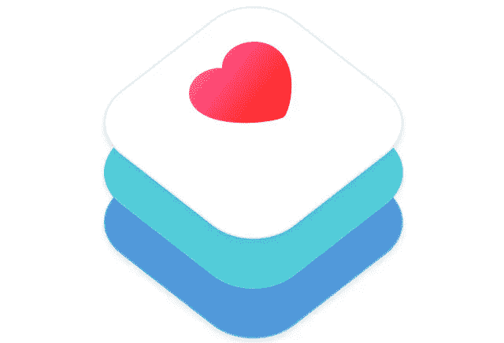
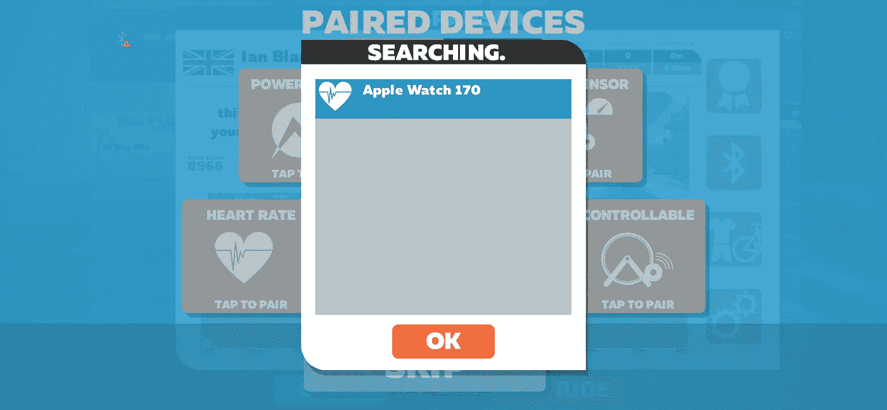
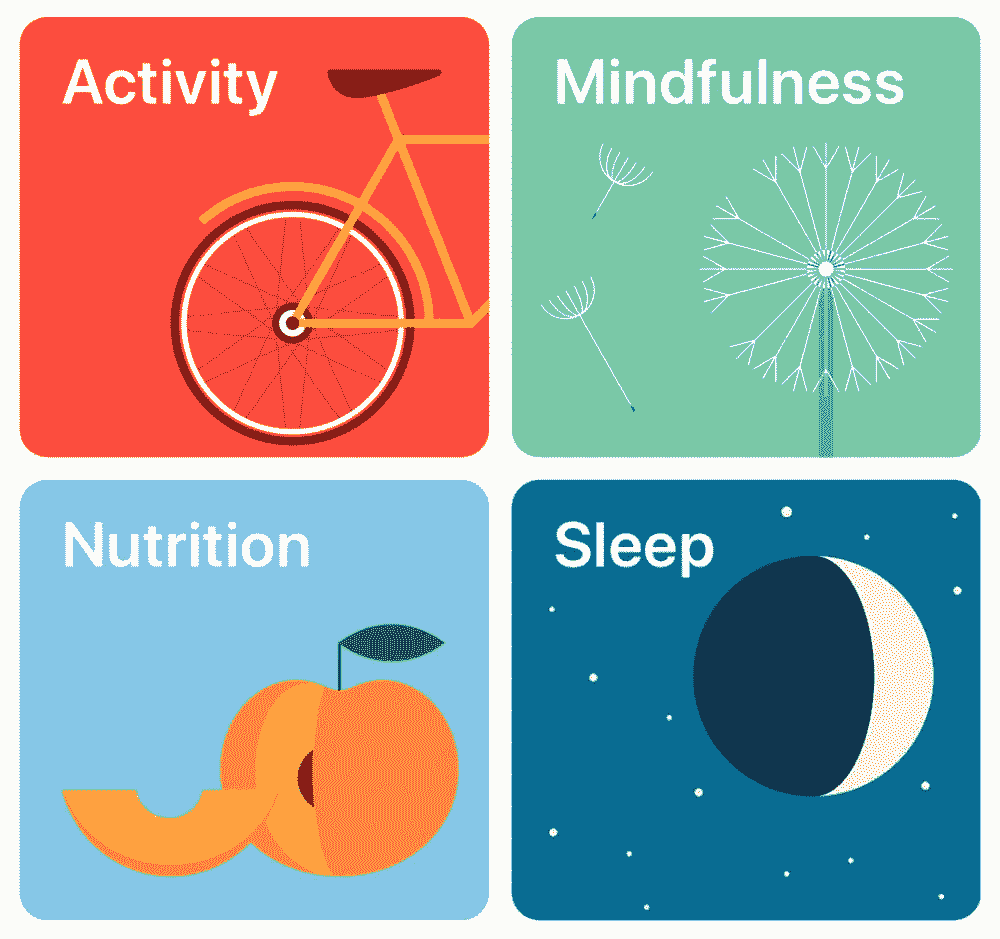
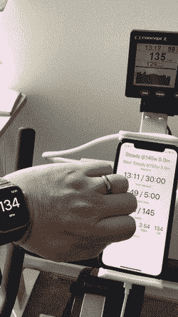
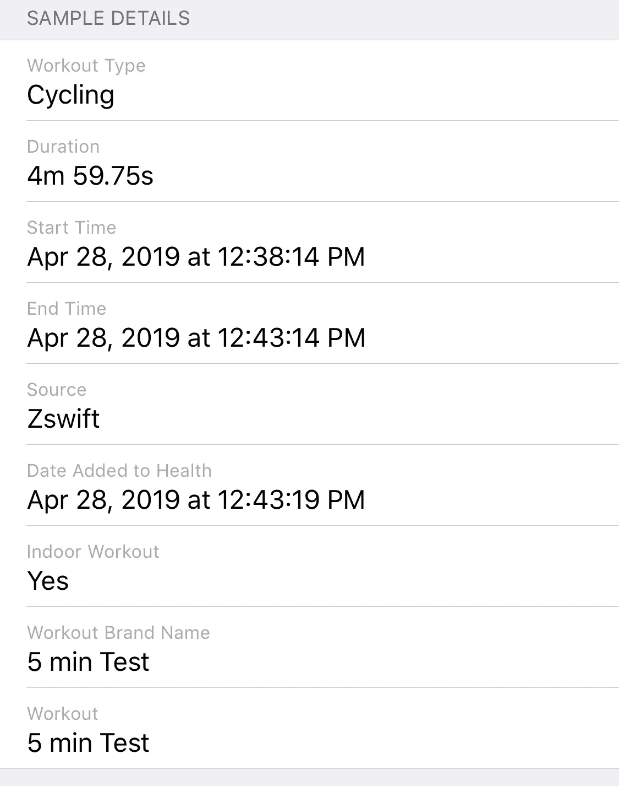
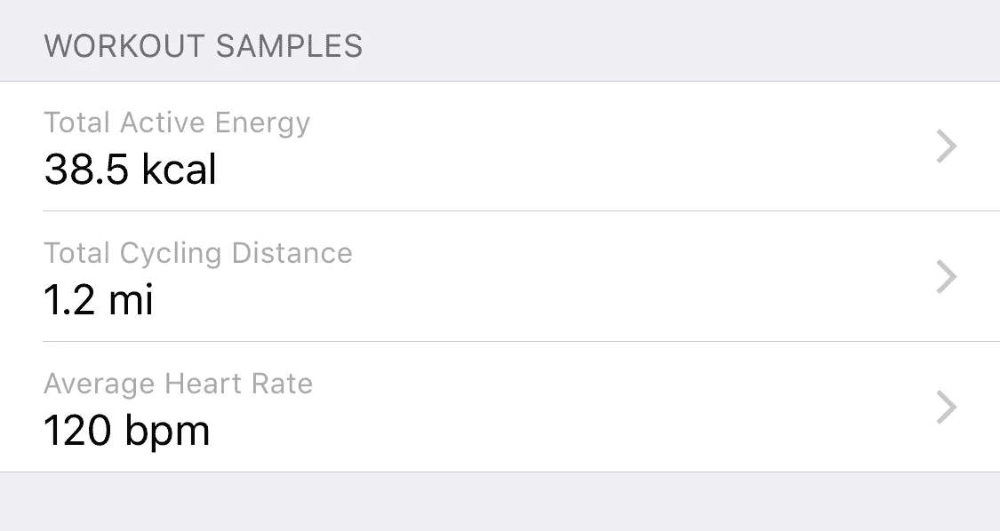

# 在 iOS 上克隆 Zwift 第 3 部分:HealthKit 和 WatchOS 应用程序

> 原文：<https://medium.com/hackernoon/cloning-zwift-on-ios-part-3-healthkit-and-a-watchos-app-5fc77e6b6921>

我在尝试克隆 Zwift 的博客系列上更新得有点慢，但这并不是因为我已经停止了这方面的工作。相反，我已经能够在第 [1](https://hackernoon.com/making-an-ios-zwift-clone-to-save-15-a-month-part-1-core-bluetooth-9925bba79f7a) 和第 [2](https://hackernoon.com/cloning-zwift-on-ios-part-2-reverse-engineering-a-workout-9d4ffabc29e8) 部分中使用我迄今为止已经构建的 MVP，并且发现我花在我的应用程序上的时间可以用于实际的锻炼。我会写一个东西的实现，但它会占用我太多的时间，以至于我无法测试它，我不得不去睡觉…尽管如此，我在我的应用程序中缺少一些重要的功能，所以我一直在我的健康工作之间慢慢地工作。

# 连接 Apple Watch

Zwift’s interface for connecting the Apple Watch works really well

Zwift 的一个伟大之处是他们为不同的健身配件提供了多少支持，包括 Apple Watch。不幸的是，Apple Watch 硬件没有像第 1 部分中我的健身车那样允许任意的蓝牙连接。相反，要访问用户的健康信息，如心率，你需要编写一个完整的 WatchOS 应用程序！

幸运的是，这不是我的第一次竞技，因为我曾为星巴克开发过 Apple Watch 应用程序，所以我能够很快地在我的项目中添加一个 Watch 应用程序扩展目标。

我在谷歌上搜索如何通过编程获得用户的心率，偶然发现了一个[承诺的 StackOverflow 帖子](https://stackoverflow.com/questions/38158841/live-heart-rate-in-watchos-3)，上面有一个 [Github 项目](https://github.com/coolioxlr/watchOS-3-heartrate/blob/master/VimoHeartRate%20WatchKit%20App%20Extension/InterfaceController.swift)的链接，并且能够自己实现它。然而，当我查看 copy-pasta 代码时，我觉得这似乎有点不对。该代码开始一个健身程序会话，但随后创建了一个对象查询，该查询将在健身程序添加新的心率样本(早于特定日期)时运行关闭。这似乎是一种迂回的方式来获取心率样本，我想知道苹果是否有更好的 API 来完成这一点。

# 实施健康工具包

我最终找到了一些苹果[样本代码](https://developer.apple.com/documentation/healthkit/workouts_and_activity_rings/speedysloth_creating_a_workout)，显示了获取心率数据的更好方法。解决方案是使用 WatchOS 5 中引入的一些新功能，这些功能允许直接在 Apple Watch 上创建锻炼。我链接的苹果文档解释得很好，但是步骤是:

1.  请求用户允许跟踪他们的心率数据
2.  创建一个健身程序配置(如室内自行车健身程序)和一个健身程序会话，以及相关的健身程序生成器
3.  开始会话，并告诉健身程序生成器开始收集数据样本
4.  响应委托方法“workout builder(_:didCollectDataOf:)”来收集一堆样本，包括心率信息

在代码中，它看起来像这样:

iPhone 版的 *HKHealthStore* 没有在手表应用程序中添加一些 UI 来开始锻炼，而是有一个名为[*startWatchApp(with:completion:)*](https://developer.apple.com/documentation/healthkit/hkhealthstore/1648358-startwatchapp)的功能，该功能会将锻炼配置发送到手表，以便于创建锻炼。当我在 iPhone 应用程序上开始锻炼时，我只需调用该功能，我的手表应用程序就会启动 HealthKit 锻炼会话，开始测量心率等数据(并计算其估计消耗的卡路里)。

我现在能够在手表读取心率的同时获取心率，并根据需要更新手表上的任何显示。不过，这只是故事的一半。在 Zwift 中，心率显示在用户界面上，我想自己模仿它。由于我无法直接从手机访问锻炼过程，我必须将心率信息从手表发送回主应用程序。

# 回到应用程序

这篇博文不是关于手表应用，所以我不会过多地讨论这个功能的这一方面。我基本上使用 WatchConnectivity 会话将消息发送回应用程序，其中包含一个包含新心率的字典。

在所有这些编程之后，我想给你展示我拍摄过的最难的视频:在 iPad 上，在健身自行车上保持平衡，记录我的手表和我的心率，应用程序显示完全相同的心率！

我还搭建了一个初始界面，显示我正在进行的锻炼环节、下一个环节、该环节的进度和我在整个锻炼过程中的进度，以及燃烧的卡路里(由自行车决定)、节奏和行驶距离等统计数据。

在这一点上，我有一个非常实用的应用程序！但是看到 HealthKit 广泛的 API 让我想在我的应用程序中添加越来越多的东西。这是范围蔓延在起作用。参见 [*HKWorkoutBuilder*](https://developer.apple.com/documentation/healthkit/hkworkoutbuilder) 的文档，查看所有可以存储的数据和元数据。最后，我又从应用程序向手表发送了几条信息，这样我就可以在锻炼中存储更多数据:

在锻炼结束时，我会发送开始和结束时间，以及消耗的总卡路里和行进的距离。这不是真的有必要，因为手表已经对消耗的卡路里进行了猜测，距离也不是真实的，因为它在一辆静止的自行车上。但我认为，看看这些数据是如何表示的可能会很有趣。

我也尝试过发送分段数据，但我还没有在锻炼视图中看到它的可视化表示。我想在 Apple Activity 应用程序中查看有关锻炼的更多详细信息，所以我也发送了锻炼的名称作为*hkmetadatakeyworkoutbrand name*值，尽管我不确定这是它的目的！以下是运动应用程序和健康应用程序的锻炼数据:

我想到并添加了一个更有趣但可选的东西，那就是当我接近一个片段的结尾时，手腕轻击提醒。有时，我只是在状态中，没有注意到我需要在下一部分加速或减速，所以当一个部分还剩 5 秒时，我会从手机向手表发送信息，轻触我的手腕并发送提醒:

编写自己的锻炼应用程序的一个好处是，你不需要等待第三方开发者来实现你对应用程序的任何想法！我认为这实际上是唯一好的事情…

不管怎样，我对结果很满意。接下来，我计划在界面上添加一些视觉上的修饰，甚至可能创建一个应用程序图标！我还想汇总数据，如心率信息、瓦特工作等，并跟踪统计数据和图表数据，可能是实时的。我发现在不同的日子里比较我在相同的锻炼中的努力非常有激励作用，看看我是否在进步(也许通过测量平均心率)。

和往常一样，我的改动在 [Github](https://github.com/hungtruong/Zswift) 中，以防你碰巧有和我一模一样的健身车，或者对我如何实现某些事情感到好奇。