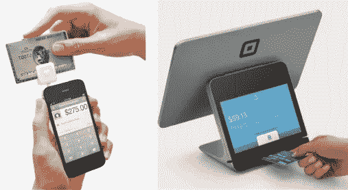
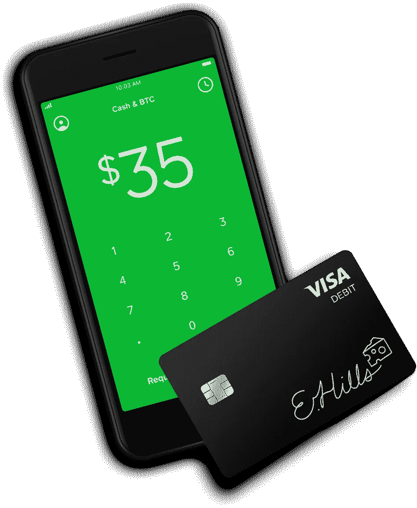
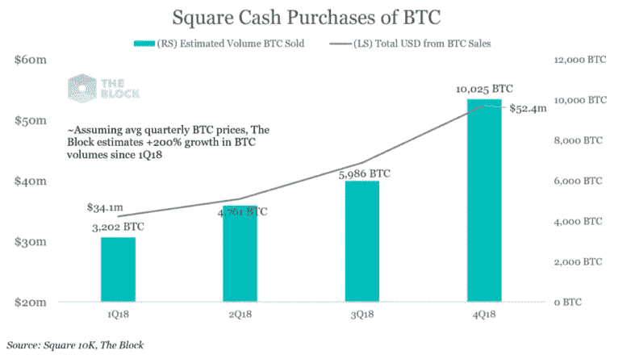
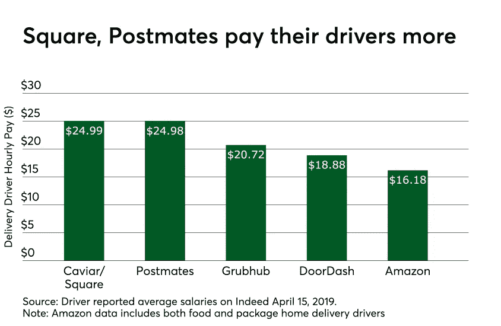
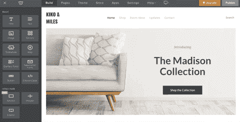
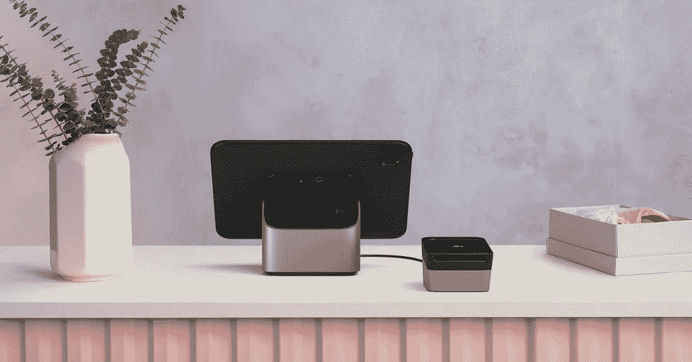

# 封闭的$平方生态系统

> 原文：<https://medium.com/hackernoon/closed-square-payments-c5544365d4ca>

Square 最初是作为一种信用卡读卡器推出的，它附加在早期用于结算移动交易的智能手机上。现在，它已经迅速发展成为在当地咖啡店完成支付的首选硬件和软件。

2009 vs 2019

正如你在上面看到的，Square 已经有了很大的发展。截至本文撰写之时，Square 的估值约为 Visa 的 10%,并在 2018 年获得了 3B 的收入，而 Visa 的收入为 200 亿美元。同样在 2018 年，Square 处理了 850 亿美元的总支付量，而 Visa 的处理量是它的 130 倍，达到惊人的 11 万亿美元。为了达到这一里程碑，Square 已经从移动业务的入门套件扩展到面向商家和消费者的支付和服务生态系统。

如果他们听了对价格敏感的商家的话，他们就会专注于降低费用。*相反，Square 有远见地围绕解决货币交换中的摩擦建立了自己的商业模式，而现有公司专注于利用他们的遗留商业模式，收取交换费和高额利息。* Square 已经开发并收购了一个产品生态系统，以支持其使商务变得简单、快捷和实惠的使命。

> 我们相信每个人都应该能够参与经济并在经济中茁壮成长。任何人都不应因为成本太高或技术太复杂而被排除在经济之外。— [广场的约页](https://squareup.com/us/en/about)

下面我将把三个产品创新联系起来——Cash App、Caviar 和 Weebly——并试图将它们与我对杰克·多西总体规划的假设联系起来:推出一个闭环支付，与脸书的 Libra Coin 竞争。 —闭环支付系统是一种交易保持在受控生态系统内的系统，它通过减少中间商的数量来降低成本。

现金应用程序正准备融合文莫和比特币基地。在购买下一个分数比特币时，向你的朋友、同事和家人汇款，只需在同一个应用程序中点击几下。Square 正在使用 PayPal 早期采用的相同策略来增长黑客病毒:向用户支付 5 美元现金来推荐他们的朋友。Square 的资产负债表上有 5 亿美元的现金，它能够承担这种客户获取战略。对于那些不知道的人来说，Venmo 是一个数字钱包，可以让你与朋友进行支付并分享支付，而[比特币基地](https://medium.com/u/913e7ed84452?source=post_page-----c5544365d4ca--------------------------------)是一个应用程序，允许用户购买、出售和存储未经研究的加密货币购买。比特币基地通过交易费赚钱，而 Venmo 正在测试不同的货币化策略——目前的一个策略是“用 Venmo 支付”,作为时尚的 D2C 结账页面上的支付选项。

## 顺便说一下， [Square 在 2018 年卖出了 1.66 亿美元的比特币。](https://www.theblockcrypto.com/2019/02/27/square-sold-over-166m-worth-of-bitcoin-in-2018/)

[https://www.theblockcrypto.com/2019/02/27/square-sold-over-166m-worth-of-bitcoin-in-2018/](https://www.theblockcrypto.com/2019/02/27/square-sold-over-166m-worth-of-bitcoin-in-2018/)

现金应用程序是将 Square 定位为闭环支付系统的先行者的宝石，该系统具有巨大的规模和分销网点。想象一下，用几分钟前你和朋友分摊账单时得到的 5 美元来支付你的周末拿铁咖啡。没印象？我也是。让我们更进一步。

现在想象一下，这 5 美元的交易被汇总，并用于在下班后几分钟将工资直接存入为您制作拿铁咖啡的员工。现在不可能的主要原因是，现有的银行基础设施无法提供这种选择。**雇主为工资单处理支付的费用大约为每位员工每个工资周期 5 美元。毫不夸张地说，对于零工经济工作者和数百万靠薪水过活的美国人来说，即时支付将是一项受欢迎的额外福利。**

更重要的是，Square 将通过将信用卡交易与朋友间的 P2P 交易结合起来，同时收取可以忽略不计的费用，来积累一套更加完整的消费者数据。

[https://www.paymentssource.com/list/5-key-ingredients-in-successful-food-delivery-apps](https://www.paymentssource.com/list/5-key-ingredients-in-successful-food-delivery-apps)

目前，现金应用程序正被用作 Square 鱼子酱员工的数字钱包。鱼子酱是 Square 在 2011 年对食品配送的早期尝试，本质上是 Uber Eats 的翻版，没有令人震惊的 149%的同比增长。然而，Caviar 确实为 Square 提供了一个可控的环境来测试无摩擦商务的未来。根据其网站，运送鱼子酱的快递员每小时挣 25 美元，在提供服务后立即在现金应用程序中提供。诚然，鱼子酱快递市场不会削弱现金应用与 Venmo 竞争所需的用户基础，但它强化了一个用例，是一个提高零工经济工作流动性的学习机会。

## 这个闭环支付生态系统的使用案例为 Square 提供了一个节省薪资处理费用的机会，同时通过提供一个主要的额外好处(即时支付)来区别于上面图表中的其他交付服务。

最后，Square 的管理团队承认，实体零售领域的萎缩可能会阻碍其简化商业的使命。因此，他们决定通过收购 Weebly 来探索服务数字商店的前景，wee bly 是一个自己动手的网站开发工具，周末战士使用它来实现他们的 D2C 想法。 [Shopify](https://medium.com/u/bab76dfc19b0?source=post_page-----c5544365d4ca--------------------------------) 、 [Wix](https://medium.com/u/2741d9d88322?source=post_page-----c5544365d4ca--------------------------------) 和 [Squarespace Inc.](https://medium.com/u/21796ef64a5d?source=post_page-----c5544365d4ca--------------------------------) 已经加入 Weebly，通过在服务、会计和库存管理方面提供类似的功能来实现网站开发空间的民主化。然而，Square 有一个显著的优势:

使用 Square 终端进入数字领域的公司在使用 Weebly 时几乎不会面临转换成本，因为它无缝集成了库存、报告和支付。这种无缝集成试图通过为 Square 的客户群提供产品粘性来为 Square 创建产品护城河。以下是商家将他们的 Square 账户与 Weebly 联系起来的简单方法。别眨眼，你可能会错过:

[https://squareup.com/help/us/en/article/5495-weebly-and-square](https://squareup.com/help/us/en/article/5495-weebly-and-square)

另一方面，Square 的经济护城河受到了 Shopify 进入实体零售领域的挑战，Shopify 的零售套件怪异地模仿了 Square 的审美。时间将会证明 Shopify 是否能被采用，是否能从 Square 那里获得市场份额。但有一点是肯定的，Shopify 将能够利用其现有的 50 万活跃业务，将其产品用作合格客户名单。

Shopify’s Hardware

# 对于 Square 来说，突破零售消费者能够在商店或网上无缝消费其现金应用金额的瓶颈，成为一个闭环支付提供商将是至关重要的。否则，它们将不再是支付处理发展的垫脚石。

在我看来，杰克·多西和[广场](https://medium.com/u/589d4400b6a4?source=post_page-----c5544365d4ca--------------------------------)的管理团队不需要把这一切都搞清楚——这个领域发展很快，他们似乎善于随机应变。我们仍然不知道采用脸书的 Libra 币会有什么结果，也不知道加密货币会如何进一步撼动 P2P 领域。我确实知道，Square 需要完美地执行，不仅要成长到 300 亿美元的估值，还要与越来越多的竞争对手短兵相接:Visa、Shopify、UberEats 和 Stripe。为了创新，广场万岁。

声明:我是龙$广场和