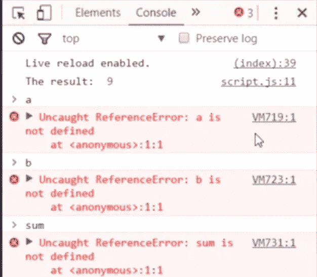
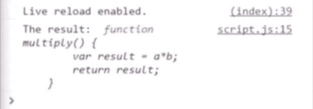
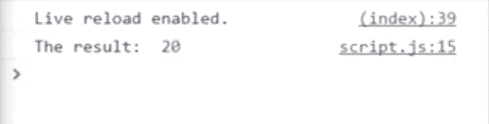
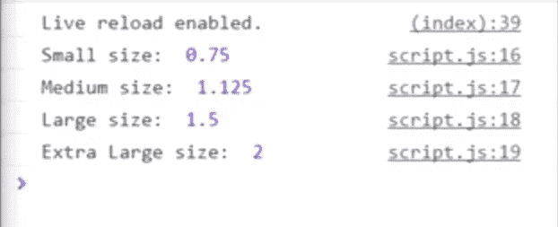

# Javascript 中的闭包学习简单的方法

> 原文：<https://medium.com/hackernoon/closures-in-javascript-learn-the-easy-way-7a7317ce2a07>


# 什么是闭包？

> 一个**闭包**是一个内部函数，它可以访问外部(封闭)函数的变量——作用域链。**闭包**有三个作用域链:它可以访问自己的作用域(花括号中定义的变量)，可以访问外部函数的变量，还可以访问全局变量

简单地说，这就是它的字面意思，函数内部的函数，依赖于外部函数中的变量来工作。

理解一个概念的最好方法是去做。

让我们来看一些闭包的例子。

```
function doSomeMath(){
var a=5;
var b=4;
var sum=a+b;return sum;
}var theResult = doSomeMath();console.log("The result:", theResult);
```

我们在这里做一些数学计算，设置三个变量，将一个变量加到另一个变量上，然后返回总和。现在让我们仔细看看浏览器到底是如何处理这些代码的。当我们在浏览器中运行脚本时。它首先发现这个函数 doSomeMath，但是没有对它做任何事情。然后在这里找到变量 Result，看到 doSomeMath 被赋给了这个变量。

这意味着它需要运行 doSomeMath，所以它跳到函数，设置三个变量，执行数学运算，然后将结果放在 sum 变量中，并返回 sum 变量。然后，sum 变量的内容被放入结果中，doSomeMath 函数被有效地关闭，其中的所有内容都被丢弃。结果中唯一剩下的是值 9，这意味着如果我去控制台，尝试调用 A，B，或 sum，我什么也没得到。



这是因为它们位于函数 doSomeMath 的范围内。我们现在在范围之外，这些变量不存在。到目前为止，这里没有什么新的东西。现在让我们稍微改变一下这个例子。

```
function doSomeMath(){
var a=5;
var b=4;function multiply(){
    var result = a*b;
    return result;
}return multiply;
}var theResult = doSomeMath();console.log("The result:", theResult);
```

如果我现在保存它，你会在控制台这里看到，变量 Result 现在保存了 total 函数及其所有内容。



如果我现在保存它，你会在控制台这里看到，变量 Result 现在保存了 total 函数及其所有内容。



这很奇怪，基于我们已经知道的函数是如何工作的，这是不应该的。我为什么要说这个？好吧，考虑一下这个问题。浏览器从右上方读取？所以它首先找到函数 doSomeMath，但不对它做任何事情。然后它跳到变量 Result，看到 doSomeMath 已经被赋值给它，所以它跳到最上面，运行整个函数。它设置了两个变量，注册了乘法函数，然后在底部看到，哦，我想返回乘法函数，但我不想运行它，我只是把它当作一个变量来返回，所以我把这个乘法函数放在结果中，其他的都关闭。

所以从技术上来说，这意味着 A 和 B 应该停止存在，但如果我们在控制台中查看，它显然不存在，它显然还在那里。这就是所谓的终结。实际情况是，这个内部函数乘法，依赖于已经在外部函数中定义的变量。而且浏览器足够聪明，可以理解哦，这些东西是相关的，所以即使我们已经关闭了 doSomeMath 函数，我还是要让这两个变量保持活动状态，这样乘法函数仍然可以使用它们。

**那么我们为什么会有这种特性呢？**

嗯，它有一些有趣的实际应用。让我给你看一个非常简单的例子。我会清除我所有的代码，然后我们重新开始。如果你曾经在 CSS 中使用过 Em，你就会知道计算它们可能有点麻烦，特别是如果你知道你要寻找的像素值是多少，然后你必须计算出类似的 Em 值是多少。

Ems 的诀窍是，如果你知道当前上下文的像素值，你可以只取你正在寻找的像素值，比如说 32 个像素，然后用它除以当前上下文像素值，如果你只是在整个浏览器中工作，通常是 16。所需像素值 32 除以根像素值 16 的结果就是 Em 值。使用闭包，我们可以创建一个函数来帮助我们生成这些数字。

首先我要建立一个新的函数，我把它命名为 giveMeEms。此函数有一个参数(像素)。这是我们要转换成 Ems 的像素值。在函数内部，我们有一个名为 baseValue 的变量。我将把它设置为 16，因为 16 是大多数浏览器的基本字体大小。然后我们设置了一个内部函数 doTheMath。在 doTheMath 内部，我们将简单地返回 pixels/baseValue。

看这里，我们获取像素参数，并在内部函数中使用它，然后获取变量基值，并在内部函数中使用它。最后，为了结束，我们返回 doTheMath。现在，我们可以设置一系列调用 giveMeEms 的变量和不同的像素大小，并获得相应的值。所以我将设置 var smallSize = giveMeEms。

这里我将传递(12)，所以我在寻找相当于 12 个像素的 Em 值。那么 var mediumSize = giveMeEms(18)，var largeSize = giveMeEms(24)。最后是 var xlargeSize = giveMeEms(32)。

然后，为了实际获得这里的结果，我将 console.log("Small size:"和 Small size ")。我就抄这些。中，大，超大，最后，我需要运行小尺寸，中尺寸，大尺寸，超大尺寸变量作为函数。

```
function giveMeEms(pixels){
var baseValue = 16;function doTheMath(){
return pixels/baseValue;
}return doTheMath;
}var smallSize = giveMeEms(12);
var mediumSize = giveMeEms(18);
var largeSize = giveMeEms(24);
var xlargeSize = giveMeEms(32);console.log("Small Size", smallSize())
console.log("Medium Size", mediumSize())
console.log("Large Size", largeSize())
console.log("Extra Large Size", xlargeSize())
```

当我保存它，并在浏览器中运行时，



我得到了这些尺寸的 Em 尺寸，0.75、1.125、1.5 和 2。同样，这仅仅是因为闭包才成为可能。在这种情况下，这里的闭包既包含了这个变量的基值，也包含了像素的值，尽管从技术上来说，giveMeEms 函数已经运行了，当我们在这里调用它时，我们应该不能得到这些值。

> JavaScript 中的闭包是一个有趣的话题，这个特殊的兔子洞比我在这里展示的要深得多。为了更好地理解闭包有多强大，在哪里可以使用它们，以及它们什么时候可能导致问题，您应该查看 MDN 上关于闭包的文章。它给了你很多例子，更多的细节，告诉你如何在日常代码中使用它们。

*你好，我叫* [***胡尔·库马尔·曼达尔***](https://www.linkedin.com/in/officialrahulmandal/) *。我是一个全栈开发者。我写的是 JavaScript、NodeJS 和 reactjs。和大家分享我的世界观，在*[***Twitter***](https://twitter.com/official__rahul)*或*[***Medium***](/@officialrahulmandal)*关注我，加入我的探索。*

我希望您喜欢这篇关于 JavaScript 闭包的文章。

请随意评论并喜欢这篇文章，以便其他人可以在 Medium 上轻松找到它！

感谢你阅读这篇文章，如果你喜欢，就和你的朋友和敌人分享吧。我会写更多关于 JavaScript 的文章，请与我保持联系。