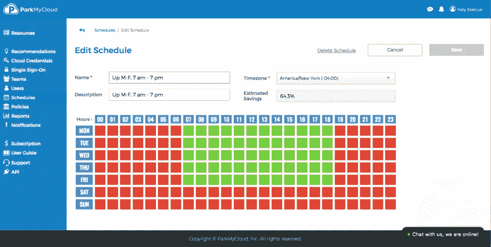

# 云成本黑客

> 原文：<https://medium.com/hackernoon/cloud-cost-hacking-fc35fd19985d>

> fin ops——云提供商不想让你知道的成本优化指南

使用云的主要动机之一是灵活性和成本节约。问题是，如果没有持续的管理和监督，云预算可能会增长到无法盈利的程度。

最近一项关于云使用成本的研究表明，公司在云服务上支付的费用平均比他们实际应该支付的多 35%。总共有超过 600 亿美元的[浪费在没有使用的云服务上。](https://www.businessinsider.com/companies-waste-62-billion-on-the-cloud-by-paying-for-storage-they-dont-need-according-to-a-report-2017-11)

在本文中，我将分享我从最近管理的云成本优化流程中得出的结论，并回顾一些在不牺牲性能的情况下大幅降低云成本 30–50%的方法和工具。除非另有说明，本文中的建议对所有云供应商都有效。

**管理云成本的工具**

在你开始存钱之前，了解成本构成是很重要的。在每个云中，都有成本管理工具，这些工具根据服务类型显示不同的成本细分。这些工具可以自动检测未充分利用的服务器，并建议缩小或关闭它们。

*   多重云: [VMware CloudHealh](https://www.cloudhealthtech.com/)
*   Azure: [造价顾问](https://docs.microsoft.com/en-us/azure/advisor/advisor-cost-recommendations)， [Cloudyn](https://www.cloudyn.com/)
*   AWS: [值得信赖的顾问](https://aws.amazon.com/premiumsupport/technology/trusted-advisor/)，[成本管理](https://aws.amazon.com/aws-cost-management/)
*   GCP: [成本管理](https://cloud.google.com/cost-management/)

# **第 1 部分—服务器成本**

通常，服务器是总成本中最大的组成部分，因此我们将从服务器成本节约战略开始，然后我们将寻找降低您的存储和网络费用的方法，最后审查一些业务选项，以获得云支出的显著折扣。

关闭服务器

*预计折扣—服务器总成本的 15%*

*   关闭不使用的服务器。
*   调整—根据数量和使用负载调整服务器的大小。
*   限制用户创建新服务器的权限。

**保留实例**

*预计折扣—长期服务器成本的 50%*

如果您签订长期合同，保留实例(RI)可以显著降低服务器成本。通常一年的承诺会给 40%的折扣，三年的承诺会给 60%的折扣。

如果您仍然想停止使用您已经承诺的服务器，有几种方法可以摆脱国际扶轮的承诺:

*   用不同类型的服务器替换承诺
*   取消 RI 并支付离职罚金

根据我对 Azure 的计算，承诺 3 年 60%的折扣并在一年后取消(支付 12%的罚款)比承诺一年 40%的折扣更有利可图。

[https://azure . Microsoft . com/en-us/pricing/details/virtual-machine-scale-sets](https://azure.microsoft.com/en-us/pricing/details/virtual-machine-scale-sets)

[https://AWS . Amazon . com/ec2/pricing/reserved-instances/pricing/](https://aws.amazon.com/ec2/pricing/reserved-instances/pricing/)

[https://cloud.google.com/compute/pricing](https://cloud.google.com/compute/pricing)

**斑点实例**

*预计折扣—非“关键任务”服务器成本的 70%*

现场服务器或低优先级服务器比同等功率的普通服务器便宜 70-90 %!此外，今天的折扣或多或少是固定的(并且不依赖于过去实行的拍卖过程)。

问题在于，这些服务器的优先级较低，因此您可能会面临它们突然关闭的风险。

然而，有几种方法可以处理这种不幸的情况:

*   运行不重要的无状态服务；如果它们关闭，您可以随时再次打开它们(光盘不会被删除)。
*   使用队列；如果一个服务器关闭，任务将留在队列中等待另一个服务器。
*   使用自动缩放规则来自动处理特定的实例计数。
*   一家名为 [Spotinst](https://spotinst.com/) 的有趣公司通过有效利用 Spot 来帮助降低成本。他们能够识别即将关闭的 spot 服务器，并在几乎不停机的情况下用其他 spot 服务器替换它们。从我做的一个查询来看，似乎他们的 Azure 支持还不完全(Azure managed k8s 服务不完全支持)，AWS 有更好的支持。

**无服务器\自动扩展架构**

*预计折扣—持续开放加载时间的服务器成本的 90%*

我们的系统必须承受高负载，但是没有理由在低需求期间让所有的服务器都工作。

自动扩展确保服务器的数量将根据测量的负载自动扩展。

无服务器功能仅按需运行，不需要永久服务器。

合适的架构是有效云的基本要素之一，但超出了本文的范围。对于架构和云设计模式，一般来说，参见 [awesome-design-patterns](https://github.com/DovAmir/awesome-design-patterns#cloud-architecture) 。

在 Kubernetes 管理的系统中，资源的分配通常更有效率和成本效益。 [virtual-kubelet](https://github.com/virtual-kubelet/virtual-kubelet) 项目可以将 Kubernetes 连接到无服务器容器平台，如 AWS Fargate 和 Azure 容器实例。

**开发\测试**

*预计折扣—低空服务器成本的 50%*

我们的大部分服务器属于开发、测试和生产前环境。

在 Azure 中，开发/测试环境有[折扣](https://azure.microsoft.com/en-us/pricing/dev-test/)(我不知道其他云中有类似的程序)。

在许多情况下，我们只在白天工作于开发/测试环境，所以这些服务器可以在晚上和周末关闭，节省超过 50%的成本。有一些工具可以根据时间表自动关闭服务器:

[Skeddly](https://www.skeddly.com/features/cost-optimization/)

[Parkmycloud](https://www.parkmycloud.com/)

Parlmycloud — Servers turn on only at the green slots.

# **第 2 部分—存储和网络**

**存储**

*预计折扣—存储成本的 20%*

以下是从便宜到昂贵(从慢到快)排列的 5 大云存储类别:

*   存档存储- AWS 冰川
*   对象存储- S3 \ Blob
*   文件存储-可以映射到多台服务器的网络库
*   块存储-磁盘固态硬盘
*   数据库存储- SQL，MongoDB …

在每一个存储类别中，根据速度和冗余性有几个价格级别。

原始数据可以存储在便宜的存储类别中，但是用于频繁查询的元数据最好存储在昂贵的存储类别中。

存档存储是最便宜的存储形式，但由于检索速度慢，对于正在进行的工作来说并不实用。对象存储是第二便宜的存储类别，因此这是大多数数据的首选存储。

您应该设置一个“存储生命周期”策略，允许您设置将旧文件自动移动到更便宜的存储类别的规则。(在 AWS 和 Azure 预览版中可用)

**网络**

*预计折扣—网络流量费用的 20%*

网络流量包括内部流量(在您的网络内)和服务器与客户之间的外部流量。

对于内部流量，我建议:

*   如果可能的话，允许进程在相同的地理区域内运行。
*   仅使用内部地址。

为了了解减少外部流量的方法，我与 Cloudflare 的 CTO John Graham-Cumming 进行了交谈，他指出了 Cloudflare 的网络成本优势*:

*   DDOS 保护— DDOS 会产生网络成本。
*   CDN —从离客户端位置最近的 Cloudflare 服务器下载文件(没有额外的网络成本)。
*   [带宽联盟](https://techcrunch.com/2018/09/26/cloudflare-partners-with-microsoft-google-and-others-to-reduce-bandwidth-costs/)——承诺在联盟成员之间传输数据时降低云网络成本。
*   [Cloudflare workers](https://cloudflareworkers.com/#12a9195720fe4ed660949efdbd9c0219:https://tutorial.cloudflareworkers.com) —在请求到达我的网络之前，在 Cloudflare 的端点运行 javascript 请求逻辑。
*   Brotli 压缩——比 gzip 好。

*这并不意味着 Cloudflare 是该领域的唯一供应商。

# **第 3 部分—商业折扣**

云提供商及其合作伙伴有许多可以提供大幅折扣的计划。大客户也可以直接与云提供商讨价还价，获得折扣。

**云伙伴**

*预计折扣—总费用的 5-10%折扣+咨询*

经验丰富的云架构师的咨询是无可替代的。所有主要的云提供商都有提供咨询服务的合作伙伴。与他们合作可以带来很多好处。

例如:

*   云计算总成本的折扣
*   故障支持
*   建筑咨询
*   成本管理工具
*   灵活的付款方式

[https://partner.microsoft.com/](https://partner.microsoft.com/)

[https://aws.amazon.com/partners/](https://aws.amazon.com/partners/)

[https://cloud.google.com/partners/](https://cloud.google.com/partners/)

**启动程序**

*预计折扣——可达数万美元或更多的信贷*

所有云公司都有能让初创企业受益的计划。

好处包括:

*   云使用的信用
*   咨询服务
*   业务推广/加速器

[https://startups.microsoft.com/en-us/](https://startups.microsoft.com/en-us/)

【https://aws.amazon.com/startups/ 号

【https://cloud.google.com/developers/startups/ 

**自由层程序**

*预计折扣—小型服务器第一年免费*

所有云提供商都有免费层计划。这些计划允许免费使用一年或固定次数的最低成本服务。通常，可以创建的免费层帐户的数量没有限制。

[https://azure.microsoft.com/en-us/free](https://azure.microsoft.com/en-us/free)

[https://aws.amazon.com/free/](https://aws.amazon.com/free/)

[https://cloud.google.com/free/](https://cloud.google.com/free/)

就是这样！

你有自己的云成本优化技巧吗？

我很想在评论中或者在 https://twitter.com/turaaaa 听到他们的消息

*   以上话题仅反映我的专业意见。我与文章中提到的任何服务都没有关系。