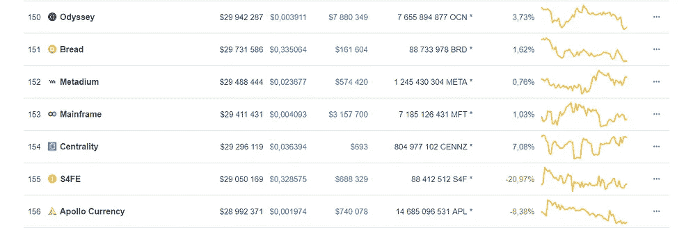
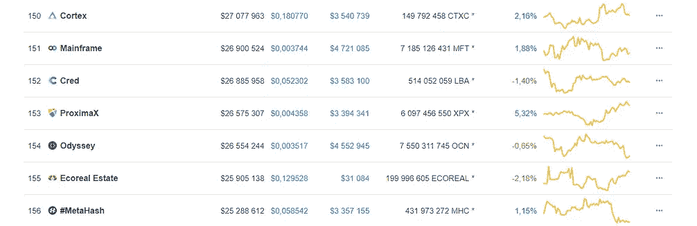
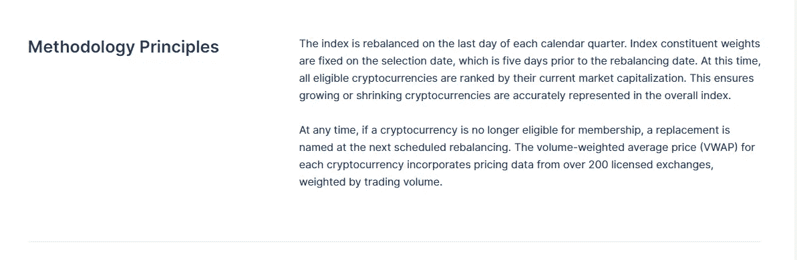

# CMC200 和 CMC200EX。CoinMarketCap 指数以及我不信任它们的原因。

> 原文：<https://medium.com/hackernoon/cmc200-and-cmc200ex-coinmarketcap-indexes-and-why-i-do-not-trust-them-88f5148a7ed9>

Photo by [Kai Pilger](https://unsplash.com/@kaip?utm_source=unsplash&utm_medium=referral&utm_content=creditCopyText) on [Unsplash](https://unsplash.com/search/photos/trust?utm_source=unsplash&utm_medium=referral&utm_content=creditCopyText)

在三月，CoinMarketCap】公布了 CMC200 指数和 CMC200EX **指数。当 CMC200 在纳斯达克上市时，很多媒体都关注了这件事。**

这一事件之后，加密货币从“鲸鱼”开始增长，比率上升。但是许多好奇的投资者还记得 CoinMarketCap 上关于伪造[交易量的新闻。](https://cointelegraph.com/news/coinmarketcap-will-alter-listing-metrics-after-latest-fake-volume-research)当然，我们作为投资者应该去了解一下，对吗？

## 为什么 CMC200 和 CMC200EX 不是索引。

**首先，**先说包含假卷的索引不可能是正确的索引。为什么？答案很简单。例如，你做了 500.000.000 代币，并把它们放在任何一个小交易所。如果一个代币等于 1 美元，那么您的代币的大写将等于 500.000.000 美元，现在您在 CoinMarketCap 排名前 100。简单，嗯？

我非常怀疑[*qu bitica*](https://coinmarketcap.com/currencies/qubitica/#charts)*有超过 1.25 亿美元的交易量。*

**其次，**在 150–200 位范围内的记号经常改变位置。事实。你可以在 [web.archive.](http://web.archive.org/web/20190410185215/https://coinmarketcap.com/2) 查看

**April 10, 2019 — April 18, 2019**

**第三，**一个成熟的加密货币指数不应该有任何稳定的币，有 **4(你能想象吗，卡尔？CoinMarketCap 指数中的稳定指数。它更像是一个投资组合，而不是一个指数。**

**Four Stablecoins in the index. Can you imagine, CARL?**

## 让我们分析一下方法论

[Methodology](https://coinmarketcap.com/indices/#Methodology) from CMC.

并且 **#herewegoagain** 他们建议我们以加密货币的资本化为主要因素。*什么？？？*

所以现在我们可以得出结论，他们使用的方法与 crypto winter 中的方法相同，当时所有的 crypto 市场都崩溃了，资本化维持在适当的水平，这是由于大量新硬币的上市(带有假量)。当然，后来他们把它们除名了。(并非全部)

例如，我使用 [CIX100](https://cix100.com/) ，在那里我知道他们的方法，没有对假卷进行任何操作。

该指数不能包括假体积的硬币，因为:

*   如果硬币在 3 个月内没有进入前 200 名——硬币不能包含在 CIX100 中。这消除了快速进出硬币的风险。
*   如果一枚硬币/代币只在一个交易所交易——进入 CIX100 的几率非常低。
*   如果在 GitHub 没有活动，那么进入前 200 的 CMC 就不允许币在 CIX100。

下一个例子——[霍比 10 指数。](https://www.hbg.com/en-us/etf/hb10/info/)

霍比指数优于 CMC 的原因是:

*   该指数将只反映火币 Pro 市场的整体表现，而不是 CMC
*   每个人都可以识别在 Huobi.pro 上交易的最具流动性的资产，而不必检查单个加密货币的汇率。

*在我看来:这些指数比只使用不正确的市值的 CMC 要好得多。*

## 结论

加密货币市场上经典股票工具的出现为新人、交易者和“鲸鱼”创造了有利的环境。加密货币正逐渐从“灰色部门”中脱颖而出，开始在实体部门积极使用。

*免责声明:以上内容仅代表一种观点，仅供参考。它无意成为投资建议。请自己做作业。*

订阅分享！感谢您的关注！