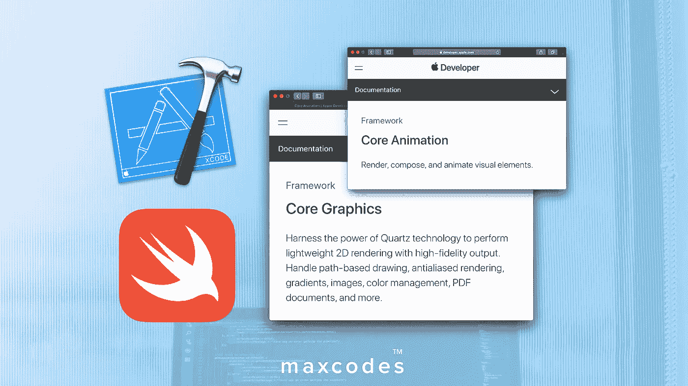
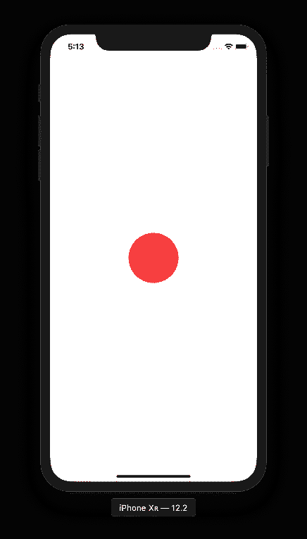
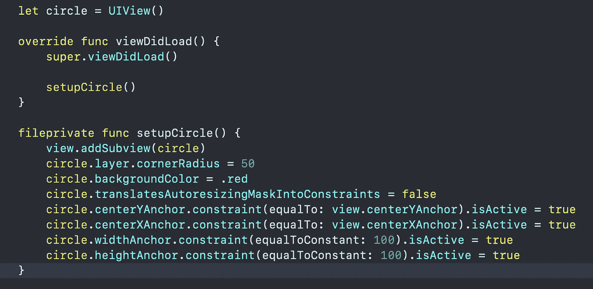
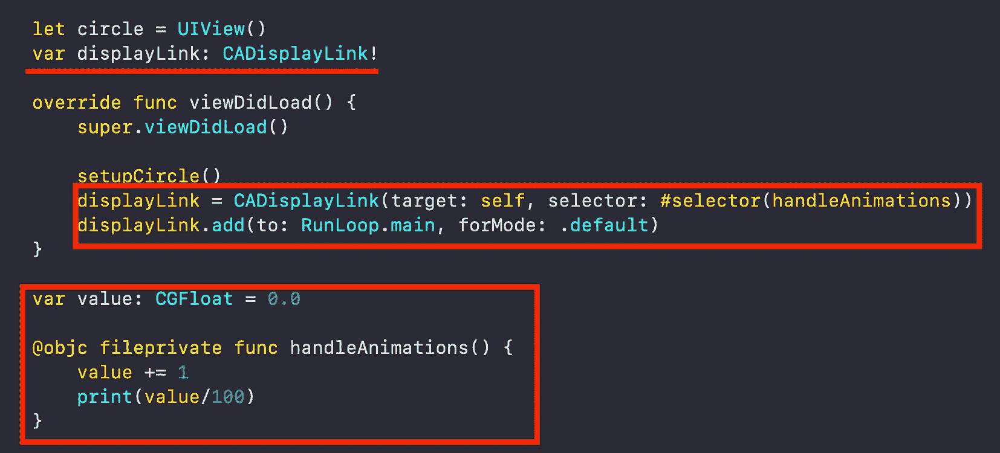
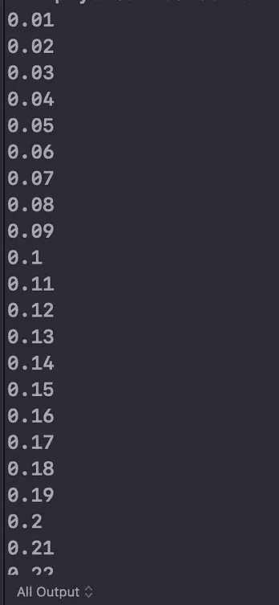
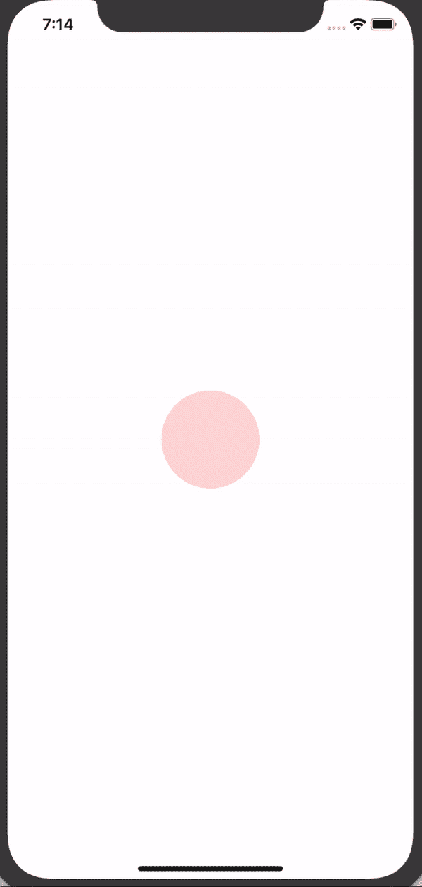
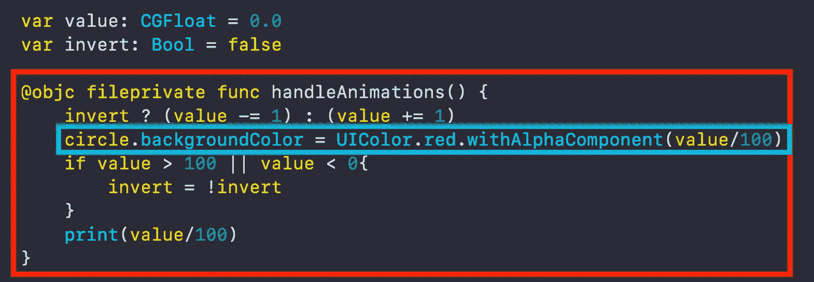

# 在 Swift 和 Xcode 中使用 CADisplayLink 编码加载动画，而不使用 CocoaPods

> 原文：<https://medium.com/hackernoon/code-a-loading-animation-with-cadisplaylink-in-swift-xcode-without-cocoapods-12ad88283be6>

使用 CADisplayLink 为您的 iOS 应用程序创建 dope 加载动画。

我叫 Max，我跑*[***maxcodes . io***](https://www.maxcodes.io)**。很高兴终于见到你了。***

*我在这里录制了一个关于这个主题的视频。*

# *第一步。创建一个圆圈*

*创建一个视图，用下面几行代码约束屏幕上的垃圾内容。*

****

*the following lines of code.*

# *第二步。创建 CADisplayLink 实例*

*   *在我解释之前，声明 CADisplayLink 的一个实例，并用下面几行代码将其附加到一个方法。*
*   *创建一个值 CGFloat 变量，我们可以使用它在每次帧更新时修改视图的 alpha 或不透明度。*
*   *将值增加 1 并打印除以 100 的值。您应该会看到这样的输出，它会一直持续下去。*

*[***我在这里找到的最新课程中使用了很多 CADisplayLink。***](https://www.udemy.com/coreanimation/?couponCode=THEPROFESSIONAL)*

*我们在这里所做的是向设备上的主线程添加一个 CADisplayLink，它将与显示器的刷新率同步。你可以在 CADisplayLink 上的[苹果开发者文档中阅读所有相关内容。](https://developer.apple.com/documentation/quartzcore/cadisplaylink)*

****

*yes, these are the following lines of code. The output is pictured on the right.*

# *第三步——制作动画。*

*想想我们在这里能做什么。在一段时间内，这个值从 0 到 1。*

*我们可以在设置颜色时应用，或者将这个值传递给 UIColor 上的***with alpha component***方法。这将允许我们慢慢淡化任何给定的颜色。*

*您可以用一行代码淡入颜色，这一行代码包含在下面的代码图像中的蓝色框内。*

*但是，如果你想让它来回褪色，你需要应用一些基本的逻辑，我在这里找到的这篇文章的 [***视频版本中 100%免费解释这些逻辑。*T34**](https://youtu.be/iHeeOULNdFA)*

****

*ahh yes, the following lines of code; with output on the left of course.*

# *第 4 步—输出如上图 gif 所示。*

*好了，我们完成了，但是**什么** *是*步骤 4？步骤 4 是可选的。如果你想使用 **CADisplayLink** 以及类似[***cashaplayer、UIBezierPath、cabasicamation***](https://www.udemy.com/coreanimation/?couponCode=THEPROFESSIONAL)等类从头到尾创建复杂的动画，那么你会想参加[我的最新课程](https://www.udemy.com/coreanimation/?couponCode=THEPROFESSIONAL)、[***iOS 开发动画课程——Swift 5&Xcode 10***](https://www.udemy.com/coreanimation/?couponCode=THEPROFESSIONAL)*

# *谢了，老兄。*

*我真的很感谢那些观看我的视频，阅读我的文章，参加我的课程的人。*

*为了听到第一个**新的文章公告、课程、YouTube 系列和视频博客，**一定要看看我的网站 [**加入开发人员名单。**](http://maxcodes.io)*

*谢谢，*

*一如既往，我们将在下一段视频中再见。*

****-最大****