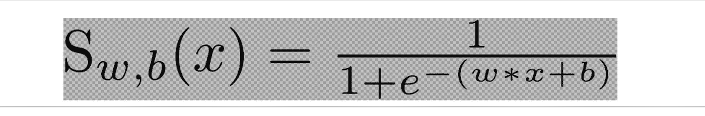
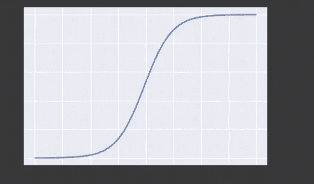
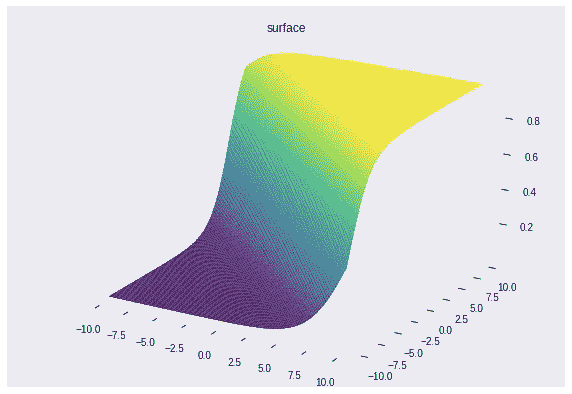
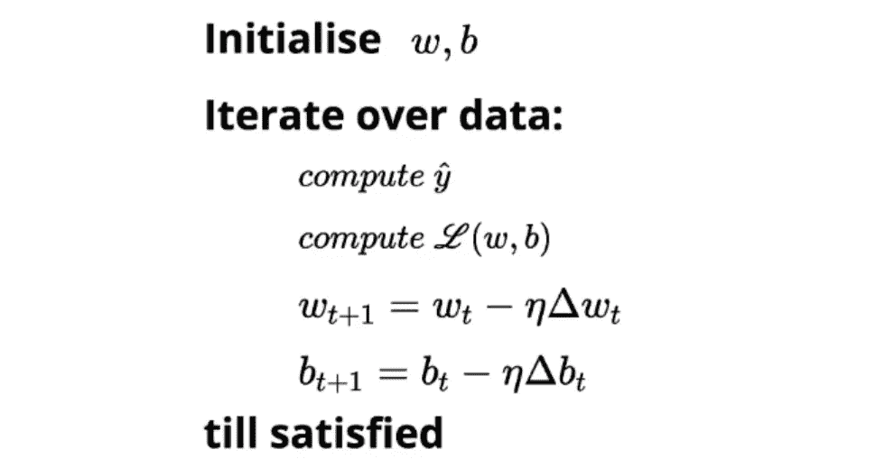
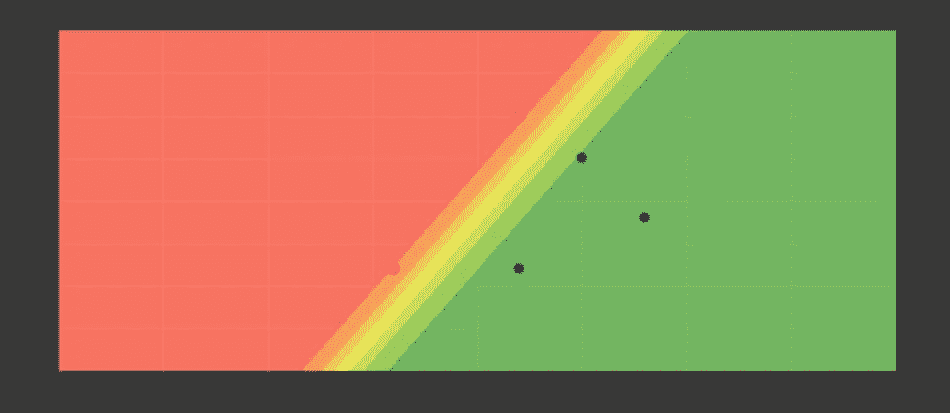
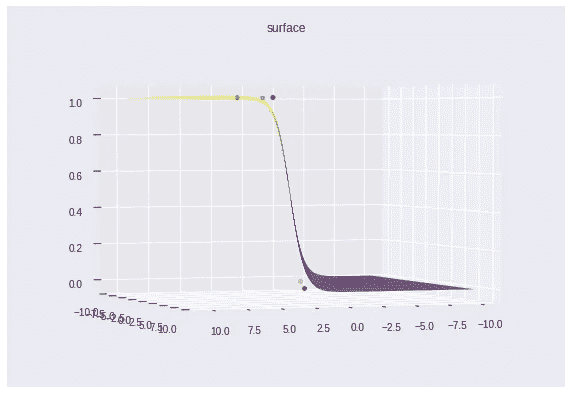

# 用 Python 构造一个 Sigmoid 感知器

> 原文：<https://medium.com/hackernoon/codeblog-sigmoid-perceptron-e52c878e0e03>

## 在本文中，我们的目标是在样本数据集的帮助下可视化它的训练。

# 模型的直觉

## 激活功能

在构建 Sigmoid 模型之前，让我们先了解它的基础知识。顾名思义，该模型围绕 sigmoid 公式，可表示为:

我们的 sigmoid 公式包含以下参数:

*   x:数据集的特征
*   w:对应于 X 的权重向量
*   偏见

Sigmoid Curve 2D

Sigmoid Curve 3D

sigmoid 曲线的属性(值范围在 0 和 1 之间)使其有利于主要的回归/分类问题。

## 损失函数

因为我们将处理这个可视化的真实值，我们将使用均方误差作为我们的损失函数。

## 算法

“w”的梯度可计算如下:

# 密码

让我们从导入我们需要的库开始。这里有一些(深入的)动画文档:动画，[简单动画教程](https://jakevdp.github.io/blog/2012/08/18/matplotlib-animation-tutorial/)

现在让我们列出我们的乙状结肠神经元类将包括的组件

*   计算 w*x+ b 的函数
*   应用 sigmoid 函数的函数
*   预测给定 X 数据帧输出的函数
*   函数返回“w”和“b”的渐变值
*   函数来适应所提供的数据集

关于课程的一些要点:

*   我们的目标是培训的可视化，并且记录每个输入的变化。因此，在“拟合”函数中没有添加对数据集的迭代。
*   我们可以将“w”和“b”初始化为任意随机值。这里我们已经初始化了一个特定的 float，因为它为我们提供了最不适合这个模型的场景。

Unfit Scenario

我们的下一步将是创建一个样本数据集，创建一个将生成等值线图的函数，并创建一个循环以随时间推移向模型提供数据集。

一些资源: [Mycmap](https://matplotlib.org/api/_as_gen/matplotlib.colors.LinearSegmentedColormap.html) ， [meshgrid](https://stackoverflow.com/questions/36013063/what-is-the-purpose-of-meshgrid-in-python-numpy) ，[支线剧情](https://jakevdp.github.io/PythonDataScienceHandbook/04.08-multiple-subplots.html)， [contourf](https://jakevdp.github.io/PythonDataScienceHandbook/04.04-density-and-contour-plots.html) ，

现在我们终于收到了 120 幅描绘训练的图。

## 第一个情节

## 最后的情节

[所有 120 个图都可以在这里找到](https://github.com/jaswinder9051998/SigmoidTrainingGraph/blob/master/MultiGraph%20(2).ipynb)。

我们的最后一步是为培训创建一个动画。

## 决赛成绩

3d plot visualization

感谢您阅读这篇文章。完整的代码可以在[这里](https://github.com/jaswinder9051998/SigmoidTrainingGraph/blob/master/MultiGraph%20(2).ipynb)找到。