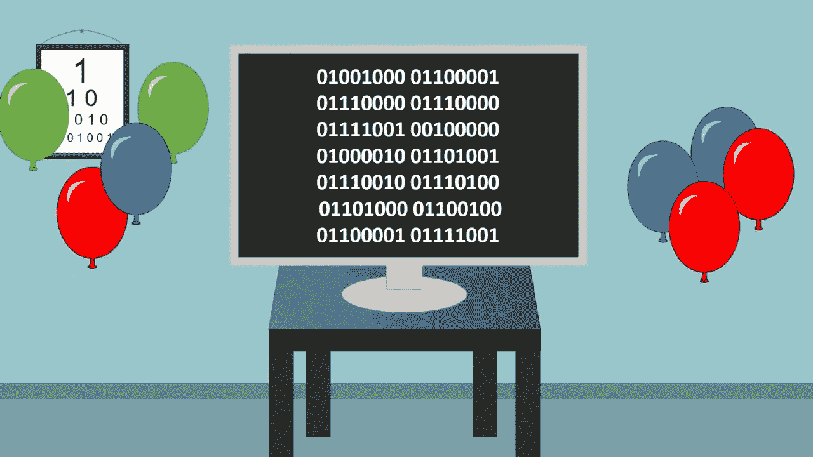

# 编码器祝生日快乐的方式

> 原文：<https://medium.com/hackernoon/coders-way-of-wishing-happy-birthday-1fe457e7a2ba>



Image Source : Google Search

99.9%的人只是在社交网站上互相说***【生日快乐】***，比如和[推特](https://twitter.com/Vinit_Shahdeo)，用同样的 14 个可预测的字母。 ***为什么不用代码说？*** *如果你是开发者你已经明白了！*

```
***01001000*** *01100001* ***01110000*** *01110000* ***01111001*** *00100000* ***01000010*** *01101001* ***01110010*** *01110100* ***01101000*** *01100100* ***01100001*** *01111001* ***00100001***
```

当你心中亲近的人又老了一岁，你会想尽一切办法让他们的日子变得格外难忘。无论你是举办生日派对、鸡尾酒会，还是计划在荣誉获得者最喜欢的餐厅举行晚宴，通过脸书/推特等在线方式祝福他们都是一种传统。人们制作漂亮的卡片来庆祝这一时刻，但是我们呢？我们没有创造力，我们是编码员！不，我必须说我们是有创造力的程序员。让我用一些代码片段来帮助你。

[Click to view gist](https://gist.github.com/vinitshahdeo/f7228e5aff3bf0c21656a079b1306765)

> [**点击这里**](https://code.hackerearth.com/927398t) 运行上面的代码片段！

[Click to view gist](https://gist.github.com/vinitshahdeo/28665b5a010b92cf96cd1abced0a2a9e)

> [**点击这里**](https://code.hackerearth.com/65105eK) 运行上面的代码片段！

现在，让我们为 PHP 爱好者准备一些东西。

```
*Ask him/her to decode this :* **SGFwcHkgQmlydGhkYXkh**
```

现在我们来玩数字游戏:

```
***486170707920426972746864617921***
```

你猜怎么着？没错，就是*十六进制*记数法中的“**生日快乐**”。

最后，设计一个网站总是一个令人印象深刻的想法。我也创建了一个— [点击这里](https://vinitshahdeo.github.io/HBD/)查看！

 [## 生日快乐！

### 编码器祝生日快乐的方式！

vinitshahdeo.github.io](https://vinitshahdeo.github.io/HBD/) 

今年，说一声 [**生日快乐！**](https://vinitshahdeo.github.io/HBD/) “用几行谁也不会忘记的代码。有更好的想法，通过评论分享吧！

> **从年龄=1 到现在，重复聚会直到死去！**

很高兴在这里见到你！感谢您阅读这篇文章。如果需要任何帮助，请随时联系我。

[](https://twitter.com/Vinit_Shahdeo) [## 维尼特·沙赫迪奥

### Vinit Shahdeo 的最新推文(@Vinit_Shahdeo)。软件工程师@getpostman |前副总裁(技术)@codechef VIT |…

twitter.com](https://twitter.com/Vinit_Shahdeo) [](https://www.linkedin.com/in/vinitshahdeo/) [## Vinit Shahdeo -软件工程师-邮递员| LinkedIn

### 技术从来不会让人害怕，它总是会吸引人！热衷于通过技术简化事物。精通数据…

www.linkedin.com](https://www.linkedin.com/in/vinitshahdeo/)