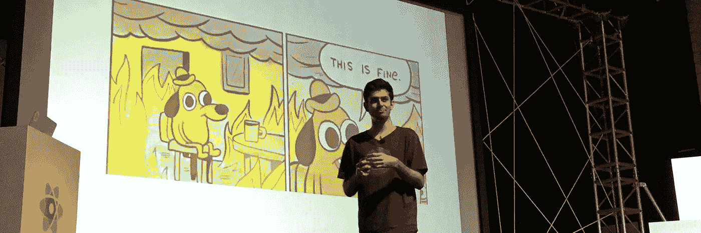
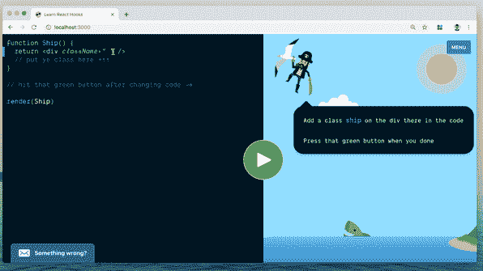
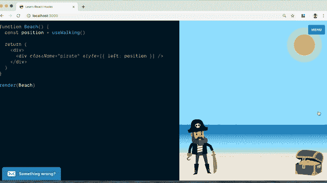

# 采访 Sid，React 背后的搞笑家伙。比赛

> 原文：<https://medium.com/hackernoon/coding-education-part-2-interview-with-sid-a-guy-behind-react-games-257eab1c135c>

Sid is a funny guy, you know

## 编码教育第 2 部分—

## 我采访了独立网站开发者 Sid T1，他辞去了白天的工作，决定开发教育编码游戏。在这次采访中，Sid 分享了他对设计和 JavaScript 的发现，以及它如何定义了他在 web 开发中的未来；谈论他在 React Hooks 上的主要项目、他的时事通讯和他即将到来的计划。

【Soshace.com】**这个帖子之所以成为可能，是因为:雇佣一名开发人员或者找一份远程工作。Part 1(有 Mike Driscoll 和 Chris Ching)可以在这里查看:* [*编码教育最前沿的人 Part 1*](https://hackernoon.com/people-at-the-forefront-of-coding-education-part-1-q-a-with-mike-driscoll-an-author-of-python-628353366ddb)*

****你好希德！请告诉我关于你自己，分享你的故事。****

*多亏了我爸，我很小的时候家里就有了电脑。我花了很多时间用 Powerpoint 制作动画😋。为了让我的动画更有趣，我必须学习如何制作图形。我有幸找到了免费的开源工具，可以用来探索我的创造力。对瘸子大喊！*

*到了上大学的时候，我觉得我不想当设计师，选择了学物理。最终讨厌它，并继续为大学庆典设计海报。*

*图形设计引领了界面设计，我一头扎进了 web 开发的世界，发现了 PHP 和 Javascript，并且一往无前。*

****你现在做什么？****

*那是一个很难回答的问题😅我有点心不在焉，所以在这个时候，我正试图做多件事情。当我写这篇文章时，我正在完成一个在线 Hooks 课程，并为推出 [honest.jobs](https://honest.jobs/) 做准备*

*说到语言，我在任何地方都使用 Javascript 浏览器、服务器、手机等。*

*我在家里的办公室和附近的咖啡馆工作。*

****你为什么会离开之前的职场？你对在创业公司和老牌公司工作有什么感觉？****

*我离开了以前的工作场所，因为我想做自己的项目，而且时机感觉非常好。这是一个工作的好地方，我怎么推荐都不为过。*

*说到选择工作地点，要看情况。在初创公司，你可以承担更多的责任，而在大公司，你的工作影响可能更大。它归结为你在你的阶段寻找什么。我在我的博客上写了更多关于它的内容。*

****请告诉我你的项目背后的故事，React Hooks 课程。****

*我想创建一门课程，诱使你真正完成它，因为你享受完成它的乐趣。这是 react.games 背后的核心理念。它深受约书亚·科莫和戴夫·格迪斯的作品风格的启发。React 上有很棒的课程，我想做一些完全不同的事情，并从中获得乐趣。*

*钩子是使用现有 React 特性的新 API。乍一看，如果你不喜欢编写类，这只是 React 的另一种用法。但是，在应用程序中维护和移动逻辑确实是一种更简单的方法。*

*这门课程是关于什么的？请告诉我们基本的功能，特点等。尽可能描述清楚。*

*你必须帮助海盗找到宝藏。要做到这一点，你必须一边玩游戏一边写代码。*

*要移动一艘船，需要更新船在海洋中的位置，这是在组件中维护数据或状态的一个例子。您需要监听键盘事件，以便当您按下箭头键时，海盗可以行走。*

*海盗教你如何使用钩子来管理状态，应用副作用，创建可重复使用的定制钩子和所有你需要在游戏中导航的东西。*

**

*[*https://react.games/stage-1.gif*](https://react.games/stage-1.gif)*

**

*[*https://react.games/stage-7.gif*](https://react.games/stage-7.gif)*

*我制作了一个视频预览，可能会有帮助:*

*我注意到你也是一个演说家。你能告诉我们更多关于你的经历和你已经参加过的会议吗？*

*是的，我在很多会议上做过演讲。会议是面对面结识网友和结交新朋友的好方法。我通常只看几场演讲，其余时间都在走廊跑道上与人闲逛。*

*我最喜欢的是伦敦、 [ReactFest](https://reactfest.com/) 和 [ReactFoo](https://reactfoo.in) 设计系统公司。我谈论反应和设计系统。*

*我刚从阿姆斯特丹回来，在那里我做了一个关于重构 React 的演讲。*

****请介绍一下你的*** [***迅***](https://sid.studio/newsletter/) ***。你涵盖什么科目？****

*我有一份[每周简讯](https://sid.studio/newsletter/)来分享我学到的东西。我写的是 Javascript、React 和个人成长。*

*以下是一些帮助您入门的文章:*

*[反应——就用儿童](https://sid.studio/post/just-use-children/)*

*为我们其他人设计系统*

*[CSS 动画](https://sid.studio/post/css-animation/)*

*[烧毁](https://sid.studio/post/burnout/)*

****你还有什么其他举措来推动编码教育或者让它变得有趣？请分享。****

*我脑子里还有另一门课程，但要真正开始还需要一段时间。创建课程很难！*

*React 社区的人们发表了很多文章，这太令人惊讶了。也很难跟上。我开始了另一个时事通讯，每周发送一次我认为最有用的 3 篇文章:[tiny rect . email](https://tinyreact.email)*

*我是 Soshace.com[的一名文案，这是一个为网络开发者提供的招聘平台。如果你有有趣的故事要讲，请 DM @](http://soshace.com) [MaryVorontsov](https://twitter.com/MaryVorontsov)*