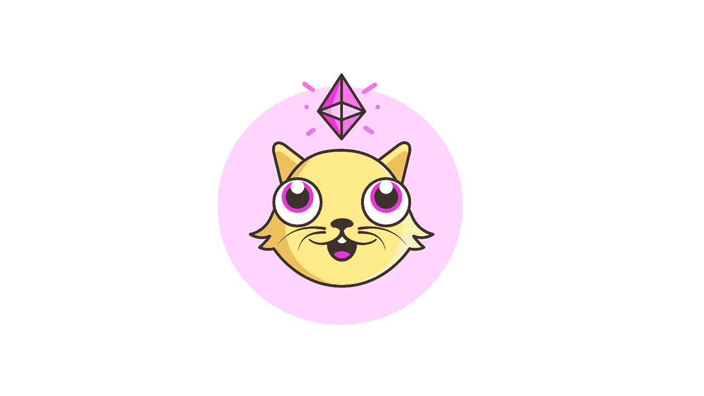
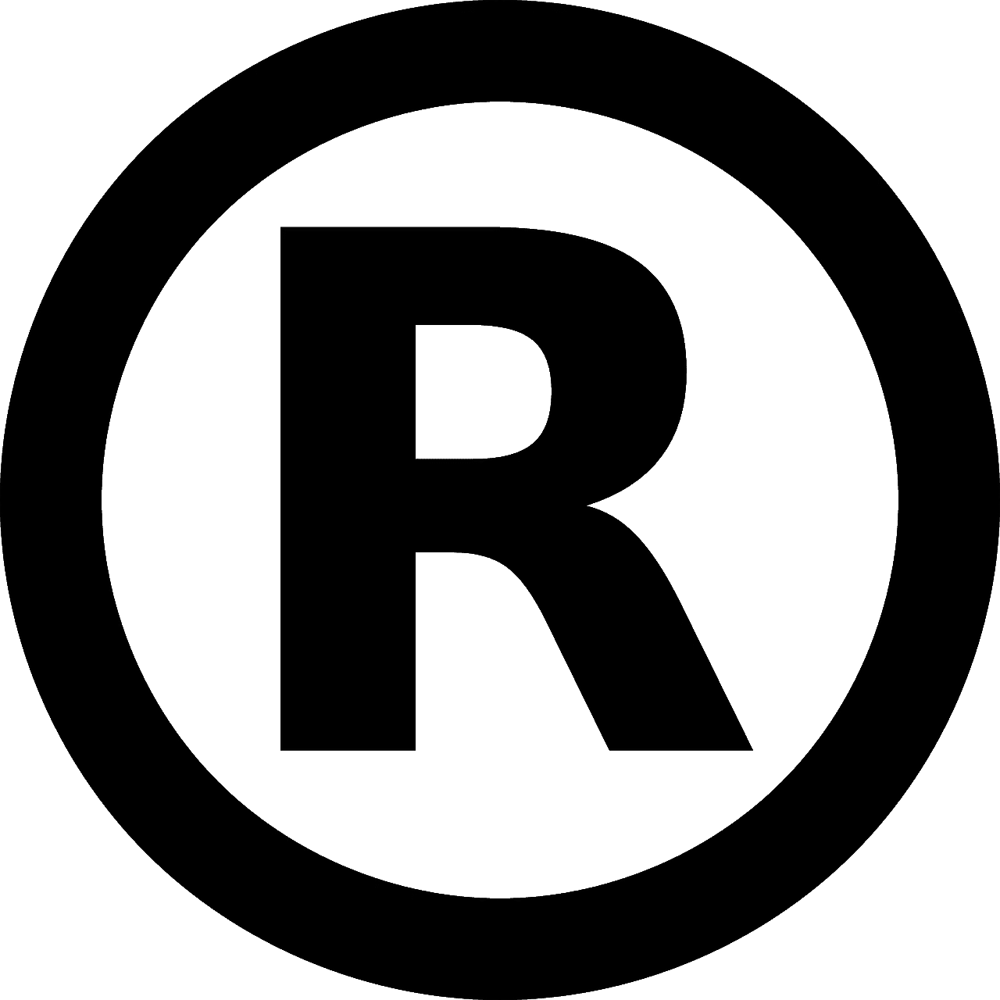
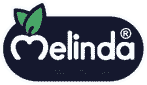
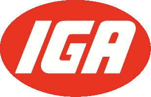

# 区块链社区集体商标？

> 原文：<https://medium.com/hackernoon/collective-trademarks-in-blockchain-communities-b0bb53a48368>

## 当法律赋予最需要的人权力时。

天哪，我碰到了一个有趣的话题。

大家好，我叫 Charles，我是一名狂热的网络空间和知识产权法爱好者，我相信区块链和其他新兴技术将对我们的社会和经济产生巨大影响。

对于这篇文章，我想讨论 2018 年 8 月在大以太坊社区内的子社区 NIFTY 社区中发生的一个有趣的情况，以及为什么区块链社区需要尽早讨论商标所有权[1]。

# 漂亮的商标

CryptoKitties Logomark.**

2018 年年中，Axiom Zen 的子公司 Dapper Labs Inc .和创造 CryptoKitties 的 venture studio 向美国专利商标局(USPTO)提交了“NIFTY”的联邦商标申请，NIFTY 是 NIFTY 亚社区内创造的一个术语，用于描述不可替代的令牌[1][2]，CryptoKitties 是一个分散化应用程序(dApp)，用户可以在以太坊区块链上收集数字宠物(想想尼奥宠物或电子鸡，但在区块链上)。

不可替换令牌是唯一的令牌，通常基于 ERC-721 标准，具有“名称、描述和 URI，通常指向图像”[11]。

NIFTY 商标于 2018 年授予，涵盖与以下相关的商品和服务:

> 国际班(IC) 009。美国 021 023 026 036 038。G & S:可下载的计算机软件，使消费者和企业能够与其他软件、数字资产、数字服装、加密货币、在线服务和数据库进行互动；用于移动电话、便携式媒体播放器和计算机的计算机应用软件，用于使用户能够通过电子钱包持有加密货币；创建和管理用于存放加密货币的电子钱包的计算机软件；应用软件，即用于发送、接收、买卖和存储加密货币的软件；用于访问、读取、跟踪和使用区块链技术、加密货币、数字资产和数字服装的软件；用于促进加密货币交易的软件
> 
> IC 014。美国 002 027 028 050 美元。G & S:促销物品
> 
> IC 025。美国 022 039。G & S:促销服装，即帽子、t 恤衫、运动衫、夹克
> 
> IC 035。美国 100 101 102。G & S:咨询服务，即向第三方提供专业服务、软件开发和教育服务
> 
> IC 041。美国 100 101 107。G & S:提供一个在线网站，使用户能够通过全球通信网络与电脑游戏和其他内容进行互动
> 
> IC 042。美国 100 美元。G & S:为访问、阅读、跟踪和使用区块链技术提供在线非下载软件和应用程序的临时使用；提供用于区块链技术和计算的在线非下载计算机软件；计算机软件设计服务，即区块链和加密货币交易的数字货币安全软件解决方案的设计、开发和实施；计算机编程和计算机软件设计服务，即设计、开发和实施用于区块链和加密货币交易的分层确定性多重签名(hdm)钱包和第三方验证服务的软件；提供具有使用户能够从事加密货币挖掘和加密货币验证服务的技术的网站；平台即服务(paas)以计算机软件平台为特色，用于提供区块链系统的设计、测试、部署和管理；平台即服务(paas ),以用于部署、转移和管理法定货币和加密货币的计算机软件平台为特色；软件即服务(saas) [9]。

正如你所猜测的，这与 NIFTY 亚社区关系不太好，NIFTY 亚社区以合作发展 NIFTY 市场和巩固技术标准而自豪[1][12]。

马特·康登[10]是这个时髦的亚社区中的一位杰出人物，他对这一行为感到震惊，并在推特上发表了严厉的评论(请原谅我的语言):

作为对马特和许多其他人抗议这一行动的多条推特的回应，AxiomZen 的创始人/首席执行官罗哈姆在推特上写道:

点击 [***这里***](https://twitter.com/rohamg/status/1028354797450145792) ***可以找到整个 twitter 的线索。***

然而，考虑到广泛的分类，并且由 [Yalda Mousavinia 恰当地强调，](/@stellarmagnet)当一个机构群体成员对一个机构群体术语进行商标注册时，特别是当其他现有平台已经使用该注册术语作为商品名称时，例如 NIFTYGallery，现在更名为 CryptoGoods Gallery [1][3][4]，会发生什么情况。

尽管如此，Dapper Labs 已经发布了开源的 NFT 许可证 2.0 来管理基于 ERC-721 标准的 NFTs 的使用，以帮助子社区中的其他公司保护他们的作品[13]。

这可能是一个迹象，表明 Roham 真的是他所说的意思，但没有提到 NIFTY 商标，甚至是开源商标许可证，这充分说明 Dapper Labs 坚持帮助其他公司只是对将自己的意志强加给子社区的冒犯[13]。

具体来说，Roham 下面的两条推文显示了他的立场与实际发生的事件之间不一致的迹象:

> “商标是我们流程的一个标准部分——我们提供了 NiftyLicense，我们的总法律顾问跳到了申请文件上——通用词语永远不会被商标删除——我们的兴趣仅在于保护产品和服务不受误导用户的抄袭者的影响，我们绝对会保护社区”
> 
> “第三，也是最重要的:我们致力于支持社区，我们知道我们正处于重大转变的最早期阶段，从集中到点对点，从数字租赁到真正的所有权，从封建主义到自由。要成为主流，我们需要可持续的商业模式”

特别是这两条推文让 Matt Condon 和其他评论者尖锐地提到 Dapper Labs 可以专门为“NIFTY+[一个额外的词]”提交申请，以防止社区术语 NIFTY 被注册商标(或至少与他的总法律顾问交谈以取消申请)[1][5]。

鉴于 NIFTY 的公共所有权被篡夺，区块链社区应该担心社区成员偷偷摸摸或不引人注意地对社区创造的术语和设计提交联邦商标申请[1]。

从这一事件中得到的最重要的教训是，尽管罗门的声明看起来像是资本家的声明，但你应该尽快(尽快)*提交联邦商标申请，以保护该术语，并帮助消费者将该术语与社区联系起来[1][5]。*

*但是，我不建议区块链/分散社群申请传统商标，因为大多数人都知道它们，相反，我建议社群申请被称为 ***的*集体商标/服务标志或集体成员标志****【6】【7】。*

*在进入*集体*商标类型之前，我将提供一个关于集体、商标和服务商标以及商标侵权的简短介绍，因为它们适用于集体商标[14]。*

# *共同的*

**

*按照 Dictionary.com 的定义，集体是“企业、农场等”。，由集团成员共同拥有和经营”[16]。*

*集体听起来很像合作社，但是两者在组织结构上有所不同[15]。在合作社中，这种结构是关于*所有权*(例如，企业中的平等所有权)，而在集体中，这种结构是关于*管理(例如*无层级管理系统)[15]。*

# *商标和服务标志*

**

*Federally Registered Trademark Symbol*

*商标是任何标志(文字、图案、颜色、声音、符号、图案等)。)在商业中用来区分一个卖家的商品与其他卖家的商品，并标明商品的原产地[16]。*

*服务商标是在商业中使用的任何标志，用于区分一个提供商的服务和其他提供商的服务，并表明服务的来源[16]。*

*两者都要求*在《商标法》第 45 节*、 [15 U.S.C. 1127](https://tmep.uspto.gov/RDMS/TFSR/current#/current/sec-0bf15ce9-7f42-4d7b-9224-c09f64b8c9bc.html) 中定义的商业中使用，即与商标相关的商品或服务在州际商业中(例如，通过互联网)用于商品或服务的扩散(例如，在商品或包装上放置商标)或服务(例如，在服务广告中使用商标)[17][18]。*

*根据《兰哈姆法》，当存在混淆的可能性时，即消费者将注册所有人的商标或服务标志与他人或实体的商标混淆时，商标或服务标志即被侵权[19]。*

*为了显示混淆的可能性，联邦法院依赖于*杜邦*因素(根据联邦巡回法院的不同略有变化):*

> **(1)商标在外观、声音、内涵和商业印象上的整体相似或相异。**
> 
> **(2)在申请或注册中描述的或与在先商标使用有关的商品或服务的相似性或不相似性及性质。**
> 
> **(3)已建立的、可能持续的贸易渠道的相似性或差异性。**
> 
> **(4)销售的条件和购买者，即“冲动”与谨慎、老练的购买。**
> 
> **(5)在先商标的知名度(销售、广告、使用期限)。**
> 
> **(6)在类似商品上使用的类似标志的数量和性质。**
> 
> **(7)任何实际混乱的性质和程度。**
> 
> **(8)在没有实际混淆证据的情况下同时使用的时间长度和条件。**
> 
> **(9)使用或不使用标志的商品品种(屋标、“族”标、品标)。**
> 
> **(10)申请人与在先商标所有人之间的市场接口:**
> 
> **…**
> 
> **(11)申请人有权拒绝他人在其商品上使用其商标的程度。**
> 
> **(12)潜在混淆的程度，即*是微小的*还是重大的。**
> 
> **(13)证明使用效果的任何其他既定事实【19】。**

# *集体商标*

**

*Melinda Consortium collective mark.***

*集体商标是为集体实体制作的商标，如协会、合作社、工会等[6][7]。在这种情况下，商标归集体所有，而不是归其“个人成员”所有[6][7][8]。*

*这些标记通常由集体实体持有，完全是为了集体成员的利益[14]。与此形成对比的是，普通商标完全由个人或实体所有，利益完全属于所有者[14]。*

*集体成员资格标志是指表示特定集体成员资格的标志[6]。集体成员标志不表示商品或服务的商业来源，也不表示任何商品或服务[6]。*

*另一方面，集体商标或服务商标是表明(1)商品或服务的商业来源和(2)商品或服务的提供者符合集体成员资格标准的商标[6][8][14][20]。*

*有了集体商标或服务标志，与集体成员标志相反，集体成员使用该标志将其商品或服务与其他提供者区分开来，并表明其商品或服务的商业来源[6][8][14][20]。*

*换句话说，集体商标可以像普通商标一样使用，即使成员组织本身并不生产商品和服务[20]。*

*集体商标并不比普通商标更难获得，但构成申请基础的样本(即商标)是不同的[6]。集体商标的样本必须显示集体成员对商标的使用，而普通商标必须显示所有者对商标的使用[6]。*

*集体实体必须显示对商标的控制(例如，有权使用商标的人、与集体实体的关系以及集体实体如何控制商标)，这可以通过章程、品牌指南或其他具有类似效果的文件来显示[28]。*

*此外，适用于普通商标的混淆可能性标准也适用于集体商标[6]。*

*对于希望为机构群体保留某个术语的机构群体而言，集体成员标志或集体商标或服务标志是将该术语保留在机构群体内的理想选择，并提供使用该术语的专有法律权利(机构群体可以根据自身的原则和价值观在需要时强制执行)[6][8][20]。*

# *集体商标的真实例子*

**

*International Grocers Alliance “IGA” initial mark.***

*四个现实世界的集体商标的例子是新罕布什尔州注册公共会计师(CPAs)协会、花店的跨国递送、国际种植者联盟和国际隐私专业人员协会[需要来源]。*

*新罕布什尔州注册会计师协会拥有集体服务标志，提供协会服务以促进新罕布什尔州注册会计师和当地会计行业的利益[21]。*

*花店的全球递送(FTD)拥有一个集体服务标志，为花店的业务运营提供服务，帮助促进花店之间的商品和服务交换，促进花店行业，并提供有关礼品、鲜花、植物和插花销售的信息材料[23]。*

*国际种植者联盟(IGA)在首字母“IGA”上拥有集体服务商标，该商标与提供“以杂货店商品和汽油为特色的零售商店服务以及零售药店服务”有关[24]。*

*IGA 的主要业务是通过非品牌商店的特许杂货店模式，即不包括商标(集体服务商标，因此不需要许可)，大多数特许商店是家庭所有，位于小市场[25]。*

*IGA 是世界上最大的独立杂货零售商，在 30 多个国家开展业务[26]。*

*国际隐私专业人员协会(IAPP)在该组织名称的标准字符标志上拥有集体服务标志，与提供“关联服务，即促进专业人员在隐私、数据保护和安全、数据管理、数据审计和上述法律合规性领域的利益”[27]有关。*

*IAPP 为对隐私感兴趣的人或希望了解行业动态的隐私专业人士提供认证、培训、会议和其他资源。*

# *假设的例子*

*这里有一个假设的例子，说明一个群体将如何考虑申请集体商标。*

*一个区块链社区或亚社区，姑且称之为 **Quirkteam** ，将开发一个商标合格标志。*

*Quirkteam 开始看到符合商标条件的术语或设计成为识别社区的主要术语或设计的潜力。*

*Quirkteam 意识到了误用和滥用合格商标的可能性，决定创建一个集体实体，作为合格商标的所有者。*

*然后，Quirkteam 将向 USPTO 提交联邦商标申请，申请集体商标(商标、服务商标或会员标志)。*

*如果成功，USPTO 将颁发一个联邦注册的集体商标 Quirkteam。*

*然后，Quirkteam 可以管理其成员对集体标志的使用(例如，通过集体实体的章程或品牌指南)，从而维护社区使用标志的原则和价值观。*

# *集体商标的替代品*

*区块链社区或子社区也可以选择将社区创建的术语或设计专用于公共领域，任何人都可以不受任何限制地免费使用。*

*此外，社区可以利用知识共享许可的一个版本来保护术语或设计的版权使用[29]。*

# *笔记*

*** =严格用于规范用途。商标所有者保留所有权利。*

# *放弃*

*此处包含的任何内容都不应被解释为或旨在作为财务或法律建议。*

*这篇文章只是为了提供信息。*

*您同意，阅读本文或在未来活动中使用本文不会产生任何律师-客户关系。*

# *承认*

*感谢@Ledgerback 的所有人对本文的帮助。非常感谢。*

# *参考*

**可根据要求提供格式化参考资料**

*[【1】https://medium . com/@ stellar magnet/nifty-ether eums-first-trade mark-battle-996 c840 b 2583](/@stellarmagnet/nifty-ethereums-first-trademark-battle-996c840b2583)*

*[2]https://trademark.trademarkia.com/nifty-88046182.html*

*[3][https://gallery.cryptogoods.com](https://gallery.cryptogoods.com)*

*[https://www.cryptogoods.com/](https://www.cryptogoods.com/)*

*[https://twitter.com/rohamg/status/1028354797450145792](https://twitter.com/rohamg/status/1028354797450145792)*

*[6][https://www . ny-trade mark-lawyer . com/collective-trade mark . html](https://www.ny-trademark-lawyer.com/collective-trademarks.html)*

*[7]美国法典第 15 编第 1127 节*

*[8][https://www . nolo . com/legal-encyclopedia/collective-marks-when-your-group-wants-protected-name . html](https://www.nolo.com/legal-encyclopedia/collective-marks-when-your-group-wants-protects-name.html)*

*[9][http://tmsearch.uspto.gov/bin/showfield?f=doc&状态=4803:qjuma1.2.8](http://tmsearch.uspto.gov/bin/showfield?f=doc&state=4803:qjuma1.2.8)*

*[https://www.nifty.gg/agenda/speakers/285069](https://www.nifty.gg/agenda/speakers/285069)*

*[11][https://medium . com/@ jagordon/nifty-区块链-游戏-思想-92075a4f934a](/@jagordon/nifty-blockchain-gaming-thoughts-92075a4f934a)*

*[https://www.nifty.gg/](https://www.nifty.gg/)*

*[13][https://medium . com/dapper labs/NFT-license-2-0-why-a-NFT-can-do-what-Mickey-mouse-never-could-27673 D5 f 29 aa](/dapperlabs/nft-license-2-0-why-a-nft-can-do-what-mickey-mouse-never-could-27673d5f29aa)*

*[https://www.bitlaw.com/source/tmep/1302.html](https://www.bitlaw.com/source/tmep/1302.html)*

*[15][http://CDI . coop/coop-cathy-coops-and-collectives-difference/](http://cdi.coop/coop-cathy-coops-and-collectives-difference/)*

*[16][https://www . USPTO . gov/learning-and-resources/trade mark-FAQ # 1223](https://www.uspto.gov/learning-and-resources/trademark-faqs#1223)*

*[17][http://www . Walt mire . com/2015/01/03/use-in-commerce-mean-trade mark-application/](http://www.waltmire.com/2015/01/03/use-in-commerce-mean-trademark-application/)*

*[18][https://tmep . USPTO . gov/RDMS/TMEP/current #/current/TMEP-900 d1e 1 . html](https://tmep.uspto.gov/RDMS/TMEP/current#/current/TMEP-900d1e1.html)*

*[19] [*参见杜邦公司&，*《联邦判例汇编》第二辑第 476 卷第 1357 页，美国药典第 177 卷第 563 页(CCPA，1973 年)](https://scholar.google.com/scholar_case?case=10357410588643700224&q=476+F.2d+1357,+177+USPQ+563+(C.C.P.A.+1973)&hl=en&as_sdt=6,29)。*

*[https://www.bitlaw.com/source/tmep/1303.html](https://www.bitlaw.com/source/tmep/1303.html)*

*[https://www.bitlaw.com/source/tmep/1303_01_a_i.html](https://www.bitlaw.com/source/tmep/1303_01_a_i.html)*

*[22][https://www.trademarkia.com/trademarks-search.aspx?tn =社会注册会计师](https://www.trademarkia.com/trademarks-search.aspx?tn=society%20of%20certified%20public%20accountants)*

*[23][https://trade mark . trade markia . com/flowers-trans world-delivery-73711904 . html](https://trademark.trademarkia.com/florists-transworld-delivery-73711904.html)*

*[https://trademark.trademarkia.com/iga-78613151.html](https://trademark.trademarkia.com/iga-78613151.html)*

*[25][https://www.iga.com/about/about-iga;](https://www.iga.com/about/about-iga)[https://en . Wikipedia . org/wiki/IGA _(超市)]/](https://en.wikipedia.org/wiki/IGA_(supermarkets))*

*[https://www.iga.com/about/about-iga](https://www.iga.com/about/about-iga)。*

*[27][https://trade mark . trade mark ia . com/the-international-association-of-privacy-professionals-86843346 . html](https://trademark.trademarkia.com/the-international-association-of-privacy-professionals-86843346.html)。*

*[28][https://www.bitlaw.com/source/tmep/1303_01_a_i_A.html](https://www.bitlaw.com/source/tmep/1303_01_a_i_A.html)*

*[29]https://creativecommons.org/licenses/*