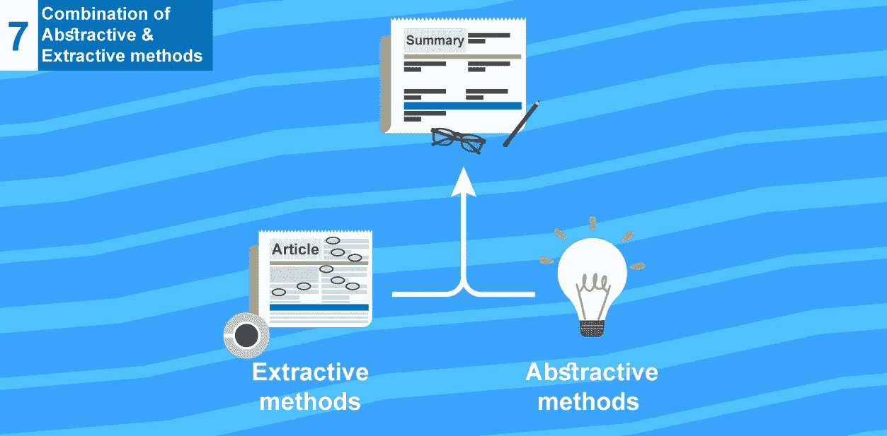
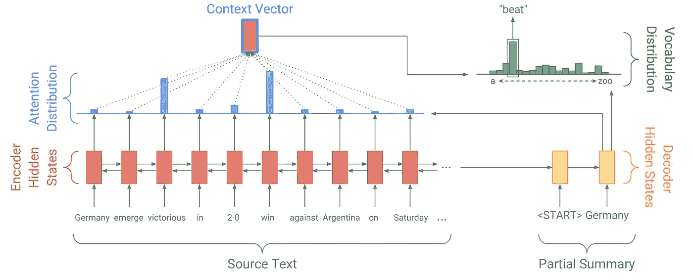
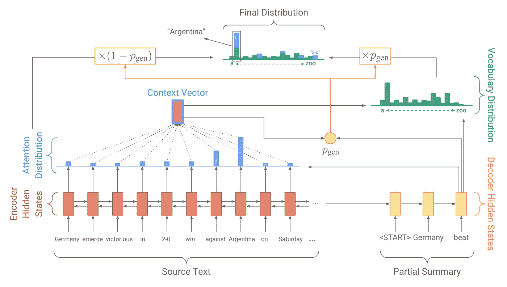
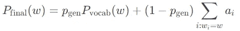
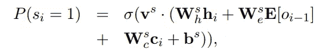
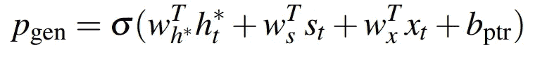

# 用于文本摘要的抽象和抽取方法的组合(教程 7)

> 原文：<https://medium.com/hackernoon/combination-of-abstractive-extractive-methods-for-text-summarization-tutorial-7-8a4fb85d67e2>



Combining both Abstractive & Extractive methods for text summarization

本教程是一系列教程中的第七篇，将帮助您使用 tensorflow 构建一个抽象的文本摘要器。

今天，我们发现了一些新颖的方法，将复制单词的抽象和提取方法结合起来，用于文本摘要，([代码](http://bit.ly/eazysum)可以在这里找到，在 google colab 的 jupyter 笔记本格式中)，我们将结合生成新单词的概念，从给定的句子中复制单词，我们将**了解这很重要的原因**，我们将详细介绍它实际上是如何完成的！！


EazyMind free Ai-As-a-service for text summarization

实际上，您可以通过 [eazymind](http://bit.ly/2VxhPqU) 使用该模型轻松生成您自己的摘要(我已经将该模型添加到 eazymind，因此可以通过简单的 api 调用来调用它，并通过 [python 包](http://bit.ly/2Ef5XnS)，因此该模型可以轻松集成到您的应用程序中，而无需设置 tensorflow 环境)，您可以免费注册[，并享受免费使用该 api 的乐趣。](http://bit.ly/2VxhPqU)

> 今天我们将讨论这两篇论文中讨论的概念([使用 Seq](https://www.aclweb.org/anthology/K16-1028) 的抽象文本摘要)& ( [抓住要点:使用指针生成器网络的摘要](https://arxiv.org/pdf/1704.04368.pdf)、[他们的报告](https://github.com/abisee/pointer-generator)、[他们真正**令人惊叹的**博客文章](http://www.abigailsee.com/2017/04/16/taming-rnns-for-better-summarization.html))，他们的工作真的很有帮助，取得了真正伟大的成果，我真的要感谢他们惊人的努力

今天我们会

1.  讨论我们如何整合文本摘要的抽象和提取方法。
2.  快速浏览[代码](http://bit.ly/eazysum) & [数据预处理](https://github.com/theamrzaki/text_summurization_abstractive_methods/tree/master/Implementation%20B%20(Pointer%20Generator%20seq2seq%20network)/PreProcessData)(我已经将这个模型转换成一个 jupyter 笔记本，可以在 google colab 上无缝运行，数据在 google drive 上找到，所以不需要下载代码和数据，你只需要一个 google colab 会话来运行代码，并将数据从我的 google drive 复制到你的 google drive 上([更多关于这个](https://hackernoon.com/begin-your-deep-learning-project-for-free-free-gpu-processing-free-storage-free-easy-upload-b4dba18abebc))，并将 Google drive 连接到你的 google colab 笔记本上)。
3.  这个模型已经被转换为一个 [api](http://bit.ly/2VxhPqU) (和一个 [python 包](http://bit.ly/2Ef5XnS))，你可以简单地在你的项目中试用它，而不需要麻烦地实际设置你的 tensorflow 环境，你可以在 [eazymind](http://bit.ly/2VxhPqU) 上免费注册，并且现在免费使用这个 api。

# 0-关于系列

这是一系列教程，将帮助您在多种方法中使用 tensorflow 构建一个抽象的文本摘要器，我们称之为抽象，因为我们教神经网络生成单词而不仅仅是复制单词，今天我们将这些概念与提取概念相结合，以获得两个世界的好处。

到目前为止我们已经讨论过了(这个系列的代码可以在[这里](https://github.com/theamrzaki/text_summurization_abstractive_methods)找到)

0.[深度学习免费生态系统概述](https://hackernoon.com/begin-your-deep-learning-project-for-free-free-gpu-processing-free-storage-free-easy-upload-b4dba18abebc)(如何使用 google colab 和 google drive)

1.  [概述文本摘要任务和用于该任务的不同技术](https://hackernoon.com/text-summarizer-using-deep-learning-made-easy-490880df6cd)
2.  [使用的数据以及如何表示我们的任务](https://hackernoon.com/abstractive-text-summarization-tutorial-2-text-representation-made-very-easy-ef4511a1a46)(本教程的先决条件)
3.  [什么是 seq2seq 文本摘要，为什么](https://hackernoon.com/tutorial-3-what-is-seq2seq-for-text-summarization-and-why-68ebaa644db0)
4.  [多层双向 LSTM/GRU](/@theamrzaki/multilayer-bidirectional-lstm-gru-for-text-summarization-made-easy-tutorial-4-a63db108b44f)
5.  [光束搜索&注意文字摘要](/@theamrzaki/beam-search-attention-for-text-summarization-made-easy-tutorial-5-3b7186df7086)
6.  [建立 seq2seq 模型，注意&波束搜索](https://hackernoon.com/build-an-abstractive-text-summarizer-in-94-lines-of-tensorflow-tutorial-6-f0e1b4d88b55)

在这些教程中，我们构建了一个角石模型，它将在今天的基础上得到增强，因为所有最新的方法都建立在这个角石基线模型上

让我们开始吧！！

# 1-为什么要复制？

上一个[教程](https://hackernoon.com/build-an-abstractive-text-summarizer-in-94-lines-of-tensorflow-tutorial-6-f0e1b4d88b55)，我们已经建立了一个 seq2seq 模型，具有注意力和波束搜索能力，能够进行抽象文本摘要，结果确实不错，但它会遇到一些问题，**词汇表外的单词** (OOV)，

**1–1 个词汇以外的单词**

哪些是看不见的单词，实际上这个问题来自于这样一个事实，即我们用有限的词汇来训练我们的模型(因为词汇不可能包含所有的英语单词)，所以在测试中，我们的模型会面对他以前没有见过的新单词，通常我们会将这些单词建模为<unk>，但实际上这不会生成好的摘要！！</unk>

**1–2 错误的事实信息**

另一个问题是没有准确地产生事实信息

> 给出一句话:在昨晚的比赛中，*德国队以 3:2*击败了阿根廷队
> 
> *模型会生成:*德国击败阿根廷****2–1****

*这是因为标记**3–2**实际上是唯一的，(不是未知的，而是唯一的)，模型更难重新生成，因此如果模型能够从原始句子中复制标记**3–2**而不是自己生成它，就会容易得多。*

***1–3 用相似的错误名称替换名称***

*另一个问题是人和国家的确切名称，因为我们的模型实际上会使用单词嵌入的概念将相同的国家聚集在一起，所以我们会看到模型实际上看到两个单词(*德里* & *孟买*)相同，并且会看到像(*安娜* & *艾米丽*)一样的名称，因为它们会有相似的单词嵌入。*

> *因此，我们将实现一个能够从原始句子中复制独特单词的模型，因为我们的模型很难自己重新生成这些单词，这种技术被称为**指针生成器***

# *2-什么是**指针发生器**？*

*这实际上是一个神经网络，它被训练来学习何时**生成新词**，何时**从原句**复制词。*

*它被称为**指针生成器网络**，因为我们使用指针来指出将从原句中复制的单词。*

## *2–1 我们的基本结构*

> *这个图是从([言归正传:用指针生成器网络进行总结](https://arxiv.org/pdf/1704.04368.pdf)、[他们的回购](https://github.com/abisee/pointer-generator)、[他们真正的**惊人的**博文](http://www.abigailsee.com/2017/04/16/taming-rnns-for-better-summarization.html))中借来的*

**

*基本结构构建为一个 [seq2seq](https://hackernoon.com/tutorial-3-what-is-seq2seq-for-text-summarization-and-why-68ebaa644db0) 模型([多层双向 LSTM](/@theamrzaki/multilayer-bidirectional-lstm-gru-for-text-summarization-made-easy-tutorial-4-a63db108b44f) 编码器&一个带[波束搜索&注意](/@theamrzaki/beam-search-attention-for-text-summarization-made-easy-tutorial-5-3b7186df7086)的解码器)并生成输出语句，我们使用两者的输出*

1.  ***解码器***
2.  ***注意力**(上下文向量)(即:注意力实际上告诉我们哪些单词对我们的输入是重要的)*

*从这两个输出中，我们将生成所有词汇的概率分布，这被称为**词汇分布**，这个分布帮助我们生成最终输出*

> *请记住，这里有两个重要的发行版:*
> 
> *1-一个**局部**分布(**注意**)，它告诉输入句子中哪些单词是重要的*
> 
> *2-这个**局部**分布(**注意力**)用于计算**全局**分布(**词汇分布**)，它根据 vocab 的**所有**单词来告诉输出的相关概率*

## *2–2 现在让我们添加指针生成器网络*

*指针生成器网络在这里将是一个神经网络，被训练来选择从哪里生成输出，或者从*

1.  ***全局**分布(**词汇分布**)，即:生成新颖的新词*
2.  *或者从**局部**分布(**注意**)，即:从原句中复制单词*

> *这个图表和公式都是借用了([言归正传:用指针生成网络进行总结](https://arxiv.org/pdf/1704.04368.pdf)，[他们的回购](https://github.com/abisee/pointer-generator)，[他们的真实**惊人**博文](http://www.abigailsee.com/2017/04/16/taming-rnns-for-better-summarization.html))*

****

*因此我们将有一个参数 **Pgen** ，它将包含从 **Vocab 分布** (P vocab)或从**注意力分布**(单词的注意力总和)生成单词的概率，(即:要么生成一个新单词，要么从句子中复制该单词)*

# *3-如何构建指针生成器网络*

*实现该网络有两种主要方法，两种方法都依赖于相同的概念，只是在实现上略有不同，*

*主要投入将是*

1.  *解码器输入*
2.  *注意力输入*

*[使用序列间 RNNs 和超越论文的抽象文本摘要](https://www.aclweb.org/anthology/K16-1028)*

**

*这里是 Pgen，这里我们通过训练一个 sigmoid 层得到它，*

*输入将是*

1.  ***hi :** 解码器隐藏状态(解码器输出)→ **解码器**参数*
2.  ***E[oi1]**:解码器步骤的前一时间步→ **解码器**参数*
3.  ***ci** :注意力加权上下文向量→ **注意力**输入*

*Ws h、Ws e、Ws c、b s 和 v s 是可学习的参数。*

*[抓住要点:用指针生成器网络进行总结](https://arxiv.org/pdf/1704.04368.pdf)*

**

*1. **st :** 解码器状态→ **解码器**参数*

*2. **xt** :解码器输入→ **解码器**参数*

*3.**ht∫**:上下文向量→ **注意**输入*

*其中，矢量 wh∫、ws、wx 和标量 bptr 是可学习的参数*

## *4-张量流实现*

*[abisee](https://github.com/abisee) 已经使用 tensorflow 实现了论文[Get To The Point:summary with Pointer-Generator Networks](https://arxiv.org/pdf/1704.04368.pdf)，他的代码基于来自 Google Brain 的 [TextSum 代码](https://github.com/tensorflow/models/tree/master/textsum)。*

*我修改了他的代码([我的修改](http://bit.ly/eazysum))*

*   *在 jupyter 笔记本上运行，在 google colab 上无缝运行*
*   *并且已经将[数据](https://drive.google.com/open?id=15c2wPpL4MGCooDx8Y1dw9M0o05P-EJto)上传到 google drive，很容易整合到 google colab 中(更多关于这个的*

*所以不需要下载代码，也不需要下载数据，你只需要一个 google colab 会话来运行代码，将数据从我的 google drive 复制到你的 google drive 上(关于这个还有[，将 Google drive 连接到你的 google colab 笔记本上)](https://hackernoon.com/begin-your-deep-learning-project-for-free-free-gpu-processing-free-storage-free-easy-upload-b4dba18abebc)*

## *5-数据表示*

*这个模型是建立在 CNN/每日邮报的数据集上的，这个数据集是为同一个故事建立多个摘要的*

*通过将数据运行到一个[脚本](https://github.com/abisee/cnn-dailymail)中，将数据转换成分块的二进制文件，然后提供给模型，从而将数据提供给模型*

*我已经修改了这个脚本([我的修改](http://v))，使其更加容易(以防您需要重新处理自己的数据)*

*原始脚本期望以. story 格式提供数据，这是一个在同一个文件中包含文本和摘要的数据文件，所以我只是编辑得更简单，现在您可以以 csv 格式将您的数据提供给[我的脚本](https://github.com/theamrzaki/text_summurization_abstractive_methods/tree/master/Implementation%20B%20(Pointer%20Generator%20seq2seq%20network)/PreProcessData)*

*我还用更简单的 nltk tokenizer 取代了下载特定 java script (Stanford CoreNLP)进行标记化的需要(希望这能有所帮助)*

## *6- [EazyMind](http://bit.ly/2VxhPqU) API*

**

*如果你需要尝试这个模型(在尝试[代码](http://bit.ly/eazysum)之前)，你可以通过 [eazymind](http://bit.ly/2VxhPqU) 很容易地做到这一点，这是一个**免费的人工智能即服务平台**，为抽象文本摘要提供这个指针生成器模型*

*你也可以免费[resister](http://bit.ly/2VxhPqU)通过 curl 调用这个模型作为 api*

```
*curl -X POST \
  [http://eazymind.herokuapp.com/arabic_sum/eazysum](http://eazymind.herokuapp.com/arabic_sum/eazysum) \
  -H 'cache-control: no-cache' \
  -H 'content-type: application/x-www-form-urlencoded' \
  -d 'key=xxxxxxxxx&sentence=Facebook%20CEO%20Mark%20Zuckerberg%2C%20left%2C%20makes%20the%20keynote%20speech%20at%20F8%2C%20the%20Facebook%26%2339%3Bs%20developer%20conference%2C%20Tuesday%2C%20April%2030%2C%202019%2C%20in%20San%20Jose%2C%20Calif.%20(AP%20Photo%2FTony%20Avelar%20)%0AFacebook%20says%20that%2C%20unlike%20its%20past%2C%20its%20future%20is%20privacy%0AA%20trader%20works%20ahead%20of%20the%20closing%20bell%20on%20the%20floor%20of%20the%20New%20York%20Stock%20Exchange%20(NYSE)%20on%20April%2012%2C%202019%20in%20New%20York%20City.%20(Photo%20by%20Johannes%20EISELE%20%2F%20AFP)%20%20%20%20%20%20%20%20(Photo%20credit%20should%20read%20JOHANNES%20EISELE%2FAFP%2FGetty%20Images)%0AResilience%20is%20still%20the%20word%20for%20stocks'*
```

*或者通过 [python 包](http://bit.ly/2Ef5XnS)*

```
*pip install eazymind*
```

*那就干脆称之为*

```
*from nlp.eazysum import Summarizer
key = "xxxxxxxxxxxxxxxxxxxxx"sentence = """(CNN)The White House has instructed former    White House Counsel Don McGahn not to comply with a subpoena    for documents from House Judiciary Chairman Jerry Nadler,     teeing up the latest in a series of escalating oversight     showdowns between the Trump administration and congressional Democrats.      McGahn's decision not to comply     with the subpoena could push Nadler     to hold McGahn in contempt of Congress,     just as he's moving to do with Attorney General William Barr after the Justice     Department defied a subpoena for the unredacted Mueller report and underlying evidence.""" summarizer = Summarizer(key)
print(summarizer.run(sentence))*
```

*如果上帝愿意，下一次我们会去的*

*   *结合**强化学习和 seq2seq** 用于摘要文本摘要的新方法*

*([更多关于文本摘要 seq2seq 的不同实现](https://hackernoon.com/text-summarizer-using-deep-learning-made-easy-490880df6cd?source=post_stats_page---------------------------))*

*本教程的所有代码都可以在这里找到。*

> **我真心希望你喜欢阅读本教程，我希望我已经把这些概念讲清楚了，这一系列教程的所有代码都可以在这里找到*[](https://github.com/theamrzaki/text_summurization_abstractive_methods)**，你可以简单地使用 google colab 来运行它，请查看教程和代码并告诉我你对它的看法，别忘了尝试一下*[*【eazymind*](http://bit.ly/2VxhPqU)*来免费生成文本摘要，希望再次见到你***