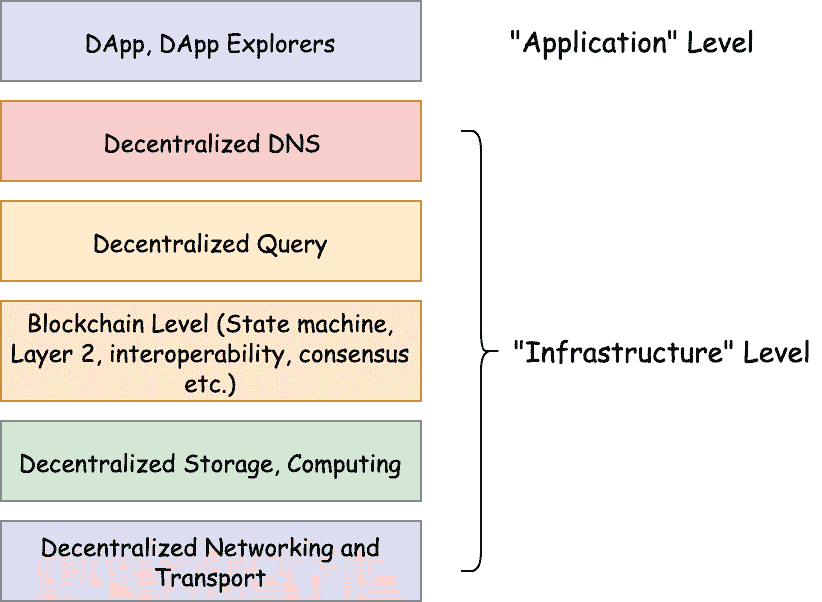
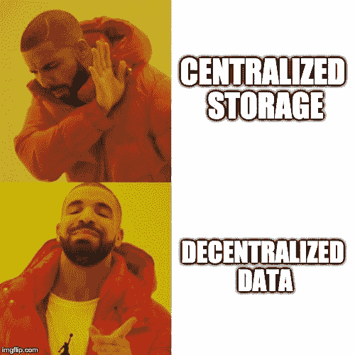
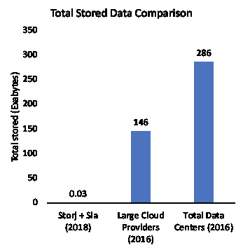
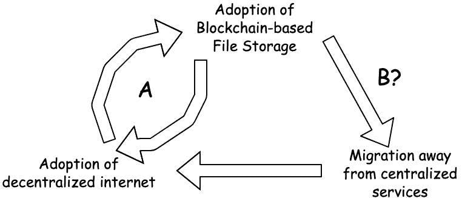

# 结合区块链和文件存储可能会分散互联网

> 原文：<https://medium.com/hackernoon/combining-blockchain-and-file-storage-might-just-decentralize-the-internet-d94c2701a8fa>

王传君是总部位于区块链的文件存储系统 Archon Cloud 的联合创始人，他在那里领导研究和其他工作。

TL；DR:这篇文章描述了基于区块链技术的文件存储系统的出现和潜在影响。基于区块链的文件存储(BFS)是集中式存储和非激励式 P2P 文件系统的一种有前途的替代方案。如果 BFS 能够克服它所面临的许多可用性和技术挑战，它有可能成为事实上的存储基础设施，催化去中心化的互联网。

# **简介**

最近，人们开始关注分散式系统，因为它们有望开发出无需中介的新型应用，创造新的规模经济，并提供前所未有的用户数据控制。智能合约功能使用户能够创建具有这些优势的应用程序。有了这个工具，人们越来越浪漫地将一个新的互联网称为去中心化互联网(或 web3)，在那里应用程序将比现在更加强大和壮观。分散式应用将在经济上安全的区块链系统基础上开发。

很快就变得很明显，作为“去中心化的操作系统”,如果不改进许多东西，区块链自己无法处理比 Cryptokitties 更需要资源的应用程序。这些事件引发了公众对去中心化基础设施进行创新和改进的狂热，这样就可以产生有用的去中心化应用程序。

例如，区块链本身是一个非常差的存储设备。一个重要的认识是不能经济地在链上存储文件[1]。事实上，由成千上万的用户共享的分类帐(其中每个数据在每个用户之间复制)实际上无法容纳超过兆字节规模的数据。

因此，分散系统中的许多重要发展应该并且确实发生在区块链之外——某些第 2 层解决方案、专用 P2P 网络解决方案、存储文件等。实际的区块链和其他独立的组件加起来形成了分散的互联网。

The web3 stack

尽管去中心化系统可能是革命性的，但如果技术很糟糕，没有多少人会加入去中心化互联网，这意味着去中心化技术栈不会比现有解决方案差太多(除非去中心化的有趣属性)。

目前，该堆栈的任何部分都不完整，DNS、存储和计算层的开发都处于早期阶段。一个典型的口头禅是这样的“我们将使用区块链来构建一个 DApp，以利用区块链的不变性”等等。，即使我们必须将文件存储在某个集中的位置也没问题”[2]。

我认为，尽管有可能在区块链的基础上构建一个被广泛采用的“应用程序”，但是如果没有以一种不可信的、分散的方式加载和交换数据，这些应用程序就不是“分散的应用程序”。换句话说，从其他方面来看，这些都是有趣的应用程序，但不一定是因为它们是真正去中心化的。

这让我想到了我的核心论点:

> *基于区块链的文件存储- >去中心化数据- >去中心化互联网*

BFS 将成为 web3 的中坚力量。我将加强我的主张，BFS 通过*去中心化的数据*催化去中心化的互联网。因为没有真正分散的数据，就没有真正的 dapp，没有真正的 dapp 就没有分散的互联网。

与其他存储解决方案相比，一个安全、公平、经济的 BFS 具有许多潜在优势，无论是一般意义上还是对于 web3 基础设施而言。我也将分析为 BFS 实现大众传播普及的实质性技术和商业障碍。

# **集中式云存储开始主导市场(20 世纪 90 年代至今)**

在 20 世纪 90 年代，文件存储在本地服务器上，人们可以直接从其他不同的计算机上请求数据。尽管人们能够自己完全控制和提供文件，但设置好这些服务器需要网络、网络安全以及时间方面的丰富经验。

这起初似乎不是什么大问题，因为整个互联网到 1997 年只有大约 1.5TB，互联网的总价值远没有今天这么大。一位著名的计算机科学家很好地总结了当时的一个流行观点:“总共可能有几千千兆字节的信息；到 2000 年，磁带和磁盘的产量将达到那个水平。

在接下来的几年里，这种模式发生了变化，因为计算机与计算机之间的交互产生的数据远远超过了人类自身产生的数据，其中许多数据对消费者和企业非常有用，他们找到了从人工智能、超高清视频和金融建模等数据中产生结果的新方法。

用户对存储、处理和分析这些数据的需求变得越来越重要，他们自己很难处理。截至 2018 年，每年生成约 32(即 32，000，000，000 TB)的数据。

这就是亚马逊的用武之地。随着亚马逊开始将自己确立为电子商务业务的主要参与者，他们意识到他们已经开发了一套庞大的内部 API 和基础设施来处理他们业务的大量数据。很快，亚马逊团队建立了一个完整的内部软件集合，帮助他们的各个部门节省了几个月的时间，不用担心基础设施[4]。2006 年，亚马逊 S3 和 EC2 发布，预示着集中式云时代的到来。

云让用户可以轻松访问亚马逊强大的工具集，并因其简单和强大而开始主导许多企业的存储需求。亚马逊(随后是微软、谷歌和像脸书这样的“私有”云)获得了对互联网数据越来越多的控制。

个人用户失去了主权和控制自己数据的能力。大约 1 个故障点，各种大型数据持有者就成了日益增多的数据泄露、数据丢失和备受关注的服务器停机的受害者，给企业造成了数十亿美元的收入损失，以及人类知识和自由的丧失。这一点，加上对大型集中式云持有者可能会侵犯个人和商业隐私的日益理解，引发了反对数据集中化的*意识形态和实践* *运动*。

作为去中心化互联网的一个组成部分，亚马逊 S3 由于其简单和强大，乍一看是一个诱人的选择。许多 DApps 目前使用这样的服务来引导他们的产品，承诺未来的分散数据，或者他们可能会争辩说没有分散数据也可以有分散的应用程序。

然而，我认为数据集中化是一个根本性的问题，它使得托管在集中式云上的应用程序或基础设施(大约 1 个故障点)无法分散。互联网只是一堆相互传输文件的电脑。集中存储支持集中数据，从而支持集中互联网。

由此推论，好的分散存储确保了分散网络的遗产。即使 web3 堆栈的许多其他组件受到攻击，数据最终总是能够以不可信的方式被检索/传输。如果没有分散存储，甚至公共链本身也没有那么分散，因为很可能大多数区块链完整节点都托管在非常少的集中式云存储解决方案上。

> **分散存储实现分散数据**。

# 挑战者出现了:对等文件存储(2001 年至今)

对等文件存储作为集中式云的替代方案出现，没有了集中化在思想和实践上的危险。早在亚马逊 S3 五年前，BitTorrent 就已经通过允许文件在同行间高效共享铺平了道路。2009 年，点对点应用最终占到了互联网流量的 50%。尽管 BitTorrent 允许人们互相分享文件，但它并不适合像亚马逊 S3 或 Dropbox 那样存储和发现这些文件；它不能很好地作为文件*存储*解决方案。

IPFS 在 BitTorrent 里程碑的基础上开发了一个真正的点对点，分散的文件存储系统。在 IPFS，所有的文件都被统一在一个群中，在一个统一的文件系统中有一种共同的语言，并且所有的对等点在整个系统中被共享，这允许人们发现并相互传输文件。

像 Internet Archive 和许多 DApps 这样的组织开始试验并使用 IPFS 来存储他们的文件，以宣传他们的更多堆栈是分散的。对于许多最初的实验性用例，IPFS 已经足够了。

因为 IPFS 在一个系统中联合了对等体(对等体可以通过所谓的分布式哈希表(DHT)发现彼此)，通过 IPFS 协议有一种共同的通信语言，并且没有中心故障点，IPFS 是新的分散式互联网的存储主干的真正分散式候选。毫无疑问，许多知名的 DApps 如 OpenBazaar 和 Augur 都使用 IPFS。

不幸的是，有一些根本性的问题阻碍了 IPFS 向社区项目和开源爱好者之外的领域扩展。以下是最紧迫的问题:

1.  在 IPFS，文件被访问得越多，就被分发到越多的节点，但是因为除了慈善事业之外，没有什么主要的动机让节点保存文件，所以访问较少的文件会随着时间的推移而消失。这已经使得许多商业应用，如视频的长期存档和老区块链不可行。
2.  尽管分布式哈希表主干使得对等体在 IPFS 发现彼此和查找文件非常有效，但是分布式哈希表对于文件发现是不安全的。这意味着，恶意攻击者可以，例如，阻止你找到一个特定的文件相对较少的努力。

许多项目通过将文件包装在由集中的亚马逊 S3 计算机托管的 IPFS 节点中来修补第一个问题。这意味着，随着时间的推移，您将托管一些亚马逊 S3 节点，以保证您的文件在 IPFS 上的存在(只要亚马逊本身按预期工作)。然而，这又是一个集权的问题，违背了使用 IPFS 的初衷。为了让分散数据变得更好，我们需要的是一种从这种系统中获得灵感的方法，但要增加一个激励层以及更强的安全保证，以使分散数据在与集中数据相同的规模下变得可行。

# **基于区块链的文件存储大有可为(2020+)**

公共区块链使用加密激励和惩罚来引导不可信的用户行为朝向期望的共识。因此，一个理想的 BFS，拥有强大的加密激励系统，并由分散技术栈的其他部分支撑，如 DHTs 的安全替代品，似乎可以解决阻止 IPFS 成为事实上的分散互联网基础设施的两个问题。

> 对于一个分散的互联网，一个理想的文件存储解决方案即使不比一个集中的更好，也是分散的。

在一个好的场景中，网络中的每个存储提供商都有大量的存储空间可以提供，并且他们的存储和带宽可以得到有效的加密保证。BFS 推动了技术的创新和全新应用，如擦除编码、存储证明和空间证明。有许多创新的参与者进入现场，有几十个项目采用各种方法在技术和产品方面进行创新。

*遵守区块链规则的个人和参与的专业存储提供商的集合可以超越任何中央集权公司*，甚至是像亚马逊这样的庞然大物。除了没有中介的数据交换，基于区块链的解决方案还引入了许多优势:

1.  允许你控制你自己的数据，并抵制审查

在加密激励下，如果节点不存储和提供数据，它们将受到经济惩罚。当企业甚至政府拥有如此高的容错能力时，他们会发现很难关闭文件。因为去中心化，没有中间人(像 Google/AWS)代表你管理数据。

2.非常能够抵御破坏性的黑天鹅事件和文件宕机

通过存储文件的碎片，无论是通过传统的切片还是擦除代码，都有许多主机持有一个文件。如果有足够的节点，那么自然灾害、人/计算机错误和协同攻击应该很难影响系统。

3.比集中式系统具有潜在的性能优势

因为许多节点存储文件的较小部分，所以下载文件可以并行化。比如在 BitTorrent 中，并行下载比从中央云下载要快很多倍。

4.很可能非常便宜，并创造新的经济。

存储和数据被许多人认为是商品，大量硬盘空间是空的。存储提供商可以出于有用的目的将其硬盘资产货币化。因为存储文件的成本很少超出硬盘本身的初始购买成本，所以托管文件的间接成本很少，存储提供商基本上是在创造纯利润。现有的解决方案已经向用户展示了巨大的成本节约:Sia 的成本约为。

For a decentralized internet, an ideal file storage solution is equal to if not better than a centralized one, but is also decentralized. BFS stands to have performance users expect from centralized entities, and the decentralization people adored from IPFS. The main problems that centralized solutions had all stemmed from the fact that they’re centralized. In other words, *理想的 BFS 是理想的文件存储解决方案*；它应该将关心去中心化的大部分人从中心化的解决方案转移到使用去中心化的数据，因为在迁移中几乎不需要做出什么牺牲。

# **基于区块链的文件存储还有很多问题需要解决**

前面几节讨论了 BFS 相对于 IPFS 和集中式解决方案的潜在优势。事实上，两个最受欢迎的生产级存储项目在 2018 年存储的数据量比大型云提供商在 2016 年存储的数据量少几千倍，云存储的总存储容量预计将在未来几年大幅增长。在与区块链的许多个人以及传统企业和商业进行讨论后，我得出的结论是，在分散式互联网将集中式解决方案淘汰之前，还有许多工作要做。亚马逊 S3 和其他公司拥有的功能和优化，以及可用性是目前区块链的解决方案或 IPFS 无法比拟的。我们将研究*技术*和*可用性*问题。

Blockchain-based File Storage systems are still in their youth

1.  **技术**

亚马逊 S3 目前在上传/下载性能以及更广泛的功能集方面都有显著优势。

根据上传，与集中式解决方案相比，分散式解决方案可能总是有些低效。一般来说，上传是通过分散的市场来处理的，其中存储提供商和存储“买家”需要以某种方式进行匹配。这种提供者/购买者匹配和通信过程，以及单个节点与企业级集中式计算机相比较慢的速度，是上传的瓶颈。为了上传文件给特定的人，他/她第一次上传文件给那个人(以某种存储合同的形式，验证发布在链上)时，通常需要很长的初始化时间(上传等待时间)；或者，可以首先发布并允许文件上传交易(其中买方和卖方匹配)被包括在每个文件的验证块中，这可能需要几秒到几分钟。

一些解决方案正在进行中，如并行上传，其中不同的文件碎片或文件片段可以一次上传到不同的节点，以最大化连接带宽，长期买方-提供商合同，批量离线买方/卖方匹配和存储协商，可以在稍后的链上回收(第 2 层解决方案)，以及更快的共识/更有效的块传播。

区块链的可扩展性也是阻止区块链系统增加其容量的一个问题。信封背面的计算显示，如果每个 Tx 指定存储 50MB 文件，并且每个块有 25 个存储事务，每 30 秒生成一个，那么整个系统每年可以存储大约 1.3 EB 的数据，这与大型云提供商当前存储的数据相比就相形见绌了。此外，还有许多其他瓶颈，如存储验证速度慢，会阻止系统达到计算的最大容量。第 2 层和其他可伸缩性解决方案可以帮助解决这个问题，但加密证明也需要更有效。

下载速度也遭受与上传类似的问题，其中下载速度和等待时间问题是由买方/提供商匹配和通信引起的，并且单个节点的速度受到质疑。下载者可以预付下载费用(Sia，Storj)，或者按需付费(Filecoin)。每次下载的方法利用买方-卖方匹配和每次支付，这可能比集中式解决方案花费更长的时间，即使该过程是离线完成的。这些问题的解决方案类似于上传的解决方案。

最后，还有基于区块链的解决方案所不具备的丰富功能。

例如，目前在我见过的所有解决方案中，每个下载者都必须是区块链的注册用户，并且通常必须拥有令牌，而在集中式云中，每个人都可以在他们的浏览器或应用程序上浏览内容，而不知道他们正在使用云(当然，这也是一个可用性问题)。目前的解决方案让用户能够在客户端加密文件，但由于交易是公开的，旁观者可以看到假名地址正在相互发送特定文件的哈希。这对于某些公司来说可能非常棘手，比如基因组公司，他们可能不希望其他人知道他们正在向谁发送数据以及关于数据的任何公共信息(甚至是哈希)。

此外，很难设计有效的证据来证明存储提供商拥有他们应该存储的文件(存储证据)，或者他们应该上传文件(上传证据)。此外，企业期望的专业服务得到了保证。服务级别协议(SLA)和文件许可(谁可以查看哪个文件)很难实现。大多数特性都处于非常早期的开发阶段(在特性集可以与集中式相比之前，我们已经完成了大约 20%)。

**2。可用性**

在 BFS 和区块链，可用性本身是一个比其他任何问题都大的障碍。

缺乏融入区块链和额外的支付选择是大问题。BFS 通常远离 DApp 用户选择的公共链。比如 Filecoin，0Chain，Sia 都有自己的区块链。DApp 用户不希望浏览全新链条的复杂规则，也不想了解赌注和行为等。上传文件。跨链整合和跨链支付可以让这变得容易得多。例如，近地天体区块链上的近地天体 Dapp 用户(可能拥有一些近地天体和 gas 令牌)可以支付 Gas 令牌，通过一个易于插件的上传 API 来上传文件，无论 BFS 是近地天体本身固有的，还是只是对近地天体进行了一些 oracle 或跨链集成，这都可以正常工作。理想情况下，代币支付的所有动态都尽可能直观。

其次，当试图使用一个文件时，通常糟糕的用户体验开始起作用。例如，无论你是上传者还是下载者，在 Filecoin 和 Sia 中，你必须下载整个区块链，这需要几个小时。然后，你通常必须在交易所拥有一个账户，并能够理解加密货币和钱包，才能查看文件。这与亚马逊 S3 形成了鲜明的对比，在亚马逊，你可以通过一个网络界面管理你的所有上传，所有的下载都远离最终用户，他们甚至不会意识到文件来自他们的浏览器，直到亚马逊崩溃，导致 facebook 和互联网的其他部分大规模瘫痪。很明显，为了让用户体验与集中式云相媲美，需要能够从加密货币和区块链中提取更多用户体验的解决方案。一种解决方案是将加密和支付的复杂性都放在上传者一方，以便下载者可以在他们的浏览器上使用简单的 JS 模块查看分散的数据，而无需安装。

最后，缺乏从集中式云解决方案迁移数据的工具阻碍了转换过程。

# **基于区块链的文件存储和去中心化互联网的良性循环**

去中心化的互联网承诺了没有中介的数据交换类型。这使得 web 应用程序的新用途能够在现有应用程序的基础上进行改进，或者开发出全新的应用程序，这在以前是不可能的。正如 Polychain Capital 的 Olaf Carlson-Wee 所说，“我认为我们将把 web 2 的东西与 web 3 或分散用户拥有的 web 进行比较，或者更确切地说，我们将发现这些 web 3 的本地应用程序，这些是我真正关心的东西，尽管现在它们听起来有些科幻，我认为它们看起来像什么还很不清楚”[5]。无论是存档的区块链、前端数据、元数据还是大型多媒体文件，拥有一个工具来存储和共享这些数据，对于这种类型的数据交换和去中心化的理念都至关重要。虽然 BFS 系统仍在发展中，但让我们给予它们应有的关注，并在此基础上使它们成为应有的产品。基于区块链的文件存储不再只是一个时髦词，而是代表了社会上许多人迫切希望解决的问题的一个大的解决方案，如果这样做也相当方便的话。这种便利体现在未来的分散式解决方案中，与集中式解决方案一样强大且易于使用。

Blockchain-based File Storage catalyzes adoption of the decentralized internet

**去中心化的数据成就了去中心化的互联网**。如前所述，互联网只是通过某种通信协议相互存储和传输数据的计算机的连接。因此，分散数据是存储和共享数据的不可靠、分散的方式。截至本文撰写之时，区块链钱包已有 3200 万个；数百万用户已经在利用分散式通信协议(gossip 协议、Tor 等)。)和不可信的方法来验证数据(区块链自己)。然而，几乎没有任何真正工作+采用+分散的应用程序。强大的存储层是缺失的部分。

分散式互联网是否会完全取代集中式互联网取决于 BFS 的采用是否会导致集中式服务的流失(上图 B)，结果仍有待观察。由于增加对分散存储的参与本质上是增加对新的分散互联网的参与，在试图解决这个问题的过程中，**我们可能无意中创建了一个存储系统，它比现有的解决方案**更好地满足了社会不断发展的需求，从而导致了一个*良性循环*(上图，A)，允许更多的人加入分散互联网。尽管如此，在良性循环出现之前，仍有许多问题需要解决，这正是像执政官云这样的项目所关注的。我希望这篇文章是对基于区块链的文件存储及其重要性的可靠介绍。敬请关注未来的文章，这些文章将描述像我们这样的人正在努力的特定 BFS 解决方案。

感谢 Archon 的 Sam Suh 帮助我改进写作风格和编辑文档，感谢 Web3Journal 的 Andrew Lee 审阅我的作品。

*免责声明:我是一家基于区块链的文件存储公司的联合创始人。*

来源:

[1][https://medium . com/@ didil/off-chain-data-storage-ether eum-ipfs-570 e 030432 cf](/@didil/off-chain-data-storage-ethereum-ipfs-570e030432cf)

[2][https://blog . waves platform . com/web 3-0-the-road-ahead-for-waves-9 BD 8 a 51 f 63 ce](https://blog.wavesplatform.com/web3-0-the-road-ahead-for-waves-9bd8a51f63ce)

[3][https://courses . cs . Washington . edu/courses/CSE 590s/03au/lesk . pdf](https://courses.cs.washington.edu/courses/cse590s/03au/lesk.pdf)

[4][https://TechCrunch . com/2016/07/02/Andy-jass ys-brief-history-of-genesis-of-AWS/](https://techcrunch.com/2016/07/02/andy-jassys-brief-history-of-the-genesis-of-aws/)

[5][https://www.youtube.com/watch?v=9SYVX2wcMVM](https://www.youtube.com/watch?v=9SYVX2wcMVM)