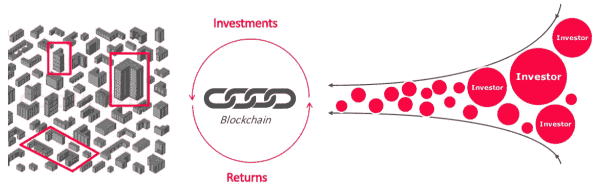
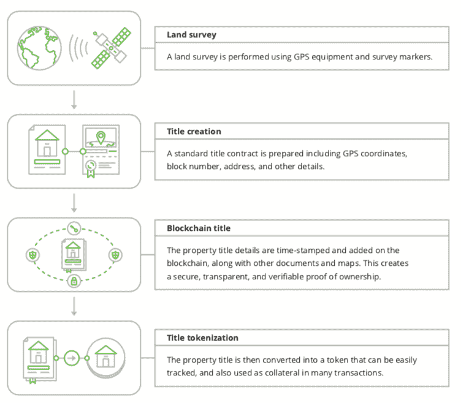
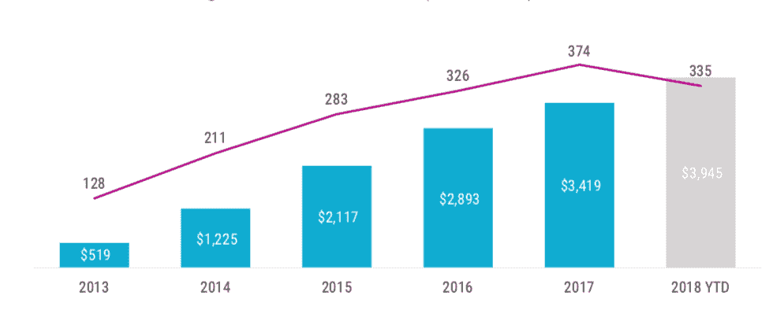
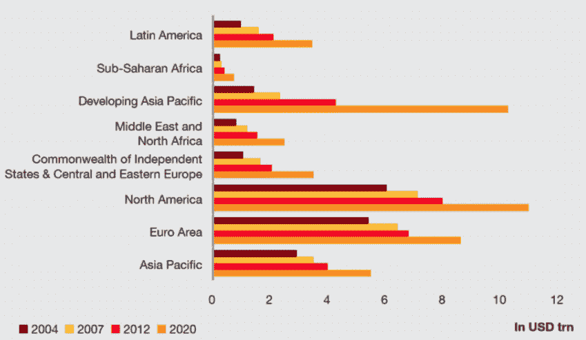
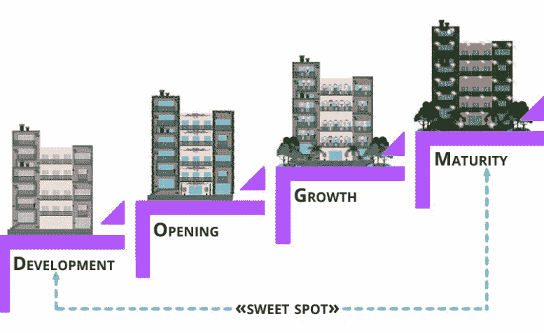

# 商业房地产(CRE)标记化—您需要了解的内容

> 原文：<https://medium.com/hackernoon/commercial-real-estate-cre-tokenization-what-you-need-to-know-1c13f3d1977d>

区块链是一种记录交易数据的不可变分布式分类帐技术。它的好处包括透明性、可追溯性、可访问性、增强的安全性、过程的成本降低以及过程的不可撤销的文档。关于区块链应用的更多细节，请点击此处。

基于区块链的流程在没有中介或清算所的情况下执行交易的能力非常适合房地产等私人市场。分布式分类账保存交易、财产、资产或所有权的历史；它为提议的交易开发数字安全标识符；它提供了以新的方式转移资金的能力，例如使用数字加密(或加密)货币，如[比特币](https://hackernoon.com/tagged/bitcoin)。

[房地产领域的区块链](https://hackernoon.com/tagged/blockchain)因此，通过向买家提供一种财产验证和支付的方式，可以消除对律师和代理等中介的需求。使用加密货币支付房产也可以帮助买家绕过银行手续费。它通过使用可以根据用户需求定制的智能合同，削减了与托管相关的费用。这项技术还可以使交易变得更容易，提供更准确的契约转让，改善投资的透明度问题，最后，加快 MLS(多重上市服务)的上市速度。

加密货币的令牌化特性使得群体所有权和房地产的部分销售成为可能。

普通的乔和简可能买不起整栋房子，甚至没有机会购买商业地产。代表股份和所有权的可转让和可交易代币，是房地产和土地所有者出售或实现增长融资的新的流动方式，面向更广泛的投资者群体。

# 房地产创新

ATO(资产代币发行)、(安全代币发行)、DSO(数字证券发行)或 TAO(令牌化资产发行)允许公司、项目或财产所有者通过将资产令牌化来使用加密货币众筹房地产开发。这里有一篇文章可以了解更多关于如何对资产进行令牌化的信息:[安全令牌产品(sto)——您需要了解的内容](https://hackernoon.com/security-token-offerings-stos-what-you-need-to-know-8628574d11e2)

安全令牌就像它们听起来的那样；区块链上的证券。一个安全令牌可以数字地代表任何数量的现实世界的资产，从[商品](https://www.linkedin.com/pulse/commodities-tokenization-danny-j-christ/)，房地产或汽车所有权，到公司的股票或债券。因此，安全令牌受证券法规的约束。

令牌也是“可编程的”代码可以根据预先定义的标准决定如何使用它们。例如，租金收入可以根据商定的时间表自动支付给代币持有者。该代码可以在不使用传统中间人(如银行)的情况下执行。

将资产(如风险基金、建筑或汽车)令牌化，通过更简单的方式在网上交易这些资产，为这些资产投资带来新的流动性。

# 令牌化房地产的潜力

只需点击几下鼠标就能买到房子，并以同样的方式出售，这不是很棒吗？

在这个世界中，价值交换的速度与当今信息流动的速度一样快。区块链的新兴技术，我们已经能够使用互联网安全地转移有价证券；无缝，点对点，没有中介。

2012-2018 年，房地产科技公司筹集了超过 120 亿美元的资金，6 家公司加入了独角兽俱乐部。

2004–2020 年，全球房地产投资，按地区，以万亿美元计…房地产成为最大的资产类别(不包括衍生品)，目前价值约 217 万亿美元。

一个房地产市场，其中每个财产由有限供应的独特代币代表，这些代币将某些权利(例如，财产的使用权、投票权、所有权)给予持有人。这些代币只与有问题的房地产资产相关联，并且可以在任何给定时刻安全地转让给其他用户，以换取支付，只需使用你的智能手机。当房子、公寓或办公室的权利由在不可变、永久、可验证和可审计的区块链基础设施上创建的令牌来表示时，基础资产就变得固有地可分割。这一新特征将曾经笨重的不动产转化为可运输的流动数字资产。

预测估计，到 2021 年，大多数房地产众筹平台将利用令牌化。网上投资者可能会受到激励，投资于可能提供 5-30%流动性溢价的交易，从而降低“传统”众筹投资的吸引力。

# 超级地产众筹

安全令牌是存在于区块链上的数字份额。它们提供了一种有效的途径来细分单个高价值资产，如房地产。随着部分所有权交易活动的增加，价格发现将得到加强，对于历史上由于单位成本高而不常交易的资产，市场将变得更加有效。随着二级市场流动性的增加，基于区块链的数字股票正在改变我们在线投资的方式。令牌化的房地产可以在任何地方交易，没有限制。区块链生态系统是一个技术栈，其中“永远开放”是交易所事实上的标准，令牌化的属性可以全天候交易。

数字股票优于其他记录和交易所有权主张的方法:

*   全天候市场
*   分散贸易
*   交易透明度
*   不可逆代码
*   公共审计
*   投资者伪匿名
*   快速结算
*   直接成本的减少
*   增加流动性和市场深度
*   部分所有权
*   可编程序性
*   自动化合规
*   资产互操作性
*   自我监护
*   费用=传统成本的一部分
*   准确的土地所有权
*   跨境简化

在我们这个持续技术革命的世界里，大多数新技术都有希望改善业务和盈利能力。不管你喜不喜欢，如果一个企业不适应时代的变化，生存就会受到威胁。随着区块链技术的不断发展，它正在挑战现状，可能需要 CRE 公司更好地了解该技术，并重新审视其现有的商业模式、战略、流程和财务计划。

区块链技术通过消除关键流程中许多现有的低效率，具有为 CRE 所有者提高透明度、效率和节约成本的巨大潜力。因此，CRE 公司和行业参与者必须评估其当前系统和策略的潜在升级或大修。基于区块链的令牌化本质上是数字股份的发行和分配。它将继续存在——为投资者带来更高的流动性、更好的多样化机会、通过代币持有者分散风险，并通过点对点交易打开新的市场。

*资料来源:CBInsights、* [*月鲸*](http://moonwhale.io/business-consulting/) *、普华永道、德勤、牛津大学、麦肯锡*

# 关于我:

**Iliya Zaki 是**[**moonwale Ventures**](https://moonwhale.io/)**的营销和业务开发主管。**

Moonwhale Ventures 是一家 [STO 金融咨询公司](https://moonwhale.io/investment-platform/#third)，为公司提供关于 STO 进程&结构的战略建议，以及代币发行，包括其项目的生命周期管理和二级市场参与。Moonwhale 还在建立一个端到端证券令牌(STO)投资平台，该平台将迎合寻求投资 STO 项目的投资者，以及寻求通过 STO 筹集资金以资助业务扩张或新企业的公司。

更多信息，请访问:[月鲸 STO 解决方案](https://moonwhale.io/investment-platform/#third)

在我们的各种社交媒体平台上关注我们。—

[推特](https://twitter.com/MoonwhaleBV) | [领英](https://www.linkedin.com/company/moonwhalebv) | [脸书](https://www.facebook.com/MoonwhaleBV/) |

