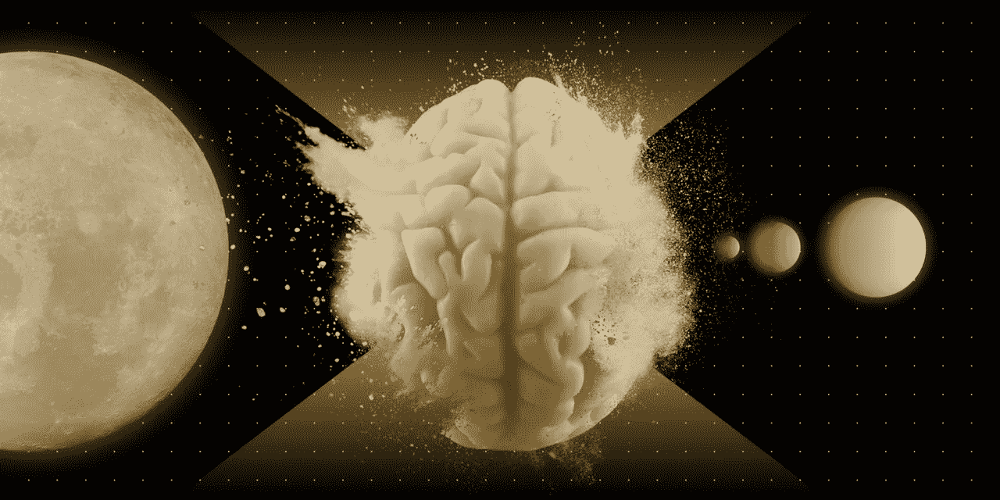

# 交易时常见的心理挑战

> 原文：<https://medium.com/hackernoon/common-psychological-challenges-when-trading-71c135e527dd>

在秘密交易中，两种情绪会毁掉一个优秀交易者的成果。这些是*贪婪和恐惧*。然而，仅仅知道这两种情绪是不够的。你也需要理解他们是如何表现自己的，这样你才不会成为他们的受害者。

为了帮助你做到这一点，这篇文章将回顾加密交易中一些常见的心理挑战。

**FOMO(害怕错过)**

加密中第一个也可能是最大的心理错误是 FOMO:害怕错过。

FOMO 的交易者相信每笔交易都是赢家。他们不喜欢坐等交易，因为害怕损失利润，也不太注意亏损的交易，因为他们相信自己有能力快速弥补损失。

FOMO 导致了两个具体的错误:进行比系统要求更多的交易，建立比系统要求更大的头寸。

解决 FOMO 问题的最好方法是让自己负起责任，并保持自律。在 Adara 上，你也可以要求其他社区成员关注你的所作所为，确保你没有屈服于 FOMO。

我们的第二个问题与 FOMO 非常相似，它被称为…

**复仇交易**

不管听起来像什么，这并不涉及报复任何人。相反，报复性交易是试图通过参与更多交易来挽回损失的行为。

这里有一个例子。

假设玛丽做了她的第一笔交易，损失了比她预期更多的钱:3%。玛丽知道她正在处理一些退税，所以她决定在下一次交易中把钱赚回来。

不幸的是，Mary 找不到任何适合她的交易系统和策略的交易……但是因为她极度渴望胜利，她打破了自己的规则，买入了一枚她希望会升值的硬币。

你能猜到接下来会发生什么吗？从统计数字来看，在现实世界中，玛丽几乎总是输钱。发生这种情况有几个原因。

首先，复仇模式的交易者忘记了他们自己的系统。第二，复仇模式的交易者出于绝望，在不该采取行动的时候采取行动。最后但同样重要的是，复仇模式下的交易者不再考虑市场，因为他们考虑的是他们需要赚的钱。

所有这些因素都会导致糟糕的、无利可图的决策——并可能很快导致巨额预算的严重缩水。

我们的第三个问题是…

**过度自信偏差**

这是这个游戏通常的玩法。假设一个叫杰克的交易者已经交易好几年了。他的胜率大约是 50%，这意味着他每隔一次交易就赢一次。

但是在目前的交易阶段，事情发生了变化。杰克的胜率跃升到 80%以上，感觉无论做什么都不能输。在这一点上，他认为自己直觉上有所发现——并开始背离他的交易规则和系统。

你能猜到接下来会发生什么吗？

没错。当杰克开始背离他的系统以保持他的连胜时，他开始输钱。事实上，大多数处于杰克这种位置的人会一直输钱，直到他们把一开始赢钱所做的一切努力都化为乌有。

这个问题如此严重，以至于一些秘密基金让他们的交易员休息一段时间，以防止过度自信。

你能看出我们到目前为止讨论的所有问题是如何代表恐惧、贪婪或两者的吗？

FOMO 是恐惧和贪婪的混合体。过度自信的偏见是纯粹的贪婪。复仇交易是想赚更多钱——贪婪——和害怕接受损失或恐惧的混合体。

当然，还有许多其他错误。在我们的阿达拉学院视频中，我们涵盖了*赌徒谬误*、对资产的情绪化以及许多其他内容。

如果你想最小化负面情绪对你交易的影响，你可能想去免费的学院学习一下。

但是今天，记住我们已经讲过的 3 个错误:FOMO、报复性交易和过度自信偏见。在交易时记住这三点将帮助你持续地最大化损失和最小化损失。

*你想了解更多关于密码交易的知识吗？с查看我们的教育平台* [*阿达拉学院*](https://academy.adara.io/)

*与我们的专家进行免费的一对一交易！立即申请成为首批 50 名被接受的申请者之一—* [*申请加入！*](http://adara.academy)

*   *在电报上与我们交谈—* [*阿达拉电报*](https://t.me/adara_io)
*   *在推特上聊天—* [*阿达拉推特*](https://twitter.com/adara_io)