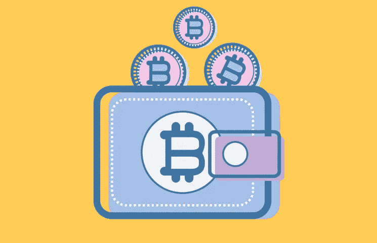
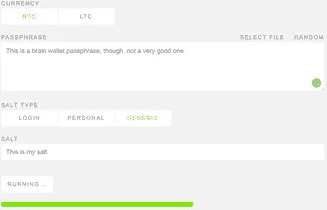
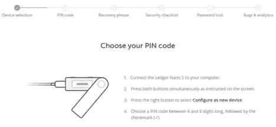
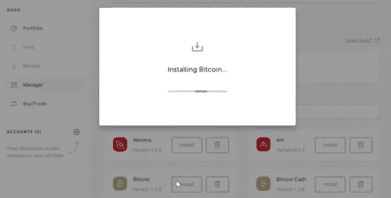
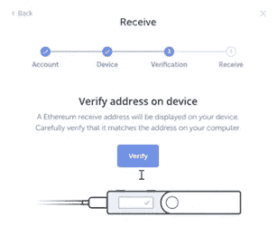
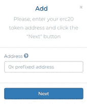
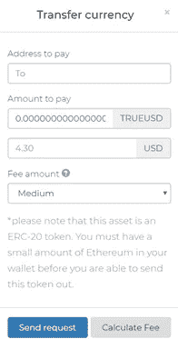

# 比较三款流行钱包。差异比你想象的要大。

> 原文：<https://medium.com/hackernoon/comparing-three-popular-wallets-the-differences-are-greater-than-you-might-think-bb6652c925de>

钱包是加密货币的门户，随着区块链空间的增长，可用钱包的种类也在增加。大多数想尝试少量加密的人，通过设置电话、桌面或 web 应用程序形式的热钱包来开始他们的加密之旅。热门钱包主要关注便利性，非常适合在旅途中进行硬币转账。

虽然热门钱包可能很方便，但它们迫使用户牺牲安全性和加密的基础:完全控制自己的财富。因此，随着人们对区块链技术有了更深的理解，并了解如何提高他们的加密资产的安全性，他们要么选择硬件钱包，甚至大脑钱包。

# **用户体验很重要**

鉴于钱包是加密货币的门户，它们为新市场进入者提供的用户体验对于加密技术的采用至关重要。这一块就来看看几款热门钱包的用户体验。下面的每一部分都将涵盖钱包的两个主要用户体验:设置和执行交易。

**这里有一个总结:**

**大脑钱包:**为了安全地设置钱包，用户必须从 GitHub 下载一个大脑钱包应用程序，或者使用一个在线工具。离线后，用户可以输入 salt 和密码来生成钱包(私钥)。私钥将被暴露，必须立即安全地存储。大脑钱包提供了一种类型的交易工具，因为交易会将私钥暴露给某些 web 前端。因此，任何时候硬币从大脑钱包发出，一个新的必须被制造。对于那些缺乏技术知识的人来说，(安全地)建立大脑钱包可能具有挑战性，并且在交易方面提供接近零的积极 UX 特征。此外，对于每一枚硬币和该硬币的每个公共地址，你需要有一个单独的大脑钱包。

**硬件钱包:**硬件钱包，如 Ledger，可通过将钱包连接到已下载硬件钱包支持软件的计算机设备(如 Ledger Live)来设置。之后，在硬件设备上设置一个 pin 来启动其功能。接下来，用户按照支持软件中提供的步骤进行操作，直到他们被提示创建一个 24 个单词的种子短语，通常写在某个地方。一旦种子短语被批准，私钥就被创建并存储在硬件钱包中。

接下来，应用程序(每个区块链一个)被下载到钱包上，以便接收和发送交易。交易在支持软件上启动，如 Ledger Live，并通过硬件钱包的按钮启动命令获得批准。硬件钱包有一个漫长的设置过程，但其支持软件很好地解释了这个过程。第一次接收和发送资金需要一个漫长的过程，因为必须单独设置对每个硬币的支持。

Bitfi: 一种新的硬件钱包。要使用 Bitfi 设置钱包，用户需要前往 Bitfi Knox 仪表板，将其与 Bitfi 设备同步。该过程要求用户将他们的 Bitfi 设备 ID 输入到他们的仪表板中。接下来，将提示用户在设备上选择 salt 和密码来创建钱包；设备上没有存储私钥。Bitfi 自动支持所有硬币，因此用户可以随时使用仪表盘启动交易；必须在 Bitfi 设备上通过用 salt 和密码对交易进行签名来批准交易(然后设备将计算相应的私钥)。

# **UX 一头扎进钱包**

# **大脑钱包**

顾名思义，大脑钱包为用户提供了令人难忘的访问密码的方式。Brainwallet.io 等领先的大脑钱包提供商允许用户以 3 种方式设置钱包:

*   普通的:用户选择一个难忘的盐和短语。
*   **个人:**用户可以创建一个通过个人信息访问的钱包。
*   **登录:**用户使用与账户登录相同的一组接入点创建钱包:用户名和密码。

**设置**

一旦你决定了钱包的记忆钥匙，你就可以生成一个钱包。

直接在网页上注册 brainwallet.io 这样的大脑钱包是一个错误。

创建钱包时，私钥在网页上是可见的，这使得恶意软件可以访问它。创建大脑钱包的唯一正确方法是下载大脑钱包生成器的源代码，然后离线运行软件。这将允许个人保护私钥。一旦设置完成，资金可以被发送到该地址，但如果钱包只是用于存储，它就变成了一个冷库，而不是一个用于交易的钱包，这与货币的整体功能背道而驰。

最重要的是，大脑钱包限制用户只能使用一个公共地址。例如，假设您有 4 个比特币地址，以太坊、莱特币、创币、恒星币和 10 个 ERC 20 代币。在这种情况下，你需要创建 18 个不同的大脑钱包(你需要记住 18 种不同的盐和短语)。因此，只有当你想在一个地址存放一种货币时，大脑钱包才是实用的。

**交易**

**使用大脑钱包进行交易是一项挑战。**

对于大多数已经适应数字时代便利的人来说，在离线软件上建立一个大脑钱包可能具有挑战性，然而，精通技术的人将轻松完成离线过程。另一方面，不管一个人的技术知识如何，使用钱包都将是一个挑战，这是由于大脑钱包的功能:它们是为一次性使用而设计的。

每当需要进行交易时，你都必须在互联网上的某个平台上输入私钥。这立即暴露了密钥，并增加了受该密钥保护的资产的脆弱性。因此，每次大脑钱包中持有的 BTC(或任何其他货币)必须被交易时，一个新的大脑钱包必须被创建以存储未被转移的 BTC。因此，大脑钱包并不适合 BTC 交易或加密货币的日常使用。

大脑钱包实际上只是一种存储形式，因为转移大脑钱包中的硬币效率非常低。正是因为这个原因，大脑钱包才没有那么受欢迎；相反，大多数熟悉加密货币的人会选择硬件钱包。

# **五金钱包**

市场上有许多硬件钱包，其中最受欢迎的是 Ledger。这种硬件钱包是一个专用于存储私人密钥的 u 盘，它们带有一组按钮，用于向设备发送命令。

硬件钱包允许用户将他们的加密货币存储在物理设备上，这些钱包为交易提供了某种便利的手段。然而，缺点是硬件钱包在物理设备中保护私有密钥。

大多数硬件钱包都有类似的设置过程和交易设施。下面来看看莱杰 Nano X 的用户体验。

**设置**

一旦用户打开他或她的分类帐，就必须对设备进行配置。用户必须登陆 Ledger 的网站，下载一款名为 Ledger Live 的软件。一旦软件运行，分类账钱包必须连接到一台计算机上，以便与分类账实时同步。

同步采取以下步骤:

*   u 盘上的按钮必须同时按下。
*   接下来，用户选择一个 pin 码，然后重新输入它以确认选择的 pin。
*   之后，用户被引导书写并确认他们的 24 个单词的种子短语。

在 15 到 20 分钟的过程中，用户收到他们的 24 个单词，将它们记在一张纸上，并存储在一个安全的位置。由于单词量大，种子几乎从未被记住，用户依赖于家庭或第三方保险箱来保护他们的种子。

一旦种子短语被收集，分类帐为用户提供随机选择的单词，用户必须正确地排列他们的 24 个单词中的每一个。这个过程至少还需要 15 到 20 分钟。这确保用户不会错过一个单词，以防他们得到错误的种子确认，他们可以重新创建一个新的种子短语。如果种子短语被正确确认，设备就可以安装应用程序了。

现在，用户开始安装应用程序。

设备连接到笔记本电脑，Ledger Live 验证硬件钱包的合法性。在安装应用程序之前，系统会提示用户选择密码来保护他们的分类帐实时数据。现在，该设备可以下载应用程序，每个应用程序都支持不同的区块链。

一旦应用程序(阅读:支持区块链)被下载，硬件钱包上的按钮需要为每个下载的应用程序同时按下，以完成其同步。

在同步对每个区块链的支持后，用户可以访问公共地址。为了接收资金，用户连接硬件钱包并通过硬件验证地址。要验证每个地址，必须同时按下硬件钱包上的两个按钮。每个区块链的地址需要逐一确认。

**交易**

要使用 Ledger 进行交易，硬件钱包必须通过电缆连接到安装了 Ledger Live 应用程序的计算机。连接硬件钱包后，系统会提示用户输入 pin 码来解锁设备功能。之后，用户可以从实时仪表盘访问比特币应用程序，并选择*发送*比特币选项。

之后，会出现一个菜单，允许用户选择他们想要发送的 BTC 数量、发送地点和首选网络费用。一旦输入了数据，就可以通过设备上的按钮确认硬件设备上的所有数据来发送交易。

总之，为了接收和发送任何硬币，特定硬币的应用必须在分类帐上实时下载，然后在硬件设备上确认。交易时，硬件设备必须连接到装有 Ledger Live 的计算机，然后应用程序和钱包必须解锁。之后，可以通过硬件设备确认交易。

# **Bitfi**

Bitfi 是一种新技术，其中硬件从不存储私钥(它是唯一不存储任何私钥的加密货币钱包)。Bitfi 旨在提升冷存储(因为根本没有存储)以外的安全性，同时还创建了一个用户友好的界面，使普通人能够快速轻松地使用它。

Bitfi 不像任何硬件钱包，也不像任何钱包。这是一种让用户创建钱包的技术，可以通过用户选择的 salt(salt 只是一个密码，但是是一个你已经知道的密码，就像你的社会安全号码)和 passphrase 来访问钱包。Bitfi 设备是一个私钥生成器，它在交易时将您的 salt 和密码短语转换为适当的私钥，而私钥在任何其他时间都不存在于设备中。

在某种程度上，Bitfi 利用了大脑钱包的概念，但方式非常不同，因为:

1.  单个 salt & phrase 将为无限数量的货币生成私钥，因此在上面的大脑钱包示例中，Bitfi 将只使用单个 salt & phrase 保护所有 18 项资产，而不是创建 18 个不同的 salt & phrase。
2.  将单次使用功能限制在一次交易中没有任何缺点。Bitfi 在极其安全的环境中创建每一笔交易，并实现频繁支付，而无需将私钥存储在可能会丢失、被盗或被扣押的物理设备上。
3.  私钥不可能泄露，因为它只存在几分之一秒来签署交易。否则，设备或任何数据上都不存在私钥。

输入设备 ID 后，会立即向 Bitfi 设备发送通知。

之后，用户被要求输入他们选择的盐和密码；这两个都可以记住(虽然你不一定要记住，这是可选的)。设备将要求您重新输入 salt 和密码，以确保输入正确。现在创建了一个钱包，但设备中不会存储任何私钥。

**设置完成。**

**交易**

Bitfi 设备天生跟踪所有加密货币和存储在其中的数字资产的价值。该设备一次为所有支持的加密货币生成钱包，不需要为每个区块链逐一生成钱包。

仪表板和 Bitfi 设备都将提供对所有受支持加密货币的公共地址的访问。这些可以用来接收硬币和代币。包括 ERC-20 代币在内的所有资产都会被 Bitfi 设备自动跟踪。只需输入令牌的合同地址，ERC-20 资产就可以在几秒钟内添加完毕。

发送硬币需要得到 Bitfi 设备的批准。从 Dahboard，用户可以访问与各种硬币相关的钱包。钱包打开后，用户可以点击*发送*选项发起转账。当开始转移时，用户被要求提供目标地址、要发送的金额和首选网络费用。

一旦点击*发送请求*按钮，Bitfi 设备将立即收到一个弹出窗口，要求用户通过输入其 salt 和密码来授权交易。

**传送完成。**

# **总结**

在从设置到进行交易的所有三个钱包的测试中，Bitfi 明显更容易设置和使用，同时在安全性方面具有明显优势，因为 Bitfi 钱包不存储私钥，使得加密资产无论在线还是离线都不可能被窃取。