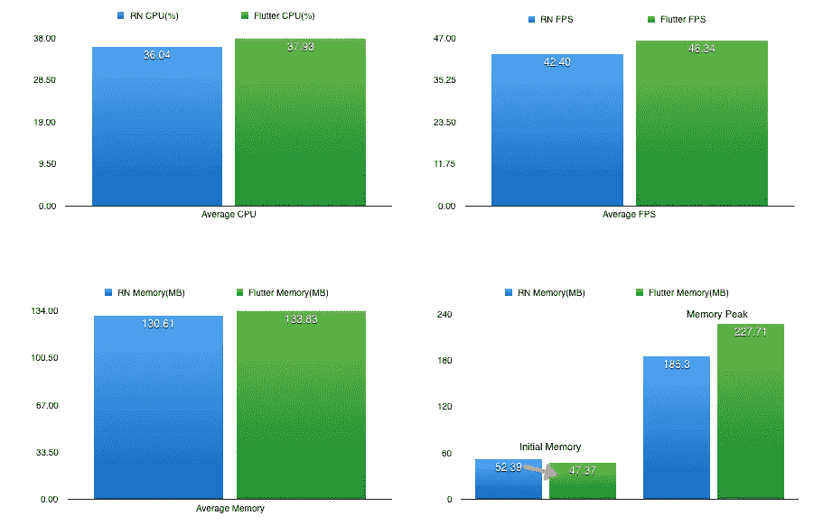
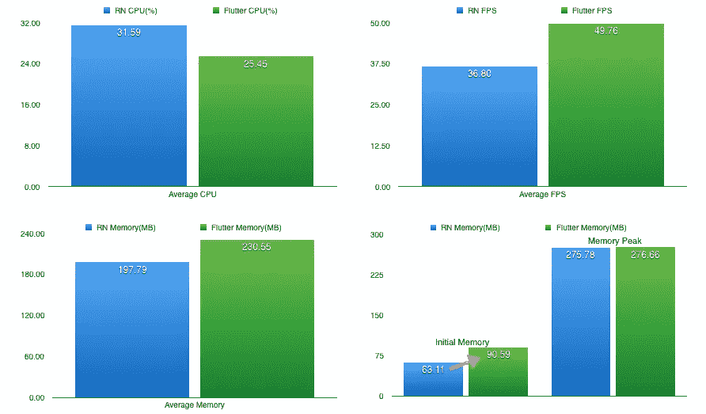
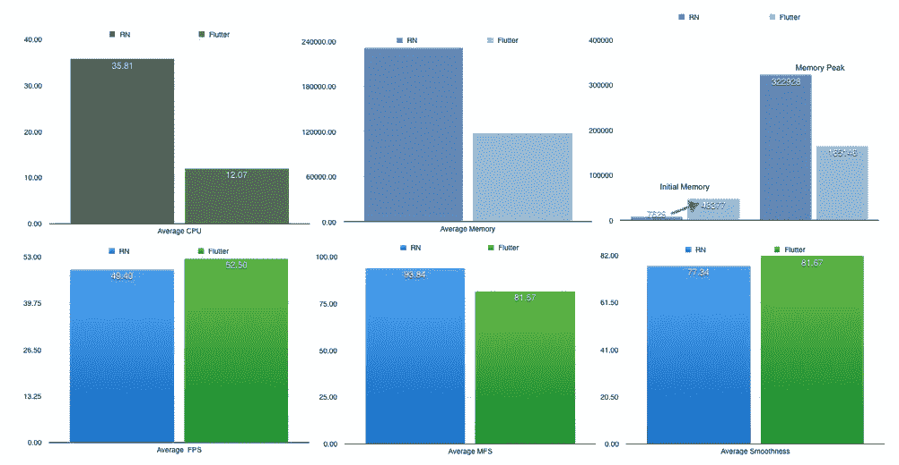
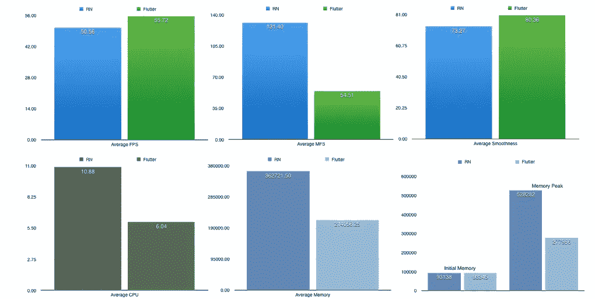

# 竞争框架:阿里巴巴测试 SDK Flutter

> 原文：<https://medium.com/hackernoon/competing-frameworks-alibaba-puts-sdk-flutter-to-the-test-88eb8cf1f35a>

## *阿里巴巴二手交易平台闲鱼背后的团队探究了为什么其选择的 SDK 击败了其他竞争对手*

*本文是阿里巴巴* [***利用旋舞***](/@alitech_2017/utilizing-flutter-best-practice-from-alibaba-236a53aa32c8) *系列的一部分。*

Behind the scenes of Alibaba’s second-hand trading platform Xianyu(闲鱼), a new-generation client architecture is at work supporting its unique business scenarios. Many following its technical development have wondered why this architecture uses the Flutter SDK over other cross-end solutions, generally focusing on the question of performance. In fact, while Flutter pages do show a performance advantage over Native pages in low-end models, the platform’s developers did not even consider performance optimization until after Flutter was already deployed.

对于 Xianyu 团队来说，Flutter 的易实现性符合尽快将产品细节页面上线的目标，功能的实现是重中之重。为此，开发人员并没有将 Flutter 作为 Native 的替代品，而是将其作为增强的跨端解决方案的一部分。

根据一位领先的 Xianyu 开发者的见解，本文将基于 Flutter 的解决方案与 React Native 进行了优势对比，以说明为什么它为像 Xianyu 这样的应用程序提供了如此强大的支持结构。

# 为竞争创造条件

Flutter 是谷歌的开源 SDK，用于高质量的原生 iOS 和 Android 移动界面，与现有代码一起工作，以创纪录的时间制作应用程序。为了测试，Xianyu 团队将其与 React Native (RN)的大规模重新架构进行了比较，React Native(RN)旨在提高灵活性，并更好地与混合 JavaScript/原生应用中的原生基础设施集成。

该团队没有开发自己的测试应用，而是在 Github 上联系了跨终端开发专家 Car Guo，他之前在 Flutter 和 RN 中开发了两个实用的应用。作为旨在帮助个人 Github 账户日常管理和维护的 Github 客户端应用，这些应用提供了极具代表性的比较基础。

在场景方面，团队为两个应用程序应用了四个挑战，如下所示:

1.成功完成默认登录。

2.在动态页面，点击搜索按钮，搜索关键词“Java”；以正常速度浏览三页，然后在加载第四页后返回第三页。

3.单击“趋势”页面选项卡并浏览“订阅源”,直到到达页面底部。点击页面最末端的“项目”。进入“项目”后，浏览详细信息和三页信息，然后返回到“我的”选项卡页面。

4.在“我的”中查看 Feeds 到最后。点击右上角的搜索按钮，搜索关键词“C”。浏览三页后，等待第四页加载。

为了测试，该团队使用了 iOS 和 Android 设备。对于前者，在手机上测试(iOS 端)依赖 CPU 和内存进行监控，使用仪器的核心动画来获取 FPS 对于后者，CPU、内存和 FPS 是通过基于 adb 的 Shell 脚本获得的。

iOS 的测试机型为 iPhone 5c 9.0.1 和 iPhone 6S 10.3.2，分别为低端和中端机型；Android 的测试型号是小米 2S 5.0.2 和三星 S8 7.0，分别是低端和高端型号。

# 数据分析:iOS

下图分别详细描述了 iPhone 5c 和 iPhone 6S 试用版的测试结果。

## iPhone 5c 9.0.1

## iPhone 6S 10.3.2

## 调查的结果

测试表明，Flutter 在中低端 iOS 模型上的性能优于 RN。CPU 使用率方面，Flutter 在低端机型上的表现略低于 RN，但在中端机型上表现更好。

内存性能是一个关键的比较因素，如上图中的红色箭头所示。尽管 Flutter 在低端型号上的起始内存与 RN 的大致相同，但在中档型号上，它比 RN 的高出约 30M。(分析显示是 Dart VM 内存。)这是 Flutter 对低端和中档机型采用不同内存策略的结果。在可用内存较少的型号中，Dart VM 的初始内存较少，并在运行时分配内存，这有助于解释为什么低端型号在 CPU 消耗方面显示出更大的损失。在中端机型中，为处理预分配了更多虚拟机内存，减少了 CPU 干预，提供了更流畅的体验。

简而言之，为了提供更好的用户体验，Flutter 团队似乎采取了更细致的方法来设计不同的型号。

# 数据分析:安卓

下图分别详细描述了小米 2S 和三星 S8 的测试结果。

## 小米 2S 5.0.2

## 三星 S8 7.0

## 调查的结果

在 CPU 使用率方面，Flutter 在高端和低端机型上都优于 RN，在低端的小米 2S 上优势尤为明显。对于 Android 机型，在原有的 FPS 参数上增加了平滑度指标，Flutter 的平滑度表现明显超过 RN。

在 Android 机型中，内存是一个特别值得注意的标准，小米 2S 上 Flutter 的启动内存比 RN 高出 4000 万。然而，RN 的内存使用量在测试期间飙升，而 Flutter 的保持相对稳定。这是因为 RN 代码需要进行内存调整。对于给定的一组代码，Flutter 的内存使用在 Android 和 iOS 上非常相似，而 RN 的只在这两个系统中的一个上进行调优。颤振因此在记忆范畴内超过 RN。

奇怪的是，在三星 S8 型号上，Flutter 和 RN 具有相同的初始内存。仙宇团队推测 RN 在高端 Android 机型上也预分配了一定量的内存，但需要进一步的研究来证实这一点。

# 为胜利者加冕

基于上述标准，在与 React Native 的竞争中，Flutter 在经验和测试数据方面都是明显的赢家。由于开发人员 Car Guo 没有为测试应用程序投资重大的性能调整，这些评估提供了一个相当客观的基础，表明 Flutter 可以在跨端开发中提供更好的用户体验。

测试之后，问题仍然存在，为什么 Flutter 能够提供比其他框架更好的平滑度，它如何优化渲染，以及 Dart VM 运行时如何工作。在以后的文章中，我们将深入探讨仙寓团队是如何寻找和发现这些问题的答案的。

***(The original article is written by Wang Huayin 王华胤)***

# 阿里巴巴科技

关于阿里巴巴最新技术的第一手深度资料→脸书: [**“阿里巴巴科技”**](http://www.facebook.com/AlibabaTechnology) 。推特: [**【阿里巴巴技术】**](https://twitter.com/AliTech2017) 。